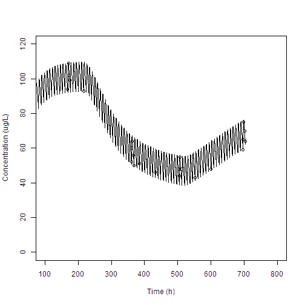

```r
setwd("D:/Rt/Gab/")
require(wnl)
dPK21 = read.csv("PK21.csv", skip=2)
colnames(dPK21) = c("TIME", "AMT", "ADDL", "DV") ; dPK21
```

```
##      TIME AMT ADDL  DV
## 1  168.00  NA   NA  94
## 2  171.00  NA   NA 109
## 3  172.67  NA   NA 102
## 4  175.67  NA   NA  99
## 5  216.00  NA   NA  93
## 6  360.00  NA   NA  52
## 7  361.17  NA   NA  60
## 8  363.17  NA   NA  64
## 9  365.42  NA   NA  56
## 10 368.00  NA   NA  50
## 11 384.00  NA   NA  51
## 12 432.00  NA   NA  46
## 13 504.00  NA   NA  44
## 14 505.08  NA   NA  48
## 15 507.08  NA   NA  55
## 16 509.75  NA   NA  48
## 17 552.00  NA   NA  43
## 18 600.00  NA   NA  48
## 19 696.00  NA   NA  59
## 20 697.00  NA   NA  65
## 21 699.00  NA   NA  75
## 22 701.00  NA   NA  70
## 23 704.00  NA   NA  64
```

```r
DKOR = 3796.94
TBP = 216
TBP2 = 512

require(deSolve)
```

```
## Loading required package: deSolve
```

```r
PKde = function(t, y, p)
{
  RKPRE = p["CLpre"]/p["V"]
  RKSS = p["CLss"]/p["V"]

  Ke = RKPRE
  if (t >= TBP & t < TBP2) {
    Ke = RKSS - (RKSS - RKPRE)*exp(-p["RKD"]*(t - TBP))
  } else if (t > TBP2) {
    AS = RKSS - (RKSS - RKPRE)*exp(-p["RKD"]*(TBP2 - TBP))
    Ke = RKPRE - (RKPRE - AS)*exp(-p["RKD"]*(t - TBP2))  # erratum a -> A
  }

  dy1dt = -p["Ka"]*y[1]
  dy2dt = DKOR*p["Ka"]*y[1]/p["V"] - Ke*y[2]

  return(list(c(dy1dt, dy2dt)))
}

Tlag = 0.814121
dTIME = seq(0, 696, by=8) ; dTIME
```

```
##  [1]   0   8  16  24  32  40  48  56  64  72  80  88  96 104 112 120 128
## [18] 136 144 152 160 168 176 184 192 200 208 216 224 232 240 248 256 264
## [35] 272 280 288 296 304 312 320 328 336 344 352 360 368 376 384 392 400
## [52] 408 416 424 432 440 448 456 464 472 480 488 496 504 512 520 528 536
## [69] 544 552 560 568 576 584 592 600 608 616 624 632 640 648 656 664 672
## [86] 680 688 696
```

```r
nDose = length(dTIME) ; nDose
```

```
## [1] 88
```

```r
EventDat = data.frame(var = rep("y1", nDose),
                      time = (dTIME + Tlag),
                      value = rep(10, nDose),
                      method = rep("add", nDose))

gTimes = seq(0, max(dPK21[,"TIME"]), by=0.1)
y = lsoda(y=c(y1=0, y2=0), times=gTimes, func=PKde, events=list(data=EventDat),
          parms=c(Ka=1.8406, CLss=114.344, CLpre=46.296, RKD=0.00547243, V=1679.4))
```

```
## Warning in checkevents(events, times, Ynames, dllname): Not all event times
## 'events$times' were in output 'times' so they are automatically included.
```

```r
y
```

```
##            time           y1         y2
## 1      0.000000 0.000000e+00   0.000000
## 2      0.100000 0.000000e+00   0.000000
## 3      0.200000 0.000000e+00   0.000000
## 4      0.300000 0.000000e+00   0.000000
## 5      0.400000 0.000000e+00   0.000000
## 6      0.500000 0.000000e+00   0.000000
## 7      0.600000 0.000000e+00   0.000000
## 8      0.700000 0.000000e+00   0.000000
## 9      0.800000 0.000000e+00   0.000000
## 10     0.814121 0.000000e+00   0.000000
## 11     0.900000 8.537910e+00   3.301613
## 12     1.000000 7.102566e+00   6.533074
## 13     1.100000 5.908523e+00   9.210859
## 14     1.200000 4.915221e+00  11.428062
## 15     1.300000 4.088904e+00  13.262164
## 16     1.400000 3.401502e+00  14.777589
## 17     1.500000 2.829662e+00  16.027941
## 18     1.600000 2.353956e+00  17.057810
## 19     1.700000 1.958223e+00  17.904289
## 20     1.800000 1.629017e+00  18.598244
## 21     1.900000 1.355156e+00  19.165336
## 22     2.000000 1.127335e+00  19.626923
## 23     2.100000 9.378139e-01  20.000770
## 24     2.200000 7.801542e-01  20.301655
## 25     2.300000 6.489992e-01  20.541873
## 26     2.400000 5.398932e-01  20.731650
## 27     2.500000 4.491295e-01  20.879493
## 28     2.600000 3.736245e-01  20.992481
## 29     2.700000 3.108129e-01  21.076499
## 30     2.800000 2.585608e-01  21.136446
## 31     2.900000 2.150931e-01  21.176396
## 32     3.000000 1.789329e-01  21.199737
## 33     3.100000 1.488517e-01  21.209290
## 34     3.200000 1.238276e-01  21.207399
## 35     3.300000 1.030105e-01  21.196016
## 36     3.400000 8.569294e-02  21.176763
## 37     3.500000 7.128674e-02  21.150990
## 38     3.600000 5.930243e-02  21.119820
## 39     3.700000 4.933285e-02  21.084188
## 40     3.800000 4.103930e-02  21.044869
## 41     3.900000 3.414001e-02  21.002511
## 42     4.000000 2.840059e-02  20.957651
## 43     4.100000 2.362605e-02  20.910736
## 44     4.200000 1.965417e-02  20.862138
## 45     4.300000 1.635003e-02  20.812166
## 46     4.400000 1.360136e-02  20.761078
## 47     4.500000 1.131477e-02  20.709087
## 48     4.600000 9.412606e-03  20.656371
## 49     4.700000 7.830221e-03  20.603079
## 50     4.800000 6.513854e-03  20.549333
## 51     4.900000 5.418787e-03  20.495235
## 52     5.000000 4.507815e-03  20.440870
## 53     5.100000 3.749990e-03  20.386309
## 54     5.200000 3.119566e-03  20.331611
## 55     5.300000 2.595125e-03  20.276824
## 56     5.400000 2.158849e-03  20.221989
## 57     5.500000 1.795917e-03  20.167139
## 58     5.600000 1.493999e-03  20.112303
## 59     5.700000 1.242838e-03  20.057502
## 60     5.800000 1.033900e-03  20.002758
## 61     5.900000 8.600872e-04  19.948085
## 62     6.000000 7.154948e-04  19.893496
## 63     6.100000 5.952097e-04  19.839003
## 64     6.200000 4.951475e-04  19.784614
## 65     6.300000 4.119060e-04  19.730336
## 66     6.400000 3.426568e-04  19.676177
## 67     6.500000 2.850498e-04  19.622141
## 68     6.600000 2.371278e-04  19.568231
## 69     6.700000 1.972623e-04  19.514451
## 70     6.800000 1.640989e-04  19.460805
## 71     6.900000 1.365109e-04  19.407294
## 72     7.000000 1.135609e-04  19.353919
## 73     7.100000 9.446612e-05  19.300683
## 74     7.200000 7.858733e-05  19.247586
## 75     7.300000 6.537767e-05  19.194629
## 76     7.400000 5.438936e-05  19.141813
## 77     7.500000 4.524762e-05  19.089138
## 78     7.600000 3.764241e-05  19.036604
## 79     7.700000 3.131549e-05  18.984213
## 80     7.800000 2.605200e-05  18.931963
## 81     7.900000 2.165702e-05  18.879855
## 82     8.000000 1.803005e-05  18.827889
## 83     8.100000 1.499128e-05  18.776064
## 84     8.200000 1.246516e-05  18.724381
## 85     8.300000 1.036492e-05  18.672839
## 86     8.400000 8.618545e-06  18.621439
## 87     8.500000 7.166411e-06  18.570179
## 88     8.600000 5.958947e-06  18.519060
## 89     8.700000 4.954928e-06  18.468081
## 90     8.800000 4.120123e-06  18.417242
## 91     8.814121 4.014408e-06  18.410074
## 92     8.900000 8.537928e+00  21.668123
## 93     9.000000 7.102583e+00  24.849025
## 94     9.100000 5.908535e+00  27.476398
## 95     9.200000 4.915225e+00  29.643337
## 96     9.300000 4.088902e+00  31.427307
## 97     9.400000 3.401511e+00  32.892699
## 98     9.500000 2.829668e+00  34.093190
## 99     9.600000 2.353961e+00  35.073329
## 100    9.700000 1.958227e+00  35.870217
## 101    9.800000 1.629022e+00  36.514710
## 102    9.900000 1.355161e+00  37.032480
## 103   10.000000 1.127339e+00  37.444881
## 104   10.100000 9.378181e-01  37.769678
## 105   10.200000 7.801580e-01  38.021648
## 106   10.300000 6.490026e-01  38.213085
## 107   10.400000 5.398962e-01  38.354216
## 108   10.500000 4.491316e-01  38.453548
## 109   10.600000 3.736261e-01  38.518157
## 110   10.700000 3.108143e-01  38.553929
## 111   10.800000 2.585620e-01  38.565763
## 112   10.900000 2.150941e-01  38.557732
## 113   11.000000 1.789337e-01  38.533225
## 114   11.100000 1.488524e-01  38.495060
## 115   11.200000 1.238282e-01  38.445584
## 116   11.300000 1.030109e-01  38.386746
## 117   11.400000 8.569334e-02  38.320169
## 118   11.500000 7.128707e-02  38.247202
## 119   11.600000 5.930270e-02  38.168968
## 120   11.700000 4.933308e-02  38.086400
## 121   11.800000 4.103949e-02  38.000277
## 122   11.900000 3.414017e-02  37.911242
## 123   12.000000 2.840072e-02  37.819834
## 124   12.100000 2.362616e-02  37.726499
## 125   12.200000 1.965427e-02  37.631609
## 126   12.300000 1.635010e-02  37.535473
## 127   12.400000 1.360142e-02  37.438347
## 128   12.500000 1.131483e-02  37.340445
## 129   12.600000 9.412649e-03  37.241945
## 130   12.700000 7.830256e-03  37.142994
## 131   12.800000 6.513884e-03  37.043715
## 132   12.900000 5.418812e-03  36.944209
## 133   13.000000 4.507836e-03  36.844562
## 134   13.100000 3.750008e-03  36.744844
## 135   13.200000 3.119580e-03  36.645112
## 136   13.300000 2.595137e-03  36.545416
## 137   13.400000 2.158859e-03  36.445795
## 138   13.500000 1.795925e-03  36.346282
## 139   13.600000 1.494006e-03  36.246906
## 140   13.700000 1.242843e-03  36.147689
## 141   13.800000 1.033904e-03  36.048650
## 142   13.900000 8.600911e-04  35.949804
## 143   14.000000 7.154981e-04  35.851164
## 144   14.100000 5.952132e-04  35.752741
## 145   14.200000 4.951498e-04  35.654543
## 146   14.300000 4.119080e-04  35.556577
## 147   14.400000 3.426587e-04  35.458850
## 148   14.500000 2.850513e-04  35.361365
## 149   14.600000 2.371290e-04  35.264127
## 150   14.700000 1.972633e-04  35.167138
## 151   14.800000 1.640998e-04  35.070401
## 152   14.900000 1.365116e-04  34.973918
## 153   15.000000 1.135615e-04  34.877690
## 154   15.100000 9.446977e-05  34.781718
## 155   15.200000 7.858768e-05  34.686004
## 156   15.300000 6.537766e-05  34.590546
## 157   15.400000 5.438935e-05  34.495347
## 158   15.500000 4.524766e-05  34.400405
## 159   15.600000 3.764243e-05  34.305721
## 160   15.700000 3.131551e-05  34.211295
## 161   15.800000 2.605201e-05  34.117127
## 162   15.900000 2.167320e-05  34.023215
## 163   16.000000 1.803026e-05  33.929561
## 164   16.100000 1.499218e-05  33.836163
## 165   16.200000 1.246576e-05  33.743021
## 166   16.300000 1.036541e-05  33.650134
## 167   16.400000 8.618948e-06  33.557503
## 168   16.500000 7.166747e-06  33.465126
## 169   16.600000 5.959226e-06  33.373002
## 170   16.700000 4.955160e-06  33.281132
## 171   16.800000 4.120405e-06  33.189514
## 172   16.814121 4.014609e-06  33.176597
## 173   16.900000 8.537932e+00  36.399718
## 174   17.000000 7.102587e+00  39.540066
## 175   17.100000 5.908538e+00  42.126998
## 176   17.200000 4.915228e+00  44.253605
## 177   17.300000 4.088903e+00  45.997360
## 178   17.400000 3.401514e+00  47.422637
## 179   17.500000 2.829669e+00  48.583133
## 180   17.600000 2.353962e+00  49.523382
## 181   17.700000 1.958228e+00  50.280491
## 182   17.800000 1.629023e+00  50.885315
## 183   17.900000 1.355161e+00  51.363524
## 184   18.000000 1.127340e+00  51.736473
## 185   18.100000 9.378186e-01  52.021927
## 186   18.200000 7.801583e-01  52.234662
## 187   18.300000 6.490029e-01  52.386973
## 188   18.400000 5.398965e-01  52.489084
## 189   18.500000 4.491319e-01  52.549504
## 190   18.600000 3.736263e-01  52.575308
## 191   18.700000 3.108145e-01  52.572383
## 192   18.800000 2.585622e-01  52.545625
## 193   18.900000 2.150942e-01  52.499109
## 194   19.000000 1.789338e-01  52.436223
## 195   19.100000 1.488525e-01  52.359785
## 196   19.200000 1.238283e-01  52.272140
## 197   19.300000 1.030110e-01  52.175239
## 198   19.400000 8.569339e-02  52.070703
## 199   19.500000 7.128711e-02  51.959882
## 200   19.600000 5.930274e-02  51.843899
## 201   19.700000 4.933311e-02  51.723686
## 202   19.800000 4.103951e-02  51.600020
## 203   19.900000 3.414019e-02  51.473547
## 204   20.000000 2.840074e-02  51.344803
## 205   20.100000 2.362617e-02  51.214235
## 206   20.200000 1.965428e-02  51.082214
## 207   20.300000 1.635011e-02  50.949050
## 208   20.400000 1.360143e-02  50.814998
## 209   20.500000 1.131483e-02  50.680271
## 210   20.600000 9.412653e-03  50.545048
## 211   20.700000 7.830260e-03  50.409475
## 212   20.800000 6.513887e-03  50.273675
## 213   20.900000 5.418814e-03  50.137748
## 214   21.000000 4.507838e-03  50.001781
## 215   21.100000 3.750009e-03  49.865842
## 216   21.200000 3.119582e-03  49.729989
## 217   21.300000 2.595138e-03  49.594271
## 218   21.400000 2.158860e-03  49.458728
## 219   21.500000 1.795926e-03  49.323392
## 220   21.600000 1.494007e-03  49.188292
## 221   21.700000 1.242844e-03  49.053448
## 222   21.800000 1.033905e-03  48.918880
## 223   21.900000 8.600915e-04  48.784604
## 224   22.000000 7.154984e-04  48.650631
## 225   22.100000 5.952134e-04  48.516972
## 226   22.200000 4.951500e-04  48.383636
## 227   22.300000 4.119083e-04  48.250628
## 228   22.400000 3.426591e-04  48.117955
## 229   22.500000 2.850517e-04  47.985621
## 230   22.600000 2.371293e-04  47.853630
## 231   22.700000 1.972636e-04  47.721983
## 232   22.800000 1.641000e-04  47.590684
## 233   22.900000 1.365118e-04  47.459734
## 234   23.000000 1.135617e-04  47.329134
## 235   23.100000 9.446989e-05  47.198884
## 236   23.200000 7.858776e-05  47.068986
## 237   23.300000 6.537744e-05  46.939440
## 238   23.400000 5.438907e-05  46.810245
## 239   23.500000 4.524745e-05  46.681401
## 240   23.600000 3.764226e-05  46.552909
## 241   23.700000 3.131537e-05  46.424768
## 242   23.800000 2.605189e-05  46.296977
## 243   23.900000 2.167310e-05  46.169536
## 244   24.000000 1.802988e-05  46.042444
## 245   24.100000 1.499294e-05  45.915700
## 246   24.200000 1.246635e-05  45.789304
## 247   24.300000 1.036588e-05  45.663255
## 248   24.400000 8.619346e-06  45.537553
## 249   24.500000 7.167078e-06  45.412196
## 250   24.600000 5.959501e-06  45.287183
## 251   24.700000 4.955388e-06  45.162514
## 252   24.800000 4.120849e-06  45.038188
## 253   24.814121 4.015046e-06  45.020659
## 254   24.900000 8.537932e+00  48.215774
## 255   25.000000 7.102587e+00  51.323593
## 256   25.100000 5.908538e+00  53.878087
## 257   25.200000 4.915228e+00  55.972344
## 258   25.300000 4.088903e+00  57.683838
## 259   25.400000 3.401514e+00  59.076944
## 260   25.500000 2.829669e+00  60.205356
## 261   25.600000 2.353962e+00  61.113611
## 262   25.700000 1.958228e+00  61.838813
## 263   25.800000 1.629023e+00  62.411818
## 264   25.900000 1.355161e+00  62.858295
## 265   26.000000 1.127340e+00  63.199601
## 266   26.100000 9.378186e-01  63.453498
## 267   26.200000 7.801583e-01  63.634763
## 268   26.300000 6.490029e-01  63.755690
## 269   26.400000 5.398965e-01  63.826504
## 270   26.500000 4.491319e-01  63.855714
## 271   26.600000 3.736263e-01  63.850393
## 272   26.700000 3.108145e-01  63.816428
## 273   26.800000 2.585622e-01  63.758717
## 274   26.900000 2.150942e-01  63.681332
## 275   27.000000 1.789338e-01  63.587662
## 276   27.100000 1.488525e-01  63.480526
## 277   27.200000 1.238283e-01  63.362267
## 278   27.300000 1.030110e-01  63.234835
## 279   27.400000 8.569339e-02  63.099854
## 280   27.500000 7.128711e-02  62.958671
## 281   27.600000 5.930274e-02  62.812408
## 282   27.700000 4.933311e-02  62.662000
## 283   27.800000 4.103951e-02  62.508222
## 284   27.900000 3.414019e-02  62.351720
## 285   28.000000 2.840074e-02  62.193029
## 286   28.100000 2.362617e-02  62.032597
## 287   28.200000 1.965428e-02  61.870795
## 288   28.300000 1.635011e-02  61.707930
## 289   28.400000 1.360143e-02  61.544260
## 290   28.500000 1.131483e-02  61.379997
## 291   28.600000 9.412653e-03  61.215319
## 292   28.700000 7.830260e-03  61.050371
## 293   28.800000 6.513887e-03  60.885277
## 294   28.900000 5.418814e-03  60.720139
## 295   29.000000 4.507838e-03  60.555039
## 296   29.100000 3.750009e-03  60.390047
## 297   29.200000 3.119582e-03  60.225223
## 298   29.300000 2.595138e-03  60.060613
## 299   29.400000 2.158860e-03  59.896257
## 300   29.500000 1.795926e-03  59.732187
## 301   29.600000 1.494007e-03  59.568432
## 302   29.700000 1.242844e-03  59.405013
## 303   29.800000 1.033905e-03  59.241949
## 304   29.900000 8.600915e-04  59.079254
## 305   30.000000 7.154984e-04  58.916941
## 306   30.100000 5.952134e-04  58.755020
## 307   30.200000 4.951500e-04  58.593499
## 308   30.300000 4.119083e-04  58.432385
## 309   30.400000 3.426591e-04  58.271682
## 310   30.500000 2.850517e-04  58.111396
## 311   30.600000 2.371293e-04  57.951529
## 312   30.700000 1.972636e-04  57.792084
## 313   30.800000 1.641000e-04  57.633063
## 314   30.900000 1.365118e-04  57.474467
## 315   31.000000 1.135617e-04  57.316297
## 316   31.100000 9.446989e-05  57.158554
## 317   31.200000 7.858776e-05  57.001238
## 318   31.300000 6.537744e-05  56.844349
## 319   31.400000 5.438907e-05  56.687887
## 320   31.500000 4.524745e-05  56.531852
## 321   31.600000 3.764226e-05  56.376242
## 322   31.700000 3.131537e-05  56.221058
## 323   31.800000 2.605189e-05  56.066299
## 324   31.900000 2.167310e-05  55.911964
## 325   32.000000 1.802988e-05  55.758052
## 326   32.100000 1.499294e-05  55.604562
## 327   32.200000 1.246635e-05  55.451494
## 328   32.300000 1.036588e-05  55.298846
## 329   32.400000 8.619346e-06  55.146617
## 330   32.500000 7.167078e-06  54.994807
## 331   32.600000 5.959501e-06  54.843414
## 332   32.700000 4.955388e-06  54.692438
## 333   32.800000 4.120849e-06  54.541877
## 334   32.814121 4.015046e-06  54.520649
## 335   32.900000 8.537932e+00  57.693300
## 336   33.000000 7.102587e+00  60.775029
## 337   33.100000 5.908538e+00  63.303503
## 338   33.200000 4.915228e+00  65.371813
## 339   33.300000 4.088903e+00  67.057432
## 340   33.400000 3.401514e+00  68.424733
## 341   33.500000 2.829669e+00  69.527412
## 342   33.600000 2.353962e+00  70.410003
## 343   33.700000 1.958228e+00  71.109613
## 344   33.800000 1.629023e+00  71.657097
## 345   33.900000 1.355161e+00  72.078123
## 346   34.000000 1.127340e+00  72.394047
## 347   34.100000 9.378186e-01  72.622633
## 348   34.200000 7.801583e-01  72.778656
## 349   34.300000 6.490029e-01  72.874411
## 350   34.400000 5.398965e-01  72.920122
## 351   34.500000 4.491319e-01  72.924298
## 352   34.600000 3.736263e-01  72.894012
## 353   34.700000 3.108145e-01  72.835151
## 354   34.800000 2.585622e-01  72.752612
## 355   34.900000 2.150942e-01  72.650468
## 356   35.000000 1.789338e-01  72.532107
## 357   35.100000 1.488525e-01  72.400347
## 358   35.200000 1.238283e-01  72.257533
## 359   35.300000 1.030110e-01  72.105614
## 360   35.400000 8.569339e-02  71.946212
## 361   35.500000 7.128711e-02  71.780676
## 362   35.600000 5.930274e-02  71.610127
## 363   35.700000 4.933311e-02  71.435500
## 364   35.800000 4.103951e-02  71.257569
## 365   35.900000 3.414019e-02  71.076981
## 366   36.000000 2.840074e-02  70.894270
## 367   36.100000 2.362617e-02  70.709885
## 368   36.200000 1.965428e-02  70.524195
## 369   36.300000 1.635011e-02  70.337508
## 370   36.400000 1.360143e-02  70.150082
## 371   36.500000 1.131483e-02  69.962128
## 372   36.600000 9.412653e-03  69.773823
## 373   36.700000 7.830260e-03  69.585315
## 374   36.800000 6.513887e-03  69.396726
## 375   36.900000 5.418814e-03  69.208156
## 376   37.000000 4.507838e-03  69.019689
## 377   37.100000 3.750009e-03  68.831395
## 378   37.200000 3.119582e-03  68.643333
## 379   37.300000 2.595138e-03  68.455548
## 380   37.400000 2.158860e-03  68.268082
## 381   37.500000 1.795926e-03  68.080966
## 382   37.600000 1.494007e-03  67.894227
## 383   37.700000 1.242844e-03  67.707888
## 384   37.800000 1.033905e-03  67.521966
## 385   37.900000 8.600915e-04  67.336477
## 386   38.000000 7.154984e-04  67.151433
## 387   38.100000 5.952134e-04  66.966843
## 388   38.200000 4.951500e-04  66.782716
## 389   38.300000 4.119083e-04  66.599058
## 390   38.400000 3.426591e-04  66.415873
## 391   38.500000 2.850517e-04  66.233167
## 392   38.600000 2.371293e-04  66.050942
## 393   38.700000 1.972636e-04  65.869200
## 394   38.800000 1.641000e-04  65.687943
## 395   38.900000 1.365118e-04  65.507173
## 396   39.000000 1.135617e-04  65.326890
## 397   39.100000 9.446989e-05  65.147094
## 398   39.200000 7.858776e-05  64.967787
## 399   39.300000 6.537744e-05  64.788967
## 400   39.400000 5.438907e-05  64.610634
## 401   39.500000 4.524745e-05  64.432787
## 402   39.600000 3.764226e-05  64.255427
## 403   39.700000 3.131537e-05  64.078553
## 404   39.800000 2.605189e-05  63.902163
## 405   39.900000 2.167310e-05  63.726256
## 406   40.000000 1.802988e-05  63.550832
## 407   40.100000 1.499294e-05  63.375890
## 408   40.200000 1.246635e-05  63.201428
## 409   40.300000 1.036588e-05  63.027445
## 410   40.400000 8.619346e-06  62.853940
## 411   40.500000 7.167078e-06  62.680913
## 412   40.600000 5.959501e-06  62.508361
## 413   40.700000 4.955388e-06  62.336284
## 414   40.800000 4.120849e-06  62.164680
## 415   40.814121 4.015046e-06  62.140486
## 416   40.900000 8.537932e+00  65.295118
## 417   41.000000 7.102587e+00  68.355920
## 418   41.100000 5.908538e+00  70.863525
## 419   41.200000 4.915228e+00  72.911023
## 420   41.300000 4.088903e+00  74.575887
## 421   41.400000 3.401514e+00  75.922490
## 422   41.500000 2.829669e+00  77.004529
## 423   41.600000 2.353962e+00  77.866536
## 424   41.700000 1.958228e+00  78.545619
## 425   41.800000 1.629023e+00  79.072632
## 426   41.900000 1.355161e+00  79.473244
## 427   42.000000 1.127340e+00  79.768810
## 428   42.100000 9.378186e-01  79.977094
## 429   42.200000 7.801583e-01  80.112871
## 430   42.300000 6.490029e-01  80.188435
## 431   42.400000 5.398965e-01  80.214012
## 432   42.500000 4.491319e-01  80.198108
## 433   42.600000 3.736263e-01  80.147798
## 434   42.700000 3.108145e-01  80.068968
## 435   42.800000 2.585622e-01  79.966515
## 436   42.900000 2.150942e-01  79.844512
## 437   43.000000 1.789338e-01  79.706347
## 438   43.100000 1.488525e-01  79.554837
## 439   43.200000 1.238283e-01  79.392327
## 440   43.300000 1.030110e-01  79.220766
## 441   43.400000 8.569339e-02  79.041777
## 442   43.500000 7.128711e-02  78.856707
## 443   43.600000 5.930274e-02  78.666680
## 444   43.700000 4.933311e-02  78.472626
## 445   43.800000 4.103951e-02  78.275323
## 446   43.900000 3.414019e-02  78.075415
## 447   44.000000 2.840074e-02  77.873439
## 448   44.100000 2.362617e-02  77.669840
## 449   44.200000 1.965428e-02  77.464990
## 450   44.300000 1.635011e-02  77.259196
## 451   44.400000 1.360143e-02  77.052715
## 452   44.500000 1.131483e-02  76.845759
## 453   44.600000 9.412653e-03  76.638504
## 454   44.700000 7.830260e-03  76.431098
## 455   44.800000 6.513887e-03  76.223663
## 456   44.900000 5.418814e-03  76.016299
## 457   45.000000 4.507838e-03  75.809090
## 458   45.100000 3.750009e-03  75.602106
## 459   45.200000 3.119582e-03  75.395404
## 460   45.300000 2.595138e-03  75.189032
## 461   45.400000 2.158860e-03  74.983029
## 462   45.500000 1.795926e-03  74.777427
## 463   45.600000 1.494007e-03  74.572254
## 464   45.700000 1.242844e-03  74.367531
## 465   45.800000 1.033905e-03  74.163276
## 466   45.900000 8.600915e-04  73.959504
## 467   46.000000 7.154984e-04  73.756227
## 468   46.100000 5.952134e-04  73.553455
## 469   46.200000 4.951500e-04  73.351196
## 470   46.300000 4.119083e-04  73.149455
## 471   46.400000 3.426591e-04  72.948238
## 472   46.500000 2.850517e-04  72.747549
## 473   46.600000 2.371293e-04  72.547390
## 474   46.700000 1.972636e-04  72.347764
## 475   46.800000 1.641000e-04  72.148672
## 476   46.900000 1.365118e-04  71.950116
## 477   47.000000 1.135617e-04  71.752097
## 478   47.100000 9.446989e-05  71.554613
## 479   47.200000 7.858776e-05  71.357666
## 480   47.300000 6.537744e-05  71.161255
## 481   47.400000 5.438907e-05  70.965380
## 482   47.500000 4.524745e-05  70.770040
## 483   47.600000 3.764226e-05  70.575234
## 484   47.700000 3.131537e-05  70.380962
## 485   47.800000 2.605189e-05  70.187222
## 486   47.900000 2.167310e-05  69.994013
## 487   48.000000 1.802988e-05  69.801334
## 488   48.100000 1.499294e-05  69.609185
## 489   48.200000 1.246635e-05  69.417563
## 490   48.300000 1.036588e-05  69.226468
## 491   48.400000 8.619346e-06  69.035898
## 492   48.500000 7.167078e-06  68.845852
## 493   48.600000 5.959501e-06  68.656329
## 494   48.700000 4.955388e-06  68.467327
## 495   48.800000 4.120849e-06  68.278845
## 496   48.814121 4.015046e-06  68.252271
## 497   48.900000 8.537932e+00  71.392452
## 498   49.000000 7.102587e+00  74.436468
## 499   49.100000 5.908538e+00  76.927334
## 500   49.200000 4.915228e+00  78.958139
## 501   49.300000 4.088903e+00  80.606355
## 502   49.400000 3.401514e+00  81.936358
## 503   49.500000 2.829669e+00  83.001840
## 504   49.600000 2.353962e+00  83.847338
## 505   49.700000 1.958228e+00  84.509956
## 506   49.800000 1.629023e+00  85.020550
## 507   49.900000 1.355161e+00  85.404788
## 508   50.000000 1.127340e+00  85.684025
## 509   50.100000 9.378186e-01  85.876025
## 510   50.200000 7.801583e-01  85.995563
## 511   50.300000 6.490029e-01  86.054933
## 512   50.400000 5.398965e-01  86.064359
## 513   50.500000 4.491319e-01  86.032350
## 514   50.600000 3.736263e-01  85.965979
## 515   50.700000 3.108145e-01  85.871132
## 516   50.800000 2.585622e-01  85.752707
## 517   50.900000 2.150942e-01  85.614774
## 518   51.000000 1.789338e-01  85.460724
## 519   51.100000 1.488525e-01  85.293373
## 520   51.200000 1.238283e-01  85.115065
## 521   51.300000 1.030110e-01  84.927751
## 522   51.400000 8.569339e-02  84.733051
## 523   51.500000 7.128711e-02  84.532313
## 524   51.600000 5.930274e-02  84.326661
## 525   51.700000 4.933311e-02  84.117026
## 526   51.800000 4.103951e-02  83.904185
## 527   51.900000 3.414019e-02  83.688781
## 528   52.000000 2.840074e-02  83.471352
## 529   52.100000 2.362617e-02  83.252343
## 530   52.200000 1.965428e-02  83.032125
## 531   52.300000 1.635011e-02  82.811005
## 532   52.400000 1.360143e-02  82.589240
## 533   52.500000 1.131483e-02  82.367042
## 534   52.600000 9.412653e-03  82.144588
## 535   52.700000 7.830260e-03  81.922025
## 536   52.800000 6.513887e-03  81.699473
## 537   52.900000 5.418814e-03  81.477035
## 538   53.000000 4.507838e-03  81.254793
## 539   53.100000 3.750009e-03  81.032818
## 540   53.200000 3.119582e-03  80.811166
## 541   53.300000 2.595138e-03  80.589884
## 542   53.400000 2.158860e-03  80.369013
## 543   53.500000 1.795926e-03  80.148585
## 544   53.600000 1.494007e-03  79.928625
## 545   53.700000 1.242844e-03  79.709156
## 546   53.800000 1.033905e-03  79.490196
## 547   53.900000 8.600915e-04  79.271760
## 548   54.000000 7.154984e-04  79.053859
## 549   54.100000 5.952134e-04  78.836503
## 550   54.200000 4.951500e-04  78.619700
## 551   54.300000 4.119083e-04  78.403455
## 552   54.400000 3.426591e-04  78.187775
## 553   54.500000 2.850517e-04  77.972661
## 554   54.600000 2.371293e-04  77.758118
## 555   54.700000 1.972636e-04  77.544148
## 556   54.800000 1.641000e-04  77.330751
## 557   54.900000 1.365118e-04  77.117929
## 558   55.000000 1.135617e-04  76.905683
## 559   55.100000 9.446989e-05  76.694012
## 560   55.200000 7.858776e-05  76.482917
## 561   55.300000 6.537744e-05  76.272397
## 562   55.400000 5.438907e-05  76.062451
## 563   55.500000 4.524745e-05  75.853079
## 564   55.600000 3.764226e-05  75.644280
## 565   55.700000 3.131537e-05  75.436053
## 566   55.800000 2.605189e-05  75.228397
## 567   55.900000 2.167310e-05  75.021311
## 568   56.000000 1.802988e-05  74.814792
## 569   56.100000 1.499294e-05  74.608841
## 570   56.200000 1.246635e-05  74.403456
## 571   56.300000 1.036588e-05  74.198635
## 572   56.400000 8.619346e-06  73.994377
## 573   56.500000 7.167078e-06  73.790681
## 574   56.600000 5.959501e-06  73.587545
## 575   56.700000 4.955388e-06  73.384968
## 576   56.800000 4.120849e-06  73.182948
## 577   56.814121 4.015046e-06  73.154466
## 578   56.900000 8.537932e+00  76.283055
## 579   57.000000 7.102587e+00  79.313608
## 580   57.100000 5.908538e+00  81.791047
## 581   57.200000 4.915228e+00  83.808463
## 582   57.300000 4.088903e+00  85.443327
## 583   57.400000 3.401514e+00  86.760013
## 584   57.500000 2.829669e+00  87.812217
## 585   57.600000 2.353962e+00  88.644472
## 586   57.700000 1.958228e+00  89.293884
## 587   57.800000 1.629023e+00  89.791308
## 588   57.900000 1.355161e+00  90.162413
## 589   58.000000 1.127340e+00  90.428553
## 590   58.100000 9.378186e-01  90.607491
## 591   58.200000 7.801583e-01  90.714004
## 592   58.300000 6.490029e-01  90.760384
## 593   58.400000 5.398965e-01  90.756858
## 594   58.500000 4.491319e-01  90.711930
## 595   58.600000 3.736263e-01  90.632677
## 596   58.700000 3.108145e-01  90.524983
## 597   58.800000 2.585622e-01  90.393746
## 598   58.900000 2.150942e-01  90.243037
## 599   59.000000 1.789338e-01  90.076246
## 600   59.100000 1.488525e-01  89.896189
## 601   59.200000 1.238283e-01  89.705210
## 602   59.300000 1.030110e-01  89.505259
## 603   59.400000 8.569339e-02  89.297957
## 604   59.500000 7.128711e-02  89.084654
## 605   59.600000 5.930274e-02  88.866469
## 606   59.700000 4.933311e-02  88.644337
## 607   59.800000 4.103951e-02  88.419032
## 608   59.900000 3.414019e-02  88.191199
## 609   60.000000 2.840074e-02  87.961375
## 610   60.100000 2.362617e-02  87.730006
## 611   60.200000 1.965428e-02  87.497461
## 612   60.300000 1.635011e-02  87.264049
## 613   60.400000 1.360143e-02  87.030025
## 614   60.500000 1.131483e-02  86.795602
## 615   60.600000 9.412653e-03  86.560957
## 616   60.700000 7.830260e-03  86.326235
## 617   60.800000 6.513887e-03  86.091560
## 618   60.900000 5.418814e-03  85.857030
## 619   61.000000 4.507838e-03  85.622731
## 620   61.100000 3.750009e-03  85.388731
## 621   61.200000 3.119582e-03  85.155087
## 622   61.300000 2.595138e-03  84.921848
## 623   61.400000 2.158860e-03  84.689051
## 624   61.500000 1.795926e-03  84.456730
## 625   61.600000 1.494007e-03  84.224910
## 626   61.700000 1.242844e-03  83.993614
## 627   61.800000 1.033905e-03  83.762860
## 628   61.900000 8.600915e-04  83.532661
## 629   62.000000 7.154984e-04  83.303030
## 630   62.100000 5.952134e-04  83.073977
## 631   62.200000 4.951500e-04  82.845508
## 632   62.300000 4.119083e-04  82.617630
## 633   62.400000 3.426591e-04  82.390348
## 634   62.500000 2.850517e-04  82.163666
## 635   62.600000 2.371293e-04  81.937586
## 636   62.700000 1.972636e-04  81.712109
## 637   62.800000 1.641000e-04  81.487239
## 638   62.900000 1.365118e-04  81.262975
## 639   63.000000 1.135617e-04  81.039317
## 640   63.100000 9.446989e-05  80.816267
## 641   63.200000 7.858776e-05  80.593824
## 642   63.300000 6.537744e-05  80.371987
## 643   63.400000 5.438907e-05  80.150755
## 644   63.500000 4.524745e-05  79.930128
## 645   63.600000 3.764226e-05  79.710106
## 646   63.700000 3.131537e-05  79.490686
## 647   63.800000 2.605189e-05  79.271868
## 648   63.900000 2.167310e-05  79.053650
## 649   64.000000 1.802988e-05  78.836031
## 650   64.100000 1.499294e-05  78.619010
## 651   64.200000 1.246635e-05  78.402585
## 652   64.300000 1.036588e-05  78.186755
## 653   64.400000 8.619346e-06  77.971518
## 654   64.500000 7.167078e-06  77.756873
## 655   64.600000 5.959501e-06  77.542819
## 656   64.700000 4.955388e-06  77.329353
## 657   64.800000 4.120849e-06  77.116475
## 658   64.814121 4.015046e-06  77.086461
## 659   64.900000 8.537932e+00  80.205753
## 660   65.000000 7.102587e+00  83.225507
## 661   65.100000 5.908538e+00  85.692177
## 662   65.200000 4.915228e+00  87.698853
## 663   65.300000 4.088903e+00  89.323007
## 664   65.400000 3.401514e+00  90.629014
## 665   65.500000 2.829669e+00  91.670566
## 666   65.600000 2.353962e+00  92.492200
## 667   65.700000 1.958228e+00  93.131020
## 668   65.800000 1.629023e+00  93.617881
## 669   65.900000 1.355161e+00  93.978451
## 670   66.000000 1.127340e+00  94.234086
## 671   66.100000 9.378186e-01  94.402548
## 672   66.200000 7.801583e-01  94.498613
## 673   66.300000 6.490029e-01  94.534575
## 674   66.400000 5.398965e-01  94.520658
## 675   66.500000 4.491319e-01  94.465369
## 676   66.600000 3.736263e-01  94.375783
## 677   66.700000 3.108145e-01  94.257785
## 678   66.800000 2.585622e-01  94.116271
## 679   66.900000 2.150942e-01  93.955315
## 680   67.000000 1.789338e-01  93.778304
## 681   67.100000 1.488525e-01  93.588056
## 682   67.200000 1.238283e-01  93.386914
## 683   67.300000 1.030110e-01  93.176827
## 684   67.400000 8.569339e-02  92.959418
## 685   67.500000 7.128711e-02  92.736035
## 686   67.600000 5.930274e-02  92.507798
## 687   67.700000 4.933311e-02  92.275642
## 688   67.800000 4.103951e-02  92.040340
## 689   67.900000 3.414019e-02  91.802539
## 690   68.000000 2.840074e-02  91.562773
## 691   68.100000 2.362617e-02  91.321489
## 692   68.200000 1.965428e-02  91.079057
## 693   68.300000 1.635011e-02  90.835785
## 694   68.400000 1.360143e-02  90.591929
## 695   68.500000 1.131483e-02  90.347700
## 696   68.600000 9.412653e-03  90.103276
## 697   68.700000 7.830260e-03  89.858803
## 698   68.800000 6.513887e-03  89.614403
## 699   68.900000 5.418814e-03  89.370176
## 700   69.000000 4.507838e-03  89.126205
## 701   69.100000 3.750009e-03  88.882560
## 702   69.200000 3.119582e-03  88.639298
## 703   69.300000 2.595138e-03  88.396467
## 704   69.400000 2.158860e-03  88.154105
## 705   69.500000 1.795926e-03  87.912245
## 706   69.600000 1.494007e-03  87.670913
## 707   69.700000 1.242844e-03  87.430130
## 708   69.800000 1.033905e-03  87.189915
## 709   69.900000 8.600915e-04  86.950282
## 710   70.000000 7.154984e-04  86.711243
## 711   70.100000 5.952134e-04  86.472807
## 712   70.200000 4.951500e-04  86.234982
## 713   70.300000 4.119083e-04  85.997773
## 714   70.400000 3.426591e-04  85.761186
## 715   70.500000 2.850517e-04  85.525224
## 716   70.600000 2.371293e-04  85.289889
## 717   70.700000 1.972636e-04  85.055185
## 718   70.800000 1.641000e-04  84.821111
## 719   70.900000 1.365118e-04  84.587669
## 720   71.000000 1.135617e-04  84.354859
## 721   71.100000 9.446989e-05  84.122682
## 722   71.200000 7.858776e-05  83.891136
## 723   71.300000 6.537744e-05  83.660222
## 724   71.400000 5.438907e-05  83.429938
## 725   71.500000 4.524745e-05  83.200284
## 726   71.600000 3.764226e-05  82.971259
## 727   71.700000 3.131537e-05  82.742861
## 728   71.800000 2.605189e-05  82.515090
## 729   71.900000 2.167310e-05  82.287944
## 730   72.000000 1.802988e-05  82.061422
## 731   72.100000 1.499294e-05  81.835521
## 732   72.200000 1.246635e-05  81.610242
## 733   72.300000 1.036588e-05  81.385581
## 734   72.400000 8.619346e-06  81.161538
## 735   72.500000 7.167078e-06  80.938112
## 736   72.600000 5.959501e-06  80.715300
## 737   72.700000 4.955388e-06  80.493100
## 738   72.800000 4.120849e-06  80.271512
## 739   72.814121 4.015046e-06  80.240271
## 740   72.900000 8.537932e+00  83.352105
## 741   73.000000 7.102587e+00  86.363197
## 742   73.100000 5.908538e+00  88.821230
## 743   73.200000 4.915228e+00  90.819292
## 744   73.300000 4.088903e+00  92.434856
## 745   73.400000 3.401514e+00  93.732296
## 746   73.500000 2.829669e+00  94.765305
## 747   73.600000 2.353962e+00  95.578419
## 748   73.700000 1.958228e+00  96.208743
## 749   73.800000 1.629023e+00  96.687131
## 750   73.900000 1.355161e+00  97.039252
## 751   74.000000 1.127340e+00  97.286461
## 752   74.100000 9.378186e-01  97.446520
## 753   74.200000 7.801583e-01  97.534206
## 754   74.300000 6.490029e-01  97.561811
## 755   74.400000 5.398965e-01  97.539560
## 756   74.500000 4.491319e-01  97.475961
## 757   74.600000 3.736263e-01  97.378087
## 758   74.700000 3.108145e-01  97.251823
## 759   74.800000 2.585622e-01  97.102068
## 760   74.900000 2.150942e-01  96.932892
## 761   75.000000 1.789338e-01  96.747684
## 762   75.100000 1.488525e-01  96.549261
## 763   75.200000 1.238283e-01  96.339967
## 764   75.300000 1.030110e-01  96.121751
## 765   75.400000 8.569339e-02  95.896235
## 766   75.500000 7.128711e-02  95.664767
## 767   75.600000 5.930274e-02  95.428468
## 768   75.700000 4.933311e-02  95.188271
## 769   75.800000 4.103951e-02  94.944951
## 770   75.900000 3.414019e-02  94.699154
## 771   76.000000 2.840074e-02  94.451414
## 772   76.100000 2.362617e-02  94.202178
## 773   76.200000 1.965428e-02  93.951816
## 774   76.300000 1.635011e-02  93.700635
## 775   76.400000 1.360143e-02  93.448892
## 776   76.500000 1.131483e-02  93.196799
## 777   76.600000 9.412653e-03  92.944532
## 778   76.700000 7.830260e-03  92.692237
## 779   76.800000 6.513887e-03  92.440036
## 780   76.900000 5.418814e-03  92.188030
## 781   77.000000 4.507838e-03  91.936302
## 782   77.100000 3.750009e-03  91.684921
## 783   77.200000 3.119582e-03  91.433945
## 784   77.300000 2.595138e-03  91.183420
## 785   77.400000 2.158860e-03  90.933386
## 786   77.500000 1.795926e-03  90.683875
## 787   77.600000 1.494007e-03  90.434913
## 788   77.700000 1.242844e-03  90.186521
## 789   77.800000 1.033905e-03  89.938718
## 790   77.900000 8.600915e-04  89.691518
## 791   78.000000 7.154984e-04  89.444932
## 792   78.100000 5.952134e-04  89.198971
## 793   78.200000 4.951500e-04  88.953641
## 794   78.300000 4.119083e-04  88.708948
## 795   78.400000 3.426591e-04  88.464897
## 796   78.500000 2.850517e-04  88.221492
## 797   78.600000 2.371293e-04  87.978735
## 798   78.700000 1.972636e-04  87.736628
## 799   78.800000 1.641000e-04  87.495173
## 800   78.900000 1.365118e-04  87.254369
## 801   79.000000 1.135617e-04  87.014218
## 802   79.100000 9.446989e-05  86.774720
## 803   79.200000 7.858776e-05  86.535873
## 804   79.300000 6.537744e-05  86.297678
## 805   79.400000 5.438907e-05  86.060134
## 806   79.500000 4.524745e-05  85.823239
## 807   79.600000 3.764226e-05  85.586993
## 808   79.700000 3.131537e-05  85.351395
## 809   79.800000 2.605189e-05  85.116443
## 810   79.900000 2.167310e-05  84.882135
## 811   80.000000 1.802988e-05  84.648471
## 812   80.100000 1.499294e-05  84.415449
## 813   80.200000 1.246635e-05  84.183067
## 814   80.300000 1.036588e-05  83.951324
## 815   80.400000 8.619346e-06  83.720218
## 816   80.500000 7.167078e-06  83.489748
## 817   80.600000 5.959501e-06  83.259911
## 818   80.700000 4.955388e-06  83.030707
## 819   80.800000 4.120849e-06  82.802133
## 820   80.814121 4.015046e-06  82.769907
## 821   80.900000 8.537932e+00  85.875759
## 822   81.000000 7.102587e+00  88.879904
## 823   81.100000 5.908538e+00  91.331008
## 824   81.200000 4.915228e+00  93.322161
## 825   81.300000 4.088903e+00  94.930835
## 826   81.400000 3.401514e+00  96.221404
## 827   81.500000 2.829669e+00  97.247561
## 828   81.600000 2.353962e+00  98.053841
## 829   81.700000 1.958228e+00  98.677351
## 830   81.800000 1.629023e+00  99.148943
## 831   81.900000 1.355161e+00  99.494287
## 832   82.000000 1.127340e+00  99.734737
## 833   82.100000 9.378186e-01  99.888056
## 834   82.200000 7.801583e-01  99.969021
## 835   82.300000 6.490029e-01  99.989923
## 836   82.400000 5.398965e-01  99.960988
## 837   82.500000 4.491319e-01  99.890723
## 838   82.600000 3.736263e-01  99.786201
## 839   82.700000 3.108145e-01  99.653308
## 840   82.800000 2.585622e-01  99.496942
## 841   82.900000 2.150942e-01  99.321173
## 842   83.000000 1.789338e-01  99.129390
## 843   83.100000 1.488525e-01  98.924411
## 844   83.200000 1.238283e-01  98.708578
## 845   83.300000 1.030110e-01  98.483842
## 846   83.400000 8.569339e-02  98.251823
## 847   83.500000 7.128711e-02  98.013870
## 848   83.600000 5.930274e-02  97.771104
## 849   83.700000 4.933311e-02  97.524458
## 850   83.800000 4.103951e-02  97.274707
## 851   83.900000 3.414019e-02  97.022496
## 852   84.000000 2.840074e-02  96.768360
## 853   84.100000 2.362617e-02  96.512746
## 854   84.200000 1.965428e-02  96.256023
## 855   84.300000 1.635011e-02  95.998499
## 856   84.400000 1.360143e-02  95.740431
## 857   84.500000 1.131483e-02  95.482029
## 858   84.600000 9.412653e-03  95.223471
## 859   84.700000 7.830260e-03  94.964902
## 860   84.800000 6.513887e-03  94.706445
## 861   84.900000 5.418814e-03  94.448200
## 862   85.000000 4.507838e-03  94.190250
## 863   85.100000 3.750009e-03  93.932664
## 864   85.200000 3.119582e-03  93.675500
## 865   85.300000 2.595138e-03  93.418804
## 866   85.400000 2.158860e-03  93.162617
## 867   85.500000 1.795926e-03  92.906968
## 868   85.600000 1.494007e-03  92.651886
## 869   85.700000 1.242844e-03  92.397392
## 870   85.800000 1.033905e-03  92.143502
## 871   85.900000 8.600915e-04  91.890233
## 872   86.000000 7.154984e-04  91.637594
## 873   86.100000 5.952134e-04  91.385596
## 874   86.200000 4.951500e-04  91.134247
## 875   86.300000 4.119083e-04  90.883551
## 876   86.400000 3.426591e-04  90.633514
## 877   86.500000 2.850517e-04  90.384138
## 878   86.600000 2.371293e-04  90.135428
## 879   86.700000 1.972636e-04  89.887384
## 880   86.800000 1.641000e-04  89.640007
## 881   86.900000 1.365118e-04  89.393300
## 882   87.000000 1.135617e-04  89.147260
## 883   87.100000 9.446989e-05  88.901890
## 884   87.200000 7.858776e-05  88.657187
## 885   87.300000 6.537744e-05  88.413153
## 886   87.400000 5.438907e-05  88.169785
## 887   87.500000 4.524745e-05  87.927082
## 888   87.600000 3.764226e-05  87.685045
## 889   87.700000 3.131537e-05  87.443671
## 890   87.800000 2.605189e-05  87.202959
## 891   87.900000 2.167310e-05  86.962907
## 892   88.000000 1.802988e-05  86.723515
## 893   88.100000 1.499294e-05  86.484780
## 894   88.200000 1.246635e-05  86.246702
## 895   88.300000 1.036588e-05  86.009278
## 896   88.400000 8.619346e-06  85.772506
## 897   88.500000 7.167078e-06  85.536386
## 898   88.600000 5.959501e-06  85.300915
## 899   88.700000 4.955388e-06  85.066092
## 900   88.800000 4.120849e-06  84.831915
## 901   88.814121 4.015046e-06  84.798899
## 902   88.900000 8.537932e+00  87.899954
## 903   89.000000 7.102587e+00  90.898526
## 904   89.100000 5.908538e+00  93.344074
## 905   89.200000 4.915228e+00  95.329685
## 906   89.300000 4.088903e+00  96.932832
## 907   89.400000 3.401514e+00  98.217889
## 908   89.500000 2.829669e+00  99.238550
## 909   89.600000 2.353962e+00 100.039350
## 910   89.700000 1.958228e+00 100.657393
## 911   89.800000 1.629023e+00 101.123535
## 912   89.900000 1.355161e+00 101.463443
## 913   90.000000 1.127340e+00 101.698472
## 914   90.100000 9.378186e-01 101.846385
## 915   90.200000 7.801583e-01 101.921959
## 916   90.300000 6.490029e-01 101.937485
## 917   90.400000 5.398965e-01 101.903188
## 918   90.500000 4.491319e-01 101.827576
## 919   90.600000 3.736263e-01 101.717722
## 920   90.700000 3.108145e-01 101.579513
## 921   90.800000 2.585622e-01 101.417843
## 922   90.900000 2.150942e-01 101.236787
## 923   91.000000 1.789338e-01 101.039730
## 924   91.100000 1.488525e-01 100.829492
## 925   91.200000 1.238283e-01 100.608415
## 926   91.300000 1.030110e-01 100.378448
## 927   91.400000 8.569339e-02 100.141214
## 928   91.500000 7.128711e-02  99.898060
## 929   91.600000 5.930274e-02  99.650107
## 930   91.700000 4.933311e-02  99.398288
## 931   91.800000 4.103951e-02  99.143379
## 932   91.900000 3.414019e-02  98.886023
## 933   92.000000 2.840074e-02  98.626757
## 934   92.100000 2.362617e-02  98.366027
## 935   92.200000 1.965428e-02  98.104202
## 936   92.300000 1.635011e-02  97.841591
## 937   92.400000 1.360143e-02  97.578448
## 938   92.500000 1.131483e-02  97.314986
## 939   92.600000 9.412653e-03  97.051382
## 940   92.700000 7.830260e-03  96.787782
## 941   92.800000 6.513887e-03  96.524306
## 942   92.900000 5.418814e-03  96.261057
## 943   93.000000 4.507838e-03  95.998116
## 944   93.100000 3.750009e-03  95.735553
## 945   93.200000 3.119582e-03  95.473426
## 946   93.300000 2.595138e-03  95.211781
## 947   93.400000 2.158860e-03  94.950657
## 948   93.500000 1.795926e-03  94.690087
## 949   93.600000 1.494007e-03  94.430096
## 950   93.700000 1.242844e-03  94.170706
## 951   93.800000 1.033905e-03  93.911935
## 952   93.900000 8.600915e-04  93.653797
## 953   94.000000 7.154984e-04  93.396304
## 954   94.100000 5.952134e-04  93.139464
## 955   94.200000 4.951500e-04  92.883286
## 956   94.300000 4.119083e-04  92.627776
## 957   94.400000 3.426591e-04  92.372937
## 958   94.500000 2.850517e-04  92.118773
## 959   94.600000 2.371293e-04  91.865287
## 960   94.700000 1.972636e-04  91.612481
## 961   94.800000 1.641000e-04  91.360356
## 962   94.900000 1.365118e-04  91.108912
## 963   95.000000 1.135617e-04  90.858150
## 964   95.100000 9.446989e-05  90.608069
## 965   95.200000 7.858776e-05  90.358670
## 966   95.300000 6.537744e-05  90.109951
## 967   95.400000 5.438907e-05  89.861912
## 968   95.500000 4.524745e-05  89.614551
## 969   95.600000 3.764226e-05  89.367868
## 970   95.700000 3.131537e-05  89.121862
## 971   95.800000 2.605189e-05  88.876530
## 972   95.900000 2.167310e-05  88.631871
## 973   96.000000 1.802988e-05  88.387885
## 974   96.100000 1.499294e-05  88.144568
## 975   96.200000 1.246635e-05  87.901920
## 976   96.300000 1.036588e-05  87.659939
## 977   96.400000 8.619346e-06  87.418624
## 978   96.500000 7.167078e-06  87.177972
## 979   96.600000 5.959501e-06  86.937982
## 980   96.700000 4.955388e-06  86.698652
## 981   96.800000 4.120849e-06  86.459981
## 982   96.814121 4.015046e-06  86.426331
## 983   96.900000 8.537932e+00  89.523537
## 984   97.000000 7.102587e+00  92.517641
## 985   97.100000 5.908538e+00  94.958731
## 986   97.200000 4.915228e+00  96.939897
## 987   97.300000 4.088903e+00  98.538611
## 988   97.400000 3.401514e+00  99.819248
## 989   97.500000 2.829669e+00 100.835501
## 990   97.600000 2.353962e+00 101.631904
## 991   97.700000 1.958228e+00 102.245563
## 992   97.800000 1.629023e+00 102.707333
## 993   97.900000 1.355161e+00 103.042881
## 994   98.000000 1.127340e+00 103.273562
## 995   98.100000 9.378186e-01 103.417139
## 996   98.200000 7.801583e-01 103.488388
## 997   98.300000 6.490029e-01 103.499602
## 998   98.400000 5.398965e-01 103.461005
## 999   98.500000 4.491319e-01 103.381105
## 1000  98.600000 3.736263e-01 103.266974
## 1001  98.700000 3.108145e-01 103.124499
## 1002  98.800000 2.585622e-01 102.958577
## 1003  98.900000 2.150942e-01 102.773279
## 1004  99.000000 1.789338e-01 102.571993
## 1005  99.100000 1.488525e-01 102.357536
## 1006  99.200000 1.238283e-01 102.132252
## 1007  99.300000 1.030110e-01 101.898091
## 1008  99.400000 8.569339e-02 101.656673
## 1009  99.500000 7.128711e-02 101.409347
## 1010  99.600000 5.930274e-02 101.157234
## 1011  99.700000 4.933311e-02 100.901266
## 1012  99.800000 4.103951e-02 100.642219
## 1013  99.900000 3.414019e-02 100.380737
## 1014 100.000000 2.840074e-02 100.117357
## 1015 100.100000 2.362617e-02  99.852523
## 1016 100.200000 1.965428e-02  99.586606
## 1017 100.300000 1.635011e-02  99.319913
## 1018 100.400000 1.360143e-02  99.052701
## 1019 100.500000 1.131483e-02  98.785181
## 1020 100.600000 9.412653e-03  98.517530
## 1021 100.700000 7.830260e-03  98.249893
## 1022 100.800000 6.513887e-03  97.982392
## 1023 100.900000 5.418814e-03  97.715129
## 1024 101.000000 4.507838e-03  97.448185
## 1025 101.100000 3.750009e-03  97.181631
## 1026 101.200000 3.119582e-03  96.915523
## 1027 101.300000 2.595138e-03  96.649908
## 1028 101.400000 2.158860e-03  96.384825
## 1029 101.500000 1.795926e-03  96.120306
## 1030 101.600000 1.494007e-03  95.856378
## 1031 101.700000 1.242844e-03  95.593062
## 1032 101.800000 1.033905e-03  95.330375
## 1033 101.900000 8.600915e-04  95.068332
## 1034 102.000000 7.154984e-04  94.806945
## 1035 102.100000 5.952134e-04  94.546222
## 1036 102.200000 4.951500e-04  94.286171
## 1037 102.300000 4.119083e-04  94.026799
## 1038 102.400000 3.426591e-04  93.768108
## 1039 102.500000 2.850517e-04  93.510104
## 1040 102.600000 2.371293e-04  93.252788
## 1041 102.700000 1.972636e-04  92.996162
## 1042 102.800000 1.641000e-04  92.740228
## 1043 102.900000 1.365118e-04  92.484985
## 1044 103.000000 1.135617e-04  92.230435
## 1045 103.100000 9.446989e-05  91.976577
## 1046 103.200000 7.858776e-05  91.723410
## 1047 103.300000 6.537744e-05  91.470934
## 1048 103.400000 5.438907e-05  91.219148
## 1049 103.500000 4.524745e-05  90.968051
## 1050 103.600000 3.764226e-05  90.717642
## 1051 103.700000 3.131537e-05  90.467920
## 1052 103.800000 2.605189e-05  90.218882
## 1053 103.900000 2.167310e-05  89.970528
## 1054 104.000000 1.802988e-05  89.722857
## 1055 104.100000 1.499294e-05  89.475865
## 1056 104.200000 1.246635e-05  89.229552
## 1057 104.300000 1.036588e-05  88.983917
## 1058 104.400000 8.619346e-06  88.738956
## 1059 104.500000 7.167078e-06  88.494670
## 1060 104.600000 5.959501e-06  88.251055
## 1061 104.700000 4.955388e-06  88.008111
## 1062 104.800000 4.120849e-06  87.765835
## 1063 104.814121 4.015046e-06  87.731677
## 1064 104.900000 8.537932e+00  90.825796
## 1065 105.000000 7.102587e+00  93.816314
## 1066 105.100000 5.908538e+00  96.253829
## 1067 105.200000 4.915228e+00  98.231430
## 1068 105.300000 4.088903e+00  99.826589
## 1069 105.400000 3.401514e+00 101.103680
## 1070 105.500000 2.829669e+00 102.116397
## 1071 105.600000 2.353962e+00 102.909274
## 1072 105.700000 1.958228e+00 103.519417
## 1073 105.800000 1.629023e+00 103.977679
## 1074 105.900000 1.355161e+00 104.309730
## 1075 106.000000 1.127340e+00 104.536924
## 1076 106.100000 9.378186e-01 104.677023
## 1077 106.200000 7.801583e-01 104.744804
## 1078 106.300000 6.490029e-01 104.752559
## 1079 106.400000 5.398965e-01 104.710513
## 1080 106.500000 4.491319e-01 104.627173
## 1081 106.600000 3.736263e-01 104.509612
## 1082 106.700000 3.108145e-01 104.363716
## 1083 106.800000 2.585622e-01 104.194382
## 1084 106.900000 2.150942e-01 104.005682
## 1085 107.000000 1.789338e-01 103.801003
## 1086 107.100000 1.488525e-01 103.583163
## 1087 107.200000 1.238283e-01 103.354506
## 1088 107.300000 1.030110e-01 103.116979
## 1089 107.400000 8.569339e-02 102.872206
## 1090 107.500000 7.128711e-02 102.621534
## 1091 107.600000 5.930274e-02 102.366084
## 1092 107.700000 4.933311e-02 102.106788
## 1093 107.800000 4.103951e-02 101.844422
## 1094 107.900000 3.414019e-02 101.579631
## 1095 108.000000 2.840074e-02 101.312950
## 1096 108.100000 2.362617e-02 101.044825
## 1097 108.200000 1.965428e-02 100.775625
## 1098 108.300000 1.635011e-02 100.505660
## 1099 108.400000 1.360143e-02 100.235183
## 1100 108.500000 1.131483e-02  99.964408
## 1101 108.600000 9.412653e-03  99.693510
## 1102 108.700000 7.830260e-03  99.422636
## 1103 108.800000 6.513887e-03  99.151907
## 1104 108.900000 5.418814e-03  98.881424
## 1105 109.000000 4.507838e-03  98.611270
## 1106 109.100000 3.750009e-03  98.341513
## 1107 109.200000 3.119582e-03  98.072212
## 1108 109.300000 2.595138e-03  97.803413
## 1109 109.400000 2.158860e-03  97.535155
## 1110 109.500000 1.795926e-03  97.267469
## 1111 109.600000 1.494007e-03  97.000383
## 1112 109.700000 1.242844e-03  96.733917
## 1113 109.800000 1.033905e-03  96.468090
## 1114 109.900000 8.600915e-04  96.202915
## 1115 110.000000 7.154984e-04  95.938404
## 1116 110.100000 5.952134e-04  95.674567
## 1117 110.200000 4.951500e-04  95.411410
## 1118 110.300000 4.119083e-04  95.148940
## 1119 110.400000 3.426591e-04  94.887160
## 1120 110.500000 2.850517e-04  94.626075
## 1121 110.600000 2.371293e-04  94.365687
## 1122 110.700000 1.972636e-04  94.105997
## 1123 110.800000 1.641000e-04  93.847008
## 1124 110.900000 1.365118e-04  93.588718
## 1125 111.000000 1.135617e-04  93.331129
## 1126 111.100000 9.446989e-05  93.074241
## 1127 111.200000 7.858776e-05  92.818053
## 1128 111.300000 6.537744e-05  92.562563
## 1129 111.400000 5.438907e-05  92.307772
## 1130 111.500000 4.524745e-05  92.053679
## 1131 111.600000 3.764226e-05  91.800281
## 1132 111.700000 3.131537e-05  91.547578
## 1133 111.800000 2.605189e-05  91.295568
## 1134 111.900000 2.167310e-05  91.044251
## 1135 112.000000 1.802988e-05  90.793623
## 1136 112.100000 1.499294e-05  90.543684
## 1137 112.200000 1.246635e-05  90.294431
## 1138 112.300000 1.036588e-05  90.045864
## 1139 112.400000 8.619346e-06  89.797980
## 1140 112.500000 7.167078e-06  89.550778
## 1141 112.600000 5.959501e-06  89.304256
## 1142 112.700000 4.955388e-06  89.058412
## 1143 112.800000 4.120849e-06  88.813245
## 1144 112.814121 4.015046e-06  88.778679
## 1145 112.900000 8.537932e+00  91.870323
## 1146 113.000000 7.102587e+00  94.857966
## 1147 113.100000 5.908538e+00  97.292613
## 1148 113.200000 4.915228e+00  99.267354
## 1149 113.300000 4.088903e+00 100.859661
## 1150 113.400000 3.401514e+00 102.133909
## 1151 113.500000 2.829669e+00 103.143789
## 1152 113.600000 2.353962e+00 103.933838
## 1153 113.700000 1.958228e+00 104.541160
## 1154 113.800000 1.629023e+00 104.996610
## 1155 113.900000 1.355161e+00 105.325856
## 1156 114.000000 1.127340e+00 105.550252
## 1157 114.100000 9.378186e-01 105.687562
## 1158 114.200000 7.801583e-01 105.752561
## 1159 114.300000 6.490029e-01 105.757542
## 1160 114.400000 5.398965e-01 105.712729
## 1161 114.500000 4.491319e-01 105.626630
## 1162 114.600000 3.736263e-01 105.506318
## 1163 114.700000 3.108145e-01 105.357678
## 1164 114.800000 2.585622e-01 105.185608
## 1165 114.900000 2.150942e-01 104.994179
## 1166 115.000000 1.789338e-01 104.786779
## 1167 115.100000 1.488525e-01 104.566225
## 1168 115.200000 1.238283e-01 104.334861
## 1169 115.300000 1.030110e-01 104.094636
## 1170 115.400000 8.569339e-02 103.847171
## 1171 115.500000 7.128711e-02 103.593815
## 1172 115.600000 5.930274e-02 103.335688
## 1173 115.700000 4.933311e-02 103.073724
## 1174 115.800000 4.103951e-02 102.808696
## 1175 115.900000 3.414019e-02 102.541250
## 1176 116.000000 2.840074e-02 102.271922
## 1177 116.100000 2.362617e-02 102.001157
## 1178 116.200000 1.965428e-02 101.729325
## 1179 116.300000 1.635011e-02 101.456733
## 1180 116.400000 1.360143e-02 101.183639
## 1181 116.500000 1.131483e-02 100.910252
## 1182 116.600000 9.412653e-03 100.636751
## 1183 116.700000 7.830260e-03 100.363280
## 1184 116.800000 6.513887e-03 100.089962
## 1185 116.900000 5.418814e-03  99.816896
## 1186 117.000000 4.507838e-03  99.544167
## 1187 117.100000 3.750009e-03  99.271842
## 1188 117.200000 3.119582e-03  98.999980
## 1189 117.300000 2.595138e-03  98.728626
## 1190 117.400000 2.158860e-03  98.457821
## 1191 117.500000 1.795926e-03  98.187596
## 1192 117.600000 1.494007e-03  97.917977
## 1193 117.700000 1.242844e-03  97.648985
## 1194 117.800000 1.033905e-03  97.380638
## 1195 117.900000 8.600915e-04  97.112951
## 1196 118.000000 7.154984e-04  96.845935
## 1197 118.100000 5.952134e-04  96.579600
## 1198 118.200000 4.951500e-04  96.313951
## 1199 118.300000 4.119083e-04  96.048996
## 1200 118.400000 3.426591e-04  95.784739
## 1201 118.500000 2.850517e-04  95.521183
## 1202 118.600000 2.371293e-04  95.258331
## 1203 118.700000 1.972636e-04  94.996184
## 1204 118.800000 1.641000e-04  94.734743
## 1205 118.900000 1.365118e-04  94.474010
## 1206 119.000000 1.135617e-04  94.213984
## 1207 119.100000 9.446989e-05  93.954665
## 1208 119.200000 7.858776e-05  93.696053
## 1209 119.300000 6.537744e-05  93.438147
## 1210 119.400000 5.438907e-05  93.180946
## 1211 119.500000 4.524745e-05  92.924448
## 1212 119.600000 3.764226e-05  92.668653
## 1213 119.700000 3.131537e-05  92.413560
## 1214 119.800000 2.605189e-05  92.159166
## 1215 119.900000 2.167310e-05  91.905471
## 1216 120.000000 1.802988e-05  91.652472
## 1217 120.100000 1.499294e-05  91.400169
## 1218 120.200000 1.246635e-05  91.148559
## 1219 120.300000 1.036588e-05  90.897640
## 1220 120.400000 8.619346e-06  90.647412
## 1221 120.500000 7.167078e-06  90.397871
## 1222 120.600000 5.959501e-06  90.149017
## 1223 120.700000 4.955388e-06  89.900848
## 1224 120.800000 4.120849e-06  89.653361
## 1225 120.814121 4.015046e-06  89.618469
## 1226 120.900000 8.537932e+00  92.708126
## 1227 121.000000 7.102587e+00  95.693463
## 1228 121.100000 5.908538e+00  98.125810
## 1229 121.200000 4.915228e+00 100.098258
## 1230 121.300000 4.088903e+00 101.688277
## 1231 121.400000 3.401514e+00 102.960243
## 1232 121.500000 2.829669e+00 103.967849
## 1233 121.600000 2.353962e+00 104.755630
## 1234 121.700000 1.958228e+00 105.360689
## 1235 121.800000 1.629023e+00 105.813883
## 1236 121.900000 1.355161e+00 106.140879
## 1237 122.000000 1.127340e+00 106.363032
## 1238 122.100000 9.378186e-01 106.498104
## 1239 122.200000 7.801583e-01 106.560872
## 1240 122.300000 6.490029e-01 106.563627
## 1241 122.400000 5.398965e-01 106.516595
## 1242 122.500000 4.491319e-01 106.428283
## 1243 122.600000 3.736263e-01 106.305764
## 1244 122.700000 3.108145e-01 106.154924
## 1245 122.800000 2.585622e-01 105.980659
## 1246 122.900000 2.150942e-01 105.787041
## 1247 123.000000 1.789338e-01 105.577458
## 1248 123.100000 1.488525e-01 105.354728
## 1249 123.200000 1.238283e-01 105.121193
## 1250 123.300000 1.030110e-01 104.878804
## 1251 123.400000 8.569339e-02 104.629180
## 1252 123.500000 7.128711e-02 104.373671
## 1253 123.600000 5.930274e-02 104.113398
## 1254 123.700000 4.933311e-02 103.849292
## 1255 123.800000 4.103951e-02 103.582129
## 1256 123.900000 3.414019e-02 103.312554
## 1257 124.000000 2.840074e-02 103.041102
## 1258 124.100000 2.362617e-02 102.768220
## 1259 124.200000 1.965428e-02 102.494276
## 1260 124.300000 1.635011e-02 102.219579
## 1261 124.400000 1.360143e-02 101.944384
## 1262 124.500000 1.131483e-02 101.668904
## 1263 124.600000 9.412653e-03 101.393314
## 1264 124.700000 7.830260e-03 101.117760
## 1265 124.800000 6.513887e-03 100.842365
## 1266 124.900000 5.418814e-03 100.567228
## 1267 125.000000 4.507838e-03 100.292433
## 1268 125.100000 3.750009e-03 100.018049
## 1269 125.200000 3.119582e-03  99.744132
## 1270 125.300000 2.595138e-03  99.470730
## 1271 125.400000 2.158860e-03  99.197882
## 1272 125.500000 1.795926e-03  98.925619
## 1273 125.600000 1.494007e-03  98.653968
## 1274 125.700000 1.242844e-03  98.382950
## 1275 125.800000 1.033905e-03  98.112583
## 1276 125.900000 8.600915e-04  97.842881
## 1277 126.000000 7.154984e-04  97.573856
## 1278 126.100000 5.952134e-04  97.305516
## 1279 126.200000 4.951500e-04  97.037870
## 1280 126.300000 4.119083e-04  96.770922
## 1281 126.400000 3.426591e-04  96.504677
## 1282 126.500000 2.850517e-04  96.239139
## 1283 126.600000 2.371293e-04  95.974310
## 1284 126.700000 1.972636e-04  95.710192
## 1285 126.800000 1.641000e-04  95.446786
## 1286 126.900000 1.365118e-04  95.184093
## 1287 127.000000 1.135617e-04  94.922112
## 1288 127.100000 9.446989e-05  94.660844
## 1289 127.200000 7.858776e-05  94.400288
## 1290 127.300000 6.537744e-05  94.140443
## 1291 127.400000 5.438907e-05  93.881308
## 1292 127.500000 4.524745e-05  93.622883
## 1293 127.600000 3.764226e-05  93.365165
## 1294 127.700000 3.131537e-05  93.108154
## 1295 127.800000 2.605189e-05  92.851849
## 1296 127.900000 2.167310e-05  92.596246
## 1297 128.000000 1.802988e-05  92.341346
## 1298 128.100000 1.499294e-05  92.087146
## 1299 128.200000 1.246635e-05  91.833645
## 1300 128.300000 1.036588e-05  91.580840
## 1301 128.400000 8.619346e-06  91.328731
## 1302 128.500000 7.167078e-06  91.077315
## 1303 128.600000 5.959501e-06  90.826590
## 1304 128.700000 4.955388e-06  90.576556
## 1305 128.800000 4.120849e-06  90.327209
## 1306 128.814121 4.015046e-06  90.292054
## 1307 128.900000 8.537932e+00  93.380119
## 1308 129.000000 7.102587e+00  96.363606
## 1309 129.100000 5.908538e+00  98.794108
## 1310 129.200000 4.915228e+00 100.764716
## 1311 129.300000 4.088903e+00 102.352901
## 1312 129.400000 3.401514e+00 103.623037
## 1313 129.500000 2.829669e+00 104.628819
## 1314 129.600000 2.353962e+00 105.414779
## 1315 129.700000 1.958228e+00 106.018025
## 1316 129.800000 1.629023e+00 106.469409
## 1317 129.900000 1.355161e+00 106.794600
## 1318 130.000000 1.127340e+00 107.014953
## 1319 130.100000 9.378186e-01 107.148231
## 1320 130.200000 7.801583e-01 107.209209
## 1321 130.300000 6.490029e-01 107.210179
## 1322 130.400000 5.398965e-01 107.161368
## 1323 130.500000 4.491319e-01 107.071280
## 1324 130.600000 3.736263e-01 106.946991
## 1325 130.700000 3.108145e-01 106.794386
## 1326 130.800000 2.585622e-01 106.618360
## 1327 130.900000 2.150942e-01 106.422987
## 1328 131.000000 1.789338e-01 106.211654
## 1329 131.100000 1.488525e-01 105.987177
## 1330 131.200000 1.238283e-01 105.751902
## 1331 131.300000 1.030110e-01 105.507776
## 1332 131.400000 8.569339e-02 105.256421
## 1333 131.500000 7.128711e-02 104.999185
## 1334 131.600000 5.930274e-02 104.737189
## 1335 131.700000 4.933311e-02 104.471366
## 1336 131.800000 4.103951e-02 104.202491
## 1337 131.900000 3.414019e-02 103.931208
## 1338 132.000000 2.840074e-02 103.658054
## 1339 132.100000 2.362617e-02 103.383473
## 1340 132.200000 1.965428e-02 103.107835
## 1341 132.300000 1.635011e-02 102.831449
## 1342 132.400000 1.360143e-02 102.554570
## 1343 132.500000 1.131483e-02 102.277410
## 1344 132.600000 9.412653e-03 102.000144
## 1345 132.700000 7.830260e-03 101.722920
## 1346 132.800000 6.513887e-03 101.445859
## 1347 132.900000 5.418814e-03 101.169061
## 1348 133.000000 4.507838e-03 100.892609
## 1349 133.100000 3.750009e-03 100.616572
## 1350 133.200000 3.119582e-03 100.341008
## 1351 133.300000 2.595138e-03 100.065963
## 1352 133.400000 2.158860e-03  99.791476
## 1353 133.500000 1.795926e-03  99.517579
## 1354 133.600000 1.494007e-03  99.244299
## 1355 133.700000 1.242844e-03  98.971656
## 1356 133.800000 1.033905e-03  98.699668
## 1357 133.900000 8.600915e-04  98.428350
## 1358 134.000000 7.154984e-04  98.157713
## 1359 134.100000 5.952134e-04  97.887766
## 1360 134.200000 4.951500e-04  97.618516
## 1361 134.300000 4.119083e-04  97.349970
## 1362 134.400000 3.426591e-04  97.082131
## 1363 134.500000 2.850517e-04  96.815004
## 1364 134.600000 2.371293e-04  96.548590
## 1365 134.700000 1.972636e-04  96.282891
## 1366 134.800000 1.641000e-04  96.017908
## 1367 134.900000 1.365118e-04  95.753643
## 1368 135.000000 1.135617e-04  95.490094
## 1369 135.100000 9.446989e-05  95.227262
## 1370 135.200000 7.858776e-05  94.965147
## 1371 135.300000 6.537744e-05  94.703747
## 1372 135.400000 5.438907e-05  94.443061
## 1373 135.500000 4.524745e-05  94.183089
## 1374 135.600000 3.764226e-05  93.923830
## 1375 135.700000 3.131537e-05  93.665281
## 1376 135.800000 2.605189e-05  93.407441
## 1377 135.900000 2.167310e-05  93.150309
## 1378 136.000000 1.802988e-05  92.893884
## 1379 136.100000 1.499294e-05  92.638163
## 1380 136.200000 1.246635e-05  92.383145
## 1381 136.300000 1.036588e-05  92.128827
## 1382 136.400000 8.619346e-06  91.875209
## 1383 136.500000 7.167078e-06  91.622289
## 1384 136.600000 5.959501e-06  91.370064
## 1385 136.700000 4.955388e-06  91.118534
## 1386 136.800000 4.120849e-06  90.867695
## 1387 136.814121 4.015046e-06  90.832330
## 1388 136.900000 8.537932e+00  93.919117
## 1389 137.000000 7.102587e+00  96.901120
## 1390 137.100000 5.908538e+00  99.330142
## 1391 137.200000 4.915228e+00 101.299275
## 1392 137.300000 4.088903e+00 102.885988
## 1393 137.400000 3.401514e+00 104.154657
## 1394 137.500000 2.829669e+00 105.158975
## 1395 137.600000 2.353962e+00 105.943476
## 1396 137.700000 1.958228e+00 106.545266
## 1397 137.800000 1.629023e+00 106.995198
## 1398 137.900000 1.355161e+00 107.318942
## 1399 138.000000 1.127340e+00 107.537852
## 1400 138.100000 9.378186e-01 107.669690
## 1401 138.200000 7.801583e-01 107.729232
## 1402 138.300000 6.490029e-01 107.728771
## 1403 138.400000 5.398965e-01 107.678532
## 1404 138.500000 4.491319e-01 107.587021
## 1405 138.600000 3.736263e-01 107.461312
## 1406 138.700000 3.108145e-01 107.307291
## 1407 138.800000 2.585622e-01 107.129854
## 1408 138.900000 2.150942e-01 106.933072
## 1409 139.000000 1.789338e-01 106.720335
## 1410 139.100000 1.488525e-01 106.494458
## 1411 139.200000 1.238283e-01 106.257786
## 1412 139.300000 1.030110e-01 106.012267
## 1413 139.400000 8.569339e-02 105.759524
## 1414 139.500000 7.128711e-02 105.500903
## 1415 139.600000 5.930274e-02 105.237526
## 1416 139.700000 4.933311e-02 104.970325
## 1417 139.800000 4.103951e-02 104.700077
## 1418 139.900000 3.414019e-02 104.427424
## 1419 140.000000 2.840074e-02 104.152903
## 1420 140.100000 2.362617e-02 103.876960
## 1421 140.200000 1.965428e-02 103.599964
## 1422 140.300000 1.635011e-02 103.322223
## 1423 140.400000 1.360143e-02 103.043993
## 1424 140.500000 1.131483e-02 102.765485
## 1425 140.600000 9.412653e-03 102.486876
## 1426 140.700000 7.830260e-03 102.208313
## 1427 140.800000 6.513887e-03 101.929915
## 1428 140.900000 5.418814e-03 101.651784
## 1429 141.000000 4.507838e-03 101.374003
## 1430 141.100000 3.750009e-03 101.096642
## 1431 141.200000 3.119582e-03 100.819756
## 1432 141.300000 2.595138e-03 100.543393
## 1433 141.400000 2.158860e-03 100.267592
## 1434 141.500000 1.795926e-03  99.992384
## 1435 141.600000 1.494007e-03  99.717796
## 1436 141.700000 1.242844e-03  99.443850
## 1437 141.800000 1.033905e-03  99.170562
## 1438 141.900000 8.600915e-04  98.897948
## 1439 142.000000 7.154984e-04  98.626018
## 1440 142.100000 5.952134e-04  98.354782
## 1441 142.200000 4.951500e-04  98.084247
## 1442 142.300000 4.119083e-04  97.814418
## 1443 142.400000 3.426591e-04  97.545301
## 1444 142.500000 2.850517e-04  97.276898
## 1445 142.600000 2.371293e-04  97.009213
## 1446 142.700000 1.972636e-04  96.742246
## 1447 142.800000 1.641000e-04  96.475999
## 1448 142.900000 1.365118e-04  96.210472
## 1449 143.000000 1.135617e-04  95.945666
## 1450 143.100000 9.446989e-05  95.681580
## 1451 143.200000 7.858776e-05  95.418213
## 1452 143.300000 6.537744e-05  95.155566
## 1453 143.400000 5.438907e-05  94.893637
## 1454 143.500000 4.524745e-05  94.632425
## 1455 143.600000 3.764226e-05  94.371928
## 1456 143.700000 3.131537e-05  94.112146
## 1457 143.800000 2.605189e-05  93.853076
## 1458 143.900000 2.167310e-05  93.594717
## 1459 144.000000 1.802988e-05  93.337068
## 1460 144.100000 1.499294e-05  93.080127
## 1461 144.200000 1.246635e-05  92.823892
## 1462 144.300000 1.036588e-05  92.568362
## 1463 144.400000 8.619346e-06  92.313534
## 1464 144.500000 7.167078e-06  92.059407
## 1465 144.600000 5.959501e-06  91.805979
## 1466 144.700000 4.955388e-06  91.553248
## 1467 144.800000 4.120849e-06  91.301213
## 1468 144.814121 4.015046e-06  91.265679
## 1469 144.900000 8.537932e+00  94.351441
## 1470 145.000000 7.102587e+00  97.332254
## 1471 145.100000 5.908538e+00  99.760090
## 1472 145.200000 4.915228e+00 101.728038
## 1473 145.300000 4.088903e+00 103.313571
## 1474 145.400000 3.401514e+00 104.581063
## 1475 145.500000 2.829669e+00 105.584207
## 1476 145.600000 2.353962e+00 106.367538
## 1477 145.700000 1.958228e+00 106.968160
## 1478 145.800000 1.629023e+00 107.416928
## 1479 145.900000 1.355161e+00 107.739511
## 1480 146.000000 1.127340e+00 107.957263
## 1481 146.100000 9.378186e-01 108.087947
## 1482 146.200000 7.801583e-01 108.146338
## 1483 146.300000 6.490029e-01 108.144728
## 1484 146.400000 5.398965e-01 108.093344
## 1485 146.500000 4.491319e-01 108.000691
## 1486 146.600000 3.736263e-01 107.873844
## 1487 146.700000 3.108145e-01 107.718686
## 1488 146.800000 2.585622e-01 107.540117
## 1489 146.900000 2.150942e-01 107.342206
## 1490 147.000000 1.789338e-01 107.128342
## 1491 147.100000 1.488525e-01 106.901342
## 1492 147.200000 1.238283e-01 106.663550
## 1493 147.300000 1.030110e-01 106.416914
## 1494 147.400000 8.569339e-02 106.163057
## 1495 147.500000 7.128711e-02 105.903325
## 1496 147.600000 5.930274e-02 105.638840
## 1497 147.700000 4.933311e-02 105.370535
## 1498 147.800000 4.103951e-02 105.099184
## 1499 147.900000 3.414019e-02 104.825433
## 1500 148.000000 2.840074e-02 104.549817
## 1501 148.100000 2.362617e-02 104.272781
## 1502 148.200000 1.965428e-02 103.994695
## 1503 148.300000 1.635011e-02 103.715868
## 1504 148.400000 1.360143e-02 103.436554
## 1505 148.500000 1.131483e-02 103.156965
## 1506 148.600000 9.412653e-03 102.877279
## 1507 148.700000 7.830260e-03 102.597640
## 1508 148.800000 6.513887e-03 102.318171
## 1509 148.900000 5.418814e-03 102.038971
## 1510 149.000000 4.507838e-03 101.760124
## 1511 149.100000 3.750009e-03 101.481700
## 1512 149.200000 3.119582e-03 101.203754
## 1513 149.300000 2.595138e-03 100.926334
## 1514 149.400000 2.158860e-03 100.649478
## 1515 149.500000 1.795926e-03 100.373220
## 1516 149.600000 1.494007e-03 100.097583
## 1517 149.700000 1.242844e-03  99.822592
## 1518 149.800000 1.033905e-03  99.548261
## 1519 149.900000 8.600915e-04  99.274607
## 1520 150.000000 7.154984e-04  99.001640
## 1521 150.100000 5.952134e-04  98.729370
## 1522 150.200000 4.951500e-04  98.457804
## 1523 150.300000 4.119083e-04  98.186947
## 1524 150.400000 3.426591e-04  97.916804
## 1525 150.500000 2.850517e-04  97.647379
## 1526 150.600000 2.371293e-04  97.378673
## 1527 150.700000 1.972636e-04  97.110689
## 1528 150.800000 1.641000e-04  96.843428
## 1529 150.900000 1.365118e-04  96.576889
## 1530 151.000000 1.135617e-04  96.311075
## 1531 151.100000 9.446989e-05  96.045983
## 1532 151.200000 7.858776e-05  95.781613
## 1533 151.300000 6.537744e-05  95.517966
## 1534 151.400000 5.438907e-05  95.255039
## 1535 151.500000 4.524745e-05  94.992832
## 1536 151.600000 3.764226e-05  94.731343
## 1537 151.700000 3.131537e-05  94.470571
## 1538 151.800000 2.605189e-05  94.210514
## 1539 151.900000 2.167310e-05  93.951172
## 1540 152.000000 1.802988e-05  93.692542
## 1541 152.100000 1.499294e-05  93.434622
## 1542 152.200000 1.246635e-05  93.177411
## 1543 152.300000 1.036588e-05  92.920907
## 1544 152.400000 8.619346e-06  92.665109
## 1545 152.500000 7.167078e-06  92.410014
## 1546 152.600000 5.959501e-06  92.155621
## 1547 152.700000 4.955388e-06  91.901928
## 1548 152.800000 4.120849e-06  91.648932
## 1549 152.814121 4.015046e-06  91.613263
## 1550 152.900000 8.537932e+00  94.698204
## 1551 153.000000 7.102587e+00  97.678061
## 1552 153.100000 5.908538e+00 100.104945
## 1553 153.200000 4.915228e+00 102.071945
## 1554 153.300000 4.088903e+00 103.656531
## 1555 153.400000 3.401514e+00 104.923079
## 1556 153.500000 2.829669e+00 105.925281
## 1557 153.600000 2.353962e+00 106.707673
## 1558 153.700000 1.958228e+00 107.307359
## 1559 153.800000 1.629023e+00 107.755193
## 1560 153.900000 1.355161e+00 108.076845
## 1561 154.000000 1.127340e+00 108.293668
## 1562 154.100000 9.378186e-01 108.423426
## 1563 154.200000 7.801583e-01 108.480893
## 1564 154.300000 6.490029e-01 108.478363
## 1565 154.400000 5.398965e-01 108.426060
## 1566 154.500000 4.491319e-01 108.332491
## 1567 154.600000 3.736263e-01 108.204730
## 1568 154.700000 3.108145e-01 108.048662
## 1569 154.800000 2.585622e-01 107.869184
## 1570 154.900000 2.150942e-01 107.670367
## 1571 155.000000 1.789338e-01 107.455600
## 1572 155.100000 1.488525e-01 107.227699
## 1573 155.200000 1.238283e-01 106.989009
## 1574 155.300000 1.030110e-01 106.741477
## 1575 155.400000 8.569339e-02 106.486726
## 1576 155.500000 7.128711e-02 106.226103
## 1577 155.600000 5.930274e-02 105.960730
## 1578 155.700000 4.933311e-02 105.691539
## 1579 155.800000 4.103951e-02 105.419304
## 1580 155.900000 3.414019e-02 105.144672
## 1581 156.000000 2.840074e-02 104.868177
## 1582 156.100000 2.362617e-02 104.590264
## 1583 156.200000 1.965428e-02 104.311305
## 1584 156.300000 1.635011e-02 104.031605
## 1585 156.400000 1.360143e-02 103.751422
## 1586 156.500000 1.131483e-02 103.470967
## 1587 156.600000 9.412653e-03 103.190416
## 1588 156.700000 7.830260e-03 102.909915
## 1589 156.800000 6.513887e-03 102.629586
## 1590 156.900000 5.418814e-03 102.349530
## 1591 157.000000 4.507838e-03 102.069828
## 1592 157.100000 3.750009e-03 101.790551
## 1593 157.200000 3.119582e-03 101.511754
## 1594 157.300000 2.595138e-03 101.233486
## 1595 157.400000 2.158860e-03 100.955786
## 1596 157.500000 1.795926e-03 100.678683
## 1597 157.600000 1.494007e-03 100.402206
## 1598 157.700000 1.242844e-03 100.126376
## 1599 157.800000 1.033905e-03  99.851210
## 1600 157.900000 8.600915e-04  99.576721
## 1601 158.000000 7.154984e-04  99.302923
## 1602 158.100000 5.952134e-04  99.029823
## 1603 158.200000 4.951500e-04  98.757430
## 1604 158.300000 4.119083e-04  98.485748
## 1605 158.400000 3.426591e-04  98.214783
## 1606 158.500000 2.850517e-04  97.944537
## 1607 158.600000 2.371293e-04  97.675013
## 1608 158.700000 1.972636e-04  97.406213
## 1609 158.800000 1.641000e-04  97.138139
## 1610 158.900000 1.365118e-04  96.870789
## 1611 159.000000 1.135617e-04  96.604165
## 1612 159.100000 9.446989e-05  96.338266
## 1613 159.200000 7.858776e-05  96.073092
## 1614 159.300000 6.537744e-05  95.808642
## 1615 159.400000 5.438907e-05  95.544915
## 1616 159.500000 4.524745e-05  95.281910
## 1617 159.600000 3.764226e-05  95.019625
## 1618 159.700000 3.131537e-05  94.758060
## 1619 159.800000 2.605189e-05  94.497212
## 1620 159.900000 2.167310e-05  94.237080
## 1621 160.000000 1.802988e-05  93.977663
## 1622 160.100000 1.499294e-05  93.718958
## 1623 160.200000 1.246635e-05  93.460965
## 1624 160.300000 1.036588e-05  93.203680
## 1625 160.400000 8.619346e-06  92.947103
## 1626 160.500000 7.167078e-06  92.691232
## 1627 160.600000 5.959501e-06  92.436065
## 1628 160.700000 4.955388e-06  92.181599
## 1629 160.800000 4.120849e-06  91.927834
## 1630 160.814121 4.015046e-06  91.892056
## 1631 160.900000 8.537932e+00  94.976338
## 1632 161.000000 7.102587e+00  97.955430
## 1633 161.100000 5.908538e+00 100.381550
## 1634 161.200000 4.915228e+00 102.347788
## 1635 161.300000 4.088903e+00 103.931615
## 1636 161.400000 3.401514e+00 105.197406
## 1637 161.500000 2.829669e+00 106.198853
## 1638 161.600000 2.353962e+00 106.980491
## 1639 161.700000 1.958228e+00 107.579426
## 1640 161.800000 1.629023e+00 108.026512
## 1641 161.900000 1.355161e+00 108.347417
## 1642 162.000000 1.127340e+00 108.563495
## 1643 162.100000 9.378186e-01 108.692510
## 1644 162.200000 7.801583e-01 108.749236
## 1645 162.300000 6.490029e-01 108.745967
## 1646 162.400000 5.398965e-01 108.692928
## 1647 162.500000 4.491319e-01 108.598625
## 1648 162.600000 3.736263e-01 108.470131
## 1649 162.700000 3.108145e-01 108.313332
## 1650 162.800000 2.585622e-01 108.133125
## 1651 162.900000 2.150942e-01 107.933582
## 1652 163.000000 1.789338e-01 107.718090
## 1653 163.100000 1.488525e-01 107.489467
## 1654 163.200000 1.238283e-01 107.250055
## 1655 163.300000 1.030110e-01 107.001805
## 1656 163.400000 8.569339e-02 106.746337
## 1657 163.500000 7.128711e-02 106.485000
## 1658 163.600000 5.930274e-02 106.218914
## 1659 163.700000 4.933311e-02 105.949012
## 1660 163.800000 4.103951e-02 105.676069
## 1661 163.900000 3.414019e-02 105.400729
## 1662 164.000000 2.840074e-02 105.123529
## 1663 164.100000 2.362617e-02 104.844914
## 1664 164.200000 1.965428e-02 104.565253
## 1665 164.300000 1.635011e-02 104.284855
## 1666 164.400000 1.360143e-02 104.003975
## 1667 164.500000 1.131483e-02 103.722824
## 1668 164.600000 9.412653e-03 103.441580
## 1669 164.700000 7.830260e-03 103.160388
## 1670 164.800000 6.513887e-03 102.879369
## 1671 164.900000 5.418814e-03 102.598625
## 1672 165.000000 4.507838e-03 102.318238
## 1673 165.100000 3.750009e-03 102.038276
## 1674 165.200000 3.119582e-03 101.758798
## 1675 165.300000 2.595138e-03 101.479850
## 1676 165.400000 2.158860e-03 101.201471
## 1677 165.500000 1.795926e-03 100.923693
## 1678 165.600000 1.494007e-03 100.646541
## 1679 165.700000 1.242844e-03 100.370038
## 1680 165.800000 1.033905e-03 100.094201
## 1681 165.900000 8.600915e-04  99.819044
## 1682 166.000000 7.154984e-04  99.544578
## 1683 166.100000 5.952134e-04  99.270813
## 1684 166.200000 4.951500e-04  98.997756
## 1685 166.300000 4.119083e-04  98.725413
## 1686 166.400000 3.426591e-04  98.453788
## 1687 166.500000 2.850517e-04  98.182884
## 1688 166.600000 2.371293e-04  97.912704
## 1689 166.700000 1.972636e-04  97.643250
## 1690 166.800000 1.641000e-04  97.374523
## 1691 166.900000 1.365118e-04  97.106523
## 1692 167.000000 1.135617e-04  96.839250
## 1693 167.100000 9.446989e-05  96.572704
## 1694 167.200000 7.858776e-05  96.306884
## 1695 167.300000 6.537744e-05  96.041791
## 1696 167.400000 5.438907e-05  95.777422
## 1697 167.500000 4.524745e-05  95.513776
## 1698 167.600000 3.764226e-05  95.250853
## 1699 167.700000 3.131537e-05  94.988651
## 1700 167.800000 2.605189e-05  94.727169
## 1701 167.900000 2.167310e-05  94.466404
## 1702 168.000000 1.802988e-05  94.206355
## 1703 168.100000 1.499294e-05  93.947021
## 1704 168.200000 1.246635e-05  93.688400
## 1705 168.300000 1.036588e-05  93.430489
## 1706 168.400000 8.619346e-06  93.173288
## 1707 168.500000 7.167078e-06  92.916794
## 1708 168.600000 5.959501e-06  92.661006
## 1709 168.700000 4.955388e-06  92.405921
## 1710 168.800000 4.120849e-06  92.151538
## 1711 168.814121 4.015046e-06  92.115674
## 1712 168.900000 8.537932e+00  95.199426
## 1713 169.000000 7.102587e+00  98.177904
## 1714 169.100000 5.908538e+00 100.603412
## 1715 169.200000 4.915228e+00 102.569039
## 1716 169.300000 4.088903e+00 104.152257
## 1717 169.400000 3.401514e+00 105.417440
## 1718 169.500000 2.829669e+00 106.418282
## 1719 169.600000 2.353962e+00 107.199316
## 1720 169.700000 1.958228e+00 107.797649
## 1721 169.800000 1.629023e+00 108.244134
## 1722 169.900000 1.355161e+00 108.564439
## 1723 170.000000 1.127340e+00 108.779920
## 1724 170.100000 9.378186e-01 108.908339
## 1725 170.200000 7.801583e-01 108.964471
## 1726 170.300000 6.490029e-01 108.960610
## 1727 170.400000 5.398965e-01 108.906980
## 1728 170.500000 4.491319e-01 108.812087
## 1729 170.600000 3.736263e-01 108.683005
## 1730 170.700000 3.108145e-01 108.525621
## 1731 170.800000 2.585622e-01 108.344830
## 1732 170.900000 2.150942e-01 108.144704
## 1733 171.000000 1.789338e-01 107.928630
## 1734 171.100000 1.488525e-01 107.699428
## 1735 171.200000 1.238283e-01 107.459438
## 1736 171.300000 1.030110e-01 107.210612
## 1737 171.400000 8.569339e-02 106.954569
## 1738 171.500000 7.128711e-02 106.692658
## 1739 171.600000 5.930274e-02 106.426001
## 1740 171.700000 4.933311e-02 106.155528
## 1741 171.800000 4.103951e-02 105.882017
## 1742 171.900000 3.414019e-02 105.606111
## 1743 172.000000 2.840074e-02 105.328345
## 1744 172.100000 2.362617e-02 105.049166
## 1745 172.200000 1.965428e-02 104.768943
## 1746 172.300000 1.635011e-02 104.487984
## 1747 172.400000 1.360143e-02 104.206544
## 1748 172.500000 1.131483e-02 103.924836
## 1749 172.600000 9.412653e-03 103.643036
## 1750 172.700000 7.830260e-03 103.361289
## 1751 172.800000 6.513887e-03 103.079718
## 1752 172.900000 5.418814e-03 102.798422
## 1753 173.000000 4.507838e-03 102.517484
## 1754 173.100000 3.750009e-03 102.236975
## 1755 173.200000 3.119582e-03 101.956949
## 1756 173.300000 2.595138e-03 101.677456
## 1757 173.400000 2.158860e-03 101.398533
## 1758 173.500000 1.795926e-03 101.120212
## 1759 173.600000 1.494007e-03 100.842519
## 1760 173.700000 1.242844e-03 100.565477
## 1761 173.800000 1.033905e-03 100.289102
## 1762 173.900000 8.600915e-04 100.013408
## 1763 174.000000 7.154984e-04  99.738407
## 1764 174.100000 5.952134e-04  99.464109
## 1765 174.200000 4.951500e-04  99.190519
## 1766 174.300000 4.119083e-04  98.917646
## 1767 174.400000 3.426591e-04  98.645491
## 1768 174.500000 2.850517e-04  98.374060
## 1769 174.600000 2.371293e-04  98.103354
## 1770 174.700000 1.972636e-04  97.833375
## 1771 174.800000 1.641000e-04  97.564124
## 1772 174.900000 1.365118e-04  97.295602
## 1773 175.000000 1.135617e-04  97.027808
## 1774 175.100000 9.446989e-05  96.760743
## 1775 175.200000 7.858776e-05  96.494406
## 1776 175.300000 6.537744e-05  96.228796
## 1777 175.400000 5.438907e-05  95.963913
## 1778 175.500000 4.524745e-05  95.699754
## 1779 175.600000 3.764226e-05  95.436319
## 1780 175.700000 3.131537e-05  95.173606
## 1781 175.800000 2.605189e-05  94.911615
## 1782 175.900000 2.167310e-05  94.650342
## 1783 176.000000 1.802988e-05  94.389787
## 1784 176.100000 1.499294e-05  94.129948
## 1785 176.200000 1.246635e-05  93.870823
## 1786 176.300000 1.036588e-05  93.612410
## 1787 176.400000 8.619346e-06  93.354708
## 1788 176.500000 7.167078e-06  93.097715
## 1789 176.600000 5.959501e-06  92.841428
## 1790 176.700000 4.955388e-06  92.585847
## 1791 176.800000 4.120849e-06  92.330969
## 1792 176.814121 4.015046e-06  92.295034
## 1793 176.900000 8.537932e+00  95.378363
## 1794 177.000000 7.102587e+00  98.356348
## 1795 177.100000 5.908538e+00 100.781365
## 1796 177.200000 4.915228e+00 102.746502
## 1797 177.300000 4.088903e+00 104.329232
## 1798 177.400000 3.401514e+00 105.593927
## 1799 177.500000 2.829669e+00 106.594283
## 1800 177.600000 2.353962e+00 107.374833
## 1801 177.700000 1.958228e+00 107.972682
## 1802 177.800000 1.629023e+00 108.418685
## 1803 177.900000 1.355161e+00 108.738511
## 1804 178.000000 1.127340e+00 108.953512
## 1805 178.100000 9.378186e-01 109.081453
## 1806 178.200000 7.801583e-01 109.137109
## 1807 178.300000 6.490029e-01 109.132772
## 1808 178.400000 5.398965e-01 109.078668
## 1809 178.500000 4.491319e-01 108.983303
## 1810 178.600000 3.736263e-01 108.853750
## 1811 178.700000 3.108145e-01 108.695895
## 1812 178.800000 2.585622e-01 108.514635
## 1813 178.900000 2.150942e-01 108.314042
## 1814 179.000000 1.789338e-01 108.097503
## 1815 179.100000 1.488525e-01 107.867835
## 1816 179.200000 1.238283e-01 107.627382
## 1817 179.300000 1.030110e-01 107.378093
## 1818 179.400000 8.569339e-02 107.121589
## 1819 179.500000 7.128711e-02 106.859219
## 1820 179.600000 5.930274e-02 106.592102
## 1821 179.700000 4.933311e-02 106.321173
## 1822 179.800000 4.103951e-02 106.047206
## 1823 179.900000 3.414019e-02 105.770844
## 1824 180.000000 2.840074e-02 105.492625
## 1825 180.100000 2.362617e-02 105.212994
## 1826 180.200000 1.965428e-02 104.932320
## 1827 180.300000 1.635011e-02 104.650911
## 1828 180.400000 1.360143e-02 104.369023
## 1829 180.500000 1.131483e-02 104.086868
## 1830 180.600000 9.412653e-03 103.804621
## 1831 180.700000 7.830260e-03 103.522430
## 1832 180.800000 6.513887e-03 103.240415
## 1833 180.900000 5.418814e-03 102.958676
## 1834 181.000000 4.507838e-03 102.677298
## 1835 181.100000 3.750009e-03 102.396348
## 1836 181.200000 3.119582e-03 102.115884
## 1837 181.300000 2.595138e-03 101.835953
## 1838 181.400000 2.158860e-03 101.556594
## 1839 181.500000 1.795926e-03 101.277838
## 1840 181.600000 1.494007e-03 100.999711
## 1841 181.700000 1.242844e-03 100.722236
## 1842 181.800000 1.033905e-03 100.445429
## 1843 181.900000 8.600915e-04 100.169305
## 1844 182.000000 7.154984e-04  99.893875
## 1845 182.100000 5.952134e-04  99.619149
## 1846 182.200000 4.951500e-04  99.345133
## 1847 182.300000 4.119083e-04  99.071833
## 1848 182.400000 3.426591e-04  98.799254
## 1849 182.500000 2.850517e-04  98.527400
## 1850 182.600000 2.371293e-04  98.256272
## 1851 182.700000 1.972636e-04  97.985872
## 1852 182.800000 1.641000e-04  97.716201
## 1853 182.900000 1.365118e-04  97.447260
## 1854 183.000000 1.135617e-04  97.179049
## 1855 183.100000 9.446989e-05  96.911568
## 1856 183.200000 7.858776e-05  96.644815
## 1857 183.300000 6.537744e-05  96.378792
## 1858 183.400000 5.438907e-05  96.113495
## 1859 183.500000 4.524745e-05  95.848924
## 1860 183.600000 3.764226e-05  95.585079
## 1861 183.700000 3.131537e-05  95.321957
## 1862 183.800000 2.605189e-05  95.059557
## 1863 183.900000 2.167310e-05  94.797877
## 1864 184.000000 1.802988e-05  94.536916
## 1865 184.100000 1.499294e-05  94.276671
## 1866 184.200000 1.246635e-05  94.017142
## 1867 184.300000 1.036588e-05  93.758327
## 1868 184.400000 8.619346e-06  93.500223
## 1869 184.500000 7.167078e-06  93.242829
## 1870 184.600000 5.959501e-06  92.986143
## 1871 184.700000 4.955388e-06  92.730164
## 1872 184.800000 4.120849e-06  92.474888
## 1873 184.814121 4.015046e-06  92.438898
## 1874 184.900000 8.537932e+00  95.521886
## 1875 185.000000 7.102587e+00  98.499476
## 1876 185.100000 5.908538e+00 100.924099
## 1877 185.200000 4.915228e+00 102.888843
## 1878 185.300000 4.088903e+00 104.471181
## 1879 185.400000 3.401514e+00 105.735486
## 1880 185.500000 2.829669e+00 106.735452
## 1881 185.600000 2.353962e+00 107.515613
## 1882 185.700000 1.958228e+00 108.113075
## 1883 185.800000 1.629023e+00 108.558691
## 1884 185.900000 1.355161e+00 108.878131
## 1885 186.000000 1.127340e+00 109.092749
## 1886 186.100000 9.378186e-01 109.220306
## 1887 186.200000 7.801583e-01 109.275580
## 1888 186.300000 6.490029e-01 109.270862
## 1889 186.400000 5.398965e-01 109.216378
## 1890 186.500000 4.491319e-01 109.120633
## 1891 186.600000 3.736263e-01 108.990702
## 1892 186.700000 3.108145e-01 108.832471
## 1893 186.800000 2.585622e-01 108.650835
## 1894 186.900000 2.150942e-01 108.449866
## 1895 187.000000 1.789338e-01 108.232953
## 1896 187.100000 1.488525e-01 108.002912
## 1897 187.200000 1.238283e-01 107.762087
## 1898 187.300000 1.030110e-01 107.512428
## 1899 187.400000 8.569339e-02 107.255554
## 1900 187.500000 7.128711e-02 106.992815
## 1901 187.600000 5.930274e-02 106.725331
## 1902 187.700000 4.933311e-02 106.454035
## 1903 187.800000 4.103951e-02 106.179701
## 1904 187.900000 3.414019e-02 105.902976
## 1905 188.000000 2.840074e-02 105.624393
## 1906 188.100000 2.362617e-02 105.344399
## 1907 188.200000 1.965428e-02 105.063363
## 1908 188.300000 1.635011e-02 104.781594
## 1909 188.400000 1.360143e-02 104.499346
## 1910 188.500000 1.131483e-02 104.216832
## 1911 188.600000 9.412653e-03 103.934227
## 1912 188.700000 7.830260e-03 103.651679
## 1913 188.800000 6.513887e-03 103.369308
## 1914 188.900000 5.418814e-03 103.087215
## 1915 189.000000 4.507838e-03 102.805482
## 1916 189.100000 3.750009e-03 102.524180
## 1917 189.200000 3.119582e-03 102.243364
## 1918 189.300000 2.595138e-03 101.963082
## 1919 189.400000 2.158860e-03 101.683373
## 1920 189.500000 1.795926e-03 101.404268
## 1921 189.600000 1.494007e-03 101.125793
## 1922 189.700000 1.242844e-03 100.847971
## 1923 189.800000 1.033905e-03 100.570818
## 1924 189.900000 8.600915e-04 100.294348
## 1925 190.000000 7.154984e-04 100.018574
## 1926 190.100000 5.952134e-04  99.743505
## 1927 190.200000 4.951500e-04  99.469146
## 1928 190.300000 4.119083e-04  99.195505
## 1929 190.400000 3.426591e-04  98.922586
## 1930 190.500000 2.850517e-04  98.650392
## 1931 190.600000 2.371293e-04  98.378925
## 1932 190.700000 1.972636e-04  98.108188
## 1933 190.800000 1.641000e-04  97.838180
## 1934 190.900000 1.365118e-04  97.568904
## 1935 191.000000 1.135617e-04  97.300358
## 1936 191.100000 9.446989e-05  97.032542
## 1937 191.200000 7.858776e-05  96.765457
## 1938 191.300000 6.537744e-05  96.499101
## 1939 191.400000 5.438907e-05  96.233473
## 1940 191.500000 4.524745e-05  95.968572
## 1941 191.600000 3.764226e-05  95.704397
## 1942 191.700000 3.131537e-05  95.440947
## 1943 191.800000 2.605189e-05  95.178219
## 1944 191.900000 2.167310e-05  94.916213
## 1945 192.000000 1.802988e-05  94.654926
## 1946 192.100000 1.499294e-05  94.394357
## 1947 192.200000 1.246635e-05  94.134504
## 1948 192.300000 1.036588e-05  93.875365
## 1949 192.400000 8.619346e-06  93.616939
## 1950 192.500000 7.167078e-06  93.359224
## 1951 192.600000 5.959501e-06  93.102218
## 1952 192.700000 4.955388e-06  92.845919
## 1953 192.800000 4.120849e-06  92.590325
## 1954 192.814121 4.015046e-06  92.554289
## 1955 192.900000 8.537932e+00  95.637005
## 1956 193.000000 7.102587e+00  98.614278
## 1957 193.100000 5.908538e+00 101.038584
## 1958 193.200000 4.915228e+00 103.003013
## 1959 193.300000 4.088903e+00 104.585037
## 1960 193.400000 3.401514e+00 105.849028
## 1961 193.500000 2.829669e+00 106.848682
## 1962 193.600000 2.353962e+00 107.628531
## 1963 193.700000 1.958228e+00 108.225682
## 1964 193.800000 1.629023e+00 108.670989
## 1965 193.900000 1.355161e+00 108.990120
## 1966 194.000000 1.127340e+00 109.204429
## 1967 194.100000 9.378186e-01 109.331679
## 1968 194.200000 7.801583e-01 109.386646
## 1969 194.300000 6.490029e-01 109.381622
## 1970 194.400000 5.398965e-01 109.326833
## 1971 194.500000 4.491319e-01 109.230784
## 1972 194.600000 3.736263e-01 109.100550
## 1973 194.700000 3.108145e-01 108.942016
## 1974 194.800000 2.585622e-01 108.760078
## 1975 194.900000 2.150942e-01 108.558809
## 1976 195.000000 1.789338e-01 108.341596
## 1977 195.100000 1.488525e-01 108.111256
## 1978 195.200000 1.238283e-01 107.870133
## 1979 195.300000 1.030110e-01 107.620176
## 1980 195.400000 8.569339e-02 107.363006
## 1981 195.500000 7.128711e-02 107.099971
## 1982 195.600000 5.930274e-02 106.832192
## 1983 195.700000 4.933311e-02 106.560602
## 1984 195.800000 4.103951e-02 106.285975
## 1985 195.900000 3.414019e-02 106.008957
## 1986 196.000000 2.840074e-02 105.730082
## 1987 196.100000 2.362617e-02 105.449797
## 1988 196.200000 1.965428e-02 105.168471
## 1989 196.300000 1.635011e-02 104.886412
## 1990 196.400000 1.360143e-02 104.603876
## 1991 196.500000 1.131483e-02 104.321074
## 1992 196.600000 9.412653e-03 104.038183
## 1993 196.700000 7.830260e-03 103.755348
## 1994 196.800000 6.513887e-03 103.472692
## 1995 196.900000 5.418814e-03 103.190314
## 1996 197.000000 4.507838e-03 102.908298
## 1997 197.100000 3.750009e-03 102.626712
## 1998 197.200000 3.119582e-03 102.345614
## 1999 197.300000 2.595138e-03 102.065051
## 2000 197.400000 2.158860e-03 101.785061
## 2001 197.500000 1.795926e-03 101.505676
## 2002 197.600000 1.494007e-03 101.226922
## 2003 197.700000 1.242844e-03 100.948821
## 2004 197.800000 1.033905e-03 100.671391
## 2005 197.900000 8.600915e-04 100.394644
## 2006 198.000000 7.154984e-04 100.118594
## 2007 198.100000 5.952134e-04  99.843249
## 2008 198.200000 4.951500e-04  99.568616
## 2009 198.300000 4.119083e-04  99.294701
## 2010 198.400000 3.426591e-04  99.021509
## 2011 198.500000 2.850517e-04  98.749043
## 2012 198.600000 2.371293e-04  98.477304
## 2013 198.700000 1.972636e-04  98.206296
## 2014 198.800000 1.641000e-04  97.936018
## 2015 198.900000 1.365118e-04  97.666472
## 2016 199.000000 1.135617e-04  97.397658
## 2017 199.100000 9.446989e-05  97.129575
## 2018 199.200000 7.858776e-05  96.862222
## 2019 199.300000 6.537744e-05  96.595600
## 2020 199.400000 5.438907e-05  96.329706
## 2021 199.500000 4.524745e-05  96.064541
## 2022 199.600000 3.764226e-05  95.800102
## 2023 199.700000 3.131537e-05  95.536388
## 2024 199.800000 2.605189e-05  95.273397
## 2025 199.900000 2.167310e-05  95.011129
## 2026 200.000000 1.802988e-05  94.749580
## 2027 200.100000 1.499294e-05  94.488751
## 2028 200.200000 1.246635e-05  94.228638
## 2029 200.300000 1.036588e-05  93.969240
## 2030 200.400000 8.619346e-06  93.710556
## 2031 200.500000 7.167078e-06  93.452583
## 2032 200.600000 5.959501e-06  93.195320
## 2033 200.700000 4.955388e-06  92.938764
## 2034 200.800000 4.120849e-06  92.682915
## 2035 200.814121 4.015046e-06  92.646843
## 2036 200.900000 8.537932e+00  95.729340
## 2037 201.000000 7.102587e+00  98.706359
## 2038 201.100000 5.908538e+00 101.130412
## 2039 201.200000 4.915228e+00 103.094588
## 2040 201.300000 4.088903e+00 104.676359
## 2041 201.400000 3.401514e+00 105.940099
## 2042 201.500000 2.829669e+00 106.939502
## 2043 201.600000 2.353962e+00 107.719102
## 2044 201.700000 1.958228e+00 108.316003
## 2045 201.800000 1.629023e+00 108.761061
## 2046 201.900000 1.355161e+00 109.079944
## 2047 202.000000 1.127340e+00 109.294006
## 2048 202.100000 9.378186e-01 109.421009
## 2049 202.200000 7.801583e-01 109.475730
## 2050 202.300000 6.490029e-01 109.470462
## 2051 202.400000 5.398965e-01 109.415428
## 2052 202.500000 4.491319e-01 109.319135
## 2053 202.600000 3.736263e-01 109.188658
## 2054 202.700000 3.108145e-01 109.029881
## 2055 202.800000 2.585622e-01 108.847702
## 2056 202.900000 2.150942e-01 108.646191
## 2057 203.000000 1.789338e-01 108.428738
## 2058 203.100000 1.488525e-01 108.198158
## 2059 203.200000 1.238283e-01 107.956796
## 2060 203.300000 1.030110e-01 107.706600
## 2061 203.400000 8.569339e-02 107.449192
## 2062 203.500000 7.128711e-02 107.185920
## 2063 203.600000 5.930274e-02 106.917904
## 2064 203.700000 4.933311e-02 106.646078
## 2065 203.800000 4.103951e-02 106.371216
## 2066 203.900000 3.414019e-02 106.093963
## 2067 204.000000 2.840074e-02 105.814854
## 2068 204.100000 2.362617e-02 105.534336
## 2069 204.200000 1.965428e-02 105.252777
## 2070 204.300000 1.635011e-02 104.970486
## 2071 204.400000 1.360143e-02 104.687718
## 2072 204.500000 1.131483e-02 104.404686
## 2073 204.600000 9.412653e-03 104.121564
## 2074 204.700000 7.830260e-03 103.838500
## 2075 204.800000 6.513887e-03 103.555615
## 2076 204.900000 5.418814e-03 103.273009
## 2077 205.000000 4.507838e-03 102.990765
## 2078 205.100000 3.750009e-03 102.708952
## 2079 205.200000 3.119582e-03 102.427628
## 2080 205.300000 2.595138e-03 102.146839
## 2081 205.400000 2.158860e-03 101.866623
## 2082 205.500000 1.795926e-03 101.587014
## 2083 205.600000 1.494007e-03 101.308036
## 2084 205.700000 1.242844e-03 101.029712
## 2085 205.800000 1.033905e-03 100.752059
## 2086 205.900000 8.600915e-04 100.475091
## 2087 206.000000 7.154984e-04 100.198819
## 2088 206.100000 5.952134e-04  99.923253
## 2089 206.200000 4.951500e-04  99.648400
## 2090 206.300000 4.119083e-04  99.374266
## 2091 206.400000 3.426591e-04  99.100854
## 2092 206.500000 2.850517e-04  98.828169
## 2093 206.600000 2.371293e-04  98.556213
## 2094 206.700000 1.972636e-04  98.284987
## 2095 206.800000 1.641000e-04  98.014493
## 2096 206.900000 1.365118e-04  97.744731
## 2097 207.000000 1.135617e-04  97.475701
## 2098 207.100000 9.446989e-05  97.207403
## 2099 207.200000 7.858776e-05  96.939837
## 2100 207.300000 6.537744e-05  96.673001
## 2101 207.400000 5.438907e-05  96.406894
## 2102 207.500000 4.524745e-05  96.141516
## 2103 207.600000 3.764226e-05  95.876865
## 2104 207.700000 3.131537e-05  95.612939
## 2105 207.800000 2.605189e-05  95.349738
## 2106 207.900000 2.167310e-05  95.087260
## 2107 208.000000 1.802988e-05  94.825502
## 2108 208.100000 1.499294e-05  94.564463
## 2109 208.200000 1.246635e-05  94.304142
## 2110 208.300000 1.036588e-05  94.044536
## 2111 208.400000 8.619346e-06  93.785645
## 2112 208.500000 7.167078e-06  93.527465
## 2113 208.600000 5.959501e-06  93.269996
## 2114 208.700000 4.955388e-06  93.013235
## 2115 208.800000 4.120849e-06  92.757180
## 2116 208.814121 4.015046e-06  92.721079
## 2117 208.900000 8.537932e+00  95.803401
## 2118 209.000000 7.102587e+00  98.780216
## 2119 209.100000 5.908538e+00 101.204066
## 2120 209.200000 4.915228e+00 103.168039
## 2121 209.300000 4.088903e+00 104.749608
## 2122 209.400000 3.401514e+00 106.013147
## 2123 209.500000 2.829669e+00 107.012348
## 2124 209.600000 2.353962e+00 107.791747
## 2125 209.700000 1.958228e+00 108.388449
## 2126 209.800000 1.629023e+00 108.833307
## 2127 209.900000 1.355161e+00 109.151991
## 2128 210.000000 1.127340e+00 109.365855
## 2129 210.100000 9.378186e-01 109.492660
## 2130 210.200000 7.801583e-01 109.547184
## 2131 210.300000 6.490029e-01 109.541719
## 2132 210.400000 5.398965e-01 109.486489
## 2133 210.500000 4.491319e-01 109.390000
## 2134 210.600000 3.736263e-01 109.259328
## 2135 210.700000 3.108145e-01 109.100357
## 2136 210.800000 2.585622e-01 108.917983
## 2137 210.900000 2.150942e-01 108.716280
## 2138 211.000000 1.789338e-01 108.498633
## 2139 211.100000 1.488525e-01 108.267861
## 2140 211.200000 1.238283e-01 108.026307
## 2141 211.300000 1.030110e-01 107.775920
## 2142 211.400000 8.569339e-02 107.518321
## 2143 211.500000 7.128711e-02 107.254858
## 2144 211.600000 5.930274e-02 106.986653
## 2145 211.700000 4.933311e-02 106.714637
## 2146 211.800000 4.103951e-02 106.439586
## 2147 211.900000 3.414019e-02 106.162145
## 2148 212.000000 2.840074e-02 105.882849
## 2149 212.100000 2.362617e-02 105.602143
## 2150 212.200000 1.965428e-02 105.320398
## 2151 212.300000 1.635011e-02 105.037921
## 2152 212.400000 1.360143e-02 104.754967
## 2153 212.500000 1.131483e-02 104.471750
## 2154 212.600000 9.412653e-03 104.188444
## 2155 212.700000 7.830260e-03 103.905196
## 2156 212.800000 6.513887e-03 103.622127
## 2157 212.900000 5.418814e-03 103.339337
## 2158 213.000000 4.507838e-03 103.056911
## 2159 213.100000 3.750009e-03 102.774916
## 2160 213.200000 3.119582e-03 102.493410
## 2161 213.300000 2.595138e-03 102.212440
## 2162 213.400000 2.158860e-03 101.932044
## 2163 213.500000 1.795926e-03 101.652254
## 2164 213.600000 1.494007e-03 101.373097
## 2165 213.700000 1.242844e-03 101.094594
## 2166 213.800000 1.033905e-03 100.816762
## 2167 213.900000 8.600915e-04 100.539616
## 2168 214.000000 7.154984e-04 100.263166
## 2169 214.100000 5.952134e-04  99.987423
## 2170 214.200000 4.951500e-04  99.712394
## 2171 214.300000 4.119083e-04  99.438083
## 2172 214.400000 3.426591e-04  99.164496
## 2173 214.500000 2.850517e-04  98.891636
## 2174 214.600000 2.371293e-04  98.619505
## 2175 214.700000 1.972636e-04  98.348105
## 2176 214.800000 1.641000e-04  98.077437
## 2177 214.900000 1.365118e-04  97.807502
## 2178 215.000000 1.135617e-04  97.538299
## 2179 215.100000 9.446989e-05  97.269829
## 2180 215.200000 7.858776e-05  97.002090
## 2181 215.300000 6.537744e-05  96.735083
## 2182 215.400000 5.438907e-05  96.468805
## 2183 215.500000 4.524745e-05  96.203257
## 2184 215.600000 3.764226e-05  95.938436
## 2185 215.700000 3.131537e-05  95.674341
## 2186 215.800000 2.605189e-05  95.410971
## 2187 215.900000 2.167310e-05  95.148323
## 2188 216.000000 1.803029e-05  94.886386
## 2189 216.100000 1.499977e-05  94.625081
## 2190 216.200000 1.247861e-05  94.364282
## 2191 216.300000 1.038121e-05  94.103990
## 2192 216.400000 8.636146e-06  93.844207
## 2193 216.500000 7.181480e-06  93.584933
## 2194 216.600000 5.971265e-06  93.326169
## 2195 216.700000 4.965162e-06  93.067915
## 2196 216.800000 4.128979e-06  92.810169
## 2197 216.814121 4.022967e-06  92.773814
## 2198 216.900000 8.537932e+00  95.854476
## 2199 217.000000 7.102587e+00  98.829106
## 2200 217.100000 5.908538e+00 101.250501
## 2201 217.200000 4.915228e+00 103.211750
## 2202 217.300000 4.088903e+00 104.790329
## 2203 217.400000 3.401514e+00 106.050614
## 2204 217.500000 2.829669e+00 107.046304
## 2205 217.600000 2.353962e+00 107.821937
## 2206 217.700000 1.958228e+00 108.414623
## 2207 217.800000 1.629023e+00 108.855219
## 2208 217.900000 1.355161e+00 109.169399
## 2209 218.000000 1.127340e+00 109.378521
## 2210 218.100000 9.378186e-01 109.500351
## 2211 218.200000 7.801583e-01 109.549670
## 2212 218.300000 6.490029e-01 109.538773
## 2213 218.400000 5.398965e-01 109.477889
## 2214 218.500000 4.491319e-01 109.375527
## 2215 218.600000 3.736263e-01 109.238765
## 2216 218.700000 3.108145e-01 109.073491
## 2217 218.800000 2.585622e-01 108.884605
## 2218 218.900000 2.150942e-01 108.676182
## 2219 219.000000 1.789338e-01 108.451610
## 2220 219.100000 1.488525e-01 108.213712
## 2221 219.200000 1.238283e-01 107.964832
## 2222 219.300000 1.030110e-01 107.706922
## 2223 219.400000 8.569339e-02 107.441606
## 2224 219.500000 7.128711e-02 107.170234
## 2225 219.600000 5.930274e-02 106.893929
## 2226 219.700000 4.933311e-02 106.613626
## 2227 219.800000 4.103951e-02 106.330102
## 2228 219.900000 3.414019e-02 106.044004
## 2229 220.000000 2.840074e-02 105.755870
## 2230 220.100000 2.362617e-02 105.466147
## 2231 220.200000 1.965428e-02 105.175207
## 2232 220.300000 1.635011e-02 104.883359
## 2233 220.400000 1.360143e-02 104.590862
## 2234 220.500000 1.131483e-02 104.297928
## 2235 220.600000 9.412653e-03 104.004737
## 2236 220.700000 7.830260e-03 103.711436
## 2237 220.800000 6.513887e-03 103.418147
## 2238 220.900000 5.418814e-03 103.124975
## 2239 221.000000 4.507838e-03 102.832003
## 2240 221.100000 3.750009e-03 102.539302
## 2241 221.200000 3.119582e-03 102.246930
## 2242 221.300000 2.595138e-03 101.954938
## 2243 221.400000 2.158860e-03 101.663365
## 2244 221.500000 1.795926e-03 101.372245
## 2245 221.600000 1.494007e-03 101.081605
## 2246 221.700000 1.242844e-03 100.791469
## 2247 221.800000 1.033905e-03 100.501857
## 2248 221.900000 8.600915e-04 100.212783
## 2249 222.000000 7.154984e-04  99.924261
## 2250 222.100000 5.952134e-04  99.636303
## 2251 222.200000 4.951500e-04  99.348916
## 2252 222.300000 4.119083e-04  99.062109
## 2253 222.400000 3.426591e-04  98.775887
## 2254 222.500000 2.850517e-04  98.490255
## 2255 222.600000 2.371293e-04  98.205217
## 2256 222.700000 1.972636e-04  97.920778
## 2257 222.800000 1.641000e-04  97.636938
## 2258 222.900000 1.365118e-04  97.353701
## 2259 223.000000 1.135617e-04  97.071068
## 2260 223.100000 9.446989e-05  96.789040
## 2261 223.200000 7.858776e-05  96.507619
## 2262 223.300000 6.537744e-05  96.226805
## 2263 223.400000 5.438907e-05  95.946598
## 2264 223.500000 4.524745e-05  95.667000
## 2265 223.600000 3.764226e-05  95.388010
## 2266 223.700000 3.131537e-05  95.109629
## 2267 223.800000 2.605189e-05  94.831856
## 2268 223.900000 2.167310e-05  94.554692
## 2269 224.000000 1.802988e-05  94.278135
## 2270 224.100000 1.499294e-05  94.002187
## 2271 224.200000 1.246635e-05  93.726847
## 2272 224.300000 1.036588e-05  93.452114
## 2273 224.400000 8.619346e-06  93.177987
## 2274 224.500000 7.167078e-06  92.904468
## 2275 224.600000 5.959501e-06  92.631555
## 2276 224.700000 4.955388e-06  92.359248
## 2277 224.800000 4.120849e-06  92.087546
## 2278 224.814121 4.015046e-06  92.049228
## 2279 224.900000 8.537932e+00  95.117741
## 2280 225.000000 7.102587e+00  98.077750
## 2281 225.100000 5.908538e+00 100.484114
## 2282 225.200000 4.915228e+00 102.430012
## 2283 225.300000 4.088903e+00 103.992992
## 2284 225.400000 3.401514e+00 105.237494
## 2285 225.500000 2.829669e+00 106.217265
## 2286 225.600000 2.353962e+00 106.976886
## 2287 225.700000 1.958228e+00 107.553502
## 2288 225.800000 1.629023e+00 107.977999
## 2289 225.900000 1.355161e+00 108.276076
## 2290 226.000000 1.127340e+00 108.469110
## 2291 226.100000 9.378186e-01 108.574885
## 2292 226.200000 7.801583e-01 108.608193
## 2293 226.300000 6.490029e-01 108.581342
## 2294 226.400000 5.398965e-01 108.504570
## 2295 226.500000 4.491319e-01 108.386394
## 2296 226.600000 3.736263e-01 108.233898
## 2297 226.700000 3.108145e-01 108.052975
## 2298 226.800000 2.585622e-01 107.848529
## 2299 226.900000 2.150942e-01 107.624639
## 2300 227.000000 1.789338e-01 107.384696
## 2301 227.100000 1.488525e-01 107.131523
## 2302 227.200000 1.238283e-01 106.867469
## 2303 227.300000 1.030110e-01 106.594486
## 2304 227.400000 8.569339e-02 106.314198
## 2305 227.500000 7.128711e-02 106.027958
## 2306 227.600000 5.930274e-02 105.736888
## 2307 227.700000 4.933311e-02 105.441924
## 2308 227.800000 4.103951e-02 105.143844
## 2309 227.900000 3.414019e-02 104.843294
## 2310 228.000000 2.840074e-02 104.540812
## 2311 228.100000 2.362617e-02 104.236845
## 2312 228.200000 1.965428e-02 103.931766
## 2313 228.300000 1.635011e-02 103.625884
## 2314 228.400000 1.360143e-02 103.319456
## 2315 228.500000 1.131483e-02 103.012696
## 2316 228.600000 9.412653e-03 102.705782
## 2317 228.700000 7.830260e-03 102.398861
## 2318 228.800000 6.513887e-03 102.092056
## 2319 228.900000 5.418814e-03 101.785469
## 2320 229.000000 4.507838e-03 101.479186
## 2321 229.100000 3.750009e-03 101.173275
## 2322 229.200000 3.119582e-03 100.867796
## 2323 229.300000 2.595138e-03 100.562797
## 2324 229.400000 2.158860e-03 100.258318
## 2325 229.500000 1.795926e-03  99.954393
## 2326 229.600000 1.494007e-03  99.651048
## 2327 229.700000 1.242844e-03  99.348307
## 2328 229.800000 1.033905e-03  99.046188
## 2329 229.900000 8.600915e-04  98.744707
## 2330 230.000000 7.154984e-04  98.443877
## 2331 230.100000 5.952134e-04  98.143707
## 2332 230.200000 4.951500e-04  97.844208
## 2333 230.300000 4.119083e-04  97.545385
## 2334 230.400000 3.426591e-04  97.247244
## 2335 230.500000 2.850517e-04  96.949790
## 2336 230.600000 2.371293e-04  96.653026
## 2337 230.700000 1.972636e-04  96.356955
## 2338 230.800000 1.641000e-04  96.061580
## 2339 230.900000 1.365118e-04  95.766903
## 2340 231.000000 1.135617e-04  95.472924
## 2341 231.100000 9.446989e-05  95.179644
## 2342 231.200000 7.858776e-05  94.887064
## 2343 231.300000 6.537744e-05  94.595185
## 2344 231.400000 5.438907e-05  94.304007
## 2345 231.500000 4.524745e-05  94.013529
## 2346 231.600000 3.764226e-05  93.723751
## 2347 231.700000 3.131537e-05  93.434674
## 2348 231.800000 2.605189e-05  93.146296
## 2349 231.900000 2.167310e-05  92.858618
## 2350 232.000000 1.802988e-05  92.571638
## 2351 232.100000 1.499294e-05  92.285356
## 2352 232.200000 1.246635e-05  91.999772
## 2353 232.300000 1.036588e-05  91.714885
## 2354 232.400000 8.619346e-06  91.430693
## 2355 232.500000 7.167078e-06  91.147196
## 2356 232.600000 5.959501e-06  90.864394
## 2357 232.700000 4.955388e-06  90.582286
## 2358 232.800000 4.120849e-06  90.300870
## 2359 232.814121 4.015046e-06  90.261187
## 2360 232.900000 8.537932e+00  93.321197
## 2361 233.000000 7.102587e+00  96.270847
## 2362 233.100000 5.908538e+00  98.666455
## 2363 233.200000 4.915228e+00 100.601286
## 2364 233.300000 4.088903e+00 102.152958
## 2365 233.400000 3.401514e+00 103.385970
## 2366 233.500000 2.829669e+00 104.354117
## 2367 233.600000 2.353962e+00 105.102022
## 2368 233.700000 1.958228e+00 105.666862
## 2369 233.800000 1.629023e+00 106.079553
## 2370 233.900000 1.355161e+00 106.365814
## 2371 234.000000 1.127340e+00 106.547042
## 2372 234.100000 9.378186e-01 106.641038
## 2373 234.200000 7.801583e-01 106.662606
## 2374 234.300000 6.490029e-01 106.624066
## 2375 234.400000 5.398965e-01 106.535663
## 2376 234.500000 4.491319e-01 106.405923
## 2377 234.600000 3.736263e-01 106.241934
## 2378 234.700000 3.108145e-01 106.049596
## 2379 234.800000 2.585622e-01 105.833816
## 2380 234.900000 2.150942e-01 105.598676
## 2381 235.000000 1.789338e-01 105.347570
## 2382 235.100000 1.488525e-01 105.083324
## 2383 235.200000 1.238283e-01 104.808287
## 2384 235.300000 1.030110e-01 104.524414
## 2385 235.400000 8.569339e-02 104.233329
## 2386 235.500000 7.128711e-02 103.936384
## 2387 235.600000 5.930274e-02 103.634705
## 2388 235.700000 4.933311e-02 103.329227
## 2389 235.800000 4.103951e-02 103.020727
## 2390 235.900000 3.414019e-02 102.709853
## 2391 236.000000 2.840074e-02 102.397142
## 2392 236.100000 2.362617e-02 102.083042
## 2393 236.200000 1.965428e-02 101.767924
## 2394 236.300000 1.635011e-02 101.452098
## 2395 236.400000 1.360143e-02 101.135821
## 2396 236.500000 1.131483e-02 100.819307
## 2397 236.600000 9.412653e-03 100.502732
## 2398 236.700000 7.830260e-03 100.186244
## 2399 236.800000 6.513887e-03  99.869966
## 2400 236.900000 5.418814e-03  99.554000
## 2401 237.000000 4.507838e-03  99.238429
## 2402 237.100000 3.750009e-03  98.923324
## 2403 237.200000 3.119582e-03  98.608742
## 2404 237.300000 2.595138e-03  98.294732
## 2405 237.400000 2.158860e-03  97.981333
## 2406 237.500000 1.795926e-03  97.668579
## 2407 237.600000 1.494007e-03  97.356495
## 2408 237.700000 1.242844e-03  97.045106
## 2409 237.800000 1.033905e-03  96.734428
## 2410 237.900000 8.600915e-04  96.424478
## 2411 238.000000 7.154984e-04  96.115266
## 2412 238.100000 5.952134e-04  95.806805
## 2413 238.200000 4.951500e-04  95.499100
## 2414 238.300000 4.119083e-04  95.192160
## 2415 238.400000 3.426591e-04  94.885989
## 2416 238.500000 2.850517e-04  94.580592
## 2417 238.600000 2.371293e-04  94.275971
## 2418 238.700000 1.972636e-04  93.972130
## 2419 238.800000 1.641000e-04  93.669069
## 2420 238.900000 1.365118e-04  93.366791
## 2421 239.000000 1.135617e-04  93.065295
## 2422 239.100000 9.446989e-05  92.764584
## 2423 239.200000 7.858776e-05  92.464656
## 2424 239.300000 6.537744e-05  92.165512
## 2425 239.400000 5.438907e-05  91.867152
## 2426 239.500000 4.524745e-05  91.569575
## 2427 239.600000 3.764226e-05  91.272780
## 2428 239.700000 3.131537e-05  90.976768
## 2429 239.800000 2.605189e-05  90.681536
## 2430 239.900000 2.167310e-05  90.387084
## 2431 240.000000 1.802988e-05  90.093412
## 2432 240.100000 1.499294e-05  89.800518
## 2433 240.200000 1.246635e-05  89.508401
## 2434 240.300000 1.036588e-05  89.217060
## 2435 240.400000 8.619346e-06  88.926493
## 2436 240.500000 7.167078e-06  88.636701
## 2437 240.600000 5.959501e-06  88.347681
## 2438 240.700000 4.955388e-06  88.059432
## 2439 240.800000 4.120849e-06  87.771953
## 2440 240.814121 4.015046e-06  87.731421
## 2441 240.900000 8.537932e+00  90.786064
## 2442 241.000000 7.102587e+00  93.729021
## 2443 241.100000 5.908538e+00  96.117551
## 2444 241.200000 4.915228e+00  98.044998
## 2445 241.300000 4.088903e+00  99.589052
## 2446 241.400000 3.401514e+00 100.814264
## 2447 241.500000 2.829669e+00 101.774480
## 2448 241.600000 2.353962e+00 102.514358
## 2449 241.700000 1.958228e+00 103.071109
## 2450 241.800000 1.629023e+00 103.475674
## 2451 241.900000 1.355161e+00 103.753796
## 2452 242.000000 1.127340e+00 103.926890
## 2453 242.100000 9.378186e-01 104.012771
## 2454 242.200000 7.801583e-01 104.026256
## 2455 242.300000 6.490029e-01 103.979675
## 2456 242.400000 5.398965e-01 103.883283
## 2457 242.500000 4.491319e-01 103.745610
## 2458 242.600000 3.736263e-01 103.573753
## 2459 242.700000 3.108145e-01 103.373615
## 2460 242.800000 2.585622e-01 103.150106
## 2461 242.900000 2.150942e-01 102.907312
## 2462 243.000000 1.789338e-01 102.648631
## 2463 243.100000 1.488525e-01 102.376888
## 2464 243.200000 1.238283e-01 102.094436
## 2465 243.300000 1.030110e-01 101.803229
## 2466 243.400000 8.569339e-02 101.504894
## 2467 243.500000 7.128711e-02 101.200784
## 2468 243.600000 5.930274e-02 100.892023
## 2469 243.700000 4.933311e-02 100.579548
## 2470 243.800000 4.103951e-02 100.264137
## 2471 243.900000 3.414019e-02  99.946436
## 2472 244.000000 2.840074e-02  99.626983
## 2473 244.100000 2.362617e-02  99.306227
## 2474 244.200000 1.965428e-02  98.984538
## 2475 244.300000 1.635011e-02  98.662225
## 2476 244.400000 1.360143e-02  98.339546
## 2477 244.500000 1.131483e-02  98.016714
## 2478 244.600000 9.412653e-03  97.693905
## 2479 244.700000 7.830260e-03  97.371267
## 2480 244.800000 6.513887e-03  97.048922
## 2481 244.900000 5.418814e-03  96.726972
## 2482 245.000000 4.507838e-03  96.405500
## 2483 245.100000 3.750009e-03  96.084575
## 2484 245.200000 3.119582e-03  95.764256
## 2485 245.300000 2.595138e-03  95.444590
## 2486 245.400000 2.158860e-03  95.125616
## 2487 245.500000 1.795926e-03  94.807367
## 2488 245.600000 1.494007e-03  94.489870
## 2489 245.700000 1.242844e-03  94.173146
## 2490 245.800000 1.033905e-03  93.857213
## 2491 245.900000 8.600915e-04  93.542086
## 2492 246.000000 7.154984e-04  93.227777
## 2493 246.100000 5.952134e-04  92.914296
## 2494 246.200000 4.951500e-04  92.601650
## 2495 246.300000 4.119083e-04  92.289845
## 2496 246.400000 3.426591e-04  91.978886
## 2497 246.500000 2.850517e-04  91.668777
## 2498 246.600000 2.371293e-04  91.359521
## 2499 246.700000 1.972636e-04  91.051120
## 2500 246.800000 1.641000e-04  90.743575
## 2501 246.900000 1.365118e-04  90.436887
## 2502 247.000000 1.135617e-04  90.131056
## 2503 247.100000 9.446989e-05  89.826083
## 2504 247.200000 7.858776e-05  89.521967
## 2505 247.300000 6.537744e-05  89.218708
## 2506 247.400000 5.438907e-05  88.916306
## 2507 247.500000 4.524745e-05  88.614759
## 2508 247.600000 3.764226e-05  88.314066
## 2509 247.700000 3.131537e-05  88.014227
## 2510 247.800000 2.605189e-05  87.715240
## 2511 247.900000 2.167310e-05  87.417103
## 2512 248.000000 1.802988e-05  87.119816
## 2513 248.100000 1.499294e-05  86.823377
## 2514 248.200000 1.246635e-05  86.527785
## 2515 248.300000 1.036588e-05  86.233038
## 2516 248.400000 8.619346e-06  85.939134
## 2517 248.500000 7.167078e-06  85.646072
## 2518 248.600000 5.959501e-06  85.353851
## 2519 248.700000 4.955388e-06  85.062469
## 2520 248.800000 4.120849e-06  84.771923
## 2521 248.814121 4.015046e-06  84.730963
## 2522 248.900000 8.537932e+00  87.782814
## 2523 249.000000 7.102587e+00  90.722087
## 2524 249.100000 5.908538e+00  93.106557
## 2525 249.200000 4.915228e+00  95.029649
## 2526 249.300000 4.088903e+00  96.569113
## 2527 249.400000 3.401514e+00  97.789558
## 2528 249.500000 2.829669e+00  98.744871
## 2529 249.600000 2.353962e+00  99.479751
## 2530 249.700000 1.958228e+00 100.031437
## 2531 249.800000 1.629023e+00 100.430898
## 2532 249.900000 1.355161e+00 100.703895
## 2533 250.000000 1.127340e+00 100.871863
## 2534 250.100000 9.378186e-01 100.952630
## 2535 250.200000 7.801583e-01 100.961026
## 2536 250.300000 6.490029e-01 100.909390
## 2537 250.400000 5.398965e-01 100.807985
## 2538 250.500000 4.491319e-01 100.665349
## 2539 250.600000 3.736263e-01 100.488583
## 2540 250.700000 3.108145e-01 100.283595
## 2541 250.800000 2.585622e-01 100.055299
## 2542 250.900000 2.150942e-01  99.807783
## 2543 251.000000 1.789338e-01  99.544448
## 2544 251.100000 1.488525e-01  99.268121
## 2545 251.200000 1.238283e-01  98.981156
## 2546 251.300000 1.030110e-01  98.685509
## 2547 251.400000 8.569339e-02  98.382807
## 2548 251.500000 7.128711e-02  98.074404
## 2549 251.600000 5.930274e-02  97.761425
## 2550 251.700000 4.933311e-02  97.444807
## 2551 251.800000 4.103951e-02  97.125327
## 2552 251.900000 3.414019e-02  96.803633
## 2553 252.000000 2.840074e-02  96.480263
## 2554 252.100000 2.362617e-02  96.155663
## 2555 252.200000 1.965428e-02  95.830206
## 2556 252.300000 1.635011e-02  95.504200
## 2557 252.400000 1.360143e-02  95.177902
## 2558 252.500000 1.131483e-02  94.851524
## 2559 252.600000 9.412653e-03  94.525245
## 2560 252.700000 7.830260e-03  94.199210
## 2561 252.800000 6.513887e-03  93.873541
## 2562 252.900000 5.418814e-03  93.548339
## 2563 253.000000 4.507838e-03  93.223688
## 2564 253.100000 3.750009e-03  92.899657
## 2565 253.200000 3.119582e-03  92.576303
## 2566 253.300000 2.595138e-03  92.253673
## 2567 253.400000 2.158860e-03  91.931807
## 2568 253.500000 1.795926e-03  91.610736
## 2569 253.600000 1.494007e-03  91.290487
## 2570 253.700000 1.242844e-03  90.971081
## 2571 253.800000 1.033905e-03  90.652535
## 2572 253.900000 8.600915e-04  90.334865
## 2573 254.000000 7.154984e-04  90.018080
## 2574 254.100000 5.952134e-04  89.702192
## 2575 254.200000 4.951500e-04  89.387206
## 2576 254.300000 4.119083e-04  89.073129
## 2577 254.400000 3.426591e-04  88.759966
## 2578 254.500000 2.850517e-04  88.447718
## 2579 254.600000 2.371293e-04  88.136389
## 2580 254.700000 1.972636e-04  87.825981
## 2581 254.800000 1.641000e-04  87.516494
## 2582 254.900000 1.365118e-04  87.207929
## 2583 255.000000 1.135617e-04  86.900285
## 2584 255.100000 9.446989e-05  86.593564
## 2585 255.200000 7.858776e-05  86.287763
## 2586 255.300000 6.537744e-05  85.982883
## 2587 255.400000 5.438907e-05  85.678922
## 2588 255.500000 4.524745e-05  85.375879
## 2589 255.600000 3.764226e-05  85.073752
## 2590 255.700000 3.131537e-05  84.772540
## 2591 255.800000 2.605189e-05  84.472241
## 2592 255.900000 2.167310e-05  84.172854
## 2593 256.000000 1.802988e-05  83.874378
## 2594 256.100000 1.499294e-05  83.576809
## 2595 256.200000 1.246635e-05  83.280146
## 2596 256.300000 1.036588e-05  82.984388
## 2597 256.400000 8.619346e-06  82.689533
## 2598 256.500000 7.167078e-06  82.395578
## 2599 256.600000 5.959501e-06  82.102521
## 2600 256.700000 4.955388e-06  81.810361
## 2601 256.800000 4.120849e-06  81.519096
## 2602 256.814121 4.015046e-06  81.478038
## 2603 256.900000 8.537932e+00  84.529113
## 2604 257.000000 7.102587e+00  87.467062
## 2605 257.100000 5.908538e+00  89.849843
## 2606 257.200000 4.915228e+00  91.770953
## 2607 257.300000 4.088903e+00  93.308207
## 2608 257.400000 3.401514e+00  94.526264
## 2609 257.500000 2.829669e+00  95.479056
## 2610 257.600000 2.353962e+00  96.211315
## 2611 257.700000 1.958228e+00  96.760312
## 2612 257.800000 1.629023e+00  97.157038
## 2613 257.900000 1.355161e+00  97.427276
## 2614 258.000000 1.127340e+00  97.592476
## 2615 258.100000 9.378186e-01  97.670482
## 2616 258.200000 7.801583e-01  97.676134
## 2617 258.300000 6.490029e-01  97.621780
## 2618 258.400000 5.398965e-01  97.517693
## 2619 258.500000 4.491319e-01  97.372415
## 2620 258.600000 3.736263e-01  97.193053
## 2621 258.700000 3.108145e-01  96.985520
## 2622 258.800000 2.585622e-01  96.754733
## 2623 258.900000 2.150942e-01  96.504782
## 2624 259.000000 1.789338e-01  96.239071
## 2625 259.100000 1.488525e-01  95.960430
## 2626 259.200000 1.238283e-01  95.671212
## 2627 259.300000 1.030110e-01  95.373375
## 2628 259.400000 8.569339e-02  95.068548
## 2629 259.500000 7.128711e-02  94.758085
## 2630 259.600000 5.930274e-02  94.443111
## 2631 259.700000 4.933311e-02  94.124562
## 2632 259.800000 4.103951e-02  93.803218
## 2633 259.900000 3.414019e-02  93.479726
## 2634 260.000000 2.840074e-02  93.154623
## 2635 260.100000 2.362617e-02  92.828356
## 2636 260.200000 1.965428e-02  92.501298
## 2637 260.300000 1.635011e-02  92.173756
## 2638 260.400000 1.360143e-02  91.845986
## 2639 260.500000 1.131483e-02  91.518203
## 2640 260.600000 9.412653e-03  91.190582
## 2641 260.700000 7.830260e-03  90.863269
## 2642 260.800000 6.513887e-03  90.536387
## 2643 260.900000 5.418814e-03  90.210035
## 2644 261.000000 4.507838e-03  89.884297
## 2645 261.100000 3.750009e-03  89.559242
## 2646 261.200000 3.119582e-03  89.234927
## 2647 261.300000 2.595138e-03  88.911398
## 2648 261.400000 2.158860e-03  88.588694
## 2649 261.500000 1.795926e-03  88.266847
## 2650 261.600000 1.494007e-03  87.945882
## 2651 261.700000 1.242844e-03  87.625821
## 2652 261.800000 1.033905e-03  87.306681
## 2653 261.900000 8.600915e-04  86.988475
## 2654 262.000000 7.154984e-04  86.671216
## 2655 262.100000 5.952134e-04  86.354910
## 2656 262.200000 4.951500e-04  86.039567
## 2657 262.300000 4.119083e-04  85.725190
## 2658 262.400000 3.426591e-04  85.411783
## 2659 262.500000 2.850517e-04  85.099351
## 2660 262.600000 2.371293e-04  84.787894
## 2661 262.700000 1.972636e-04  84.477414
## 2662 262.800000 1.641000e-04  84.167912
## 2663 262.900000 1.365118e-04  83.859388
## 2664 263.000000 1.135617e-04  83.551841
## 2665 263.100000 9.446989e-05  83.245270
## 2666 263.200000 7.858776e-05  82.939675
## 2667 263.300000 6.537744e-05  82.635055
## 2668 263.400000 5.438907e-05  82.331408
## 2669 263.500000 4.524745e-05  82.028732
## 2670 263.600000 3.764226e-05  81.727025
## 2671 263.700000 3.131537e-05  81.426286
## 2672 263.800000 2.605189e-05  81.126513
## 2673 263.900000 2.167310e-05  80.827704
## 2674 264.000000 1.802988e-05  80.529856
## 2675 264.100000 1.499294e-05  80.232968
## 2676 264.200000 1.246635e-05  79.937037
## 2677 264.300000 1.036588e-05  79.642060
## 2678 264.400000 8.619346e-06  79.348036
## 2679 264.500000 7.167078e-06  79.054963
## 2680 264.600000 5.959501e-06  78.762838
## 2681 264.700000 4.955388e-06  78.471658
## 2682 264.800000 4.120849e-06  78.181421
## 2683 264.814121 4.015046e-06  78.140513
## 2684 264.900000 8.537932e+00  81.192314
## 2685 265.000000 7.102587e+00  84.130702
## 2686 265.100000 5.908538e+00  86.513564
## 2687 265.200000 4.915228e+00  88.434471
## 2688 265.300000 4.088903e+00  89.971298
## 2689 265.400000 3.401514e+00  91.188752
## 2690 265.500000 2.829669e+00  92.140807
## 2691 265.600000 2.353962e+00  92.872228
## 2692 265.700000 1.958228e+00  93.420315
## 2693 265.800000 1.629023e+00  93.816083
## 2694 265.900000 1.355161e+00  94.085333
## 2695 266.000000 1.127340e+00  94.249534
## 2696 266.100000 9.378186e-01  94.326538
## 2697 266.200000 7.801583e-01  94.331201
## 2698 266.300000 6.490029e-01  94.275879
## 2699 266.400000 5.398965e-01  94.170850
## 2700 266.500000 4.491319e-01  94.024664
## 2701 266.600000 3.736263e-01  93.844433
## 2702 266.700000 3.108145e-01  93.636073
## 2703 266.800000 2.585622e-01  93.404506
## 2704 266.900000 2.150942e-01  93.153824
## 2705 267.000000 1.789338e-01  92.887433
## 2706 267.100000 1.488525e-01  92.608163
## 2707 267.200000 1.238283e-01  92.318372
## 2708 267.300000 1.030110e-01  92.020016
## 2709 267.400000 8.569339e-02  91.714726
## 2710 267.500000 7.128711e-02  91.403856
## 2711 267.600000 5.930274e-02  91.088532
## 2712 267.700000 4.933311e-02  90.769692
## 2713 267.800000 4.103951e-02  90.448113
## 2714 267.900000 3.414019e-02  90.124443
## 2715 268.000000 2.840074e-02  89.799220
## 2716 268.100000 2.362617e-02  89.472890
## 2717 268.200000 1.965428e-02  89.145826
## 2718 268.300000 1.635011e-02  88.818335
## 2719 268.400000 1.360143e-02  88.490674
## 2720 268.500000 1.131483e-02  88.163056
## 2721 268.600000 9.412653e-03  87.835655
## 2722 268.700000 7.830260e-03  87.508620
## 2723 268.800000 6.513887e-03  87.182070
## 2724 268.900000 5.418814e-03  86.856106
## 2725 269.000000 4.507838e-03  86.530811
## 2726 269.100000 3.750009e-03  86.206254
## 2727 269.200000 3.119582e-03  85.882490
## 2728 269.300000 2.595138e-03  85.559567
## 2729 269.400000 2.158860e-03  85.237522
## 2730 269.500000 1.795926e-03  84.916387
## 2731 269.600000 1.494007e-03  84.596187
## 2732 269.700000 1.242844e-03  84.276944
## 2733 269.800000 1.033905e-03  83.958673
## 2734 269.900000 8.600915e-04  83.641388
## 2735 270.000000 7.154984e-04  83.325101
## 2736 270.100000 5.952134e-04  83.009819
## 2737 270.200000 4.951500e-04  82.695549
## 2738 270.300000 4.119083e-04  82.382296
## 2739 270.400000 3.426591e-04  82.070063
## 2740 270.500000 2.850517e-04  81.758854
## 2741 270.600000 2.371293e-04  81.448669
## 2742 270.700000 1.972636e-04  81.139510
## 2743 270.800000 1.641000e-04  80.831377
## 2744 270.900000 1.365118e-04  80.524269
## 2745 271.000000 1.135617e-04  80.218186
## 2746 271.100000 9.446989e-05  79.913127
## 2747 271.200000 7.858776e-05  79.609090
## 2748 271.300000 6.537744e-05  79.306074
## 2749 271.400000 5.438907e-05  79.004078
## 2750 271.500000 4.524745e-05  78.703098
## 2751 271.600000 3.764226e-05  78.403133
## 2752 271.700000 3.131537e-05  78.104181
## 2753 271.800000 2.605189e-05  77.806239
## 2754 271.900000 2.167310e-05  77.509306
## 2755 272.000000 1.802988e-05  77.213377
## 2756 272.100000 1.499294e-05  76.918452
## 2757 272.200000 1.246635e-05  76.624527
## 2758 272.300000 1.036588e-05  76.331599
## 2759 272.400000 8.619346e-06  76.039667
## 2760 272.500000 7.167078e-06  75.748728
## 2761 272.600000 5.959501e-06  75.458778
## 2762 272.700000 4.955388e-06  75.169815
## 2763 272.800000 4.120849e-06  74.881837
## 2764 272.814121 4.015046e-06  74.841250
## 2765 272.900000 8.537932e+00  77.894835
## 2766 273.000000 7.102587e+00  80.834905
## 2767 273.100000 5.908538e+00  83.219103
## 2768 273.200000 4.915228e+00  85.141068
## 2769 273.300000 4.088903e+00  86.678733
## 2770 273.400000 3.401514e+00  87.896853
## 2771 273.500000 2.829669e+00  88.849439
## 2772 273.600000 2.353962e+00  89.581291
## 2773 273.700000 1.958228e+00  90.129735
## 2774 273.800000 1.629023e+00  90.525808
## 2775 273.900000 1.355161e+00  90.795332
## 2776 274.000000 1.127340e+00  90.959788
## 2777 274.100000 9.378186e-01  91.037044
## 2778 274.200000 7.801583e-01  91.041964
## 2779 274.300000 6.490029e-01  90.986913
## 2780 274.400000 5.398965e-01  90.882177
## 2781 274.500000 4.491319e-01  90.736313
## 2782 274.600000 3.736263e-01  90.556435
## 2783 274.700000 3.108145e-01  90.348465
## 2784 274.800000 2.585622e-01  90.117326
## 2785 274.900000 2.150942e-01  89.867115
## 2786 275.000000 1.789338e-01  89.601238
## 2787 275.100000 1.488525e-01  89.322530
## 2788 275.200000 1.238283e-01  89.033346
## 2789 275.300000 1.030110e-01  88.735646
## 2790 275.400000 8.569339e-02  88.431060
## 2791 275.500000 7.128711e-02  88.120944
## 2792 275.600000 5.930274e-02  87.806424
## 2793 275.700000 4.933311e-02  87.488437
## 2794 275.800000 4.103951e-02  87.167762
## 2795 275.900000 3.414019e-02  86.845046
## 2796 276.000000 2.840074e-02  86.520828
## 2797 276.100000 2.362617e-02  86.195553
## 2798 276.200000 1.965428e-02  85.869593
## 2799 276.300000 1.635011e-02  85.543257
## 2800 276.400000 1.360143e-02  85.216801
## 2801 276.500000 1.131483e-02  84.890436
## 2802 276.600000 9.412653e-03  84.564338
## 2803 276.700000 7.830260e-03  84.238654
## 2804 276.800000 6.513887e-03  83.913505
## 2805 276.900000 5.418814e-03  83.588989
## 2806 277.000000 4.507838e-03  83.265191
## 2807 277.100000 3.750009e-03  82.942178
## 2808 277.200000 3.119582e-03  82.620005
## 2809 277.300000 2.595138e-03  82.298720
## 2810 277.400000 2.158860e-03  81.978360
## 2811 277.500000 1.795926e-03  81.658956
## 2812 277.600000 1.494007e-03  81.340533
## 2813 277.700000 1.242844e-03  81.023112
## 2814 277.800000 1.033905e-03  80.706709
## 2815 277.900000 8.600915e-04  80.391337
## 2816 278.000000 7.154984e-04  80.077006
## 2817 278.100000 5.952134e-04  79.763724
## 2818 278.200000 4.951500e-04  79.451499
## 2819 278.300000 4.119083e-04  79.140333
## 2820 278.400000 3.426591e-04  78.830231
## 2821 278.500000 2.850517e-04  78.521195
## 2822 278.600000 2.371293e-04  78.213226
## 2823 278.700000 1.972636e-04  77.906324
## 2824 278.800000 1.641000e-04  77.600490
## 2825 278.900000 1.365118e-04  77.295722
## 2826 279.000000 1.135617e-04  76.992020
## 2827 279.100000 9.446989e-05  76.689383
## 2828 279.200000 7.858776e-05  76.387808
## 2829 279.300000 6.537744e-05  76.087293
## 2830 279.400000 5.438907e-05  75.787838
## 2831 279.500000 4.524745e-05  75.489438
## 2832 279.600000 3.764226e-05  75.192092
## 2833 279.700000 3.131537e-05  74.895797
## 2834 279.800000 2.605189e-05  74.600551
## 2835 279.900000 2.167310e-05  74.306350
## 2836 280.000000 1.802988e-05  74.013193
## 2837 280.100000 1.499294e-05  73.721075
## 2838 280.200000 1.246635e-05  73.429994
## 2839 280.300000 1.036588e-05  73.139948
## 2840 280.400000 8.619346e-06  72.850933
## 2841 280.500000 7.167078e-06  72.562946
## 2842 280.600000 5.959501e-06  72.275984
## 2843 280.700000 4.955388e-06  71.990045
## 2844 280.800000 4.120849e-06  71.705125
## 2845 280.814121 4.015046e-06  71.664973
## 2846 280.900000 8.537932e+00  74.721031
## 2847 281.000000 7.102587e+00  77.663599
## 2848 281.100000 5.908538e+00  80.049959
## 2849 281.200000 4.915228e+00  81.973818
## 2850 281.300000 4.088903e+00  83.513160
## 2851 281.400000 3.401514e+00  84.732787
## 2852 281.500000 2.829669e+00  85.686749
## 2853 281.600000 2.353962e+00  86.419877
## 2854 281.700000 1.958228e+00  86.969522
## 2855 281.800000 1.629023e+00  87.366743
## 2856 281.900000 1.355161e+00  87.637380
## 2857 282.000000 1.127340e+00  87.802928
## 2858 282.100000 9.378186e-01  87.881268
## 2859 282.200000 7.801583e-01  87.887274
## 2860 282.300000 6.490029e-01  87.833320
## 2861 282.400000 5.398965e-01  87.729696
## 2862 282.500000 4.491319e-01  87.584967
## 2863 282.600000 3.736263e-01  87.406252
## 2864 282.700000 3.108145e-01  87.199475
## 2865 282.800000 2.585622e-01  86.969564
## 2866 282.900000 2.150942e-01  86.720616
## 2867 283.000000 1.789338e-01  86.456042
## 2868 283.100000 1.488525e-01  86.178675
## 2869 283.200000 1.238283e-01  85.890874
## 2870 283.300000 1.030110e-01  85.594600
## 2871 283.400000 8.569339e-02  85.291483
## 2872 283.500000 7.128711e-02  84.982878
## 2873 283.600000 5.930274e-02  84.669914
## 2874 283.700000 4.933311e-02  84.353527
## 2875 283.800000 4.103951e-02  84.034496
## 2876 283.900000 3.414019e-02  83.713468
## 2877 284.000000 2.840074e-02  83.390982
## 2878 284.100000 2.362617e-02  83.067485
## 2879 284.200000 1.965428e-02  82.743346
## 2880 284.300000 1.635011e-02  82.418875
## 2881 284.400000 1.360143e-02  82.094327
## 2882 284.500000 1.131483e-02  81.769914
## 2883 284.600000 9.412653e-03  81.445812
## 2884 284.700000 7.830260e-03  81.122167
## 2885 284.800000 6.513887e-03  80.799099
## 2886 284.900000 5.418814e-03  80.476707
## 2887 285.000000 4.507838e-03  80.155075
## 2888 285.100000 3.750009e-03  79.834269
## 2889 285.200000 3.119582e-03  79.514345
## 2890 285.300000 2.595138e-03  79.195350
## 2891 285.400000 2.158860e-03  78.877321
## 2892 285.500000 1.795926e-03  78.560289
## 2893 285.600000 1.494007e-03  78.244277
## 2894 285.700000 1.242844e-03  77.929307
## 2895 285.800000 1.033905e-03  77.615395
## 2896 285.900000 8.600915e-04  77.302552
## 2897 286.000000 7.154984e-04  76.990790
## 2898 286.100000 5.952134e-04  76.680116
## 2899 286.200000 4.951500e-04  76.370535
## 2900 286.300000 4.119083e-04  76.062052
## 2901 286.400000 3.426591e-04  75.754670
## 2902 286.500000 2.850517e-04  75.448391
## 2903 286.600000 2.371293e-04  75.143216
## 2904 286.700000 1.972636e-04  74.839144
## 2905 286.800000 1.641000e-04  74.536176
## 2906 286.900000 1.365118e-04  74.234311
## 2907 287.000000 1.135617e-04  73.933546
## 2908 287.100000 9.446989e-05  73.633881
## 2909 287.200000 7.858776e-05  73.335313
## 2910 287.300000 6.537744e-05  73.037841
## 2911 287.400000 5.438907e-05  72.741460
## 2912 287.500000 4.524745e-05  72.446170
## 2913 287.600000 3.764226e-05  72.151967
## 2914 287.700000 3.131537e-05  71.858848
## 2915 287.800000 2.605189e-05  71.566811
## 2916 287.900000 2.167310e-05  71.275851
## 2917 288.000000 1.802988e-05  70.985967
## 2918 288.100000 1.499294e-05  70.697154
## 2919 288.200000 1.246635e-05  70.409411
## 2920 288.300000 1.036588e-05  70.122732
## 2921 288.400000 8.619346e-06  69.837116
## 2922 288.500000 7.167078e-06  69.552559
## 2923 288.600000 5.959501e-06  69.269057
## 2924 288.700000 4.955388e-06  68.986607
## 2925 288.800000 4.120849e-06  68.705207
## 2926 288.814121 4.015046e-06  68.665555
## 2927 288.900000 8.537932e+00  71.724486
## 2928 289.000000 7.102587e+00  74.670030
## 2929 289.100000 5.908538e+00  77.059041
## 2930 289.200000 4.915228e+00  78.985289
## 2931 289.300000 4.088903e+00  80.526812
## 2932 289.400000 3.401514e+00  81.748455
## 2933 289.500000 2.829669e+00  82.704303
## 2934 289.600000 2.353962e+00  83.439217
## 2935 289.700000 1.958228e+00  83.990574
## 2936 289.800000 1.629023e+00  84.389454
## 2937 289.900000 1.355161e+00  84.661712
## 2938 290.000000 1.127340e+00  84.828860
## 2939 290.100000 9.378186e-01  84.908788
## 2940 290.200000 7.801583e-01  84.916381
## 2941 290.300000 6.490029e-01  84.864019
## 2942 290.400000 5.398965e-01  84.762003
## 2943 290.500000 4.491319e-01  84.618899
## 2944 290.600000 3.736263e-01  84.441832
## 2945 290.700000 3.108145e-01  84.236730
## 2946 290.800000 2.585622e-01  84.008523
## 2947 290.900000 2.150942e-01  83.761312
## 2948 291.000000 1.789338e-01  83.498508
## 2949 291.100000 1.488525e-01  83.222946
## 2950 291.200000 1.238283e-01  82.936987
## 2951 291.300000 1.030110e-01  82.642592
## 2952 291.400000 8.569339e-02  82.341393
## 2953 291.500000 7.128711e-02  82.034744
## 2954 291.600000 5.930274e-02  81.723775
## 2955 291.700000 4.933311e-02  81.409422
## 2956 291.800000 4.103951e-02  81.092465
## 2957 291.900000 3.414019e-02  80.773551
## 2958 292.000000 2.840074e-02  80.453218
## 2959 292.100000 2.362617e-02  80.131912
## 2960 292.200000 1.965428e-02  79.810006
## 2961 292.300000 1.635011e-02  79.487805
## 2962 292.400000 1.360143e-02  79.165567
## 2963 292.500000 1.131483e-02  78.843503
## 2964 292.600000 9.412653e-03  78.521788
## 2965 292.700000 7.830260e-03  78.200567
## 2966 292.800000 6.513887e-03  77.879962
## 2967 292.900000 5.418814e-03  77.560071
## 2968 293.000000 4.507838e-03  77.240977
## 2969 293.100000 3.750009e-03  76.922746
## 2970 293.200000 3.119582e-03  76.605434
## 2971 293.300000 2.595138e-03  76.289088
## 2972 293.400000 2.158860e-03  75.973743
## 2973 293.500000 1.795926e-03  75.659431
## 2974 293.600000 1.494007e-03  75.346175
## 2975 293.700000 1.242844e-03  75.033996
## 2976 293.800000 1.033905e-03  74.722909
## 2977 293.900000 8.600915e-04  74.412927
## 2978 294.000000 7.154984e-04  74.104059
## 2979 294.100000 5.952134e-04  73.796313
## 2980 294.200000 4.951500e-04  73.489695
## 2981 294.300000 4.119083e-04  73.184207
## 2982 294.400000 3.426591e-04  72.879853
## 2983 294.500000 2.850517e-04  72.576635
## 2984 294.600000 2.371293e-04  72.274552
## 2985 294.700000 1.972636e-04  71.973605
## 2986 294.800000 1.641000e-04  71.673794
## 2987 294.900000 1.365118e-04  71.375116
## 2988 295.000000 1.135617e-04  71.077570
## 2989 295.100000 9.446989e-05  70.781154
## 2990 295.200000 7.858776e-05  70.485866
## 2991 295.300000 6.537744e-05  70.191703
## 2992 295.400000 5.438907e-05  69.898663
## 2993 295.500000 4.524745e-05  69.606742
## 2994 295.600000 3.764226e-05  69.315937
## 2995 295.700000 3.131537e-05  69.026245
## 2996 295.800000 2.605189e-05  68.737663
## 2997 295.900000 2.167310e-05  68.450187
## 2998 296.000000 1.802988e-05  68.163815
## 2999 296.100000 1.499294e-05  67.878542
## 3000 296.200000 1.246635e-05  67.594365
## 3001 296.300000 1.036588e-05  67.311280
## 3002 296.400000 8.619346e-06  67.029285
## 3003 296.500000 7.167078e-06  66.748375
## 3004 296.600000 5.959501e-06  66.468547
## 3005 296.700000 4.955388e-06  66.189797
## 3006 296.800000 4.120849e-06  65.912121
## 3007 296.814121 4.015046e-06  65.872997
## 3008 296.900000 8.537932e+00  68.934981
## 3009 297.000000 7.102587e+00  71.883725
## 3010 297.100000 5.908538e+00  74.275622
## 3011 297.200000 4.915228e+00  76.204503
## 3012 297.300000 4.088903e+00  77.748457
## 3013 297.400000 3.401514e+00  78.972369
## 3014 297.500000 2.829669e+00  79.930360
## 3015 297.600000 2.353962e+00  80.667321
## 3016 297.700000 1.958228e+00  81.220651
## 3017 297.800000 1.629023e+00  81.621449
## 3018 297.900000 1.355161e+00  81.895589
## 3019 298.000000 1.127340e+00  82.064594
## 3020 298.100000 9.378186e-01  82.146367
## 3021 298.200000 7.801583e-01  82.155801
## 3022 298.300000 6.490029e-01  82.105286
## 3023 298.400000 5.398965e-01  82.005125
## 3024 298.500000 4.491319e-01  81.863893
## 3025 298.600000 3.736263e-01  81.688718
## 3026 298.700000 3.108145e-01  81.485531
## 3027 298.800000 2.585622e-01  81.259265
## 3028 298.900000 2.150942e-01  81.014023
## 3029 299.000000 1.789338e-01  80.753218
## 3030 299.100000 1.488525e-01  80.479688
## 3031 299.200000 1.238283e-01  80.195792
## 3032 299.300000 1.030110e-01  79.903495
## 3033 299.400000 8.569339e-02  79.604427
## 3034 299.500000 7.128711e-02  79.299945
## 3035 299.600000 5.930274e-02  78.991177
## 3036 299.700000 4.933311e-02  78.679062
## 3037 299.800000 4.103951e-02  78.364378
## 3038 299.900000 3.414019e-02  78.047772
## 3039 300.000000 2.840074e-02  77.729783
## 3040 300.100000 2.362617e-02  77.410857
## 3041 300.200000 1.965428e-02  77.091365
## 3042 300.300000 1.635011e-02  76.771615
## 3043 300.400000 1.360143e-02  76.451862
## 3044 300.500000 1.131483e-02  76.132318
## 3045 300.600000 9.412653e-03  75.813158
## 3046 300.700000 7.830260e-03  75.494527
## 3047 300.800000 6.513887e-03  75.176546
## 3048 300.900000 5.418814e-03  74.859312
## 3049 301.000000 4.507838e-03  74.542909
## 3050 301.100000 3.750009e-03  74.227402
## 3051 301.200000 3.119582e-03  73.912848
## 3052 301.300000 2.595138e-03  73.599292
## 3053 301.400000 2.158860e-03  73.286770
## 3054 301.500000 1.795926e-03  72.975312
## 3055 301.600000 1.494007e-03  72.664943
## 3056 301.700000 1.242844e-03  72.355682
## 3057 301.800000 1.033905e-03  72.047544
## 3058 301.900000 8.600915e-04  71.740542
## 3059 302.000000 7.154984e-04  71.434685
## 3060 302.100000 5.952134e-04  71.129980
## 3061 302.200000 4.951500e-04  70.826432
## 3062 302.300000 4.119083e-04  70.524045
## 3063 302.400000 3.426591e-04  70.222821
## 3064 302.500000 2.850517e-04  69.922761
## 3065 302.600000 2.371293e-04  69.623866
## 3066 302.700000 1.972636e-04  69.326136
## 3067 302.800000 1.641000e-04  69.029568
## 3068 302.900000 1.365118e-04  68.734162
## 3069 303.000000 1.135617e-04  68.439916
## 3070 303.100000 9.446989e-05  68.146827
## 3071 303.200000 7.858776e-05  67.854893
## 3072 303.300000 6.537744e-05  67.564111
## 3073 303.400000 5.438907e-05  67.274477
## 3074 303.500000 4.524745e-05  66.985989
## 3075 303.600000 3.764226e-05  66.698642
## 3076 303.700000 3.131537e-05  66.412435
## 3077 303.800000 2.605189e-05  66.127362
## 3078 303.900000 2.167310e-05  65.843421
## 3079 304.000000 1.802988e-05  65.560608
## 3080 304.100000 1.499294e-05  65.278918
## 3081 304.200000 1.246635e-05  64.998349
## 3082 304.300000 1.036588e-05  64.718896
## 3083 304.400000 8.619346e-06  64.440555
## 3084 304.500000 7.167078e-06  64.163323
## 3085 304.600000 5.959501e-06  63.887197
## 3086 304.700000 4.955388e-06  63.612171
## 3087 304.800000 4.120849e-06  63.338242
## 3088 304.814121 4.015046e-06  63.299649
## 3089 304.900000 8.537932e+00  66.364708
## 3090 305.000000 7.102587e+00  69.316692
## 3091 305.100000 5.908538e+00  71.711526
## 3092 305.200000 4.915228e+00  73.643101
## 3093 305.300000 4.088903e+00  75.189552
## 3094 305.400000 3.401514e+00  76.415806
## 3095 305.500000 2.829669e+00  77.376018
## 3096 305.600000 2.353962e+00  78.115103
## 3097 305.700000 1.958228e+00  78.670486
## 3098 305.800000 1.629023e+00  79.073285
## 3099 305.900000 1.355161e+00  79.349387
## 3100 306.000000 1.127340e+00  79.520330
## 3101 306.100000 9.378186e-01  79.604027
## 3102 306.200000 7.801583e-01  79.615381
## 3103 306.300000 6.490029e-01  79.566788
## 3104 306.400000 5.398965e-01  79.468558
## 3105 306.500000 4.491319e-01  79.329270
## 3106 306.600000 3.736263e-01  79.156056
## 3107 306.700000 3.108145e-01  78.954851
## 3108 306.800000 2.585622e-01  78.730591
## 3109 306.900000 2.150942e-01  78.487380
## 3110 307.000000 1.789338e-01  78.228633
## 3111 307.100000 1.488525e-01  77.957191
## 3112 307.200000 1.238283e-01  77.675412
## 3113 307.300000 1.030110e-01  77.385262
## 3114 307.400000 8.569339e-02  77.088373
## 3115 307.500000 7.128711e-02  76.786102
## 3116 307.600000 5.930274e-02  76.479578
## 3117 307.700000 4.933311e-02  76.169738
## 3118 307.800000 4.103951e-02  75.857362
## 3119 307.900000 3.414019e-02  75.543097
## 3120 308.000000 2.840074e-02  75.227481
## 3121 308.100000 2.362617e-02  74.910960
## 3122 308.200000 1.965428e-02  74.593906
## 3123 308.300000 1.635011e-02  74.276627
## 3124 308.400000 1.360143e-02  73.959376
## 3125 308.500000 1.131483e-02  73.642366
## 3126 308.600000 9.412653e-03  73.325772
## 3127 308.700000 7.830260e-03  73.009739
## 3128 308.800000 6.513887e-03  72.694386
## 3129 308.900000 5.418814e-03  72.379812
## 3130 309.000000 4.507838e-03  72.066098
## 3131 309.100000 3.750009e-03  71.753312
## 3132 309.200000 3.119582e-03  71.441509
## 3133 309.300000 2.595138e-03  71.130733
## 3134 309.400000 2.158860e-03  70.821020
## 3135 309.500000 1.795926e-03  70.512402
## 3136 309.600000 1.494007e-03  70.204900
## 3137 309.700000 1.242844e-03  69.898536
## 3138 309.800000 1.033905e-03  69.593323
## 3139 309.900000 8.600915e-04  69.289274
## 3140 310.000000 7.154984e-04  68.986397
## 3141 310.100000 5.952134e-04  68.684700
## 3142 310.200000 4.951500e-04  68.384187
## 3143 310.300000 4.119083e-04  68.084862
## 3144 310.400000 3.426591e-04  67.786727
## 3145 310.500000 2.850517e-04  67.489782
## 3146 310.600000 2.371293e-04  67.194028
## 3147 310.700000 1.972636e-04  66.899464
## 3148 310.800000 1.641000e-04  66.606089
## 3149 310.900000 1.365118e-04  66.313900
## 3150 311.000000 1.135617e-04  66.022896
## 3151 311.100000 9.446989e-05  65.733073
## 3152 311.200000 7.858776e-05  65.444430
## 3153 311.300000 6.537744e-05  65.156963
## 3154 311.400000 5.438907e-05  64.870667
## 3155 311.500000 4.524745e-05  64.585541
## 3156 311.600000 3.764226e-05  64.301580
## 3157 311.700000 3.131537e-05  64.018781
## 3158 311.800000 2.605189e-05  63.737139
## 3159 311.900000 2.167310e-05  63.456652
## 3160 312.000000 1.802988e-05  63.177314
## 3161 312.100000 1.499294e-05  62.899121
## 3162 312.200000 1.246635e-05  62.622070
## 3163 312.300000 1.036588e-05  62.346157
## 3164 312.400000 8.619346e-06  62.071378
## 3165 312.500000 7.167078e-06  61.797728
## 3166 312.600000 5.959501e-06  61.525204
## 3167 312.700000 4.955388e-06  61.253801
## 3168 312.800000 4.120849e-06  60.983515
## 3169 312.814121 4.015046e-06  60.945438
## 3170 312.900000 8.537932e+00  64.013489
## 3171 313.000000 7.102587e+00  66.968627
## 3172 313.100000 5.908538e+00  69.366326
## 3173 313.200000 4.915228e+00  71.300531
## 3174 313.300000 4.088903e+00  72.849423
## 3175 313.400000 3.401514e+00  74.077968
## 3176 313.500000 2.829669e+00  75.040352
## 3177 313.600000 2.353962e+00  75.781519
## 3178 313.700000 1.958228e+00  76.338912
## 3179 313.800000 1.629023e+00  76.743670
## 3180 313.900000 1.355161e+00  77.021694
## 3181 314.000000 1.127340e+00  77.194535
## 3182 314.100000 9.378186e-01  77.280116
## 3183 314.200000 7.801583e-01  77.293348
## 3184 314.300000 6.490029e-01  77.246634
## 3185 314.400000 5.398965e-01  77.150291
## 3186 314.500000 4.491319e-01  77.012901
## 3187 314.600000 3.736263e-01  76.841601
## 3188 314.700000 3.108145e-01  76.642329
## 3189 314.800000 2.585622e-01  76.420023
## 3190 314.900000 2.150942e-01  76.178790
## 3191 315.000000 1.789338e-01  75.922047
## 3192 315.100000 1.488525e-01  75.652633
## 3193 315.200000 1.238283e-01  75.372912
## 3194 315.300000 1.030110e-01  75.084847
## 3195 315.400000 8.569339e-02  74.790073
## 3196 315.500000 7.128711e-02  74.489946
## 3197 315.600000 5.930274e-02  74.185595
## 3198 315.700000 4.933311e-02  73.877959
## 3199 315.800000 4.103951e-02  73.567816
## 3200 315.900000 3.414019e-02  73.255815
## 3201 316.000000 2.840074e-02  72.942493
## 3202 316.100000 2.362617e-02  72.628297
## 3203 316.200000 1.965428e-02  72.313597
## 3204 316.300000 1.635011e-02  71.998702
## 3205 316.400000 1.360143e-02  71.683865
## 3206 316.500000 1.131483e-02  71.369298
## 3207 316.600000 9.412653e-03  71.055177
## 3208 316.700000 7.830260e-03  70.741645
## 3209 316.800000 6.513887e-03  70.428822
## 3210 316.900000 5.418814e-03  70.116807
## 3211 317.000000 4.507838e-03  69.805681
## 3212 317.100000 3.750009e-03  69.495510
## 3213 317.200000 3.119582e-03  69.186350
## 3214 317.300000 2.595138e-03  68.878244
## 3215 317.400000 2.158860e-03  68.571229
## 3216 317.500000 1.795926e-03  68.265335
## 3217 317.600000 1.494007e-03  67.960586
## 3218 317.700000 1.242844e-03  67.656999
## 3219 317.800000 1.033905e-03  67.354590
## 3220 317.900000 8.600915e-04  67.053370
## 3221 318.000000 7.154984e-04  66.753348
## 3222 318.100000 5.952134e-04  66.454532
## 3223 318.200000 4.951500e-04  66.156924
## 3224 318.300000 4.119083e-04  65.860529
## 3225 318.400000 3.426591e-04  65.565348
## 3226 318.500000 2.850517e-04  65.271382
## 3227 318.600000 2.371293e-04  64.978631
## 3228 318.700000 1.972636e-04  64.687092
## 3229 318.800000 1.641000e-04  64.396766
## 3230 318.900000 1.365118e-04  64.107650
## 3231 319.000000 1.135617e-04  63.819741
## 3232 319.100000 9.446989e-05  63.533036
## 3233 319.200000 7.858776e-05  63.247532
## 3234 319.300000 6.537744e-05  62.963227
## 3235 319.400000 5.438907e-05  62.680115
## 3236 319.500000 4.524745e-05  62.398194
## 3237 319.600000 3.764226e-05  62.117459
## 3238 319.700000 3.131537e-05  61.837906
## 3239 319.800000 2.605189e-05  61.559532
## 3240 319.900000 2.167310e-05  61.282333
## 3241 320.000000 1.802988e-05  61.006303
## 3242 320.100000 1.499294e-05  60.731439
## 3243 320.200000 1.246635e-05  60.457736
## 3244 320.300000 1.036588e-05  60.185190
## 3245 320.400000 8.619346e-06  59.913797
## 3246 320.500000 7.167078e-06  59.643552
## 3247 320.600000 5.959501e-06  59.374452
## 3248 320.700000 4.955388e-06  59.106491
## 3249 320.800000 4.120849e-06  58.839665
## 3250 320.814121 4.015046e-06  58.802078
## 3251 320.900000 8.537932e+00  61.872969
## 3252 321.000000 7.102587e+00  64.831099
## 3253 321.100000 5.908538e+00  67.231511
## 3254 321.200000 4.915228e+00  69.168202
## 3255 321.300000 4.088903e+00  70.719400
## 3256 321.400000 3.401514e+00  71.950106
## 3257 321.500000 2.829669e+00  72.914538
## 3258 321.600000 2.353962e+00  73.657663
## 3259 321.700000 1.958228e+00  74.216948
## 3260 321.800000 1.629023e+00  74.623547
## 3261 321.900000 1.355161e+00  74.903376
## 3262 322.000000 1.127340e+00  75.077998
## 3263 322.100000 9.378186e-01  75.165347
## 3264 322.200000 7.801583e-01  75.180340
## 3265 322.300000 6.490029e-01  75.135387
## 3266 322.400000 5.398965e-01  75.040812
## 3267 322.500000 4.491319e-01  74.905201
## 3268 322.600000 3.736263e-01  74.735695
## 3269 322.700000 3.108145e-01  74.538233
## 3270 322.800000 2.585622e-01  74.317757
## 3271 322.900000 2.150942e-01  74.078377
## 3272 323.000000 1.789338e-01  73.823509
## 3273 323.100000 1.488525e-01  73.555996
## 3274 323.200000 1.238283e-01  73.278202
## 3275 323.300000 1.030110e-01  72.992090
## 3276 323.400000 8.569339e-02  72.699296
## 3277 323.500000 7.128711e-02  72.401177
## 3278 323.600000 5.930274e-02  72.098862
## 3279 323.700000 4.933311e-02  71.793289
## 3280 323.800000 4.103951e-02  71.485238
## 3281 323.900000 3.414019e-02  71.175358
## 3282 324.000000 2.840074e-02  70.864184
## 3283 324.100000 2.362617e-02  70.552165
## 3284 324.200000 1.965428e-02  70.239670
## 3285 324.300000 1.635011e-02  69.927007
## 3286 324.400000 1.360143e-02  69.614431
## 3287 324.500000 1.131483e-02  69.302153
## 3288 324.600000 9.412653e-03  68.990347
## 3289 324.700000 7.830260e-03  68.679157
## 3290 324.800000 6.513887e-03  68.368704
## 3291 324.900000 5.418814e-03  68.059086
## 3292 325.000000 4.507838e-03  67.750382
## 3293 325.100000 3.750009e-03  67.442661
## 3294 325.200000 3.119582e-03  67.135975
## 3295 325.300000 2.595138e-03  66.830370
## 3296 325.400000 2.158860e-03  66.525882
## 3297 325.500000 1.795926e-03  66.222539
## 3298 325.600000 1.494007e-03  65.920366
## 3299 325.700000 1.242844e-03  65.619379
## 3300 325.800000 1.033905e-03  65.319595
## 3301 325.900000 8.600915e-04  65.021025
## 3302 326.000000 7.154984e-04  64.723676
## 3303 326.100000 5.952134e-04  64.427556
## 3304 326.200000 4.951500e-04  64.132668
## 3305 326.300000 4.119083e-04  63.839015
## 3306 326.400000 3.426591e-04  63.546600
## 3307 326.500000 2.850517e-04  63.255421
## 3308 326.600000 2.371293e-04  62.965480
## 3309 326.700000 1.972636e-04  62.676773
## 3310 326.800000 1.641000e-04  62.389301
## 3311 326.900000 1.365118e-04  62.103059
## 3312 327.000000 1.135617e-04  61.818046
## 3313 327.100000 9.446989e-05  61.534258
## 3314 327.200000 7.858776e-05  61.251692
## 3315 327.300000 6.537744e-05  60.970344
## 3316 327.400000 5.438907e-05  60.690210
## 3317 327.500000 4.524745e-05  60.411287
## 3318 327.600000 3.764226e-05  60.133569
## 3319 327.700000 3.131537e-05  59.857054
## 3320 327.800000 2.605189e-05  59.581736
## 3321 327.900000 2.167310e-05  59.307611
## 3322 328.000000 1.802988e-05  59.034674
## 3323 328.100000 1.499294e-05  58.762922
## 3324 328.200000 1.246635e-05  58.492349
## 3325 328.300000 1.036588e-05  58.222951
## 3326 328.400000 8.619346e-06  57.954723
## 3327 328.500000 7.167078e-06  57.687662
## 3328 328.600000 5.959501e-06  57.421762
## 3329 328.700000 4.955388e-06  57.157018
## 3330 328.800000 4.120849e-06  56.893427
## 3331 328.814121 4.015046e-06  56.856298
## 3332 328.900000 8.537932e+00  59.929839
## 3333 329.000000 7.102587e+00  62.890752
## 3334 329.100000 5.908538e+00  65.293680
## 3335 329.200000 4.915228e+00  67.232671
## 3336 329.300000 4.088903e+00  68.785995
## 3337 329.400000 3.401514e+00  70.018689
## 3338 329.500000 2.829669e+00  70.984999
## 3339 329.600000 2.353962e+00  71.729917
## 3340 329.700000 1.958228e+00  72.290930
## 3341 329.800000 1.629023e+00  72.699208
## 3342 329.900000 1.355161e+00  72.980682
## 3343 330.000000 1.127340e+00  73.156926
## 3344 330.100000 9.378186e-01  73.245882
## 3345 330.200000 7.801583e-01  73.262477
## 3346 330.300000 6.490029e-01  73.219126
## 3347 330.400000 5.398965e-01  73.126159
## 3348 330.500000 4.491319e-01  72.992166
## 3349 330.600000 3.736263e-01  72.824290
## 3350 330.700000 3.108145e-01  72.628476
## 3351 330.800000 2.585622e-01  72.409667
## 3352 330.900000 2.150942e-01  72.171974
## 3353 331.000000 1.789338e-01  71.918816
## 3354 331.100000 1.488525e-01  71.653036
## 3355 331.200000 1.238283e-01  71.376998
## 3356 331.300000 1.030110e-01  71.092669
## 3357 331.400000 8.569339e-02  70.801683
## 3358 331.500000 7.128711e-02  70.505397
## 3359 331.600000 5.930274e-02  70.204943
## 3360 331.700000 4.933311e-02  69.901257
## 3361 331.800000 4.103951e-02  69.595120
## 3362 331.900000 3.414019e-02  69.287180
## 3363 332.000000 2.840074e-02  68.977974
## 3364 332.100000 2.362617e-02  68.667948
## 3365 332.200000 1.965428e-02  68.357474
## 3366 332.300000 1.635011e-02  68.046858
## 3367 332.400000 1.360143e-02  67.736355
## 3368 332.500000 1.131483e-02  67.426176
## 3369 332.600000 9.412653e-03  67.116495
## 3370 332.700000 7.830260e-03  66.807456
## 3371 332.800000 6.513887e-03  66.499180
## 3372 332.900000 5.418814e-03  66.191762
## 3373 333.000000 4.507838e-03  65.885285
## 3374 333.100000 3.750009e-03  65.579815
## 3375 333.200000 3.119582e-03  65.275405
## 3376 333.300000 2.595138e-03  64.972100
## 3377 333.400000 2.158860e-03  64.669935
## 3378 333.500000 1.795926e-03  64.368940
## 3379 333.600000 1.494007e-03  64.069137
## 3380 333.700000 1.242844e-03  63.770545
## 3381 333.800000 1.033905e-03  63.473178
## 3382 333.900000 8.600915e-04  63.177047
## 3383 334.000000 7.154984e-04  62.882161
## 3384 334.100000 5.952134e-04  62.588525
## 3385 334.200000 4.951500e-04  62.296143
## 3386 334.300000 4.119083e-04  62.005018
## 3387 334.400000 3.426591e-04  61.715151
## 3388 334.500000 2.850517e-04  61.426543
## 3389 334.600000 2.371293e-04  61.139192
## 3390 334.700000 1.972636e-04  60.853098
## 3391 334.800000 1.641000e-04  60.568257
## 3392 334.900000 1.365118e-04  60.284667
## 3393 335.000000 1.135617e-04  60.002326
## 3394 335.100000 9.446989e-05  59.721230
## 3395 335.200000 7.858776e-05  59.441374
## 3396 335.300000 6.537744e-05  59.162756
## 3397 335.400000 5.438907e-05  58.885371
## 3398 335.500000 4.524745e-05  58.609215
## 3399 335.600000 3.764226e-05  58.334284
## 3400 335.700000 3.131537e-05  58.060572
## 3401 335.800000 2.605189e-05  57.788076
## 3402 335.900000 2.167310e-05  57.516790
## 3403 336.000000 1.802988e-05  57.246711
## 3404 336.100000 1.499294e-05  56.977832
## 3405 336.200000 1.246635e-05  56.710151
## 3406 336.300000 1.036588e-05  56.443660
## 3407 336.400000 8.619346e-06  56.178357
## 3408 336.500000 7.167078e-06  55.914236
## 3409 336.600000 5.959501e-06  55.651293
## 3410 336.700000 4.955388e-06  55.389522
## 3411 336.800000 4.120849e-06  55.128919
## 3412 336.814121 4.015046e-06  55.092213
## 3413 336.900000 8.537932e+00  58.168199
## 3414 337.000000 7.102587e+00  61.131669
## 3415 337.100000 5.908538e+00  63.536897
## 3416 337.200000 4.915228e+00  65.477981
## 3417 337.300000 4.088903e+00  67.033232
## 3418 337.400000 3.401514e+00  68.267720
## 3419 337.500000 2.829669e+00  69.235718
## 3420 337.600000 2.353962e+00  69.982243
## 3421 337.700000 1.958228e+00  70.544801
## 3422 337.800000 1.629023e+00  70.954577
## 3423 337.900000 1.355161e+00  71.237516
## 3424 338.000000 1.127340e+00  71.415203
## 3425 338.100000 9.378186e-01  71.505588
## 3426 338.200000 7.801583e-01  71.523606
## 3427 338.300000 6.490029e-01  71.481680
## 3428 338.400000 5.398965e-01  71.390142
## 3429 338.500000 4.491319e-01  71.257587
## 3430 338.600000 3.736263e-01  71.091163
## 3431 338.700000 3.108145e-01  70.896816
## 3432 338.800000 2.585622e-01  70.679492
## 3433 338.900000 2.150942e-01  70.443304
## 3434 339.000000 1.789338e-01  70.191672
## 3435 339.100000 1.488525e-01  69.927440
## 3436 339.200000 1.238283e-01  69.652974
## 3437 339.300000 1.030110e-01  69.370241
## 3438 339.400000 8.569339e-02  69.080874
## 3439 339.500000 7.128711e-02  68.786234
## 3440 339.600000 5.930274e-02  68.487449
## 3441 339.700000 4.933311e-02  68.185459
## 3442 339.800000 4.103951e-02  67.881043
## 3443 339.900000 3.414019e-02  67.574849
## 3444 340.000000 2.840074e-02  67.267414
## 3445 340.100000 2.362617e-02  66.959186
## 3446 340.200000 1.965428e-02  66.650534
## 3447 340.300000 1.635011e-02  66.341766
## 3448 340.400000 1.360143e-02  66.033135
## 3449 340.500000 1.131483e-02  65.724854
## 3450 340.600000 9.412653e-03  65.417095
## 3451 340.700000 7.830260e-03  65.110003
## 3452 340.800000 6.513887e-03  64.803697
## 3453 340.900000 5.418814e-03  64.498275
## 3454 341.000000 4.507838e-03  64.193816
## 3455 341.100000 3.750009e-03  63.890388
## 3456 341.200000 3.119582e-03  63.588043
## 3457 341.300000 2.595138e-03  63.286827
## 3458 341.400000 2.158860e-03  62.986773
## 3459 341.500000 1.795926e-03  62.687911
## 3460 341.600000 1.494007e-03  62.390264
## 3461 341.700000 1.242844e-03  62.093850
## 3462 341.800000 1.033905e-03  61.798683
## 3463 341.900000 8.600915e-04  61.504773
## 3464 342.000000 7.154984e-04  61.212129
## 3465 342.100000 5.952134e-04  60.920756
## 3466 342.200000 4.951500e-04  60.630659
## 3467 342.300000 4.119083e-04  60.341839
## 3468 342.400000 3.426591e-04  60.054297
## 3469 342.500000 2.850517e-04  59.768034
## 3470 342.600000 2.371293e-04  59.483048
## 3471 342.700000 1.972636e-04  59.199337
## 3472 342.800000 1.641000e-04  58.916900
## 3473 342.900000 1.365118e-04  58.635733
## 3474 343.000000 1.135617e-04  58.355833
## 3475 343.100000 9.446989e-05  58.077197
## 3476 343.200000 7.858776e-05  57.799820
## 3477 343.300000 6.537744e-05  57.523698
## 3478 343.400000 5.438907e-05  57.248827
## 3479 343.500000 4.524745e-05  56.975203
## 3480 343.600000 3.764226e-05  56.702821
## 3481 343.700000 3.131537e-05  56.431675
## 3482 343.800000 2.605189e-05  56.161762
## 3483 343.900000 2.167310e-05  55.893077
## 3484 344.000000 1.802988e-05  55.625614
## 3485 344.100000 1.499294e-05  55.359368
## 3486 344.200000 1.246635e-05  55.094335
## 3487 344.300000 1.036588e-05  54.830510
## 3488 344.400000 8.619346e-06  54.567887
## 3489 344.500000 7.167078e-06  54.306462
## 3490 344.600000 5.959501e-06  54.046229
## 3491 344.700000 4.955388e-06  53.787184
## 3492 344.800000 4.120849e-06  53.529322
## 3493 344.814121 4.015046e-06  53.493004
## 3494 344.900000 8.537932e+00  56.571227
## 3495 345.000000 7.102587e+00  59.537023
## 3496 345.100000 5.908538e+00  61.944333
## 3497 345.200000 4.915228e+00  63.887300
## 3498 345.300000 4.088903e+00  65.444275
## 3499 345.400000 3.401514e+00  66.680359
## 3500 345.500000 2.829669e+00  67.649853
## 3501 345.600000 2.353962e+00  68.397796
## 3502 345.700000 1.958228e+00  68.961712
## 3503 345.800000 1.629023e+00  69.372802
## 3504 345.900000 1.355161e+00  69.657024
## 3505 346.000000 1.127340e+00  69.835971
## 3506 346.100000 9.378186e-01  69.927604
## 3507 346.200000 7.801583e-01  69.946865
## 3508 346.300000 6.490029e-01  69.906182
## 3509 346.400000 5.398965e-01  69.815891
## 3510 346.500000 4.491319e-01  69.684594
## 3511 346.600000 3.736263e-01  69.519440
## 3512 346.700000 3.108145e-01  69.326378
## 3513 346.800000 2.585622e-01  69.110356
## 3514 346.900000 2.150942e-01  68.875488
## 3515 347.000000 1.789338e-01  68.625197
## 3516 347.100000 1.488525e-01  68.362328
## 3517 347.200000 1.238283e-01  68.089247
## 3518 347.300000 1.030110e-01  67.807921
## 3519 347.400000 8.569339e-02  67.519986
## 3520 347.500000 7.128711e-02  67.226801
## 3521 347.600000 5.930274e-02  66.929496
## 3522 347.700000 4.933311e-02  66.629009
## 3523 347.800000 4.103951e-02  66.326121
## 3524 347.900000 3.414019e-02  66.021479
## 3525 348.000000 2.840074e-02  65.715622
## 3526 348.100000 2.362617e-02  65.408994
## 3527 348.200000 1.965428e-02  65.101968
## 3528 348.300000 1.635011e-02  64.794849
## 3529 348.400000 1.360143e-02  64.487892
## 3530 348.500000 1.131483e-02  64.181307
## 3531 348.600000 9.412653e-03  63.875269
## 3532 348.700000 7.830260e-03  63.569922
## 3533 348.800000 6.513887e-03  63.265383
## 3534 348.900000 5.418814e-03  62.961751
## 3535 349.000000 4.507838e-03  62.659105
## 3536 349.100000 3.750009e-03  62.357512
## 3537 349.200000 3.119582e-03  62.057026
## 3538 349.300000 2.595138e-03  61.757688
## 3539 349.400000 2.158860e-03  61.459536
## 3540 349.500000 1.795926e-03  61.162598
## 3541 349.600000 1.494007e-03  60.866895
## 3542 349.700000 1.242844e-03  60.572446
## 3543 349.800000 1.033905e-03  60.279265
## 3544 349.900000 8.600915e-04  59.987362
## 3545 350.000000 7.154984e-04  59.696745
## 3546 350.100000 5.952134e-04  59.407419
## 3547 350.200000 4.951500e-04  59.119388
## 3548 350.300000 4.119083e-04  58.832655
## 3549 350.400000 3.426591e-04  58.547219
## 3550 350.500000 2.850517e-04  58.263080
## 3551 350.600000 2.371293e-04  57.980238
## 3552 350.700000 1.972636e-04  57.698690
## 3553 350.800000 1.641000e-04  57.418434
## 3554 350.900000 1.365118e-04  57.139466
## 3555 351.000000 1.135617e-04  56.861782
## 3556 351.100000 9.446989e-05  56.585380
## 3557 351.200000 7.858776e-05  56.310255
## 3558 351.300000 6.537744e-05  56.036403
## 3559 351.400000 5.438907e-05  55.763818
## 3560 351.500000 4.524745e-05  55.492497
## 3561 351.600000 3.764226e-05  55.222434
## 3562 351.700000 3.131537e-05  54.953625
## 3563 351.800000 2.605189e-05  54.686064
## 3564 351.900000 2.167310e-05  54.419746
## 3565 352.000000 1.802988e-05  54.154667
## 3566 352.100000 1.499294e-05  53.890821
## 3567 352.200000 1.246635e-05  53.628202
## 3568 352.300000 1.036588e-05  53.366806
## 3569 352.400000 8.619346e-06  53.106627
## 3570 352.500000 7.167078e-06  52.847661
## 3571 352.600000 5.959638e-06  52.589902
## 3572 352.700000 4.959097e-06  52.333345
## 3573 352.800000 4.125770e-06  52.077985
## 3574 352.814121 4.019907e-06  52.042021
## 3575 352.900000 8.537932e+00  55.122281
## 3576 353.000000 7.102587e+00  58.090183
## 3577 353.100000 5.908538e+00  60.499363
## 3578 353.200000 4.915228e+00  62.444011
## 3579 353.300000 4.088903e+00  64.002514
## 3580 353.400000 3.401514e+00  65.240004
## 3581 353.500000 2.829669e+00  66.210809
## 3582 353.600000 2.353962e+00  66.959988
## 3583 353.700000 1.958228e+00  67.525083
## 3584 353.800000 1.629023e+00  67.937310
## 3585 353.900000 1.355161e+00  68.222638
## 3586 354.000000 1.127340e+00  68.402671
## 3587 354.100000 9.378186e-01  68.495378
## 3588 354.200000 7.801583e-01  68.515708
## 3589 354.300000 6.490029e-01  68.476094
## 3590 354.400000 5.398965e-01  68.386879
## 3591 354.500000 4.491319e-01  68.256665
## 3592 354.600000 3.736263e-01  68.092607
## 3593 354.700000 3.108145e-01  67.900655
## 3594 354.800000 2.585622e-01  67.685760
## 3595 354.900000 2.150942e-01  67.452037
## 3596 355.000000 1.789338e-01  67.202910
## 3597 355.100000 1.488525e-01  66.941227
## 3598 355.200000 1.238283e-01  66.669352
## 3599 355.300000 1.030110e-01  66.389255
## 3600 355.400000 8.569339e-02  66.102571
## 3601 355.500000 7.128711e-02  65.810661
## 3602 355.600000 5.930274e-02  65.514653
## 3603 355.700000 4.933311e-02  65.215487
## 3604 355.800000 4.103951e-02  64.913944
## 3605 355.900000 3.414019e-02  64.610670
## 3606 356.000000 2.840074e-02  64.306203
## 3607 356.100000 2.362617e-02  64.000991
## 3608 356.200000 1.965428e-02  63.695402
## 3609 356.300000 1.635011e-02  63.389745
## 3610 356.400000 1.360143e-02  63.084272
## 3611 356.500000 1.131483e-02  62.779194
## 3612 356.600000 9.412653e-03  62.474686
## 3613 356.700000 7.830260e-03  62.170890
## 3614 356.800000 6.513887e-03  61.867926
## 3615 356.900000 5.418814e-03  61.565890
## 3616 357.000000 4.507838e-03  61.264863
## 3617 357.100000 3.750009e-03  60.964910
## 3618 357.200000 3.119582e-03  60.666084
## 3619 357.300000 2.595138e-03  60.368429
## 3620 357.400000 2.158860e-03  60.071981
## 3621 357.500000 1.795926e-03  59.776766
## 3622 357.600000 1.494007e-03  59.482807
## 3623 357.700000 1.242844e-03  59.190123
## 3624 357.800000 1.033905e-03  58.898726
## 3625 357.900000 8.600915e-04  58.608627
## 3626 358.000000 7.154984e-04  58.319833
## 3627 358.100000 5.952134e-04  58.032351
## 3628 358.200000 4.951500e-04  57.746182
## 3629 358.300000 4.119083e-04  57.461329
## 3630 358.400000 3.426591e-04  57.177792
## 3631 358.500000 2.850517e-04  56.895571
## 3632 358.600000 2.371293e-04  56.614664
## 3633 358.700000 1.972636e-04  56.335069
## 3634 358.800000 1.641000e-04  56.056784
## 3635 358.900000 1.365118e-04  55.779804
## 3636 359.000000 1.135617e-04  55.504126
## 3637 359.100000 9.446989e-05  55.229747
## 3638 359.200000 7.858776e-05  54.956661
## 3639 359.300000 6.537744e-05  54.684864
## 3640 359.400000 5.438907e-05  54.414351
## 3641 359.500000 4.524745e-05  54.145118
## 3642 359.600000 3.764226e-05  53.877159
## 3643 359.700000 3.131537e-05  53.610469
## 3644 359.800000 2.605189e-05  53.345043
## 3645 359.900000 2.167310e-05  53.080876
## 3646 360.000000 1.802988e-05  52.817962
## 3647 360.100000 1.499294e-05  52.556295
## 3648 360.200000 1.246635e-05  52.295871
## 3649 360.300000 1.036588e-05  52.036684
## 3650 360.400000 8.619346e-06  51.778729
## 3651 360.500000 7.167078e-06  51.522000
## 3652 360.600000 5.959638e-06  51.266492
## 3653 360.700000 4.959097e-06  51.012199
## 3654 360.800000 4.125770e-06  50.759117
## 3655 360.814121 4.019907e-06  50.723476
## 3656 360.900000 8.537932e+00  53.805585
## 3657 361.000000 7.102587e+00  56.775386
## 3658 361.100000 5.908538e+00  59.186241
## 3659 361.200000 4.915228e+00  61.132381
## 3660 361.300000 4.088903e+00  62.692230
## 3661 361.400000 3.401514e+00  63.930951
## 3662 361.500000 2.829669e+00  64.902895
## 3663 361.600000 2.353962e+00  65.653141
## 3664 361.700000 1.958228e+00  66.219249
## 3665 361.800000 1.629023e+00  66.632448
## 3666 361.900000 1.355161e+00  66.918720
## 3667 362.000000 1.127340e+00  67.099677
## 3668 362.100000 9.378186e-01  67.193299
## 3669 362.200000 7.801583e-01  67.214537
## 3670 362.300000 6.490029e-01  67.175833
## 3671 362.400000 5.398965e-01  67.087532
## 3672 362.500000 4.491319e-01  66.958241
## 3673 362.600000 3.736263e-01  66.795118
## 3674 362.700000 3.108145e-01  66.604115
## 3675 362.800000 2.585622e-01  66.390185
## 3676 362.900000 2.150942e-01  66.157445
## 3677 363.000000 1.789338e-01  65.909321
## 3678 363.100000 1.488525e-01  65.648658
## 3679 363.200000 1.238283e-01  65.377826
## 3680 363.300000 1.030110e-01  65.098793
## 3681 363.400000 8.569339e-02  64.813195
## 3682 363.500000 7.128711e-02  64.522392
## 3683 363.600000 5.930274e-02  64.227515
## 3684 363.700000 4.933311e-02  63.929502
## 3685 363.800000 4.103951e-02  63.629133
## 3686 363.900000 3.414019e-02  63.327057
## 3687 364.000000 2.840074e-02  63.023812
## 3688 364.100000 2.362617e-02  62.719842
## 3689 364.200000 1.965428e-02  62.415519
## 3690 364.300000 1.635011e-02  62.111149
## 3691 364.400000 1.360143e-02  61.806986
## 3692 364.500000 1.131483e-02  61.503241
## 3693 364.600000 9.412653e-03  61.200086
## 3694 364.700000 7.830260e-03  60.897666
## 3695 364.800000 6.513887e-03  60.596098
## 3696 364.900000 5.418814e-03  60.295480
## 3697 365.000000 4.507838e-03  59.995892
## 3698 365.100000 3.750009e-03  59.697399
## 3699 365.200000 3.119582e-03  59.400054
## 3700 365.300000 2.595138e-03  59.103899
## 3701 365.400000 2.158860e-03  58.808971
## 3702 365.500000 1.795926e-03  58.515297
## 3703 365.600000 1.494007e-03  58.222899
## 3704 365.700000 1.242844e-03  57.931794
## 3705 365.800000 1.033905e-03  57.641996
## 3706 365.900000 8.600915e-04  57.353515
## 3707 366.000000 7.154984e-04  57.066358
## 3708 366.100000 5.952134e-04  56.780530
## 3709 366.200000 4.951500e-04  56.496034
## 3710 366.300000 4.119083e-04  56.212873
## 3711 366.400000 3.426591e-04  55.931045
## 3712 366.500000 2.850517e-04  55.650551
## 3713 366.600000 2.371293e-04  55.371388
## 3714 366.700000 1.972636e-04  55.093554
## 3715 366.800000 1.641000e-04  54.817047
## 3716 366.900000 1.365118e-04  54.541862
## 3717 367.000000 1.135617e-04  54.267996
## 3718 367.100000 9.446989e-05  53.995444
## 3719 367.200000 7.858776e-05  53.724201
## 3720 367.300000 6.537744e-05  53.454264
## 3721 367.400000 5.438907e-05  53.185627
## 3722 367.500000 4.524745e-05  52.918284
## 3723 367.600000 3.764226e-05  52.652231
## 3724 367.700000 3.131537e-05  52.387462
## 3725 367.800000 2.605189e-05  52.123972
## 3726 367.900000 2.167310e-05  51.861754
## 3727 368.000000 1.802988e-05  51.600805
## 3728 368.100000 1.499294e-05  51.341117
## 3729 368.200000 1.246635e-05  51.082686
## 3730 368.300000 1.036588e-05  50.825506
## 3731 368.400000 8.619346e-06  50.569571
## 3732 368.500000 7.167078e-06  50.314875
## 3733 368.600000 5.959638e-06  50.061414
## 3734 368.700000 4.959097e-06  49.809182
## 3735 368.800000 4.125770e-06  49.558172
## 3736 368.814121 4.019907e-06  49.522826
## 3737 368.900000 8.537932e+00  52.606612
## 3738 369.000000 7.102587e+00  55.578123
## 3739 369.100000 5.908538e+00  57.990473
## 3740 369.200000 4.915228e+00  59.937935
## 3741 369.300000 4.088903e+00  61.498965
## 3742 369.400000 3.401514e+00  62.738757
## 3743 369.500000 2.829669e+00  63.711684
## 3744 369.600000 2.353962e+00  64.462845
## 3745 369.700000 1.958228e+00  65.029816
## 3746 369.800000 1.629023e+00  65.443840
## 3747 369.900000 1.355161e+00  65.730909
## 3748 370.000000 1.127340e+00  65.912647
## 3749 370.100000 9.378186e-01  66.007037
## 3750 370.200000 7.801583e-01  66.029040
## 3751 370.300000 6.490029e-01  65.991101
## 3752 370.400000 5.398965e-01  65.903571
## 3753 370.500000 4.491319e-01  65.775060
## 3754 370.600000 3.736263e-01  65.612727
## 3755 370.700000 3.108145e-01  65.422528
## 3756 370.800000 2.585622e-01  65.209418
## 3757 370.900000 2.150942e-01  64.977516
## 3758 371.000000 1.789338e-01  64.730246
## 3759 371.100000 1.488525e-01  64.470459
## 3760 371.200000 1.238283e-01  64.200522
## 3761 371.300000 1.030110e-01  63.922404
## 3762 371.400000 8.569339e-02  63.637743
## 3763 371.500000 7.128711e-02  63.347897
## 3764 371.600000 5.930274e-02  63.053999
## 3765 371.700000 4.933311e-02  62.756988
## 3766 371.800000 4.103951e-02  62.457642
## 3767 371.900000 3.414019e-02  62.156611
## 3768 372.000000 2.840074e-02  61.854432
## 3769 372.100000 2.362617e-02  61.551551
## 3770 372.200000 1.965428e-02  61.248338
## 3771 372.300000 1.635011e-02  60.945100
## 3772 372.400000 1.360143e-02  60.642090
## 3773 372.500000 1.131483e-02  60.339519
## 3774 372.600000 9.412653e-03  60.037559
## 3775 372.700000 7.830260e-03  59.736355
## 3776 372.800000 6.513887e-03  59.436024
## 3777 372.900000 5.418814e-03  59.136664
## 3778 373.000000 4.507838e-03  58.838353
## 3779 373.100000 3.750009e-03  58.541157
## 3780 373.200000 3.119582e-03  58.245129
## 3781 373.300000 2.595138e-03  57.950311
## 3782 373.400000 2.158860e-03  57.656739
## 3783 373.500000 1.795926e-03  57.364440
## 3784 373.600000 1.494007e-03  57.073436
## 3785 373.700000 1.242844e-03  56.783745
## 3786 373.800000 1.033905e-03  56.495378
## 3787 373.900000 8.600915e-04  56.208346
## 3788 374.000000 7.154984e-04  55.922657
## 3789 374.100000 5.952134e-04  55.638314
## 3790 374.200000 4.951500e-04  55.355322
## 3791 374.300000 4.119083e-04  55.073680
## 3792 374.400000 3.426591e-04  54.793390
## 3793 374.500000 2.850517e-04  54.514450
## 3794 374.600000 2.371293e-04  54.236859
## 3795 374.700000 1.972636e-04  53.960613
## 3796 374.800000 1.641000e-04  53.685709
## 3797 374.900000 1.365118e-04  53.412144
## 3798 375.000000 1.135617e-04  53.139914
## 3799 375.100000 9.446989e-05  52.869013
## 3800 375.200000 7.858776e-05  52.599438
## 3801 375.300000 6.537744e-05  52.331183
## 3802 375.400000 5.438907e-05  52.064243
## 3803 375.500000 4.524745e-05  51.798612
## 3804 375.600000 3.764226e-05  51.534286
## 3805 375.700000 3.131537e-05  51.271258
## 3806 375.800000 2.605189e-05  51.009523
## 3807 375.900000 2.167310e-05  50.749075
## 3808 376.000000 1.802988e-05  50.489909
## 3809 376.100000 1.499294e-05  50.232018
## 3810 376.200000 1.246635e-05  49.975398
## 3811 376.300000 1.036588e-05  49.720041
## 3812 376.400000 8.619346e-06  49.465943
## 3813 376.500000 7.167078e-06  49.213097
## 3814 376.600000 5.959638e-06  48.961498
## 3815 376.700000 4.959097e-06  48.711141
## 3816 376.800000 4.125770e-06  48.462019
## 3817 376.814121 4.019907e-06  48.426939
## 3818 376.900000 8.537932e+00  51.512248
## 3819 377.000000 7.102587e+00  54.485299
## 3820 377.100000 5.908538e+00  56.898984
## 3821 377.200000 4.915228e+00  58.847614
## 3822 377.300000 4.088903e+00  60.409680
## 3823 377.400000 3.401514e+00  61.650400
## 3824 377.500000 2.829669e+00  62.624172
## 3825 377.600000 2.353962e+00  63.376113
## 3826 377.700000 1.958228e+00  63.943815
## 3827 377.800000 1.629023e+00  64.358534
## 3828 377.900000 1.355161e+00  64.646271
## 3829 378.000000 1.127340e+00  64.828660
## 3830 378.100000 9.378186e-01  64.923691
## 3831 378.200000 7.801583e-01  64.946332
## 3832 378.300000 6.490029e-01  64.909032
## 3833 378.400000 5.398965e-01  64.822146
## 3834 378.500000 4.491319e-01  64.694287
## 3835 378.600000 3.736263e-01  64.532617
## 3836 378.700000 3.108145e-01  64.343096
## 3837 378.800000 2.585622e-01  64.130677
## 3838 378.900000 2.150942e-01  63.899483
## 3839 379.000000 1.789338e-01  63.652940
## 3840 379.100000 1.488525e-01  63.393898
## 3841 379.200000 1.238283e-01  63.124725
## 3842 379.300000 1.030110e-01  62.847392
## 3843 379.400000 8.569339e-02  62.563535
## 3844 379.500000 7.128711e-02  62.274515
## 3845 379.600000 5.930274e-02  61.981464
## 3846 379.700000 4.933311e-02  61.685319
## 3847 379.800000 4.103951e-02  61.386862
## 3848 379.900000 3.414019e-02  61.086741
## 3849 380.000000 2.840074e-02  60.785492
## 3850 380.100000 2.362617e-02  60.483562
## 3851 380.200000 1.965428e-02  60.181322
## 3852 380.300000 1.635011e-02  59.879076
## 3853 380.400000 1.360143e-02  59.577080
## 3854 380.500000 1.131483e-02  59.275543
## 3855 380.600000 9.412653e-03  58.974638
## 3856 380.700000 7.830260e-03  58.674508
## 3857 380.800000 6.513887e-03  58.375272
## 3858 380.900000 5.418814e-03  58.077025
## 3859 381.000000 4.507838e-03  57.779848
## 3860 381.100000 3.750009e-03  57.483805
## 3861 381.200000 3.119582e-03  57.188949
## 3862 381.300000 2.595138e-03  56.895322
## 3863 381.400000 2.158860e-03  56.602960
## 3864 381.500000 1.795926e-03  56.311889
## 3865 381.600000 1.494007e-03  56.022131
## 3866 381.700000 1.242844e-03  55.733704
## 3867 381.800000 1.033905e-03  55.446619
## 3868 381.900000 8.600915e-04  55.160887
## 3869 382.000000 7.154984e-04  54.876515
## 3870 382.100000 5.952134e-04  54.593506
## 3871 382.200000 4.951500e-04  54.311865
## 3872 382.300000 4.119083e-04  54.031591
## 3873 382.400000 3.426591e-04  53.752685
## 3874 382.500000 2.850517e-04  53.475146
## 3875 382.600000 2.371293e-04  53.198971
## 3876 382.700000 1.972636e-04  52.924158
## 3877 382.800000 1.641000e-04  52.650702
## 3878 382.900000 1.365118e-04  52.378601
## 3879 383.000000 1.135617e-04  52.107850
## 3880 383.100000 9.446989e-05  51.838443
## 3881 383.200000 7.858776e-05  51.570377
## 3882 383.300000 6.537744e-05  51.303645
## 3883 383.400000 5.438907e-05  51.038243
## 3884 383.500000 4.524745e-05  50.774165
## 3885 383.600000 3.764226e-05  50.511405
## 3886 383.700000 3.131537e-05  50.249958
## 3887 383.800000 2.605189e-05  49.989817
## 3888 383.900000 2.167310e-05  49.730977
## 3889 384.000000 1.802988e-05  49.473431
## 3890 384.100000 1.499294e-05  49.217175
## 3891 384.200000 1.246635e-05  48.962201
## 3892 384.300000 1.036588e-05  48.708504
## 3893 384.400000 8.619346e-06  48.456078
## 3894 384.500000 7.167078e-06  48.204917
## 3895 384.600000 5.959638e-06  47.955015
## 3896 384.700000 4.959097e-06  47.706367
## 3897 384.800000 4.125770e-06  47.458966
## 3898 384.814121 4.019907e-06  47.424130
## 3899 384.900000 8.537932e+00  50.510824
## 3900 385.000000 7.102587e+00  53.485263
## 3901 385.100000 5.908538e+00  55.900140
## 3902 385.200000 4.915228e+00  57.849803
## 3903 385.300000 4.088903e+00  59.412775
## 3904 385.400000 3.401514e+00  60.654299
## 3905 385.500000 2.829669e+00  61.628795
## 3906 385.600000 2.353962e+00  62.381399
## 3907 385.700000 1.958228e+00  62.949716
## 3908 385.800000 1.629023e+00  63.365015
## 3909 385.900000 1.355161e+00  63.653309
## 3910 386.000000 1.127340e+00  63.836238
## 3911 386.100000 9.378186e-01  63.931800
## 3912 386.200000 7.801583e-01  63.954968
## 3913 386.300000 6.490029e-01  63.918196
## 3914 386.400000 5.398965e-01  63.831843
## 3915 386.500000 4.491319e-01  63.704526
## 3916 386.600000 3.736263e-01  63.543409
## 3917 386.700000 3.108145e-01  63.354453
## 3918 386.800000 2.585622e-01  63.142616
## 3919 386.900000 2.150942e-01  62.912018
## 3920 387.000000 1.789338e-01  62.666089
## 3921 387.100000 1.488525e-01  62.407679
## 3922 387.200000 1.238283e-01  62.139157
## 3923 387.300000 1.030110e-01  61.862493
## 3924 387.400000 8.569339e-02  61.579326
## 3925 387.500000 7.128711e-02  61.291016
## 3926 387.600000 5.930274e-02  60.998694
## 3927 387.700000 4.933311e-02  60.703300
## 3928 387.800000 4.103951e-02  60.405613
## 3929 387.900000 3.414019e-02  60.106282
## 3930 388.000000 2.840074e-02  59.805845
## 3931 388.100000 2.362617e-02  59.504747
## 3932 388.200000 1.965428e-02  59.203357
## 3933 388.300000 1.635011e-02  58.901984
## 3934 388.400000 1.360143e-02  58.600879
## 3935 388.500000 1.131483e-02  58.300253
## 3936 388.600000 9.412653e-03  58.000278
## 3937 388.700000 7.830260e-03  57.701099
## 3938 388.800000 6.513887e-03  57.402831
## 3939 388.900000 5.418814e-03  57.105573
## 3940 389.000000 4.507838e-03  56.809403
## 3941 389.100000 3.750009e-03  56.514386
## 3942 389.200000 3.119582e-03  56.220574
## 3943 389.300000 2.595138e-03  55.928010
## 3944 389.400000 2.158860e-03  55.636727
## 3945 389.500000 1.795926e-03  55.346754
## 3946 389.600000 1.494007e-03  55.058112
## 3947 389.700000 1.242844e-03  54.770818
## 3948 389.800000 1.033905e-03  54.484883
## 3949 389.900000 8.600915e-04  54.200318
## 3950 390.000000 7.154984e-04  53.917129
## 3951 390.100000 5.952134e-04  53.635321
## 3952 390.200000 4.951500e-04  53.354896
## 3953 390.300000 4.119083e-04  53.075856
## 3954 390.400000 3.426591e-04  52.798198
## 3955 390.500000 2.850517e-04  52.521923
## 3956 390.600000 2.371293e-04  52.247028
## 3957 390.700000 1.972636e-04  51.973510
## 3958 390.800000 1.641000e-04  51.701365
## 3959 390.900000 1.365118e-04  51.430589
## 3960 391.000000 1.135617e-04  51.161177
## 3961 391.100000 9.446989e-05  50.893125
## 3962 391.200000 7.858776e-05  50.626427
## 3963 391.300000 6.537744e-05  50.361079
## 3964 391.400000 5.438907e-05  50.097073
## 3965 391.500000 4.524745e-05  49.834406
## 3966 391.600000 3.764226e-05  49.573070
## 3967 391.700000 3.131537e-05  49.313059
## 3968 391.800000 2.605189e-05  49.054369
## 3969 391.900000 2.167310e-05  48.796993
## 3970 392.000000 1.802988e-05  48.540924
## 3971 392.100000 1.499294e-05  48.286156
## 3972 392.200000 1.246635e-05  48.032684
## 3973 392.300000 1.036588e-05  47.780501
## 3974 392.400000 8.619346e-06  47.529600
## 3975 392.500000 7.167078e-06  47.279977
## 3976 392.600000 5.959638e-06  47.031625
## 3977 392.700000 4.959097e-06  46.784538
## 3978 392.800000 4.125770e-06  46.538709
## 3979 392.814121 4.019907e-06  46.504097
## 3980 392.900000 8.537932e+00  49.592051
## 3981 393.000000 7.102587e+00  52.567746
## 3982 393.100000 5.908538e+00  54.983689
## 3983 393.200000 4.915228e+00  56.934267
## 3984 393.300000 4.088903e+00  58.498031
## 3985 393.400000 3.401514e+00  59.740251
## 3986 393.500000 2.829669e+00  60.715367
## 3987 393.600000 2.353962e+00  61.468531
## 3988 393.700000 1.958228e+00  62.037364
## 3989 393.800000 1.629023e+00  62.453146
## 3990 393.900000 1.355161e+00  62.741899
## 3991 394.000000 1.127340e+00  62.925271
## 3992 394.100000 9.378186e-01  63.021269
## 3993 394.200000 7.801583e-01  63.044869
## 3994 394.300000 6.490029e-01  63.008531
## 3995 394.400000 5.398965e-01  62.922617
## 3996 394.500000 4.491319e-01  62.795747
## 3997 394.600000 3.736263e-01  62.635088
## 3998 394.700000 3.108145e-01  62.446602
## 3999 394.800000 2.585622e-01  62.235249
## 4000 394.900000 2.150942e-01  62.005152
## 4001 395.000000 1.789338e-01  61.759740
## 4002 395.100000 1.488525e-01  61.501864
## 4003 395.200000 1.238283e-01  61.233894
## 4004 395.300000 1.030110e-01  60.957802
## 4005 395.400000 8.569339e-02  60.675225
## 4006 395.500000 7.128711e-02  60.387524
## 4007 395.600000 5.930274e-02  60.095831
## 4008 395.700000 4.933311e-02  59.801085
## 4009 395.800000 4.103951e-02  59.504066
## 4010 395.900000 3.414019e-02  59.205423
## 4011 396.000000 2.840074e-02  58.905693
## 4012 396.100000 2.362617e-02  58.605322
## 4013 396.200000 1.965428e-02  58.304679
## 4014 396.300000 1.635011e-02  58.004071
## 4015 396.400000 1.360143e-02  57.703751
## 4016 396.500000 1.131483e-02  57.403928
## 4017 396.600000 9.412653e-03  57.104777
## 4018 396.700000 7.830260e-03  56.806438
## 4019 396.800000 6.513887e-03  56.509031
## 4020 396.900000 5.418814e-03  56.212651
## 4021 397.000000 4.507838e-03  55.917377
## 4022 397.100000 3.750009e-03  55.623274
## 4023 397.200000 3.119582e-03  55.330394
## 4024 397.300000 2.595138e-03  55.038779
## 4025 397.400000 2.158860e-03  54.748464
## 4026 397.500000 1.795926e-03  54.459475
## 4027 397.600000 1.494007e-03  54.171834
## 4028 397.700000 1.242844e-03  53.885557
## 4029 397.800000 1.033905e-03  53.600657
## 4030 397.900000 8.600915e-04  53.317142
## 4031 398.000000 7.154984e-04  53.035020
## 4032 398.100000 5.952134e-04  52.754295
## 4033 398.200000 4.951500e-04  52.474968
## 4034 398.300000 4.119083e-04  52.197041
## 4035 398.400000 3.426591e-04  51.920512
## 4036 398.500000 2.850517e-04  51.645382
## 4037 398.600000 2.371293e-04  51.371645
## 4038 398.700000 1.972636e-04  51.099301
## 4039 398.800000 1.641000e-04  50.828344
## 4040 398.900000 1.365118e-04  50.558771
## 4041 399.000000 1.135617e-04  50.290576
## 4042 399.100000 9.446989e-05  50.023755
## 4043 399.200000 7.858776e-05  49.758302
## 4044 399.300000 6.537744e-05  49.494211
## 4045 399.400000 5.438907e-05  49.231477
## 4046 399.500000 4.524745e-05  48.970094
## 4047 399.600000 3.764226e-05  48.710056
## 4048 399.700000 3.131537e-05  48.451357
## 4049 399.800000 2.605189e-05  48.193990
## 4050 399.900000 2.167310e-05  47.937949
## 4051 400.000000 1.802988e-05  47.683229
## 4052 400.100000 1.499294e-05  47.429821
## 4053 400.200000 1.246635e-05  47.177721
## 4054 400.300000 1.036612e-05  46.926922
## 4055 400.400000 8.625819e-06  46.677419
## 4056 400.500000 7.176567e-06  46.429203
## 4057 400.600000 5.970115e-06  46.182270
## 4058 400.700000 4.966548e-06  45.936613
## 4059 400.800000 4.130412e-06  45.692225
## 4060 400.814121 4.024344e-06  45.657816
## 4061 400.900000 8.537932e+00  48.746922
## 4062 401.000000 7.102587e+00  51.723753
## 4063 401.100000 5.908538e+00  54.140653
## 4064 401.200000 4.915228e+00  56.092043
## 4065 401.300000 4.088903e+00  57.656501
## 4066 401.400000 3.401514e+00  58.899324
## 4067 401.500000 2.829669e+00  59.874969
## 4068 401.600000 2.353962e+00  60.628607
## 4069 401.700000 1.958228e+00  61.197870
## 4070 401.800000 1.629023e+00  61.614050
## 4071 401.900000 1.355161e+00  61.903180
## 4072 402.000000 1.127340e+00  62.086914
## 4073 402.100000 9.378186e-01  62.183266
## 4074 402.200000 7.801583e-01  62.207218
## 4075 402.300000 6.490029e-01  62.171233
## 4076 402.400000 5.398965e-01  62.085677
## 4077 402.500000 4.491319e-01  61.959173
## 4078 402.600000 3.736263e-01  61.798890
## 4079 402.700000 3.108145e-01  61.610793
## 4080 402.800000 2.585622e-01  61.399842
## 4081 402.900000 2.150942e-01  61.170163
## 4082 403.000000 1.789338e-01  60.925184
## 4083 403.100000 1.488525e-01  60.667759
## 4084 403.200000 1.238283e-01  60.400257
## 4085 403.300000 1.030110e-01  60.124651
## 4086 403.400000 8.569339e-02  59.842578
## 4087 403.500000 7.128711e-02  59.555401
## 4088 403.600000 5.930274e-02  59.264250
## 4089 403.700000 4.933311e-02  58.970065
## 4090 403.800000 4.103951e-02  58.673626
## 4091 403.900000 3.414019e-02  58.375582
## 4092 404.000000 2.840074e-02  58.076469
## 4093 404.100000 2.362617e-02  57.776734
## 4094 404.200000 1.965428e-02  57.476746
## 4095 404.300000 1.635011e-02  57.176812
## 4096 404.400000 1.360143e-02  56.877184
## 4097 404.500000 1.131483e-02  56.578073
## 4098 404.600000 9.412653e-03  56.279650
## 4099 404.700000 7.830260e-03  55.982059
## 4100 404.800000 6.513887e-03  55.685416
## 4101 404.900000 5.418814e-03  55.389818
## 4102 405.000000 4.507838e-03  55.095344
## 4103 405.100000 3.750009e-03  54.802058
## 4104 405.200000 3.119582e-03  54.510012
## 4105 405.300000 2.595138e-03  54.219249
## 4106 405.400000 2.158860e-03  53.929801
## 4107 405.500000 1.795926e-03  53.641697
## 4108 405.600000 1.494007e-03  53.354956
## 4109 405.700000 1.242844e-03  53.069595
## 4110 405.800000 1.033905e-03  52.785628
## 4111 405.900000 8.600915e-04  52.503061
## 4112 406.000000 7.154984e-04  52.221903
## 4113 406.100000 5.952134e-04  51.942157
## 4114 406.200000 4.951500e-04  51.663824
## 4115 406.300000 4.119083e-04  51.386906
## 4116 406.400000 3.426591e-04  51.111402
## 4117 406.500000 2.850517e-04  50.837309
## 4118 406.600000 2.371293e-04  50.564626
## 4119 406.700000 1.972636e-04  50.293349
## 4120 406.800000 1.641000e-04  50.023473
## 4121 406.900000 1.365118e-04  49.754994
## 4122 407.000000 1.135617e-04  49.487908
## 4123 407.100000 9.446989e-05  49.222208
## 4124 407.200000 7.858776e-05  48.957890
## 4125 407.300000 6.537744e-05  48.694948
## 4126 407.400000 5.438907e-05  48.433375
## 4127 407.500000 4.524745e-05  48.173165
## 4128 407.600000 3.764226e-05  47.914314
## 4129 407.700000 3.131537e-05  47.656813
## 4130 407.800000 2.605189e-05  47.400657
## 4131 407.900000 2.167310e-05  47.145839
## 4132 408.000000 1.802988e-05  46.892353
## 4133 408.100000 1.499294e-05  46.640192
## 4134 408.200000 1.246635e-05  46.389350
## 4135 408.300000 1.036612e-05  46.139820
## 4136 408.400000 8.625819e-06  45.891597
## 4137 408.500000 7.176567e-06  45.644673
## 4138 408.600000 5.970115e-06  45.399043
## 4139 408.700000 4.966548e-06  45.154698
## 4140 408.800000 4.130412e-06  44.911634
## 4141 408.814121 4.024344e-06  44.877413
## 4142 408.900000 8.537932e+00  47.967573
## 4143 409.000000 7.102587e+00  50.945438
## 4144 409.100000 5.908538e+00  53.363198
## 4145 409.200000 4.915228e+00  55.315309
## 4146 409.300000 4.088903e+00  56.880378
## 4147 409.400000 3.401514e+00  58.123721
## 4148 409.500000 2.829669e+00  59.099819
## 4149 409.600000 2.353962e+00  59.853855
## 4150 409.700000 1.958228e+00  60.423475
## 4151 409.800000 1.629023e+00  60.839983
## 4152 409.900000 1.355161e+00  61.129419
## 4153 410.000000 1.127340e+00  61.313447
## 4154 410.100000 9.378186e-01  61.410084
## 4155 410.200000 7.801583e-01  61.434319
## 4156 410.300000 6.490029e-01  61.398618
## 4157 410.400000 5.398965e-01  61.313351
## 4158 410.500000 4.491319e-01  61.187144
## 4159 410.600000 3.736263e-01  61.027169
## 4160 410.700000 3.108145e-01  60.839391
## 4161 410.800000 2.585622e-01  60.628773
## 4162 410.900000 2.150942e-01  60.399441
## 4163 411.000000 1.789338e-01  60.154825
## 4164 411.100000 1.488525e-01  59.897779
## 4165 411.200000 1.238283e-01  59.630674
## 4166 411.300000 1.030110e-01  59.355481
## 4167 411.400000 8.569339e-02  59.073840
## 4168 411.500000 7.128711e-02  58.787112
## 4169 411.600000 5.930274e-02  58.496428
## 4170 411.700000 4.933311e-02  58.202728
## 4171 411.800000 4.103951e-02  57.906794
## 4172 411.900000 3.414019e-02  57.609271
## 4173 412.000000 2.840074e-02  57.310699
## 4174 412.100000 2.362617e-02  57.011523
## 4175 412.200000 1.965428e-02  56.712111
## 4176 412.300000 1.635011e-02  56.412772
## 4177 412.400000 1.360143e-02  56.113756
## 4178 412.500000 1.131483e-02  55.815274
## 4179 412.600000 9.412653e-03  55.517499
## 4180 412.700000 7.830260e-03  55.220573
## 4181 412.800000 6.513887e-03  54.924612
## 4182 412.900000 5.418814e-03  54.629713
## 4183 413.000000 4.507838e-03  54.335955
## 4184 413.100000 3.750009e-03  54.043401
## 4185 413.200000 3.119582e-03  53.752104
## 4186 413.300000 2.595138e-03  53.462106
## 4187 413.400000 2.158860e-03  53.173440
## 4188 413.500000 1.795926e-03  52.886132
## 4189 413.600000 1.494007e-03  52.600204
## 4190 413.700000 1.242844e-03  52.315672
## 4191 413.800000 1.033905e-03  52.032548
## 4192 413.900000 8.600915e-04  51.750840
## 4193 414.000000 7.154984e-04  51.470556
## 4194 414.100000 5.952134e-04  51.191697
## 4195 414.200000 4.951500e-04  50.914268
## 4196 414.300000 4.119083e-04  50.638267
## 4197 414.400000 3.426591e-04  50.363694
## 4198 414.500000 2.850517e-04  50.090547
## 4199 414.600000 2.371293e-04  49.818823
## 4200 414.700000 1.972636e-04  49.548518
## 4201 414.800000 1.641000e-04  49.279629
## 4202 414.900000 1.365118e-04  49.012150
## 4203 415.000000 1.135617e-04  48.746076
## 4204 415.100000 9.446989e-05  48.481402
## 4205 415.200000 7.858776e-05  48.218122
## 4206 415.300000 6.537744e-05  47.956231
## 4207 415.400000 5.438907e-05  47.695721
## 4208 415.500000 4.524745e-05  47.436588
## 4209 415.600000 3.764226e-05  47.178823
## 4210 415.700000 3.131537e-05  46.922422
## 4211 415.800000 2.605189e-05  46.667377
## 4212 415.900000 2.167310e-05  46.413682
## 4213 416.000000 1.802988e-05  46.161330
## 4214 416.100000 1.499294e-05  45.910314
## 4215 416.200000 1.246635e-05  45.660629
## 4216 416.300000 1.036612e-05  45.412266
## 4217 416.400000 8.625819e-06  45.165221
## 4218 416.500000 7.176567e-06  44.919486
## 4219 416.600000 5.970115e-06  44.675054
## 4220 416.700000 4.966548e-06  44.431920
## 4221 416.800000 4.130412e-06  44.190074
## 4222 416.814121 4.024344e-06  44.156027
## 4223 416.900000 8.537932e+00  47.247156
## 4224 417.000000 7.102587e+00  50.225962
## 4225 417.100000 5.908538e+00  52.644498
## 4226 417.200000 4.915228e+00  54.597253
## 4227 417.300000 4.088903e+00  56.162858
## 4228 417.400000 3.401514e+00  57.406654
## 4229 417.500000 2.829669e+00  58.383138
## 4230 417.600000 2.353962e+00  59.137508
## 4231 417.700000 1.958228e+00  59.707424
## 4232 417.800000 1.629023e+00  60.124199
## 4233 417.900000 1.355161e+00  60.413882
## 4234 418.000000 1.127340e+00  60.598144
## 4235 418.100000 9.378186e-01  60.695009
## 4236 418.200000 7.801583e-01  60.719468
## 4237 418.300000 6.490029e-01  60.683994
## 4238 418.400000 5.398965e-01  60.598959
## 4239 418.500000 4.491319e-01  60.472991
## 4240 418.600000 3.736263e-01  60.313265
## 4241 418.700000 3.108145e-01  60.125748
## 4242 418.800000 2.585622e-01  59.915404
## 4243 418.900000 2.150942e-01  59.686359
## 4244 419.000000 1.789338e-01  59.442046
## 4245 419.100000 1.488525e-01  59.185318
## 4246 419.200000 1.238283e-01  58.918548
## 4247 419.300000 1.030110e-01  58.643707
## 4248 419.400000 8.569339e-02  58.362434
## 4249 419.500000 7.128711e-02  58.076092
## 4250 419.600000 5.930274e-02  57.785812
## 4251 419.700000 4.933311e-02  57.492533
## 4252 419.800000 4.103951e-02  57.197037
## 4253 419.900000 3.414019e-02  56.899971
## 4254 420.000000 2.840074e-02  56.601873
## 4255 420.100000 2.362617e-02  56.303188
## 4256 420.200000 1.965428e-02  56.004285
## 4257 420.300000 1.635011e-02  55.705471
## 4258 420.400000 1.360143e-02  55.406999
## 4259 420.500000 1.131483e-02  55.109077
## 4260 420.600000 9.412653e-03  54.811879
## 4261 420.700000 7.830260e-03  54.515546
## 4262 420.800000 6.513887e-03  54.220195
## 4263 420.900000 5.418814e-03  53.925923
## 4264 421.000000 4.507838e-03  53.632808
## 4265 421.100000 3.750009e-03  53.340913
## 4266 421.200000 3.119582e-03  53.050290
## 4267 421.300000 2.595138e-03  52.760982
## 4268 421.400000 2.158860e-03  52.473021
## 4269 421.500000 1.795926e-03  52.186435
## 4270 421.600000 1.494007e-03  51.901243
## 4271 421.700000 1.242844e-03  51.617462
## 4272 421.800000 1.033905e-03  51.335103
## 4273 421.900000 8.600915e-04  51.054176
## 4274 422.000000 7.154984e-04  50.774685
## 4275 422.100000 5.952134e-04  50.496636
## 4276 422.200000 4.951500e-04  50.220029
## 4277 422.300000 4.119083e-04  49.944865
## 4278 422.400000 3.426591e-04  49.671142
## 4279 422.500000 2.850517e-04  49.398858
## 4280 422.600000 2.371293e-04  49.128011
## 4281 422.700000 1.972636e-04  48.858596
## 4282 422.800000 1.641000e-04  48.590610
## 4283 422.900000 1.365118e-04  48.324046
## 4284 423.000000 1.135617e-04  48.058901
## 4285 423.100000 9.446989e-05  47.795167
## 4286 423.200000 7.858776e-05  47.532840
## 4287 423.300000 6.537744e-05  47.271914
## 4288 423.400000 5.438907e-05  47.012381
## 4289 423.500000 4.524745e-05  46.754236
## 4290 423.600000 3.764226e-05  46.497471
## 4291 423.700000 3.131537e-05  46.242081
## 4292 423.800000 2.605189e-05  45.988059
## 4293 423.900000 2.167310e-05  45.735398
## 4294 424.000000 1.802988e-05  45.484091
## 4295 424.100000 1.499294e-05  45.234131
## 4296 424.200000 1.246635e-05  44.985512
## 4297 424.300000 1.036612e-05  44.738226
## 4298 424.400000 8.625819e-06  44.492268
## 4299 424.500000 7.176567e-06  44.247630
## 4300 424.600000 5.970115e-06  44.004306
## 4301 424.700000 4.966548e-06  43.762288
## 4302 424.800000 4.130412e-06  43.521569
## 4303 424.814121 4.024344e-06  43.487682
## 4304 424.900000 8.537932e+00  46.579703
## 4305 425.000000 7.102587e+00  49.559369
## 4306 425.100000 5.908538e+00  51.978609
## 4307 425.200000 4.915228e+00  53.931939
## 4308 425.300000 4.088903e+00  55.498018
## 4309 425.400000 3.401514e+00  56.742207
## 4310 425.500000 2.829669e+00  57.719020
## 4311 425.600000 2.353962e+00  58.473671
## 4312 425.700000 1.958228e+00  59.043830
## 4313 425.800000 1.629023e+00  59.460821
## 4314 425.900000 1.355161e+00  59.750702
## 4315 426.000000 1.127340e+00  59.935148
## 4316 426.100000 9.378186e-01  60.032191
## 4317 426.200000 7.801583e-01  60.056827
## 4318 426.300000 6.490029e-01  60.021531
## 4319 426.400000 5.398965e-01  59.936678
## 4320 426.500000 4.491319e-01  59.810901
## 4321 426.600000 3.736263e-01  59.651375
## 4322 426.700000 3.108145e-01  59.464068
## 4323 426.800000 2.585622e-01  59.253948
## 4324 426.900000 2.150942e-01  59.025140
## 4325 427.000000 1.789338e-01  58.781079
## 4326 427.100000 1.488525e-01  58.524618
## 4327 427.200000 1.238283e-01  58.258131
## 4328 427.300000 1.030110e-01  57.983589
## 4329 427.400000 8.569339e-02  57.702631
## 4330 427.500000 7.128711e-02  57.416621
## 4331 427.600000 5.930274e-02  57.126689
## 4332 427.700000 4.933311e-02  56.833777
## 4333 427.800000 4.103951e-02  56.538663
## 4334 427.900000 3.414019e-02  56.241997
## 4335 428.000000 2.840074e-02  55.944315
## 4336 428.100000 2.362617e-02  55.646063
## 4337 428.200000 1.965428e-02  55.347611
## 4338 428.300000 1.635011e-02  55.049263
## 4339 428.400000 1.360143e-02  54.751274
## 4340 428.500000 1.131483e-02  54.453852
## 4341 428.600000 9.412653e-03  54.157169
## 4342 428.700000 7.830260e-03  53.861368
## 4343 428.800000 6.513887e-03  53.566566
## 4344 428.900000 5.418814e-03  53.272857
## 4345 429.000000 4.507838e-03  52.980320
## 4346 429.100000 3.750009e-03  52.689020
## 4347 429.200000 3.119582e-03  52.399007
## 4348 429.300000 2.595138e-03  52.110323
## 4349 429.400000 2.158860e-03  51.823002
## 4350 429.500000 1.795926e-03  51.537070
## 4351 429.600000 1.494007e-03  51.252547
## 4352 429.700000 1.242844e-03  50.969448
## 4353 429.800000 1.033905e-03  50.687787
## 4354 429.900000 8.600915e-04  50.407571
## 4355 430.000000 7.154984e-04  50.128805
## 4356 430.100000 5.952134e-04  49.851495
## 4357 430.200000 4.951500e-04  49.575640
## 4358 430.300000 4.119083e-04  49.301240
## 4359 430.400000 3.426591e-04  49.028296
## 4360 430.500000 2.850517e-04  48.756804
## 4361 430.600000 2.371293e-04  48.486761
## 4362 430.700000 1.972636e-04  48.218163
## 4363 430.800000 1.641000e-04  47.951005
## 4364 430.900000 1.365118e-04  47.685283
## 4365 431.000000 1.135617e-04  47.420990
## 4366 431.100000 9.446989e-05  47.158122
## 4367 431.200000 7.858776e-05  46.896672
## 4368 431.300000 6.537744e-05  46.636634
## 4369 431.400000 5.438907e-05  46.378001
## 4370 431.500000 4.524745e-05  46.120768
## 4371 431.600000 3.764226e-05  45.864926
## 4372 431.700000 3.131537e-05  45.610469
## 4373 431.800000 2.605189e-05  45.357391
## 4374 431.900000 2.167310e-05  45.105685
## 4375 432.000000 1.802988e-05  44.855343
## 4376 432.100000 1.499294e-05  44.606359
## 4377 432.200000 1.246635e-05  44.358725
## 4378 432.300000 1.036612e-05  44.112435
## 4379 432.400000 8.625819e-06  43.867483
## 4380 432.500000 7.176567e-06  43.623861
## 4381 432.600000 5.970115e-06  43.381561
## 4382 432.700000 4.966548e-06  43.140578
## 4383 432.800000 4.130412e-06  42.900904
## 4384 432.814121 4.024344e-06  42.867165
## 4385 432.900000 8.537932e+00  45.960011
## 4386 433.000000 7.102587e+00  48.940466
## 4387 433.100000 5.908538e+00  51.360343
## 4388 433.200000 4.915228e+00  53.314190
## 4389 433.300000 4.088903e+00  54.880689
## 4390 433.400000 3.401514e+00  56.125219
## 4391 433.500000 2.829669e+00  57.102313
## 4392 433.600000 2.353962e+00  57.857198
## 4393 433.700000 1.958228e+00  58.427557
## 4394 433.800000 1.629023e+00  58.844721
## 4395 433.900000 1.355161e+00  59.134756
## 4396 434.000000 1.127340e+00  59.319346
## 4397 434.100000 9.378186e-01  59.416526
## 4398 434.200000 7.801583e-01  59.441298
## 4399 434.300000 6.490029e-01  59.406139
## 4400 434.400000 5.398965e-01  59.321428
## 4401 434.500000 4.491319e-01  59.195800
## 4402 434.600000 3.736263e-01  59.036432
## 4403 434.700000 3.108145e-01  58.849295
## 4404 434.800000 2.585622e-01  58.639356
## 4405 434.900000 2.150942e-01  58.410743
## 4406 435.000000 1.789338e-01  58.166890
## 4407 435.100000 1.488525e-01  57.910652
## 4408 435.200000 1.238283e-01  57.644403
## 4409 435.300000 1.030110e-01  57.370115
## 4410 435.400000 8.569339e-02  57.089427
## 4411 435.500000 7.128711e-02  56.803703
## 4412 435.600000 5.930274e-02  56.514073
## 4413 435.700000 4.933311e-02  56.221479
## 4414 435.800000 4.103951e-02  55.926700
## 4415 435.900000 3.414019e-02  55.630384
## 4416 436.000000 2.840074e-02  55.333070
## 4417 436.100000 2.362617e-02  55.035201
## 4418 436.200000 1.965428e-02  54.737148
## 4419 436.300000 1.635011e-02  54.439216
## 4420 436.400000 1.360143e-02  54.141658
## 4421 436.500000 1.131483e-02  53.844683
## 4422 436.600000 9.412653e-03  53.548463
## 4423 436.700000 7.830260e-03  53.253140
## 4424 436.800000 6.513887e-03  52.958831
## 4425 436.900000 5.418814e-03  52.665630
## 4426 437.000000 4.507838e-03  52.373617
## 4427 437.100000 3.750009e-03  52.082855
## 4428 437.200000 3.119582e-03  51.793395
## 4429 437.300000 2.595138e-03  51.505279
## 4430 437.400000 2.158860e-03  51.218539
## 4431 437.500000 1.795926e-03  50.933202
## 4432 437.600000 1.494007e-03  50.649289
## 4433 437.700000 1.242844e-03  50.366814
## 4434 437.800000 1.033905e-03  50.085790
## 4435 437.900000 8.600915e-04  49.806224
## 4436 438.000000 7.154984e-04  49.528122
## 4437 438.100000 5.952134e-04  49.251488
## 4438 438.200000 4.951500e-04  48.976322
## 4439 438.300000 4.119083e-04  48.702626
## 4440 438.400000 3.426591e-04  48.430396
## 4441 438.500000 2.850517e-04  48.159631
## 4442 438.600000 2.371293e-04  47.890328
## 4443 438.700000 1.972636e-04  47.622481
## 4444 438.800000 1.641000e-04  47.356087
## 4445 438.900000 1.365118e-04  47.091140
## 4446 439.000000 1.135617e-04  46.827635
## 4447 439.100000 9.446989e-05  46.565565
## 4448 439.200000 7.858776e-05  46.304924
## 4449 439.300000 6.537744e-05  46.045707
## 4450 439.400000 5.438907e-05  45.787906
## 4451 439.500000 4.524745e-05  45.531514
## 4452 439.600000 3.764226e-05  45.276526
## 4453 439.700000 3.131537e-05  45.022933
## 4454 439.800000 2.605189e-05  44.770729
## 4455 439.900000 2.167310e-05  44.519907
## 4456 440.000000 1.802988e-05  44.270460
## 4457 440.100000 1.499294e-05  44.022379
## 4458 440.200000 1.246635e-05  43.775660
## 4459 440.300000 1.036612e-05  43.530294
## 4460 440.400000 8.625819e-06  43.286274
## 4461 440.500000 7.176567e-06  43.043595
## 4462 440.600000 5.970115e-06  42.802247
## 4463 440.700000 4.966548e-06  42.562224
## 4464 440.800000 4.130412e-06  42.323520
## 4465 440.814121 4.024344e-06  42.289918
## 4466 440.900000 8.537932e+00  45.383528
## 4467 441.000000 7.102587e+00  48.364709
## 4468 441.100000 5.908538e+00  50.785168
## 4469 441.200000 4.915228e+00  52.739480
## 4470 441.300000 4.088903e+00  54.306350
## 4471 441.400000 3.401514e+00  55.551179
## 4472 441.500000 2.829669e+00  56.528513
## 4473 441.600000 2.353962e+00  57.283593
## 4474 441.700000 1.958228e+00  57.854113
## 4475 441.800000 1.629023e+00  58.271414
## 4476 441.900000 1.355161e+00  58.561569
## 4477 442.000000 1.127340e+00  58.746268
## 4478 442.100000 9.378186e-01  58.843550
## 4479 442.200000 7.801583e-01  58.868423
## 4480 442.300000 6.490029e-01  58.833367
## 4481 442.400000 5.398965e-01  58.748764
## 4482 442.500000 4.491319e-01  58.623251
## 4483 442.600000 3.736263e-01  58.464006
## 4484 442.700000 3.108145e-01  58.277003
## 4485 442.800000 2.585622e-01  58.067209
## 4486 442.900000 2.150942e-01  57.838755
## 4487 443.000000 1.789338e-01  57.595074
## 4488 443.100000 1.488525e-01  57.339022
## 4489 443.200000 1.238283e-01  57.072973
## 4490 443.300000 1.030110e-01  56.798901
## 4491 443.400000 8.569339e-02  56.518444
## 4492 443.500000 7.128711e-02  56.232966
## 4493 443.600000 5.930274e-02  55.943599
## 4494 443.700000 4.933311e-02  55.651282
## 4495 443.800000 4.103951e-02  55.356796
## 4496 443.900000 3.414019e-02  55.060789
## 4497 444.000000 2.840074e-02  54.763799
## 4498 444.100000 2.362617e-02  54.466271
## 4499 444.200000 1.965428e-02  54.168573
## 4500 444.300000 1.635011e-02  53.871012
## 4501 444.400000 1.360143e-02  53.573840
## 4502 444.500000 1.131483e-02  53.277267
## 4503 444.600000 9.412653e-03  52.981463
## 4504 444.700000 7.830260e-03  52.686571
## 4505 444.800000 6.513887e-03  52.392707
## 4506 444.900000 5.418814e-03  52.099967
## 4507 445.000000 4.507838e-03  51.808429
## 4508 445.100000 3.750009e-03  51.518156
## 4509 445.200000 3.119582e-03  51.229199
## 4510 445.300000 2.595138e-03  50.941599
## 4511 445.400000 2.158860e-03  50.655390
## 4512 445.500000 1.795926e-03  50.370597
## 4513 445.600000 1.494007e-03  50.087241
## 4514 445.700000 1.242844e-03  49.805337
## 4515 445.800000 1.033905e-03  49.524897
## 4516 445.900000 8.600915e-04  49.245927
## 4517 446.000000 7.154984e-04  48.968435
## 4518 446.100000 5.952134e-04  48.692423
## 4519 446.200000 4.951500e-04  48.417891
## 4520 446.300000 4.119083e-04  48.144841
## 4521 446.400000 3.426591e-04  47.873270
## 4522 446.500000 2.850517e-04  47.603176
## 4523 446.600000 2.371293e-04  47.334554
## 4524 446.700000 1.972636e-04  47.067402
## 4525 446.800000 1.641000e-04  46.801713
## 4526 446.900000 1.365118e-04  46.537482
## 4527 447.000000 1.135617e-04  46.274705
## 4528 447.100000 9.446989e-05  46.013374
## 4529 447.200000 7.858776e-05  45.753483
## 4530 447.300000 6.537744e-05  45.495025
## 4531 447.400000 5.438907e-05  45.237995
## 4532 447.500000 4.524745e-05  44.982384
## 4533 447.600000 3.764226e-05  44.728187
## 4534 447.700000 3.131537e-05  44.475395
## 4535 447.800000 2.605189e-05  44.224002
## 4536 447.900000 2.167310e-05  43.974001
## 4537 448.000000 1.802988e-05  43.725385
## 4538 448.100000 1.499294e-05  43.478144
## 4539 448.200000 1.246635e-05  43.232274
## 4540 448.300000 1.036612e-05  42.987767
## 4541 448.400000 8.625819e-06  42.744616
## 4542 448.500000 7.176567e-06  42.502813
## 4543 448.600000 5.970115e-06  42.262351
## 4544 448.700000 4.966548e-06  42.023222
## 4545 448.800000 4.130412e-06  41.785421
## 4546 448.814121 4.024344e-06  41.751947
## 4547 448.900000 8.537932e+00  44.846267
## 4548 449.000000 7.102587e+00  47.828117
## 4549 449.100000 5.908538e+00  50.249108
## 4550 449.200000 4.915228e+00  52.203839
## 4551 449.300000 4.088903e+00  53.771041
## 4552 449.400000 3.401514e+00  55.016130
## 4553 449.500000 2.829669e+00  55.993668
## 4554 449.600000 2.353962e+00  56.748910
## 4555 449.700000 1.958228e+00  57.319560
## 4556 449.800000 1.629023e+00  57.736967
## 4557 449.900000 1.355161e+00  58.027212
## 4558 450.000000 1.127340e+00  58.211990
## 4559 450.100000 9.378186e-01  58.309347
## 4560 450.200000 7.801583e-01  58.334291
## 4561 450.300000 6.490029e-01  58.299310
## 4562 450.400000 5.398965e-01  58.214786
## 4563 450.500000 4.491319e-01  58.089358
## 4564 450.600000 3.736263e-01  57.930208
## 4565 450.700000 3.108145e-01  57.743309
## 4566 450.800000 2.585622e-01  57.533631
## 4567 450.900000 2.150942e-01  57.305304
## 4568 451.000000 1.789338e-01  57.061764
## 4569 451.100000 1.488525e-01  56.805867
## 4570 451.200000 1.238283e-01  56.539987
## 4571 451.300000 1.030110e-01  56.266097
## 4572 451.400000 8.569339e-02  55.985838
## 4573 451.500000 7.128711e-02  55.700572
## 4574 451.600000 5.930274e-02  55.411432
## 4575 451.700000 4.933311e-02  55.119358
## 4576 451.800000 4.103951e-02  54.825130
## 4577 451.900000 3.414019e-02  54.529396
## 4578 452.000000 2.840074e-02  54.232693
## 4579 452.100000 2.362617e-02  53.935467
## 4580 452.200000 1.965428e-02  53.638087
## 4581 452.300000 1.635011e-02  53.340859
## 4582 452.400000 1.360143e-02  53.044034
## 4583 452.500000 1.131483e-02  52.747821
## 4584 452.600000 9.412653e-03  52.452393
## 4585 452.700000 7.830260e-03  52.157892
## 4586 452.800000 6.513887e-03  51.864432
## 4587 452.900000 5.418814e-03  51.572110
## 4588 453.000000 4.507838e-03  51.281004
## 4589 453.100000 3.750009e-03  50.991176
## 4590 453.200000 3.119582e-03  50.702678
## 4591 453.300000 2.595138e-03  50.415551
## 4592 453.400000 2.158860e-03  50.129827
## 4593 453.500000 1.795926e-03  49.845533
## 4594 453.600000 1.494007e-03  49.562689
## 4595 453.700000 1.242844e-03  49.281309
## 4596 453.800000 1.033905e-03  49.001404
## 4597 453.900000 8.600915e-04  48.722984
## 4598 454.000000 7.154984e-04  48.446053
## 4599 454.100000 5.952134e-04  48.170614
## 4600 454.200000 4.951500e-04  47.896668
## 4601 454.300000 4.119083e-04  47.624214
## 4602 454.400000 3.426591e-04  47.353252
## 4603 454.500000 2.850517e-04  47.083777
## 4604 454.600000 2.371293e-04  46.815787
## 4605 454.700000 1.972636e-04  46.549276
## 4606 454.800000 1.641000e-04  46.284240
## 4607 454.900000 1.365118e-04  46.020674
## 4608 455.000000 1.135617e-04  45.758571
## 4609 455.100000 9.446989e-05  45.497925
## 4610 455.200000 7.858776e-05  45.238729
## 4611 455.300000 6.537744e-05  44.980978
## 4612 455.400000 5.438907e-05  44.724663
## 4613 455.500000 4.524745e-05  44.469778
## 4614 455.600000 3.764226e-05  44.216316
## 4615 455.700000 3.131537e-05  43.964270
## 4616 455.800000 2.605189e-05  43.713632
## 4617 455.900000 2.167310e-05  43.464395
## 4618 456.000000 1.802988e-05  43.216551
## 4619 456.100000 1.499294e-05  42.970094
## 4620 456.200000 1.246635e-05  42.725015
## 4621 456.300000 1.036612e-05  42.481308
## 4622 456.400000 8.625819e-06  42.238966
## 4623 456.500000 7.176567e-06  41.997980
## 4624 456.600000 5.970115e-06  41.758344
## 4625 456.700000 4.966548e-06  41.520050
## 4626 456.800000 4.130412e-06  41.283091
## 4627 456.814121 4.024344e-06  41.249737
## 4628 456.900000 8.537932e+00  44.344717
## 4629 457.000000 7.102587e+00  47.327187
## 4630 457.100000 5.908538e+00  49.748664
## 4631 457.200000 4.915228e+00  51.703776
## 4632 457.300000 4.088903e+00  53.271273
## 4633 457.400000 3.401514e+00  54.516589
## 4634 457.500000 2.829669e+00  55.494302
## 4635 457.600000 2.353962e+00  56.249678
## 4636 457.700000 1.958228e+00  56.820431
## 4637 457.800000 1.629023e+00  57.237918
## 4638 457.900000 1.355161e+00  57.528228
## 4639 458.000000 1.127340e+00  57.713062
## 4640 458.100000 9.378186e-01  57.810468
## 4641 458.200000 7.801583e-01  57.835461
## 4642 458.300000 6.490029e-01  57.800530
## 4643 458.400000 5.398965e-01  57.716061
## 4644 458.500000 4.491319e-01  57.590694
## 4645 458.600000 3.736263e-01  57.431613
## 4646 458.700000 3.108145e-01  57.244794
## 4647 458.800000 2.585622e-01  57.035206
## 4648 458.900000 2.150942e-01  56.806981
## 4649 459.000000 1.789338e-01  56.563556
## 4650 459.100000 1.488525e-01  56.307786
## 4651 459.200000 1.238283e-01  56.042047
## 4652 459.300000 1.030110e-01  55.768313
## 4653 459.400000 8.569339e-02  55.488223
## 4654 459.500000 7.128711e-02  55.203141
## 4655 459.600000 5.930274e-02  54.914198
## 4656 459.700000 4.933311e-02  54.622336
## 4657 459.800000 4.103951e-02  54.328335
## 4658 459.900000 3.414019e-02  54.032842
## 4659 460.000000 2.840074e-02  53.736395
## 4660 460.100000 2.362617e-02  53.439439
## 4661 460.200000 1.965428e-02  53.142343
## 4662 460.300000 1.635011e-02  52.845413
## 4663 460.400000 1.360143e-02  52.548901
## 4664 460.500000 1.131483e-02  52.253015
## 4665 460.600000 9.412653e-03  51.957927
## 4666 460.700000 7.830260e-03  51.663779
## 4667 460.800000 6.513887e-03  51.370687
## 4668 460.900000 5.418814e-03  51.078747
## 4669 461.000000 4.507838e-03  50.788034
## 4670 461.100000 3.750009e-03  50.498614
## 4671 461.200000 3.119582e-03  50.210536
## 4672 461.300000 2.595138e-03  49.923842
## 4673 461.400000 2.158860e-03  49.638564
## 4674 461.500000 1.795926e-03  49.354728
## 4675 461.600000 1.494007e-03  49.072354
## 4676 461.700000 1.242844e-03  48.791456
## 4677 461.800000 1.033905e-03  48.512047
## 4678 461.900000 8.600915e-04  48.234133
## 4679 462.000000 7.154984e-04  47.957720
## 4680 462.100000 5.952134e-04  47.682811
## 4681 462.200000 4.951500e-04  47.409406
## 4682 462.300000 4.119083e-04  47.137505
## 4683 462.400000 3.426591e-04  46.867105
## 4684 462.500000 2.850517e-04  46.598205
## 4685 462.600000 2.371293e-04  46.330800
## 4686 462.700000 1.972636e-04  46.064885
## 4687 462.800000 1.641000e-04  45.800456
## 4688 462.900000 1.365118e-04  45.537506
## 4689 463.000000 1.135617e-04  45.276030
## 4690 463.100000 9.446989e-05  45.016021
## 4691 463.200000 7.858776e-05  44.757473
## 4692 463.300000 6.537744e-05  44.500378
## 4693 463.400000 5.438907e-05  44.244729
## 4694 463.500000 4.524745e-05  43.990521
## 4695 463.600000 3.764226e-05  43.737744
## 4696 463.700000 3.131537e-05  43.486392
## 4697 463.800000 2.605189e-05  43.236458
## 4698 463.900000 2.167310e-05  42.987934
## 4699 464.000000 1.802988e-05  42.740812
## 4700 464.100000 1.499294e-05  42.495084
## 4701 464.200000 1.246635e-05  42.250744
## 4702 464.300000 1.036612e-05  42.007785
## 4703 464.400000 8.625819e-06  41.766198
## 4704 464.500000 7.176567e-06  41.525976
## 4705 464.600000 5.970115e-06  41.287112
## 4706 464.700000 4.966548e-06  41.049599
## 4707 464.800000 4.130412e-06  40.813427
## 4708 464.814121 4.024344e-06  40.780185
## 4709 464.900000 8.537932e+00  43.875782
## 4710 465.000000 7.102587e+00  46.858825
## 4711 465.100000 5.908538e+00  49.280750
## 4712 465.200000 4.915228e+00  51.236208
## 4713 465.300000 4.088903e+00  52.803968
## 4714 465.400000 3.401514e+00  54.049484
## 4715 465.500000 2.829669e+00  55.027346
## 4716 465.600000 2.353962e+00  55.782831
## 4717 465.700000 1.958228e+00  56.353664
## 4718 465.800000 1.629023e+00  56.771210
## 4719 465.900000 1.355161e+00  57.061564
## 4720 466.000000 1.127340e+00  57.246432
## 4721 466.100000 9.378186e-01  57.343868
## 4722 466.200000 7.801583e-01  57.368890
## 4723 466.300000 6.490029e-01  57.333988
## 4724 466.400000 5.398965e-01  57.249554
## 4725 466.500000 4.491319e-01  57.124228
## 4726 466.600000 3.736263e-01  56.965197
## 4727 466.700000 3.108145e-01  56.778436
## 4728 466.800000 2.585622e-01  56.568916
## 4729 466.900000 2.150942e-01  56.340772
## 4730 467.000000 1.789338e-01  56.097439
## 4731 467.100000 1.488525e-01  55.841774
## 4732 467.200000 1.238283e-01  55.576153
## 4733 467.300000 1.030110e-01  55.302549
## 4734 467.400000 8.569339e-02  55.022604
## 4735 467.500000 7.128711e-02  54.737680
## 4736 467.600000 5.930274e-02  54.448910
## 4737 467.700000 4.933311e-02  54.157234
## 4738 467.800000 4.103951e-02  53.863433
## 4739 467.900000 3.414019e-02  53.568154
## 4740 468.000000 2.840074e-02  53.271935
## 4741 468.100000 2.362617e-02  52.975220
## 4742 468.200000 1.965428e-02  52.678380
## 4743 468.300000 1.635011e-02  52.381719
## 4744 468.400000 1.360143e-02  52.085489
## 4745 468.500000 1.131483e-02  51.789899
## 4746 468.600000 9.412653e-03  51.495120
## 4747 468.700000 7.830260e-03  51.201294
## 4748 468.800000 6.513887e-03  50.908538
## 4749 468.900000 5.418814e-03  50.616945
## 4750 469.000000 4.507838e-03  50.326593
## 4751 469.100000 3.750009e-03  50.037546
## 4752 469.200000 3.119582e-03  49.749854
## 4753 469.300000 2.595138e-03  49.463558
## 4754 469.400000 2.158860e-03  49.178690
## 4755 469.500000 1.795926e-03  48.895276
## 4756 469.600000 1.494007e-03  48.613336
## 4757 469.700000 1.242844e-03  48.332884
## 4758 469.800000 1.033905e-03  48.053932
## 4759 469.900000 8.600915e-04  47.776487
## 4760 470.000000 7.154984e-04  47.500553
## 4761 470.100000 5.952134e-04  47.226135
## 4762 470.200000 4.951500e-04  46.953231
## 4763 470.300000 4.119083e-04  46.681843
## 4764 470.400000 3.426591e-04  46.411967
## 4765 470.500000 2.850517e-04  46.143600
## 4766 470.600000 2.371293e-04  45.876739
## 4767 470.700000 1.972636e-04  45.611378
## 4768 470.800000 1.641000e-04  45.347513
## 4769 470.900000 1.365118e-04  45.085138
## 4770 471.000000 1.135617e-04  44.824246
## 4771 471.100000 9.446989e-05  44.564830
## 4772 471.200000 7.858776e-05  44.306885
## 4773 471.300000 6.537744e-05  44.050402
## 4774 471.400000 5.438907e-05  43.795376
## 4775 471.500000 4.524745e-05  43.541798
## 4776 471.600000 3.764226e-05  43.289661
## 4777 471.700000 3.131537e-05  43.038958
## 4778 471.800000 2.605189e-05  42.789681
## 4779 471.900000 2.167310e-05  42.541823
## 4780 472.000000 1.802988e-05  42.295376
## 4781 472.100000 1.499294e-05  42.050331
## 4782 472.200000 1.246635e-05  41.806683
## 4783 472.300000 1.036612e-05  41.564422
## 4784 472.400000 8.625819e-06  41.323543
## 4785 472.500000 7.176567e-06  41.084036
## 4786 472.600000 5.970115e-06  40.845895
## 4787 472.700000 4.966548e-06  40.609112
## 4788 472.800000 4.130412e-06  40.373678
## 4789 472.814121 4.024344e-06  40.340541
## 4790 472.900000 8.537932e+00  43.436714
## 4791 473.000000 7.102587e+00  46.420290
## 4792 473.100000 5.908538e+00  48.842628
## 4793 473.200000 4.915228e+00  50.798400
## 4794 473.300000 4.088903e+00  52.366397
## 4795 473.400000 3.401514e+00  53.612088
## 4796 473.500000 2.829669e+00  54.590076
## 4797 473.600000 2.353962e+00  55.345651
## 4798 473.700000 1.958228e+00  55.916544
## 4799 473.800000 1.629023e+00  56.334131
## 4800 473.900000 1.355161e+00  56.624512
## 4801 474.000000 1.127340e+00  56.809397
## 4802 474.100000 9.378186e-01  56.906846
## 4803 474.200000 7.801583e-01  56.931879
## 4804 474.300000 6.490029e-01  56.896991
## 4805 474.400000 5.398965e-01  56.812575
## 4806 474.500000 4.491319e-01  56.687273
## 4807 474.600000 3.736263e-01  56.528273
## 4808 474.700000 3.108145e-01  56.341553
## 4809 474.800000 2.585622e-01  56.132084
## 4810 474.900000 2.150942e-01  55.904001
## 4811 475.000000 1.789338e-01  55.660741
## 4812 475.100000 1.488525e-01  55.405162
## 4813 475.200000 1.238283e-01  55.139639
## 4814 475.300000 1.030110e-01  54.866146
## 4815 475.400000 8.569339e-02  54.586324
## 4816 475.500000 7.128711e-02  54.301537
## 4817 475.600000 5.930274e-02  54.012917
## 4818 475.700000 4.933311e-02  53.721404
## 4819 475.800000 4.103951e-02  53.427780
## 4820 475.900000 3.414019e-02  53.132691
## 4821 476.000000 2.840074e-02  52.836675
## 4822 476.100000 2.362617e-02  52.540178
## 4823 476.200000 1.965428e-02  52.243567
## 4824 476.300000 1.635011e-02  51.947149
## 4825 476.400000 1.360143e-02  51.651175
## 4826 476.500000 1.131483e-02  51.355854
## 4827 476.600000 9.412653e-03  51.061357
## 4828 476.700000 7.830260e-03  50.767825
## 4829 476.800000 6.513887e-03  50.475375
## 4830 476.900000 5.418814e-03  50.184101
## 4831 477.000000 4.507838e-03  49.894081
## 4832 477.100000 3.750009e-03  49.605377
## 4833 477.200000 3.119582e-03  49.318040
## 4834 477.300000 2.595138e-03  49.032110
## 4835 477.400000 2.158860e-03  48.747621
## 4836 477.500000 1.795926e-03  48.464597
## 4837 477.600000 1.494007e-03  48.183058
## 4838 477.700000 1.242844e-03  47.903018
## 4839 477.800000 1.033905e-03  47.624489
## 4840 477.900000 8.600915e-04  47.347478
## 4841 478.000000 7.154984e-04  47.071990
## 4842 478.100000 5.952134e-04  46.798027
## 4843 478.200000 4.951500e-04  46.525590
## 4844 478.300000 4.119083e-04  46.254678
## 4845 478.400000 3.426591e-04  45.985289
## 4846 478.500000 2.850517e-04  45.717419
## 4847 478.600000 2.371293e-04  45.451065
## 4848 478.700000 1.972636e-04  45.186221
## 4849 478.800000 1.641000e-04  44.922882
## 4850 478.900000 1.365118e-04  44.661042
## 4851 479.000000 1.135617e-04  44.400695
## 4852 479.100000 9.446989e-05  44.141834
## 4853 479.200000 7.858776e-05  43.884452
## 4854 479.300000 6.537744e-05  43.628542
## 4855 479.400000 5.438907e-05  43.374096
## 4856 479.500000 4.524745e-05  43.121108
## 4857 479.600000 3.764226e-05  42.869570
## 4858 479.700000 3.131537e-05  42.619474
## 4859 479.800000 2.605189e-05  42.370813
## 4860 479.900000 2.167310e-05  42.123578
## 4861 480.000000 1.802988e-05  41.877763
## 4862 480.100000 1.499294e-05  41.633358
## 4863 480.200000 1.246635e-05  41.390357
## 4864 480.300000 1.036612e-05  41.148752
## 4865 480.400000 8.625819e-06  40.908535
## 4866 480.500000 7.176567e-06  40.669700
## 4867 480.600000 5.970115e-06  40.432236
## 4868 480.700000 4.966548e-06  40.196138
## 4869 480.800000 4.130412e-06  39.961397
## 4870 480.814121 4.024344e-06  39.928359
## 4871 480.900000 8.537932e+00  43.025070
## 4872 481.000000 7.102587e+00  46.009144
## 4873 481.100000 5.908538e+00  48.431862
## 4874 481.200000 4.915228e+00  50.387921
## 4875 481.300000 4.088903e+00  51.956131
## 4876 481.400000 3.401514e+00  53.201975
## 4877 481.500000 2.829669e+00  54.180071
## 4878 481.600000 2.353962e+00  54.935717
## 4879 481.700000 1.958228e+00  55.506656
## 4880 481.800000 1.629023e+00  55.924268
## 4881 481.900000 1.355161e+00  56.214660
## 4882 482.000000 1.127340e+00  56.399549
## 4883 482.100000 9.378186e-01  56.496996
## 4884 482.200000 7.801583e-01  56.522027
## 4885 482.300000 6.490029e-01  56.487139
## 4886 482.400000 5.398965e-01  56.402726
## 4887 482.500000 4.491319e-01  56.277434
## 4888 482.600000 3.736263e-01  56.118451
## 4889 482.700000 3.108145e-01  55.931757
## 4890 482.800000 2.585622e-01  55.722324
## 4891 482.900000 2.150942e-01  55.494287
## 4892 483.000000 1.789338e-01  55.251084
## 4893 483.100000 1.488525e-01  54.995573
## 4894 483.200000 1.238283e-01  54.730131
## 4895 483.300000 1.030110e-01  54.456731
## 4896 483.400000 8.569339e-02  54.177015
## 4897 483.500000 7.128711e-02  53.892346
## 4898 483.600000 5.930274e-02  53.603857
## 4899 483.700000 4.933311e-02  53.312488
## 4900 483.800000 4.103951e-02  53.019020
## 4901 483.900000 3.414019e-02  52.724101
## 4902 484.000000 2.840074e-02  52.428267
## 4903 484.100000 2.362617e-02  52.131965
## 4904 484.200000 1.965428e-02  51.835562
## 4905 484.300000 1.635011e-02  51.539363
## 4906 484.400000 1.360143e-02  51.243622
## 4907 484.500000 1.131483e-02  50.948545
## 4908 484.600000 9.412653e-03  50.654305
## 4909 484.700000 7.830260e-03  50.361043
## 4910 484.800000 6.513887e-03  50.068874
## 4911 484.900000 5.418814e-03  49.777893
## 4912 485.000000 4.507838e-03  49.488177
## 4913 485.100000 3.750009e-03  49.199789
## 4914 485.200000 3.119582e-03  48.912780
## 4915 485.300000 2.595138e-03  48.627189
## 4916 485.400000 2.158860e-03  48.343050
## 4917 485.500000 1.795926e-03  48.060387
## 4918 485.600000 1.494007e-03  47.779220
## 4919 485.700000 1.242844e-03  47.499563
## 4920 485.800000 1.033905e-03  47.221427
## 4921 485.900000 8.600915e-04  46.944820
## 4922 486.000000 7.154984e-04  46.669745
## 4923 486.100000 5.952134e-04  46.396206
## 4924 486.200000 4.951500e-04  46.124204
## 4925 486.300000 4.119083e-04  45.853736
## 4926 486.400000 3.426591e-04  45.584800
## 4927 486.500000 2.850517e-04  45.317394
## 4928 486.600000 2.371293e-04  45.051512
## 4929 486.700000 1.972636e-04  44.787150
## 4930 486.800000 1.641000e-04  44.524303
## 4931 486.900000 1.365118e-04  44.262964
## 4932 487.000000 1.135617e-04  44.003126
## 4933 487.100000 9.446989e-05  43.744783
## 4934 487.200000 7.858776e-05  43.487929
## 4935 487.300000 6.537744e-05  43.232555
## 4936 487.400000 5.438907e-05  42.978654
## 4937 487.500000 4.524745e-05  42.726218
## 4938 487.600000 3.764226e-05  42.475241
## 4939 487.700000 3.131537e-05  42.225714
## 4940 487.800000 2.605189e-05  41.977630
## 4941 487.900000 2.167310e-05  41.730980
## 4942 488.000000 1.802988e-05  41.485757
## 4943 488.100000 1.499294e-05  41.241953
## 4944 488.200000 1.246635e-05  40.999560
## 4945 488.300000 1.036612e-05  40.758570
## 4946 488.400000 8.625819e-06  40.518976
## 4947 488.500000 7.176567e-06  40.280770
## 4948 488.600000 5.970115e-06  40.043944
## 4949 488.700000 4.966548e-06  39.808489
## 4950 488.800000 4.130412e-06  39.574399
## 4951 488.814121 4.024344e-06  39.541453
## 4952 488.900000 8.537932e+00  42.638670
## 4953 489.000000 7.102587e+00  45.623207
## 4954 489.100000 5.908538e+00  48.046277
## 4955 489.200000 4.915228e+00  50.002600
## 4956 489.300000 4.088903e+00  51.571002
## 4957 489.400000 3.401514e+00  52.816981
## 4958 489.500000 2.829669e+00  53.795167
## 4959 489.600000 2.353962e+00  54.550870
## 4960 489.700000 1.958228e+00  55.121839
## 4961 489.800000 1.629023e+00  55.539464
## 4962 489.900000 1.355161e+00  55.829856
## 4963 490.000000 1.127340e+00  56.014735
## 4964 490.100000 9.378186e-01  56.112170
## 4965 490.200000 7.801583e-01  56.137188
## 4966 490.300000 6.490029e-01  56.102288
## 4967 490.400000 5.398965e-01  56.017867
## 4968 490.500000 4.491319e-01  55.892573
## 4969 490.600000 3.736263e-01  55.733595
## 4970 490.700000 3.108145e-01  55.546913
## 4971 490.800000 2.585622e-01  55.337503
## 4972 490.900000 2.150942e-01  55.109499
## 4973 491.000000 1.789338e-01  54.866340
## 4974 491.100000 1.488525e-01  54.610883
## 4975 491.200000 1.238283e-01  54.345507
## 4976 491.300000 1.030110e-01  54.072185
## 4977 491.400000 8.569339e-02  53.792559
## 4978 491.500000 7.128711e-02  53.507992
## 4979 491.600000 5.930274e-02  53.219617
## 4980 491.700000 4.933311e-02  52.928375
## 4981 491.800000 4.103951e-02  52.635046
## 4982 491.900000 3.414019e-02  52.340278
## 4983 492.000000 2.840074e-02  52.044608
## 4984 492.100000 2.362617e-02  51.748481
## 4985 492.200000 1.965428e-02  51.452266
## 4986 492.300000 1.635011e-02  51.156267
## 4987 492.400000 1.360143e-02  50.860737
## 4988 492.500000 1.131483e-02  50.565884
## 4989 492.600000 9.412653e-03  50.271880
## 4990 492.700000 7.830260e-03  49.978864
## 4991 492.800000 6.513887e-03  49.686953
## 4992 492.900000 5.418814e-03  49.396242
## 4993 493.000000 4.507838e-03  49.106807
## 4994 493.100000 3.750009e-03  48.818711
## 4995 493.200000 3.119582e-03  48.532004
## 4996 493.300000 2.595138e-03  48.246728
## 4997 493.400000 2.158860e-03  47.962913
## 4998 493.500000 1.795926e-03  47.680585
## 4999 493.600000 1.494007e-03  47.399763
## 5000 493.700000 1.242844e-03  47.120462
## 5001 493.800000 1.033905e-03  46.842691
## 5002 493.900000 8.600915e-04  46.566460
## 5003 494.000000 7.154984e-04  46.291771
## 5004 494.100000 5.952134e-04  46.018628
## 5005 494.200000 4.951500e-04  45.747030
## 5006 494.300000 4.119083e-04  45.476976
## 5007 494.400000 3.426591e-04  45.208465
## 5008 494.500000 2.850517e-04  44.941491
## 5009 494.600000 2.371293e-04  44.676052
## 5010 494.700000 1.972636e-04  44.412142
## 5011 494.800000 1.641000e-04  44.149754
## 5012 494.900000 1.365118e-04  43.888884
## 5013 495.000000 1.135617e-04  43.629523
## 5014 495.100000 9.446989e-05  43.371666
## 5015 495.200000 7.858776e-05  43.115306
## 5016 495.300000 6.537744e-05  42.860434
## 5017 495.400000 5.438907e-05  42.607044
## 5018 495.500000 4.524745e-05  42.355127
## 5019 495.600000 3.764226e-05  42.104676
## 5020 495.700000 3.131537e-05  41.855683
## 5021 495.800000 2.605189e-05  41.608141
## 5022 495.900000 2.167310e-05  41.362040
## 5023 496.000000 1.802988e-05  41.117374
## 5024 496.100000 1.499294e-05  40.874134
## 5025 496.200000 1.246635e-05  40.632312
## 5026 496.300000 1.036612e-05  40.391901
## 5027 496.400000 8.625819e-06  40.152892
## 5028 496.500000 7.176567e-06  39.915279
## 5029 496.600000 5.970115e-06  39.679051
## 5030 496.700000 4.966548e-06  39.444203
## 5031 496.800000 4.130412e-06  39.210725
## 5032 496.814121 4.024344e-06  39.177866
## 5033 496.900000 8.537932e+00  42.275559
## 5034 497.000000 7.102587e+00  45.260528
## 5035 497.100000 5.908538e+00  47.683925
## 5036 497.200000 4.915228e+00  49.640489
## 5037 497.300000 4.088903e+00  51.209064
## 5038 497.400000 3.401514e+00  52.455161
## 5039 497.500000 2.829669e+00  53.433424
## 5040 497.600000 2.353962e+00  54.189171
## 5041 497.700000 1.958228e+00  54.760160
## 5042 497.800000 1.629023e+00  55.177786
## 5043 497.900000 1.355161e+00  55.468167
## 5044 498.000000 1.127340e+00  55.653028
## 5045 498.100000 9.378186e-01  55.750441
## 5046 498.200000 7.801583e-01  55.775435
## 5047 498.300000 6.490029e-01  55.740514
## 5048 498.400000 5.398965e-01  55.656075
## 5049 498.500000 4.491319e-01  55.530769
## 5050 498.600000 3.736263e-01  55.371786
## 5051 498.700000 3.108145e-01  55.185107
## 5052 498.800000 2.585622e-01  54.975709
## 5053 498.900000 2.150942e-01  54.747726
## 5054 499.000000 1.789338e-01  54.504598
## 5055 499.100000 1.488525e-01  54.249185
## 5056 499.200000 1.238283e-01  53.983862
## 5057 499.300000 1.030110e-01  53.710605
## 5058 499.400000 8.569339e-02  53.431055
## 5059 499.500000 7.128711e-02  53.146576
## 5060 499.600000 5.930274e-02  52.858301
## 5061 499.700000 4.933311e-02  52.567171
## 5062 499.800000 4.103951e-02  52.273965
## 5063 499.900000 3.414019e-02  51.979332
## 5064 500.000000 2.840074e-02  51.683809
## 5065 500.100000 2.362617e-02  51.387841
## 5066 500.200000 1.965428e-02  51.091796
## 5067 500.300000 1.635011e-02  50.795979
## 5068 500.400000 1.360143e-02  50.500643
## 5069 500.500000 1.131483e-02  50.205994
## 5070 500.600000 9.412653e-03  49.912205
## 5071 500.700000 7.830260e-03  49.619417
## 5072 500.800000 6.513887e-03  49.327744
## 5073 500.900000 5.418814e-03  49.037281
## 5074 501.000000 4.507838e-03  48.748106
## 5075 501.100000 3.750009e-03  48.460280
## 5076 501.200000 3.119582e-03  48.173854
## 5077 501.300000 2.595138e-03  47.888869
## 5078 501.400000 2.158860e-03  47.605355
## 5079 501.500000 1.795926e-03  47.323338
## 5080 501.600000 1.494007e-03  47.042838
## 5081 501.700000 1.242844e-03  46.763868
## 5082 501.800000 1.033905e-03  46.486438
## 5083 501.900000 8.600915e-04  46.210557
## 5084 502.000000 7.154984e-04  45.936229
## 5085 502.100000 5.952134e-04  45.663455
## 5086 502.200000 4.951500e-04  45.392235
## 5087 502.300000 4.119083e-04  45.122569
## 5088 502.400000 3.426591e-04  44.854454
## 5089 502.500000 2.850517e-04  44.587886
## 5090 502.600000 2.371293e-04  44.322861
## 5091 502.700000 1.972636e-04  44.059373
## 5092 502.800000 1.641000e-04  43.797417
## 5093 502.900000 1.365118e-04  43.536986
## 5094 503.000000 1.135617e-04  43.278073
## 5095 503.100000 9.446989e-05  43.020672
## 5096 503.200000 7.858776e-05  42.764776
## 5097 503.300000 6.537744e-05  42.510376
## 5098 503.400000 5.438907e-05  42.257465
## 5099 503.500000 4.524745e-05  42.006035
## 5100 503.600000 3.764226e-05  41.756079
## 5101 503.700000 3.131537e-05  41.507589
## 5102 503.800000 2.605189e-05  41.260555
## 5103 503.900000 2.167310e-05  41.014972
## 5104 504.000000 1.802988e-05  40.770830
## 5105 504.100000 1.499294e-05  40.528120
## 5106 504.200000 1.246635e-05  40.286836
## 5107 504.300000 1.036612e-05  40.046969
## 5108 504.400000 8.625819e-06  39.808512
## 5109 504.500000 7.176567e-06  39.571456
## 5110 504.600000 5.970115e-06  39.335793
## 5111 504.700000 4.966548e-06  39.101515
## 5112 504.800000 4.130412e-06  38.868614
## 5113 504.814121 4.024344e-06  38.835837
## 5114 504.900000 8.537932e+00  41.933977
## 5115 505.000000 7.102587e+00  44.919351
## 5116 505.100000 5.908538e+00  47.343052
## 5117 505.200000 4.915228e+00  49.299838
## 5118 505.300000 4.088903e+00  50.868569
## 5119 505.400000 3.401514e+00  52.114771
## 5120 505.500000 2.829669e+00  53.093098
## 5121 505.600000 2.353962e+00  53.848878
## 5122 505.700000 1.958228e+00  54.419876
## 5123 505.800000 1.629023e+00  54.837495
## 5124 505.900000 1.355161e+00  55.127856
## 5125 506.000000 1.127340e+00  55.312691
## 5126 506.100000 9.378186e-01  55.410073
## 5127 506.200000 7.801583e-01  55.435037
## 5128 506.300000 6.490029e-01  55.400086
## 5129 506.400000 5.398965e-01  55.315622
## 5130 506.500000 4.491319e-01  55.190295
## 5131 506.600000 3.736263e-01  55.031298
## 5132 506.700000 3.108145e-01  54.844614
## 5133 506.800000 2.585622e-01  54.635218
## 5134 506.900000 2.150942e-01  54.407247
## 5135 507.000000 1.789338e-01  54.164141
## 5136 507.100000 1.488525e-01  53.908760
## 5137 507.200000 1.238283e-01  53.643480
## 5138 507.300000 1.030110e-01  53.370276
## 5139 507.400000 8.569339e-02  53.090791
## 5140 507.500000 7.128711e-02  52.806389
## 5141 507.600000 5.930274e-02  52.518201
## 5142 507.700000 4.933311e-02  52.227169
## 5143 507.800000 4.103951e-02  51.934073
## 5144 507.900000 3.414019e-02  51.639561
## 5145 508.000000 2.840074e-02  51.344171
## 5146 508.100000 2.362617e-02  51.048346
## 5147 508.200000 1.965428e-02  50.752456
## 5148 508.300000 1.635011e-02  50.456805
## 5149 508.400000 1.360143e-02  50.161645
## 5150 508.500000 1.131483e-02  49.867184
## 5151 508.600000 9.412653e-03  49.573594
## 5152 508.700000 7.830260e-03  49.281014
## 5153 508.800000 6.513887e-03  48.989561
## 5154 508.900000 5.418814e-03  48.699328
## 5155 509.000000 4.507838e-03  48.410393
## 5156 509.100000 3.750009e-03  48.122818
## 5157 509.200000 3.119582e-03  47.836653
## 5158 509.300000 2.595138e-03  47.551938
## 5159 509.400000 2.158860e-03  47.268704
## 5160 509.500000 1.795926e-03  46.986978
## 5161 509.600000 1.494007e-03  46.706777
## 5162 509.700000 1.242844e-03  46.428115
## 5163 509.800000 1.033905e-03  46.151005
## 5164 509.900000 8.600915e-04  45.875451
## 5165 510.000000 7.154984e-04  45.601459
## 5166 510.100000 5.952134e-04  45.329030
## 5167 510.200000 4.951500e-04  45.058165
## 5168 510.300000 4.119083e-04  44.788862
## 5169 510.400000 3.426591e-04  44.521119
## 5170 510.500000 2.850517e-04  44.254931
## 5171 510.600000 2.371293e-04  43.990294
## 5172 510.700000 1.972636e-04  43.727203
## 5173 510.800000 1.641000e-04  43.465651
## 5174 510.900000 1.365118e-04  43.205633
## 5175 511.000000 1.135617e-04  42.947141
## 5176 511.100000 9.446989e-05  42.690169
## 5177 511.200000 7.858776e-05  42.434708
## 5178 511.300000 6.537744e-05  42.180752
## 5179 511.400000 5.438907e-05  41.928292
## 5180 511.500000 4.524745e-05  41.677320
## 5181 511.600000 3.764226e-05  41.427830
## 5182 511.700000 3.131537e-05  41.179812
## 5183 511.800000 2.605189e-05  40.933259
## 5184 511.900000 2.167310e-05  40.688162
## 5185 512.000000 1.802988e-05  40.444518
## 5186 512.100000 1.499294e-05  40.202355
## 5187 512.200000 1.246635e-05  39.961709
## 5188 512.300000 1.036612e-05  39.722574
## 5189 512.400000 8.625819e-06  39.484941
## 5190 512.500000 7.176567e-06  39.248797
## 5191 512.600000 5.970115e-06  39.014135
## 5192 512.700000 4.966663e-06  38.780944
## 5193 512.800000 4.131817e-06  38.549215
## 5194 512.814121 4.025816e-06  38.516610
## 5195 512.900000 8.537932e+00  41.615808
## 5196 513.000000 7.102587e+00  44.602446
## 5197 513.100000 5.908538e+00  47.027465
## 5198 513.200000 4.915228e+00  48.985641
## 5199 513.300000 4.088903e+00  50.555846
## 5200 513.400000 3.401514e+00  51.803616
## 5201 513.500000 2.829669e+00  52.783610
## 5202 513.600000 2.353962e+00  53.541162
## 5203 513.700000 1.958228e+00  54.114041
## 5204 513.800000 1.629023e+00  54.533649
## 5205 513.900000 1.355161e+00  54.826110
## 5206 514.000000 1.127340e+00  55.013155
## 5207 514.100000 9.378186e-01  55.112857
## 5208 514.200000 7.801583e-01  55.140248
## 5209 514.300000 6.490029e-01  55.107832
## 5210 514.400000 5.398965e-01  55.026008
## 5211 514.500000 4.491319e-01  54.903425
## 5212 514.600000 3.736263e-01  54.747273
## 5213 514.700000 3.108145e-01  54.563535
## 5214 514.800000 2.585622e-01  54.357182
## 5215 514.900000 2.150942e-01  54.132351
## 5216 515.000000 1.789338e-01  53.892477
## 5217 515.100000 1.488525e-01  53.640420
## 5218 515.200000 1.238283e-01  53.378553
## 5219 515.300000 1.030110e-01  53.108851
## 5220 515.400000 8.569339e-02  52.832952
## 5221 515.500000 7.128711e-02  52.552220
## 5222 515.600000 5.930274e-02  52.267783
## 5223 515.700000 4.933311e-02  51.980582
## 5224 515.800000 4.103951e-02  51.691395
## 5225 515.900000 3.414019e-02  51.400867
## 5226 516.000000 2.840074e-02  51.109535
## 5227 516.100000 2.362617e-02  50.817840
## 5228 516.200000 1.965428e-02  50.526150
## 5229 516.300000 1.635011e-02  50.234769
## 5230 516.400000 1.360143e-02  49.943945
## 5231 516.500000 1.131483e-02  49.653885
## 5232 516.600000 9.412653e-03  49.364760
## 5233 516.700000 7.830260e-03  49.076707
## 5234 516.800000 6.513887e-03  48.789840
## 5235 516.900000 5.418814e-03  48.504253
## 5236 517.000000 4.507838e-03  48.220021
## 5237 517.100000 3.750009e-03  47.937204
## 5238 517.200000 3.119582e-03  47.655851
## 5239 517.300000 2.595138e-03  47.376000
## 5240 517.400000 2.158860e-03  47.097683
## 5241 517.500000 1.795926e-03  46.820922
## 5242 517.600000 1.494007e-03  46.545735
## 5243 517.700000 1.242844e-03  46.272134
## 5244 517.800000 1.033905e-03  46.000130
## 5245 517.900000 8.600915e-04  45.729726
## 5246 518.000000 7.154984e-04  45.460927
## 5247 518.100000 5.952134e-04  45.193733
## 5248 518.200000 4.951500e-04  44.928143
## 5249 518.300000 4.119083e-04  44.664153
## 5250 518.400000 3.426591e-04  44.401761
## 5251 518.500000 2.850517e-04  44.140960
## 5252 518.600000 2.371293e-04  43.881746
## 5253 518.700000 1.972636e-04  43.624111
## 5254 518.800000 1.641000e-04  43.368049
## 5255 518.900000 1.365118e-04  43.113551
## 5256 519.000000 1.135617e-04  42.860610
## 5257 519.100000 9.446989e-05  42.609218
## 5258 519.200000 7.858776e-05  42.359365
## 5259 519.300000 6.537744e-05  42.111044
## 5260 519.400000 5.438907e-05  41.864246
## 5261 519.500000 4.524745e-05  41.618960
## 5262 519.600000 3.764226e-05  41.375180
## 5263 519.700000 3.131537e-05  41.132894
## 5264 519.800000 2.605189e-05  40.892095
## 5265 519.900000 2.167310e-05  40.652772
## 5266 520.000000 1.803029e-05  40.414918
## 5267 520.100000 1.499977e-05  40.178522
## 5268 520.200000 1.247861e-05  39.943576
## 5269 520.300000 1.038121e-05  39.710071
## 5270 520.400000 8.636344e-06  39.477997
## 5271 520.500000 7.184751e-06  39.247345
## 5272 520.600000 5.977141e-06  39.018106
## 5273 520.700000 4.972505e-06  38.790272
## 5274 520.800000 4.136670e-06  38.563833
## 5275 520.814121 4.030545e-06  38.531969
## 5276 520.900000 8.537932e+00  41.635851
## 5277 521.000000 7.102587e+00  44.628333
## 5278 521.100000 5.908538e+00  47.059530
## 5279 521.200000 4.915228e+00  49.024145
## 5280 521.300000 4.088903e+00  50.600991
## 5281 521.400000 3.401514e+00  51.855553
## 5282 521.500000 2.829669e+00  52.842449
## 5283 521.600000 2.353962e+00  53.606978
## 5284 521.700000 1.958228e+00  54.186880
## 5285 521.800000 1.629023e+00  54.613534
## 5286 521.900000 1.355161e+00  54.913045
## 5287 522.000000 1.127340e+00  55.107127
## 5288 522.100000 9.378186e-01  55.213841
## 5289 522.200000 7.801583e-01  55.248208
## 5290 522.300000 6.490029e-01  55.222723
## 5291 522.400000 5.398965e-01  55.147778
## 5292 522.500000 4.491319e-01  55.032016
## 5293 522.600000 3.736263e-01  54.882623
## 5294 522.700000 3.108145e-01  54.705576
## 5295 522.800000 2.585622e-01  54.505846
## 5296 522.900000 2.150942e-01  54.287564
## 5297 523.000000 1.789338e-01  54.054168
## 5298 523.100000 1.488525e-01  53.808513
## 5299 523.200000 1.238283e-01  53.552972
## 5300 523.300000 1.030110e-01  53.289519
## 5301 523.400000 8.569339e-02  53.019793
## 5302 523.500000 7.128711e-02  52.745156
## 5303 523.600000 5.930274e-02  52.466737
## 5304 523.700000 4.933311e-02  52.185476
## 5305 523.800000 4.103951e-02  51.902152
## 5306 523.900000 3.414019e-02  51.617411
## 5307 524.000000 2.840074e-02  51.331788
## 5308 524.100000 2.362617e-02  51.045728
## 5309 524.200000 1.965428e-02  50.759596
## 5310 524.300000 1.635011e-02  50.473698
## 5311 524.400000 1.360143e-02  50.188283
## 5312 524.500000 1.131483e-02  49.903558
## 5313 524.600000 9.412653e-03  49.619694
## 5314 524.700000 7.830260e-03  49.336830
## 5315 524.800000 6.513887e-03  49.055080
## 5316 524.900000 5.418814e-03  48.774539
## 5317 525.000000 4.507838e-03  48.495281
## 5318 525.100000 3.750009e-03  48.217369
## 5319 525.200000 3.119582e-03  47.940851
## 5320 525.300000 2.595138e-03  47.665767
## 5321 525.400000 2.158860e-03  47.392148
## 5322 525.500000 1.795926e-03  47.120018
## 5323 525.600000 1.494007e-03  46.849395
## 5324 525.700000 1.242844e-03  46.580292
## 5325 525.800000 1.033905e-03  46.312720
## 5326 525.900000 8.600915e-04  46.046684
## 5327 526.000000 7.154984e-04  45.782189
## 5328 526.100000 5.952134e-04  45.519235
## 5329 526.200000 4.951500e-04  45.257821
## 5330 526.300000 4.119083e-04  44.997946
## 5331 526.400000 3.426591e-04  44.739607
## 5332 526.500000 2.850517e-04  44.482798
## 5333 526.600000 2.371293e-04  44.227515
## 5334 526.700000 1.972636e-04  43.973752
## 5335 526.800000 1.641000e-04  43.721502
## 5336 526.900000 1.365118e-04  43.470758
## 5337 527.000000 1.135617e-04  43.221513
## 5338 527.100000 9.446989e-05  42.973759
## 5339 527.200000 7.858776e-05  42.727488
## 5340 527.300000 6.537744e-05  42.482693
## 5341 527.400000 5.438907e-05  42.239363
## 5342 527.500000 4.524745e-05  41.997493
## 5343 527.600000 3.764226e-05  41.757072
## 5344 527.700000 3.131537e-05  41.518092
## 5345 527.800000 2.605189e-05  41.280546
## 5346 527.900000 2.167310e-05  41.044423
## 5347 528.000000 1.803029e-05  40.809716
## 5348 528.100000 1.499977e-05  40.576416
## 5349 528.200000 1.247861e-05  40.344514
## 5350 528.300000 1.038121e-05  40.114002
## 5351 528.400000 8.636344e-06  39.884871
## 5352 528.500000 7.184751e-06  39.657113
## 5353 528.600000 5.977141e-06  39.430719
## 5354 528.700000 4.972505e-06  39.205680
## 5355 528.800000 4.136670e-06  38.981989
## 5356 528.814121 4.030545e-06  38.950510
## 5357 528.900000 8.537932e+00  42.056900
## 5358 529.000000 7.102587e+00  45.052688
## 5359 529.100000 5.908538e+00  47.487528
## 5360 529.200000 4.915228e+00  49.456052
## 5361 529.300000 4.088903e+00  51.037015
## 5362 529.400000 3.401514e+00  52.295853
## 5363 529.500000 2.829669e+00  53.287145
## 5364 529.600000 2.353962e+00  54.056157
## 5365 529.700000 1.958228e+00  54.640601
## 5366 529.800000 1.629023e+00  55.071835
## 5367 529.900000 1.355161e+00  55.375943
## 5368 530.000000 1.127340e+00  55.574626
## 5369 530.100000 9.378186e-01  55.685930
## 5370 530.200000 7.801583e-01  55.724867
## 5371 530.300000 6.490029e-01  55.703924
## 5372 530.400000 5.398965e-01  55.633485
## 5373 530.500000 4.491319e-01  55.522187
## 5374 530.600000 3.736263e-01  55.377213
## 5375 530.700000 3.108145e-01  55.204535
## 5376 530.800000 2.585622e-01  55.009121
## 5377 530.900000 2.150942e-01  54.795101
## 5378 531.000000 1.789338e-01  54.565910
## 5379 531.100000 1.488525e-01  54.324401
## 5380 531.200000 1.238283e-01  54.072947
## 5381 531.300000 1.030110e-01  53.813522
## 5382 531.400000 8.569339e-02  53.547762
## 5383 531.500000 7.128711e-02  53.277030
## 5384 531.600000 5.930274e-02  53.002455
## 5385 531.700000 4.933311e-02  52.724978
## 5386 531.800000 4.103951e-02  52.445376
## 5387 531.900000 3.414019e-02  52.164297
## 5388 532.000000 2.840074e-02  51.882275
## 5389 532.100000 2.362617e-02  51.599755
## 5390 532.200000 1.965428e-02  51.317104
## 5391 532.300000 1.635011e-02  51.034626
## 5392 532.400000 1.360143e-02  50.752574
## 5393 532.500000 1.131483e-02  50.471152
## 5394 532.600000 9.412653e-03  50.190533
## 5395 532.700000 7.830260e-03  49.910857
## 5396 532.800000 6.513887e-03  49.632238
## 5397 532.900000 5.418814e-03  49.354770
## 5398 533.000000 4.507838e-03  49.078530
## 5399 533.100000 3.750009e-03  48.803580
## 5400 533.200000 3.119582e-03  48.529969
## 5401 533.300000 2.595138e-03  48.257738
## 5402 533.400000 2.158860e-03  47.986918
## 5403 533.500000 1.795926e-03  47.717533
## 5404 533.600000 1.494007e-03  47.449603
## 5405 533.700000 1.242844e-03  47.183140
## 5406 533.800000 1.033905e-03  46.918157
## 5407 533.900000 8.600915e-04  46.654659
## 5408 534.000000 7.154984e-04  46.392650
## 5409 534.100000 5.952134e-04  46.132132
## 5410 534.200000 4.951500e-04  45.873105
## 5411 534.300000 4.119083e-04  45.615568
## 5412 534.400000 3.426591e-04  45.359518
## 5413 534.500000 2.850517e-04  45.104951
## 5414 534.600000 2.371293e-04  44.851861
## 5415 534.700000 1.972636e-04  44.600245
## 5416 534.800000 1.641000e-04  44.350095
## 5417 534.900000 1.365118e-04  44.101405
## 5418 535.000000 1.135617e-04  43.854168
## 5419 535.100000 9.446989e-05  43.608377
## 5420 535.200000 7.858776e-05  43.364025
## 5421 535.300000 6.537744e-05  43.121104
## 5422 535.400000 5.438907e-05  42.879606
## 5423 535.500000 4.524745e-05  42.639523
## 5424 535.600000 3.764226e-05  42.400847
## 5425 535.700000 3.131537e-05  42.163571
## 5426 535.800000 2.605189e-05  41.927685
## 5427 535.900000 2.167310e-05  41.693182
## 5428 536.000000 1.802988e-05  41.460054
## 5429 536.100000 1.499294e-05  41.228292
## 5430 536.200000 1.246635e-05  40.997888
## 5431 536.300000 1.036612e-05  40.768834
## 5432 536.400000 8.625819e-06  40.541123
## 5433 536.500000 7.176567e-06  40.314746
## 5434 536.600000 5.970115e-06  40.089695
## 5435 536.700000 4.966548e-06  39.865962
## 5436 536.800000 4.130412e-06  39.643538
## 5437 536.814121 4.024344e-06  39.612235
## 5438 536.900000 8.537932e+00  42.719864
## 5439 537.000000 7.102587e+00  45.717473
## 5440 537.100000 5.908538e+00  48.154464
## 5441 537.200000 4.915228e+00  50.125402
## 5442 537.300000 4.088903e+00  51.708986
## 5443 537.400000 3.401514e+00  52.970607
## 5444 537.500000 2.829669e+00  53.964805
## 5445 537.600000 2.353962e+00  54.736815
## 5446 537.700000 1.958228e+00  55.324323
## 5447 537.800000 1.629023e+00  55.758664
## 5448 537.900000 1.355161e+00  56.065906
## 5449 538.000000 1.127340e+00  56.267734
## 5450 538.100000 9.378186e-01  56.382182
## 5451 538.200000 7.801583e-01  56.424253
## 5452 538.300000 6.490029e-01  56.406423
## 5453 538.400000 5.398965e-01  56.339072
## 5454 538.500000 4.491319e-01  56.230831
## 5455 538.600000 3.736263e-01  56.088878
## 5456 538.700000 3.108145e-01  55.919181
## 5457 538.800000 2.585622e-01  55.726706
## 5458 538.900000 2.150942e-01  55.515581
## 5459 539.000000 1.789338e-01  55.289237
## 5460 539.100000 1.488525e-01  55.050528
## 5461 539.200000 1.238283e-01  54.801826
## 5462 539.300000 1.030110e-01  54.545101
## 5463 539.400000 8.569339e-02  54.281992
## 5464 539.500000 7.128711e-02  54.013860
## 5465 539.600000 5.930274e-02  53.741835
## 5466 539.700000 4.933311e-02  53.466856
## 5467 539.800000 4.103951e-02  53.189702
## 5468 539.900000 3.414019e-02  52.911018
## 5469 540.000000 2.840074e-02  52.631342
## 5470 540.100000 2.362617e-02  52.351117
## 5471 540.200000 1.965428e-02  52.070711
## 5472 540.300000 1.635011e-02  51.790428
## 5473 540.400000 1.360143e-02  51.510521
## 5474 540.500000 1.131483e-02  51.231196
## 5475 540.600000 9.412653e-03  50.952625
## 5476 540.700000 7.830260e-03  50.674947
## 5477 540.800000 6.513887e-03  50.398280
## 5478 540.900000 5.418814e-03  50.122716
## 5479 541.000000 4.507838e-03  49.848333
## 5480 541.100000 3.750009e-03  49.575193
## 5481 541.200000 3.119582e-03  49.303347
## 5482 541.300000 2.595138e-03  49.032835
## 5483 541.400000 2.158860e-03  48.763689
## 5484 541.500000 1.795926e-03  48.495933
## 5485 541.600000 1.494007e-03  48.229588
## 5486 541.700000 1.242844e-03  47.964667
## 5487 541.800000 1.033905e-03  47.701181
## 5488 541.900000 8.600915e-04  47.439138
## 5489 542.000000 7.154984e-04  47.178542
## 5490 542.100000 5.952134e-04  46.919396
## 5491 542.200000 4.951500e-04  46.661699
## 5492 542.300000 4.119083e-04  46.405450
## 5493 542.400000 3.426591e-04  46.150648
## 5494 542.500000 2.850517e-04  45.897289
## 5495 542.600000 2.371293e-04  45.645368
## 5496 542.700000 1.972636e-04  45.394881
## 5497 542.800000 1.641000e-04  45.145821
## 5498 542.900000 1.365118e-04  44.898184
## 5499 543.000000 1.135617e-04  44.651961
## 5500 543.100000 9.446989e-05  44.407147
## 5501 543.200000 7.858776e-05  44.163735
## 5502 543.300000 6.537744e-05  43.921717
## 5503 543.400000 5.438907e-05  43.681085
## 5504 543.500000 4.524745e-05  43.441834
## 5505 543.600000 3.764226e-05  43.203953
## 5506 543.700000 3.131537e-05  42.967437
## 5507 543.800000 2.605189e-05  42.732278
## 5508 543.900000 2.167310e-05  42.498467
## 5509 544.000000 1.802988e-05  42.265996
## 5510 544.100000 1.499294e-05  42.034859
## 5511 544.200000 1.246635e-05  41.805046
## 5512 544.300000 1.036612e-05  41.576551
## 5513 544.400000 8.625819e-06  41.349366
## 5514 544.500000 7.176567e-06  41.123484
## 5515 544.600000 5.970115e-06  40.898895
## 5516 544.700000 4.966548e-06  40.675594
## 5517 544.800000 4.130412e-06  40.453570
## 5518 544.814121 4.024344e-06  40.422321
## 5519 544.900000 8.537932e+00  43.530443
## 5520 545.000000 7.102587e+00  46.528992
## 5521 545.100000 5.908538e+00  48.967243
## 5522 545.200000 4.915228e+00  50.939698
## 5523 545.300000 4.088903e+00  52.525004
## 5524 545.400000 3.401514e+00  53.788506
## 5525 545.500000 2.829669e+00  54.784709
## 5526 545.600000 2.353962e+00  55.558816
## 5527 545.700000 1.958228e+00  56.148489
## 5528 545.800000 1.629023e+00  56.585043
## 5529 545.900000 1.355161e+00  56.894527
## 5530 546.000000 1.127340e+00  57.098613
## 5531 546.100000 9.378186e-01  57.215323
## 5532 546.200000 7.801583e-01  57.259651
## 5533 546.300000 6.490029e-01  57.244064
## 5534 546.400000 5.398965e-01  57.178937
## 5535 546.500000 4.491319e-01  57.072894
## 5536 546.600000 3.736263e-01  56.933109
## 5537 546.700000 3.108145e-01  56.765548
## 5538 546.800000 2.585622e-01  56.575173
## 5539 546.900000 2.150942e-01  56.366110
## 5540 547.000000 1.789338e-01  56.141788
## 5541 547.100000 1.488525e-01  55.905060
## 5542 547.200000 1.238283e-01  55.658296
## 5543 547.300000 1.030110e-01  55.403467
## 5544 547.400000 8.569339e-02  55.142210
## 5545 547.500000 7.128711e-02  54.875885
## 5546 547.600000 5.930274e-02  54.605624
## 5547 547.700000 4.933311e-02  54.332363
## 5548 547.800000 4.103951e-02  54.056883
## 5549 547.900000 3.414019e-02  53.779830
## 5550 548.000000 2.840074e-02  53.501739
## 5551 548.100000 2.362617e-02  53.223056
## 5552 548.200000 1.965428e-02  52.944147
## 5553 548.300000 1.635011e-02  52.665319
## 5554 548.400000 1.360143e-02  52.386823
## 5555 548.500000 1.131483e-02  52.108866
## 5556 548.600000 9.412653e-03  51.831620
## 5557 548.700000 7.830260e-03  51.555225
## 5558 548.800000 6.513887e-03  51.279799
## 5559 548.900000 5.418814e-03  51.005435
## 5560 549.000000 4.507838e-03  50.732211
## 5561 549.100000 3.750009e-03  50.460190
## 5562 549.200000 3.119582e-03  50.189422
## 5563 549.300000 2.595138e-03  49.919948
## 5564 549.400000 2.158860e-03  49.651800
## 5565 549.500000 1.795926e-03  49.385004
## 5566 549.600000 1.494007e-03  49.119580
## 5567 549.700000 1.242844e-03  48.855542
## 5568 549.800000 1.033905e-03  48.592902
## 5569 549.900000 8.600915e-04  48.331667
## 5570 550.000000 7.154984e-04  48.071842
## 5571 550.100000 5.952134e-04  47.813430
## 5572 550.200000 4.951500e-04  47.556431
## 5573 550.300000 4.119083e-04  47.300846
## 5574 550.400000 3.426591e-04  47.046671
## 5575 550.500000 2.850517e-04  46.793904
## 5576 550.600000 2.371293e-04  46.542541
## 5577 550.700000 1.972636e-04  46.292578
## 5578 550.800000 1.641000e-04  46.044008
## 5579 550.900000 1.365118e-04  45.796827
## 5580 551.000000 1.135617e-04  45.551028
## 5581 551.100000 9.446989e-05  45.306605
## 5582 551.200000 7.858776e-05  45.063552
## 5583 551.300000 6.537744e-05  44.821861
## 5584 551.400000 5.438907e-05  44.581525
## 5585 551.500000 4.524745e-05  44.342537
## 5586 551.600000 3.764226e-05  44.104891
## 5587 551.700000 3.131537e-05  43.868578
## 5588 551.800000 2.605189e-05  43.633591
## 5589 551.900000 2.167310e-05  43.399923
## 5590 552.000000 1.802988e-05  43.167567
## 5591 552.100000 1.499294e-05  42.936514
## 5592 552.200000 1.246635e-05  42.706757
## 5593 552.300000 1.036612e-05  42.478290
## 5594 552.400000 8.625819e-06  42.251105
## 5595 552.500000 7.176567e-06  42.025195
## 5596 552.600000 5.970115e-06  41.800551
## 5597 552.700000 4.966548e-06  41.577167
## 5598 552.800000 4.130412e-06  41.355035
## 5599 552.814121 4.024344e-06  41.323768
## 5600 552.900000 8.537932e+00  44.431941
## 5601 553.000000 7.102587e+00  47.430902
## 5602 553.100000 5.908538e+00  49.869876
## 5603 553.200000 4.915228e+00  51.843303
## 5604 553.300000 4.088903e+00  53.429778
## 5605 553.400000 3.401514e+00  54.694607
## 5606 553.500000 2.829669e+00  55.692256
## 5607 553.600000 2.353962e+00  56.467902
## 5608 553.700000 1.958228e+00  57.059182
## 5609 553.800000 1.629023e+00  57.497390
## 5610 553.900000 1.355161e+00  57.808561
## 5611 554.000000 1.127340e+00  58.014351
## 5612 554.100000 9.378186e-01  58.132773
## 5613 554.200000 7.801583e-01  58.178810
## 5614 554.300000 6.490029e-01  58.164923
## 5615 554.400000 5.398965e-01  58.101479
## 5616 554.500000 4.491319e-01  57.997098
## 5617 554.600000 3.736263e-01  57.858950
## 5618 554.700000 3.108145e-01  57.692997
## 5619 554.800000 2.585622e-01  57.504199
## 5620 554.900000 2.150942e-01  57.296679
## 5621 555.000000 1.789338e-01  57.073865
## 5622 555.100000 1.488525e-01  56.838608
## 5623 555.200000 1.238283e-01  56.593278
## 5624 555.300000 1.030110e-01  56.339843
## 5625 555.400000 8.569339e-02  56.079942
## 5626 555.500000 7.128711e-02  55.814934
## 5627 555.600000 5.930274e-02  55.545949
## 5628 555.700000 4.933311e-02  55.273925
## 5629 555.800000 4.103951e-02  54.999641
## 5630 555.900000 3.414019e-02  54.723745
## 5631 556.000000 2.840074e-02  54.446771
## 5632 556.100000 2.362617e-02  54.169165
## 5633 556.200000 1.965428e-02  53.891294
## 5634 556.300000 1.635011e-02  53.613464
## 5635 556.400000 1.360143e-02  53.335927
## 5636 556.500000 1.131483e-02  53.058891
## 5637 556.600000 9.412653e-03  52.782527
## 5638 556.700000 7.830260e-03  52.506978
## 5639 556.800000 6.513887e-03  52.232358
## 5640 556.900000 5.418814e-03  51.958764
## 5641 557.000000 4.507838e-03  51.686272
## 5642 557.100000 3.750009e-03  51.414946
## 5643 557.200000 3.119582e-03  51.144838
## 5644 557.300000 2.595138e-03  50.875987
## 5645 557.400000 2.158860e-03  50.608428
## 5646 557.500000 1.795926e-03  50.342185
## 5647 557.600000 1.494007e-03  50.077279
## 5648 557.700000 1.242844e-03  49.813726
## 5649 557.800000 1.033905e-03  49.551535
## 5650 557.900000 8.600915e-04  49.290717
## 5651 558.000000 7.154984e-04  49.031275
## 5652 558.100000 5.952134e-04  48.773213
## 5653 558.200000 4.951500e-04  48.516532
## 5654 558.300000 4.119083e-04  48.261232
## 5655 558.400000 3.426591e-04  48.007311
## 5656 558.500000 2.850517e-04  47.754766
## 5657 558.600000 2.371293e-04  47.503595
## 5658 558.700000 1.972636e-04  47.253792
## 5659 558.800000 1.641000e-04  47.005352
## 5660 558.900000 1.365118e-04  46.758271
## 5661 559.000000 1.135617e-04  46.512543
## 5662 559.100000 9.446989e-05  46.268161
## 5663 559.200000 7.858776e-05  46.025120
## 5664 559.300000 6.537744e-05  45.783412
## 5665 559.400000 5.438907e-05  45.543031
## 5666 559.500000 4.524745e-05  45.303971
## 5667 559.600000 3.764226e-05  45.066224
## 5668 559.700000 3.131537e-05  44.829783
## 5669 559.800000 2.605189e-05  44.594641
## 5670 559.900000 2.167310e-05  44.360792
## 5671 560.000000 1.802988e-05  44.128227
## 5672 560.100000 1.499294e-05  43.896940
## 5673 560.200000 1.246635e-05  43.666924
## 5674 560.300000 1.036612e-05  43.438171
## 5675 560.400000 8.625819e-06  43.210676
## 5676 560.500000 7.176567e-06  42.984430
## 5677 560.600000 5.970115e-06  42.759426
## 5678 560.700000 4.966548e-06  42.535658
## 5679 560.800000 4.130412e-06  42.313118
## 5680 560.814121 4.024344e-06  42.281792
## 5681 560.900000 8.537932e+00  45.389754
## 5682 561.000000 7.102587e+00  48.388809
## 5683 561.100000 5.908538e+00  50.828176
## 5684 561.200000 4.915228e+00  52.802236
## 5685 561.300000 4.088903e+00  54.389536
## 5686 561.400000 3.401514e+00  55.655339
## 5687 561.500000 2.829669e+00  56.654082
## 5688 561.600000 2.353962e+00  57.430911
## 5689 561.700000 1.958228e+00  58.023440
## 5690 561.800000 1.629023e+00  58.462947
## 5691 561.900000 1.355161e+00  58.775448
## 5692 562.000000 1.127340e+00  58.982587
## 5693 562.100000 9.378186e-01  59.102367
## 5694 562.200000 7.801583e-01  59.149761
## 5695 562.300000 6.490029e-01  59.137224
## 5696 562.400000 5.398965e-01  59.075116
## 5697 562.500000 4.491319e-01  58.972054
## 5698 562.600000 3.736263e-01  58.835201
## 5699 562.700000 3.108145e-01  58.670518
## 5700 562.800000 2.585622e-01  58.482961
## 5701 562.900000 2.150942e-01  58.276652
## 5702 563.000000 1.789338e-01  58.055017
## 5703 563.100000 1.488525e-01  57.820906
## 5704 563.200000 1.238283e-01  57.576687
## 5705 563.300000 1.030110e-01  57.324328
## 5706 563.400000 8.569339e-02  57.065467
## 5707 563.500000 7.128711e-02  56.801463
## 5708 563.600000 5.930274e-02  56.533445
## 5709 563.700000 4.933311e-02  56.262352
## 5710 563.800000 4.103951e-02  55.988963
## 5711 563.900000 3.414019e-02  55.713924
## 5712 564.000000 2.840074e-02  55.437771
## 5713 564.100000 2.362617e-02  55.160949
## 5714 564.200000 1.965428e-02  54.883827
## 5715 564.300000 1.635011e-02  54.606709
## 5716 564.400000 1.360143e-02  54.329848
## 5717 564.500000 1.131483e-02  54.053453
## 5718 564.600000 9.412653e-03  53.777695
## 5719 564.700000 7.830260e-03  53.502715
## 5720 564.800000 6.513887e-03  53.228632
## 5721 564.900000 5.418814e-03  52.955539
## 5722 565.000000 4.507838e-03  52.683515
## 5723 565.100000 3.750009e-03  52.412623
## 5724 565.200000 3.119582e-03  52.142915
## 5725 565.300000 2.595138e-03  51.874432
## 5726 565.400000 2.158860e-03  51.607207
## 5727 565.500000 1.795926e-03  51.341267
## 5728 565.600000 1.494007e-03  51.076632
## 5729 565.700000 1.242844e-03  50.813317
## 5730 565.800000 1.033905e-03  50.551334
## 5731 565.900000 8.600915e-04  50.290692
## 5732 566.000000 7.154984e-04  50.031396
## 5733 566.100000 5.952134e-04  49.773450
## 5734 566.200000 4.951500e-04  49.516855
## 5735 566.300000 4.119083e-04  49.261611
## 5736 566.400000 3.426591e-04  49.007717
## 5737 566.500000 2.850517e-04  48.755171
## 5738 566.600000 2.371293e-04  48.503969
## 5739 566.700000 1.972636e-04  48.254107
## 5740 566.800000 1.641000e-04  48.005581
## 5741 566.900000 1.365118e-04  47.758385
## 5742 567.000000 1.135617e-04  47.512515
## 5743 567.100000 9.446989e-05  47.267965
## 5744 567.200000 7.858776e-05  47.024728
## 5745 567.300000 6.537744e-05  46.782799
## 5746 567.400000 5.438907e-05  46.542170
## 5747 567.500000 4.524745e-05  46.302836
## 5748 567.600000 3.764226e-05  46.064790
## 5749 567.700000 3.131537e-05  45.828024
## 5750 567.800000 2.605189e-05  45.592534
## 5751 567.900000 2.167310e-05  45.358311
## 5752 568.000000 1.802988e-05  45.125348
## 5753 568.100000 1.499294e-05  44.893639
## 5754 568.200000 1.246635e-05  44.663177
## 5755 568.300000 1.036612e-05  44.433956
## 5756 568.400000 8.625819e-06  44.205968
## 5757 568.500000 7.176567e-06  43.979207
## 5758 568.600000 5.970115e-06  43.753666
## 5759 568.700000 4.966548e-06  43.529338
## 5760 568.800000 4.130412e-06  43.306215
## 5761 568.814121 4.024344e-06  43.274805
## 5762 568.900000 8.537932e+00  46.382402
## 5763 569.000000 7.102587e+00  49.381358
## 5764 569.100000 5.908538e+00  51.820913
## 5765 569.200000 4.915228e+00  53.795391
## 5766 569.300000 4.088903e+00  55.383293
## 5767 569.400000 3.401514e+00  56.649845
## 5768 569.500000 2.829669e+00  57.649450
## 5769 569.600000 2.353962e+00  58.427228
## 5770 569.700000 1.958228e+00  59.020773
## 5771 569.800000 1.629023e+00  59.461341
## 5772 569.900000 1.355161e+00  59.774936
## 5773 570.000000 1.127340e+00  59.983189
## 5774 570.100000 9.378186e-01  60.104091
## 5775 570.200000 7.801583e-01  60.152609
## 5776 570.300000 6.490029e-01  60.141189
## 5777 570.400000 5.398965e-01  60.080187
## 5778 570.500000 4.491319e-01  59.978213
## 5779 570.600000 3.736263e-01  59.842430
## 5780 570.700000 3.108145e-01  59.678792
## 5781 570.800000 2.585622e-01  59.492254
## 5782 570.900000 2.150942e-01  59.286936
## 5783 571.000000 1.789338e-01  59.066263
## 5784 571.100000 1.488525e-01  58.833082
## 5785 571.200000 1.238283e-01  58.589762
## 5786 571.300000 1.030110e-01  58.338270
## 5787 571.400000 8.569339e-02  58.080241
## 5788 571.500000 7.128711e-02  57.817037
## 5789 571.600000 5.930274e-02  57.549784
## 5790 571.700000 4.933311e-02  57.279423
## 5791 571.800000 4.103951e-02  57.006731
## 5792 571.900000 3.414019e-02  56.732354
## 5793 572.000000 2.840074e-02  56.456831
## 5794 572.100000 2.362617e-02  56.180604
## 5795 572.200000 1.965428e-02  55.904043
## 5796 572.300000 1.635011e-02  55.627453
## 5797 572.400000 1.360143e-02  55.351086
## 5798 572.500000 1.131483e-02  55.075152
## 5799 572.600000 9.412653e-03  54.799822
## 5800 572.700000 7.830260e-03  54.525239
## 5801 572.800000 6.513887e-03  54.251518
## 5802 572.900000 5.418814e-03  53.978756
## 5803 573.000000 4.507838e-03  53.707032
## 5804 573.100000 3.750009e-03  53.436408
## 5805 573.200000 3.119582e-03  53.166937
## 5806 573.300000 2.595138e-03  52.898661
## 5807 573.400000 2.158860e-03  52.631612
## 5808 573.500000 1.795926e-03  52.365817
## 5809 573.600000 1.494007e-03  52.101298
## 5810 573.700000 1.242844e-03  51.838069
## 5811 573.800000 1.033905e-03  51.576143
## 5812 573.900000 8.600915e-04  51.315529
## 5813 574.000000 7.154984e-04  51.056233
## 5814 574.100000 5.952134e-04  50.798258
## 5815 574.200000 4.951500e-04  50.541607
## 5816 574.300000 4.119083e-04  50.286279
## 5817 574.400000 3.426591e-04  50.032273
## 5818 574.500000 2.850517e-04  49.779588
## 5819 574.600000 2.371293e-04  49.528221
## 5820 574.700000 1.972636e-04  49.278167
## 5821 574.800000 1.641000e-04  49.029423
## 5822 574.900000 1.365118e-04  48.781985
## 5823 575.000000 1.135617e-04  48.535845
## 5824 575.100000 9.446989e-05  48.291001
## 5825 575.200000 7.858776e-05  48.047444
## 5826 575.300000 6.537744e-05  47.805171
## 5827 575.400000 5.438907e-05  47.564174
## 5828 575.500000 4.524745e-05  47.324447
## 5829 575.600000 3.764226e-05  47.085985
## 5830 575.700000 3.131537e-05  46.848780
## 5831 575.800000 2.605189e-05  46.612826
## 5832 575.900000 2.167310e-05  46.378117
## 5833 576.000000 1.802988e-05  46.144646
## 5834 576.100000 1.499294e-05  45.912406
## 5835 576.200000 1.246635e-05  45.681391
## 5836 576.300000 1.036612e-05  45.451594
## 5837 576.400000 8.625819e-06  45.223010
## 5838 576.500000 7.176567e-06  44.995631
## 5839 576.600000 5.970115e-06  44.769450
## 5840 576.700000 4.966548e-06  44.544462
## 5841 576.800000 4.130412e-06  44.320659
## 5842 576.814121 4.024344e-06  44.289150
## 5843 576.900000 8.537932e+00  47.396293
## 5844 577.000000 7.102587e+00  50.395031
## 5845 577.100000 5.908538e+00  52.834642
## 5846 577.200000 4.915228e+00  54.809400
## 5847 577.300000 4.088903e+00  56.397758
## 5848 577.400000 3.401514e+00  57.664907
## 5849 577.500000 2.829669e+00  58.665217
## 5850 577.600000 2.353962e+00  59.443786
## 5851 577.700000 1.958228e+00  60.038184
## 5852 577.800000 1.629023e+00  60.479651
## 5853 577.900000 1.355161e+00  60.794177
## 5854 578.000000 1.127340e+00  61.003380
## 5855 578.100000 9.378186e-01  61.125242
## 5856 578.200000 7.801583e-01  61.174721
## 5857 578.300000 6.490029e-01  61.164258
## 5858 578.400000 5.398965e-01  61.104201
## 5859 578.500000 4.491319e-01  61.003159
## 5860 578.600000 3.736263e-01  60.868287
## 5861 578.700000 3.108145e-01  60.705539
## 5862 578.800000 2.585622e-01  60.519868
## 5863 578.900000 2.150942e-01  60.315390
## 5864 579.000000 1.789338e-01  60.095529
## 5865 579.100000 1.488525e-01  59.863131
## 5866 579.200000 1.238283e-01  59.620565
## 5867 579.300000 1.030110e-01  59.369795
## 5868 579.400000 8.569339e-02  59.112459
## 5869 579.500000 7.128711e-02  58.849915
## 5870 579.600000 5.930274e-02  58.583291
## 5871 579.700000 4.933311e-02  58.313526
## 5872 579.800000 4.103951e-02  58.041398
## 5873 579.900000 3.414019e-02  57.767555
## 5874 580.000000 2.840074e-02  57.492531
## 5875 580.100000 2.362617e-02  57.216773
## 5876 580.200000 1.965428e-02  56.940649
## 5877 580.300000 1.635011e-02  56.664464
## 5878 580.400000 1.360143e-02  56.388471
## 5879 580.500000 1.131483e-02  56.112880
## 5880 580.600000 9.412653e-03  55.837862
## 5881 580.700000 7.830260e-03  55.563559
## 5882 580.800000 6.513887e-03  55.290089
## 5883 580.900000 5.418814e-03  55.017548
## 5884 581.000000 4.507838e-03  54.746014
## 5885 581.100000 3.750009e-03  54.475551
## 5886 581.200000 3.119582e-03  54.206212
## 5887 581.300000 2.595138e-03  53.938038
## 5888 581.400000 2.158860e-03  53.671063
## 5889 581.500000 1.795926e-03  53.405314
## 5890 581.600000 1.494007e-03  53.140812
## 5891 581.700000 1.242844e-03  52.877573
## 5892 581.800000 1.033905e-03  52.615610
## 5893 581.900000 8.600915e-04  52.354931
## 5894 582.000000 7.154984e-04  52.095543
## 5895 582.100000 5.952134e-04  51.837449
## 5896 582.200000 4.951500e-04  51.580653
## 5897 582.300000 4.119083e-04  51.325154
## 5898 582.400000 3.426591e-04  51.070952
## 5899 582.500000 2.850517e-04  50.818045
## 5900 582.600000 2.371293e-04  50.566430
## 5901 582.700000 1.972636e-04  50.316104
## 5902 582.800000 1.641000e-04  50.067063
## 5903 582.900000 1.365118e-04  49.819303
## 5904 583.000000 1.135617e-04  49.572818
## 5905 583.100000 9.446989e-05  49.327604
## 5906 583.200000 7.858776e-05  49.083655
## 5907 583.300000 6.537744e-05  48.840966
## 5908 583.400000 5.438907e-05  48.599530
## 5909 583.500000 4.524745e-05  48.359342
## 5910 583.600000 3.764226e-05  48.120395
## 5911 583.700000 3.131537e-05  47.882684
## 5912 583.800000 2.605189e-05  47.646202
## 5913 583.900000 2.167310e-05  47.410943
## 5914 584.000000 1.802988e-05  47.176900
## 5915 584.100000 1.499294e-05  46.944067
## 5916 584.200000 1.246635e-05  46.712439
## 5917 584.300000 1.036612e-05  46.482008
## 5918 584.400000 8.625819e-06  46.252768
## 5919 584.500000 7.176567e-06  46.024714
## 5920 584.600000 5.970115e-06  45.797839
## 5921 584.700000 4.966548e-06  45.572135
## 5922 584.800000 4.130412e-06  45.347598
## 5923 584.814121 4.024344e-06  45.315985
## 5924 584.900000 8.537932e+00  48.422620
## 5925 585.000000 7.102587e+00  51.421068
## 5926 585.100000 5.908538e+00  53.860653
## 5927 585.200000 4.915228e+00  55.835596
## 5928 585.300000 4.088903e+00  57.424310
## 5929 585.400000 3.401514e+00  58.691949
## 5930 585.500000 2.829669e+00  59.692855
## 5931 585.600000 2.353962e+00  60.472101
## 5932 585.700000 1.958228e+00  61.067237
## 5933 585.800000 1.629023e+00  61.509486
## 5934 585.900000 1.355161e+00  61.824825
## 5935 586.000000 1.127340e+00  62.034860
## 5936 586.100000 9.378186e-01  62.157565
## 5937 586.200000 7.801583e-01  62.207888
## 5938 586.300000 6.490029e-01  62.198264
## 5939 586.400000 5.398965e-01  62.139037
## 5940 586.500000 4.491319e-01  62.038811
## 5941 586.600000 3.736263e-01  61.904737
## 5942 586.700000 3.108145e-01  61.742768
## 5943 586.800000 2.585622e-01  61.557852
## 5944 586.900000 2.150942e-01  61.354105
## 5945 587.000000 1.789338e-01  61.134950
## 5946 587.100000 1.488525e-01  60.903230
## 5947 587.200000 1.238283e-01  60.661313
## 5948 587.300000 1.030110e-01  60.411165
## 5949 587.400000 8.569339e-02  60.154421
## 5950 587.500000 7.128711e-02  59.892438
## 5951 587.600000 5.930274e-02  59.626347
## 5952 587.700000 4.933311e-02  59.357083
## 5953 587.800000 4.103951e-02  59.085427
## 5954 587.900000 3.414019e-02  58.812025
## 5955 588.000000 2.840074e-02  58.537412
## 5956 588.100000 2.362617e-02  58.262035
## 5957 588.200000 1.965428e-02  57.986261
## 5958 588.300000 1.635011e-02  57.710397
## 5959 588.400000 1.360143e-02  57.434696
## 5960 588.500000 1.131483e-02  57.159366
## 5961 588.600000 9.412653e-03  56.884580
## 5962 588.700000 7.830260e-03  56.610481
## 5963 588.800000 6.513887e-03  56.337185
## 5964 588.900000 5.418814e-03  56.064790
## 5965 589.000000 4.507838e-03  55.793374
## 5966 589.100000 3.750009e-03  55.523001
## 5967 589.200000 3.119582e-03  55.253724
## 5968 589.300000 2.595138e-03  54.985585
## 5969 589.400000 2.158860e-03  54.718617
## 5970 589.500000 1.795926e-03  54.452849
## 5971 589.600000 1.494007e-03  54.188300
## 5972 589.700000 1.242844e-03  53.924989
## 5973 589.800000 1.033905e-03  53.662927
## 5974 589.900000 8.600915e-04  53.402124
## 5975 590.000000 7.154984e-04  53.142586
## 5976 590.100000 5.952134e-04  52.884317
## 5977 590.200000 4.951500e-04  52.627320
## 5978 590.300000 4.119083e-04  52.371597
## 5979 590.400000 3.426591e-04  52.117145
## 5980 590.500000 2.850517e-04  51.863964
## 5981 590.600000 2.371293e-04  51.612052
## 5982 590.700000 1.972636e-04  51.361405
## 5983 590.800000 1.641000e-04  51.112020
## 5984 590.900000 1.365118e-04  50.863892
## 5985 591.000000 1.135617e-04  50.617017
## 5986 591.100000 9.446989e-05  50.371390
## 5987 591.200000 7.858776e-05  50.127006
## 5988 591.300000 6.537744e-05  49.883859
## 5989 591.400000 5.438907e-05  49.641944
## 5990 591.500000 4.524745e-05  49.401255
## 5991 591.600000 3.764226e-05  49.161786
## 5992 591.700000 3.131537e-05  48.923531
## 5993 591.800000 2.605189e-05  48.686485
## 5994 591.900000 2.167310e-05  48.450641
## 5995 592.000000 1.802988e-05  48.215993
## 5996 592.100000 1.499294e-05  47.982535
## 5997 592.200000 1.246635e-05  47.750261
## 5998 592.300000 1.036588e-05  47.519165
## 5999 592.400000 8.619346e-06  47.289240
## 6000 592.500000 7.167078e-06  47.060482
## 6001 592.600000 5.959638e-06  46.832883
## 6002 592.700000 4.959097e-06  46.606438
## 6003 592.800000 4.125770e-06  46.381141
## 6004 592.814121 4.019907e-06  46.349419
## 6005 592.900000 8.537932e+00  49.455521
## 6006 593.000000 7.102587e+00  52.453634
## 6007 593.100000 5.908538e+00  54.893136
## 6008 593.200000 4.915228e+00  56.868200
## 6009 593.300000 4.088903e+00  58.457198
## 6010 593.400000 3.401514e+00  59.725251
## 6011 593.500000 2.829669e+00  60.726672
## 6012 593.600000 2.353962e+00  61.506510
## 6013 593.700000 1.958228e+00  62.102297
## 6014 593.800000 1.629023e+00  62.545241
## 6015 593.900000 1.355161e+00  62.861303
## 6016 594.000000 1.127340e+00  63.072081
## 6017 594.100000 9.378186e-01  63.195538
## 6018 594.200000 7.801583e-01  63.246615
## 6019 594.300000 6.490029e-01  63.237742
## 6020 594.400000 5.398965e-01  63.179258
## 6021 594.500000 4.491319e-01  63.079760
## 6022 594.600000 3.736263e-01  62.946399
## 6023 594.700000 3.108145e-01  62.785123
## 6024 594.800000 2.585622e-01  62.600880
## 6025 594.900000 2.150942e-01  62.397782
## 6026 595.000000 1.789338e-01  62.179251
## 6027 595.100000 1.488525e-01  61.948130
## 6028 595.200000 1.238283e-01  61.706786
## 6029 595.300000 1.030110e-01  61.457183
## 6030 595.400000 8.569339e-02  61.200955
## 6031 595.500000 7.128711e-02  60.939462
## 6032 595.600000 5.930274e-02  60.673830
## 6033 595.700000 4.933311e-02  60.404999
## 6034 595.800000 4.103951e-02  60.133746
## 6035 595.900000 3.414019e-02  59.860718
## 6036 596.000000 2.840074e-02  59.586451
## 6037 596.100000 2.362617e-02  59.311391
## 6038 596.200000 1.965428e-02  59.035906
## 6039 596.300000 1.635011e-02  58.760303
## 6040 596.400000 1.360143e-02  58.484833
## 6041 596.500000 1.131483e-02  58.209707
## 6042 596.600000 9.412653e-03  57.935098
## 6043 596.700000 7.830260e-03  57.661147
## 6044 596.800000 6.513887e-03  57.387973
## 6045 596.900000 5.418814e-03  57.115673
## 6046 597.000000 4.507838e-03  56.844324
## 6047 597.100000 3.750009e-03  56.573992
## 6048 597.200000 3.119582e-03  56.304729
## 6049 597.300000 2.595138e-03  56.036578
## 6050 597.400000 2.158860e-03  55.769573
## 6051 597.500000 1.795926e-03  55.503741
## 6052 597.600000 1.494007e-03  55.239104
## 6053 597.700000 1.242844e-03  54.975680
## 6054 597.800000 1.033905e-03  54.713479
## 6055 597.900000 8.600915e-04  54.452513
## 6056 598.000000 7.154984e-04  54.192788
## 6057 598.100000 5.952134e-04  53.934308
## 6058 598.200000 4.951500e-04  53.677076
## 6059 598.300000 4.119083e-04  53.421094
## 6060 598.400000 3.426591e-04  53.166360
## 6061 598.500000 2.850517e-04  52.912875
## 6062 598.600000 2.371293e-04  52.660635
## 6063 598.700000 1.972636e-04  52.409638
## 6064 598.800000 1.641000e-04  52.159880
## 6065 598.900000 1.365118e-04  51.911358
## 6066 599.000000 1.135617e-04  51.664066
## 6067 599.100000 9.446989e-05  51.418002
## 6068 599.200000 7.858776e-05  51.173158
## 6069 599.300000 6.537744e-05  50.929531
## 6070 599.400000 5.438907e-05  50.687115
## 6071 599.500000 4.524745e-05  50.445904
## 6072 599.600000 3.764226e-05  50.205893
## 6073 599.700000 3.131537e-05  49.967076
## 6074 599.800000 2.605189e-05  49.729447
## 6075 599.900000 2.167310e-05  49.493002
## 6076 600.000000 1.802988e-05  49.257732
## 6077 600.100000 1.499294e-05  49.023634
## 6078 600.200000 1.246635e-05  48.790700
## 6079 600.300000 1.036588e-05  48.558926
## 6080 600.400000 8.619346e-06  48.328304
## 6081 600.500000 7.167078e-06  48.098830
## 6082 600.600000 5.959638e-06  47.870498
## 6083 600.700000 4.959097e-06  47.643302
## 6084 600.800000 4.125770e-06  47.417235
## 6085 600.814121 4.019907e-06  47.385403
## 6086 600.900000 8.537932e+00  50.490958
## 6087 601.000000 7.102587e+00  53.488709
## 6088 601.100000 5.908538e+00  55.928091
## 6089 601.200000 4.915228e+00  57.903230
## 6090 601.300000 4.088903e+00  59.492458
## 6091 601.400000 3.401514e+00  60.760865
## 6092 601.500000 2.829669e+00  61.762738
## 6093 601.600000 2.353962e+00  62.543103
## 6094 601.700000 1.958228e+00  63.139473
## 6095 601.800000 1.629023e+00  63.583041
## 6096 601.900000 1.355161e+00  63.899757
## 6097 602.000000 1.127340e+00  64.111206
## 6098 602.100000 9.378186e-01  64.235344
## 6099 602.200000 7.801583e-01  64.287105
## 6100 602.300000 6.490029e-01  64.278912
## 6101 602.400000 5.398965e-01  64.221099
## 6102 602.500000 4.491319e-01  64.122261
## 6103 602.600000 3.736263e-01  63.989544
## 6104 602.700000 3.108145e-01  63.828894
## 6105 602.800000 2.585622e-01  63.645257
## 6106 602.900000 2.150942e-01  63.442743
## 6107 603.000000 1.789338e-01  63.224773
## 6108 603.100000 1.488525e-01  62.994189
## 6109 603.200000 1.238283e-01  62.753356
## 6110 603.300000 1.030110e-01  62.504238
## 6111 603.400000 8.569339e-02  62.248470
## 6112 603.500000 7.128711e-02  61.987408
## 6113 603.600000 5.930274e-02  61.722182
## 6114 603.700000 4.933311e-02  61.453729
## 6115 603.800000 4.103951e-02  61.182827
## 6116 603.900000 3.414019e-02  60.910122
## 6117 604.000000 2.840074e-02  60.636151
## 6118 604.100000 2.362617e-02  60.361360
## 6119 604.200000 1.965428e-02  60.086117
## 6120 604.300000 1.635011e-02  59.810728
## 6121 604.400000 1.360143e-02  59.535447
## 6122 604.500000 1.131483e-02  59.260482
## 6123 604.600000 9.412653e-03  58.986007
## 6124 604.700000 7.830260e-03  58.712166
## 6125 604.800000 6.513887e-03  58.439074
## 6126 604.900000 5.418814e-03  58.166830
## 6127 605.000000 4.507838e-03  57.895512
## 6128 605.100000 3.750009e-03  57.625186
## 6129 605.200000 3.119582e-03  57.355904
## 6130 605.300000 2.595138e-03  57.087708
## 6131 605.400000 2.158860e-03  56.820635
## 6132 605.500000 1.795926e-03  56.554710
## 6133 605.600000 1.494007e-03  56.289955
## 6134 605.700000 1.242844e-03  56.026389
## 6135 605.800000 1.033905e-03  55.764024
## 6136 605.900000 8.600915e-04  55.502869
## 6137 606.000000 7.154984e-04  55.242932
## 6138 606.100000 5.952134e-04  54.984218
## 6139 606.200000 4.951500e-04  54.726729
## 6140 606.300000 4.119083e-04  54.470466
## 6141 606.400000 3.426591e-04  54.215431
## 6142 606.500000 2.850517e-04  53.961622
## 6143 606.600000 2.371293e-04  53.709036
## 6144 606.700000 1.972636e-04  53.457672
## 6145 606.800000 1.641000e-04  53.207525
## 6146 606.900000 1.365118e-04  52.958593
## 6147 607.000000 1.135617e-04  52.710872
## 6148 607.100000 9.446989e-05  52.464356
## 6149 607.200000 7.858776e-05  52.219041
## 6150 607.300000 6.537744e-05  51.974922
## 6151 607.400000 5.438907e-05  51.731995
## 6152 607.500000 4.524745e-05  51.490252
## 6153 607.600000 3.764226e-05  51.249691
## 6154 607.700000 3.131537e-05  51.010304
## 6155 607.800000 2.605189e-05  50.772086
## 6156 607.900000 2.167310e-05  50.535033
## 6157 608.000000 1.802988e-05  50.299137
## 6158 608.100000 1.499294e-05  50.064393
## 6159 608.200000 1.246635e-05  49.830796
## 6160 608.300000 1.036588e-05  49.598341
## 6161 608.400000 8.619346e-06  49.367020
## 6162 608.500000 7.167078e-06  49.136830
## 6163 608.600000 5.959638e-06  48.907763
## 6164 608.700000 4.959097e-06  48.679816
## 6165 608.800000 4.125770e-06  48.452981
## 6166 608.814121 4.019907e-06  48.421039
## 6167 608.900000 8.537932e+00  51.526043
## 6168 609.000000 7.102587e+00  54.523415
## 6169 609.100000 5.908538e+00  56.962650
## 6170 609.200000 4.915228e+00  58.937828
## 6171 609.300000 4.088903e+00  60.527246
## 6172 609.400000 3.401514e+00  61.795961
## 6173 609.500000 2.829669e+00  62.798235
## 6174 609.600000 2.353962e+00  63.579072
## 6175 609.700000 1.958228e+00  64.175970
## 6176 609.800000 1.629023e+00  64.620105
## 6177 609.900000 1.355161e+00  64.937415
## 6178 610.000000 1.127340e+00  65.149476
## 6179 610.100000 9.378186e-01  65.274235
## 6180 610.200000 7.801583e-01  65.326620
## 6181 610.300000 6.490029e-01  65.319049
## 6182 610.400000 5.398965e-01  65.261849
## 6183 610.500000 4.491319e-01  65.163613
## 6184 610.600000 3.736263e-01  65.031484
## 6185 610.700000 3.108145e-01  64.871404
## 6186 610.800000 2.585622e-01  64.688318
## 6187 610.900000 2.150942e-01  64.486335
## 6188 611.000000 1.789338e-01  64.268873
## 6189 611.100000 1.488525e-01  64.038774
## 6190 611.200000 1.238283e-01  63.798402
## 6191 611.300000 1.030110e-01  63.549721
## 6192 611.400000 8.569339e-02  63.294364
## 6193 611.500000 7.128711e-02  63.033689
## 6194 611.600000 5.930274e-02  62.768823
## 6195 611.700000 4.933311e-02  62.500704
## 6196 611.800000 4.103951e-02  62.230110
## 6197 611.900000 3.414019e-02  61.957688
## 6198 612.000000 2.840074e-02  61.683974
## 6199 612.100000 2.362617e-02  61.409413
## 6200 612.200000 1.965428e-02  61.134375
## 6201 612.300000 1.635011e-02  60.859165
## 6202 612.400000 1.360143e-02  60.584037
## 6203 612.500000 1.131483e-02  60.309200
## 6204 612.600000 9.412653e-03  60.034828
## 6205 612.700000 7.830260e-03  59.761064
## 6206 612.800000 6.513887e-03  59.488026
## 6207 612.900000 5.418814e-03  59.215810
## 6208 613.000000 4.507838e-03  58.944496
## 6209 613.100000 3.750009e-03  58.674149
## 6210 613.200000 3.119582e-03  58.404822
## 6211 613.300000 2.595138e-03  58.136559
## 6212 613.400000 2.158860e-03  57.869393
## 6213 613.500000 1.795926e-03  57.603353
## 6214 613.600000 1.494007e-03  57.338461
## 6215 613.700000 1.242844e-03  57.074734
## 6216 613.800000 1.033905e-03  56.812185
## 6217 613.900000 8.600915e-04  56.550825
## 6218 614.000000 7.154984e-04  56.290660
## 6219 614.100000 5.952134e-04  56.031695
## 6220 614.200000 4.951500e-04  55.773934
## 6221 614.300000 4.119083e-04  55.517379
## 6222 614.400000 3.426591e-04  55.262029
## 6223 614.500000 2.850517e-04  55.007884
## 6224 614.600000 2.371293e-04  54.754942
## 6225 614.700000 1.972636e-04  54.503201
## 6226 614.800000 1.641000e-04  54.252658
## 6227 614.900000 1.365118e-04  54.003308
## 6228 615.000000 1.135617e-04  53.755149
## 6229 615.100000 9.446989e-05  53.508177
## 6230 615.200000 7.858776e-05  53.262385
## 6231 615.300000 6.537744e-05  53.017771
## 6232 615.400000 5.438907e-05  52.774328
## 6233 615.500000 4.524745e-05  52.532052
## 6234 615.600000 3.764226e-05  52.290938
## 6235 615.700000 3.131537e-05  52.050980
## 6236 615.800000 2.605189e-05  51.812173
## 6237 615.900000 2.167310e-05  51.574512
## 6238 616.000000 1.802988e-05  51.337991
## 6239 616.100000 1.499294e-05  51.102605
## 6240 616.200000 1.246635e-05  50.868347
## 6241 616.300000 1.036588e-05  50.635214
## 6242 616.400000 8.619346e-06  50.403199
## 6243 616.500000 7.167078e-06  50.172297
## 6244 616.600000 5.959638e-06  49.942502
## 6245 616.700000 4.959097e-06  49.713809
## 6246 616.800000 4.125770e-06  49.486213
## 6247 616.814121 4.019907e-06  49.454163
## 6248 616.900000 8.537932e+00  52.558617
## 6249 617.000000 7.102587e+00  55.555600
## 6250 617.100000 5.908538e+00  57.994668
## 6251 617.200000 4.915228e+00  59.969859
## 6252 617.300000 4.088903e+00  61.559432
## 6253 617.400000 3.401514e+00  62.828416
## 6254 617.500000 2.829669e+00  63.831048
## 6255 617.600000 2.353962e+00  64.612313
## 6256 617.700000 1.958228e+00  65.209690
## 6257 617.800000 1.629023e+00  65.654343
## 6258 617.900000 1.355161e+00  65.972197
## 6259 618.000000 1.127340e+00  66.184819
## 6260 618.100000 9.378186e-01  66.310149
## 6261 618.200000 7.801583e-01  66.363107
## 6262 618.300000 6.490029e-01  66.356105
## 6263 618.400000 5.398965e-01  66.299468
## 6264 618.500000 4.491319e-01  66.201784
## 6265 618.600000 3.736263e-01  66.070194
## 6266 618.700000 3.108145e-01  65.910637
## 6267 618.800000 2.585622e-01  65.728055
## 6268 618.900000 2.150942e-01  65.526556
## 6269 619.000000 1.789338e-01  65.309557
## 6270 619.100000 1.488525e-01  65.079900
## 6271 619.200000 1.238283e-01  64.839946
## 6272 619.300000 1.030110e-01  64.591660
## 6273 619.400000 8.569339e-02  64.336675
## 6274 619.500000 7.128711e-02  64.076346
## 6275 619.600000 5.930274e-02  63.811803
## 6276 619.700000 4.933311e-02  63.543982
## 6277 619.800000 4.103951e-02  63.273661
## 6278 619.900000 3.414019e-02  63.001487
## 6279 620.000000 2.840074e-02  62.727996
## 6280 620.100000 2.362617e-02  62.453634
## 6281 620.200000 1.965428e-02  62.178770
## 6282 620.300000 1.635011e-02  61.903709
## 6283 620.400000 1.360143e-02  61.628706
## 6284 620.500000 1.131483e-02  61.353970
## 6285 620.600000 9.412653e-03  61.079675
## 6286 620.700000 7.830260e-03  60.805964
## 6287 620.800000 6.513887e-03  60.532954
## 6288 620.900000 5.418814e-03  60.260744
## 6289 621.000000 4.507838e-03  59.989412
## 6290 621.100000 3.750009e-03  59.719025
## 6291 621.200000 3.119582e-03  59.449634
## 6292 621.300000 2.595138e-03  59.181284
## 6293 621.400000 2.158860e-03  58.914010
## 6294 621.500000 1.795926e-03  58.647839
## 6295 621.600000 1.494007e-03  58.382793
## 6296 621.700000 1.242844e-03  58.118891
## 6297 621.800000 1.033905e-03  57.856145
## 6298 621.900000 8.600915e-04  57.594566
## 6299 622.000000 7.154984e-04  57.334162
## 6300 622.100000 5.952134e-04  57.074937
## 6301 622.200000 4.951500e-04  56.816895
## 6302 622.300000 4.119083e-04  56.560038
## 6303 622.400000 3.426591e-04  56.304367
## 6304 622.500000 2.850517e-04  56.049879
## 6305 622.600000 2.371293e-04  55.796575
## 6306 622.700000 1.972636e-04  55.544452
## 6307 622.800000 1.641000e-04  55.293508
## 6308 622.900000 1.365118e-04  55.043738
## 6309 623.000000 1.135617e-04  54.795139
## 6310 623.100000 9.446989e-05  54.547708
## 6311 623.200000 7.858776e-05  54.301439
## 6312 623.300000 6.537744e-05  54.056328
## 6313 623.400000 5.438907e-05  53.812372
## 6314 623.500000 4.524745e-05  53.569563
## 6315 623.600000 3.764226e-05  53.327899
## 6316 623.700000 3.131537e-05  53.087373
## 6317 623.800000 2.605189e-05  52.847981
## 6318 623.900000 2.167310e-05  52.609717
## 6319 624.000000 1.802988e-05  52.372576
## 6320 624.100000 1.499294e-05  52.136553
## 6321 624.200000 1.246635e-05  51.901642
## 6322 624.300000 1.036588e-05  51.667838
## 6323 624.400000 8.619346e-06  51.435136
## 6324 624.500000 7.167078e-06  51.203531
## 6325 624.600000 5.959638e-06  50.973017
## 6326 624.700000 4.959097e-06  50.743590
## 6327 624.800000 4.125770e-06  50.515244
## 6328 624.814121 4.019907e-06  50.483086
## 6329 624.900000 8.537932e+00  53.586995
## 6330 625.000000 7.102587e+00  56.583585
## 6331 625.100000 5.908538e+00  59.022471
## 6332 625.200000 4.915228e+00  60.997651
## 6333 625.300000 4.088903e+00  62.587351
## 6334 625.400000 3.401514e+00  63.856571
## 6335 625.500000 2.829669e+00  64.859524
## 6336 625.600000 2.353962e+00  65.641176
## 6337 625.700000 1.958228e+00  66.238990
## 6338 625.800000 1.629023e+00  66.684117
## 6339 625.900000 1.355161e+00  67.002471
## 6340 626.000000 1.127340e+00  67.215609
## 6341 626.100000 9.378186e-01  67.341463
## 6342 626.200000 7.801583e-01  67.394949
## 6343 626.300000 6.490029e-01  67.388472
## 6344 626.400000 5.398965e-01  67.332354
## 6345 626.500000 4.491319e-01  67.235178
## 6346 626.600000 3.736263e-01  67.104082
## 6347 626.700000 3.108145e-01  66.945005
## 6348 626.800000 2.585622e-01  66.762885
## 6349 626.900000 2.150942e-01  66.561830
## 6350 627.000000 1.789338e-01  66.345255
## 6351 627.100000 1.488525e-01  66.116000
## 6352 627.200000 1.238283e-01  65.876428
## 6353 627.300000 1.030110e-01  65.628500
## 6354 627.400000 8.569339e-02  65.373850
## 6355 627.500000 7.128711e-02  65.113835
## 6356 627.600000 5.930274e-02  64.849581
## 6357 627.700000 4.933311e-02  64.582025
## 6358 627.800000 4.103951e-02  64.311947
## 6359 627.900000 3.414019e-02  64.039991
## 6360 628.000000 2.840074e-02  63.766695
## 6361 628.100000 2.362617e-02  63.492504
## 6362 628.200000 1.965428e-02  63.217788
## 6363 628.300000 1.635011e-02  62.942851
## 6364 628.400000 1.360143e-02  62.667949
## 6365 628.500000 1.131483e-02  62.393291
## 6366 628.600000 9.412653e-03  62.119051
## 6367 628.700000 7.830260e-03  61.845372
## 6368 628.800000 6.513887e-03  61.572371
## 6369 628.900000 5.418814e-03  61.300148
## 6370 629.000000 4.507838e-03  61.028781
## 6371 629.100000 3.750009e-03  60.758335
## 6372 629.200000 3.119582e-03  60.488866
## 6373 629.300000 2.595138e-03  60.220414
## 6374 629.400000 2.158860e-03  59.953017
## 6375 629.500000 1.795926e-03  59.686702
## 6376 629.600000 1.494007e-03  59.421492
## 6377 629.700000 1.242844e-03  59.157403
## 6378 629.800000 1.033905e-03  58.894451
## 6379 629.900000 8.600915e-04  58.632645
## 6380 630.000000 7.154984e-04  58.371993
## 6381 630.100000 5.952134e-04  58.112501
## 6382 630.200000 4.951500e-04  57.854171
## 6383 630.300000 4.119083e-04  57.597007
## 6384 630.400000 3.426591e-04  57.341009
## 6385 630.500000 2.850517e-04  57.086176
## 6386 630.600000 2.371293e-04  56.832507
## 6387 630.700000 1.972636e-04  56.580000
## 6388 630.800000 1.641000e-04  56.328653
## 6389 630.900000 1.365118e-04  56.078462
## 6390 631.000000 1.135617e-04  55.829423
## 6391 631.100000 9.446989e-05  55.581534
## 6392 631.200000 7.858776e-05  55.334790
## 6393 631.300000 6.537744e-05  55.089186
## 6394 631.400000 5.438907e-05  54.844719
## 6395 631.500000 4.524745e-05  54.601382
## 6396 631.600000 3.764226e-05  54.359173
## 6397 631.700000 3.131537e-05  54.118084
## 6398 631.800000 2.605189e-05  53.878113
## 6399 631.900000 2.167310e-05  53.639253
## 6400 632.000000 1.802988e-05  53.401500
## 6401 632.100000 1.499294e-05  53.164848
## 6402 632.200000 1.246635e-05  52.929292
## 6403 632.300000 1.036588e-05  52.694828
## 6404 632.400000 8.619346e-06  52.461450
## 6405 632.500000 7.167078e-06  52.229152
## 6406 632.600000 5.959638e-06  51.997931
## 6407 632.700000 4.959097e-06  51.767781
## 6408 632.800000 4.125770e-06  51.538696
## 6409 632.814121 4.019907e-06  51.506433
## 6410 632.900000 8.537932e+00  54.609804
## 6411 633.000000 7.102587e+00  57.605997
## 6412 633.100000 5.908538e+00  60.044690
## 6413 633.200000 4.915228e+00  62.019840
## 6414 633.300000 4.088903e+00  63.609642
## 6415 633.400000 3.401514e+00  64.879068
## 6416 633.500000 2.829669e+00  65.882310
## 6417 633.600000 2.353962e+00  66.664313
## 6418 633.700000 1.958228e+00  67.262527
## 6419 633.800000 1.629023e+00  67.708088
## 6420 633.900000 1.355161e+00  68.026901
## 6421 634.000000 1.127340e+00  68.240514
## 6422 634.100000 9.378186e-01  68.366852
## 6423 634.200000 7.801583e-01  68.420824
## 6424 634.300000 6.490029e-01  68.414831
## 6425 634.400000 5.398965e-01  68.359190
## 6426 634.500000 4.491319e-01  68.262482
## 6427 634.600000 3.736263e-01  68.131842
## 6428 634.700000 3.108145e-01  67.973206
## 6429 634.800000 2.585622e-01  67.791511
## 6430 634.900000 2.150942e-01  67.590863
## 6431 635.000000 1.789338e-01  67.374675
## 6432 635.100000 1.488525e-01  67.145789
## 6433 635.200000 1.238283e-01  66.906563
## 6434 635.300000 1.030110e-01  66.658961
## 6435 635.400000 8.569339e-02  66.404615
## 6436 635.500000 7.128711e-02  66.144882
## 6437 635.600000 5.930274e-02  65.880887
## 6438 635.700000 4.933311e-02  65.613569
## 6439 635.800000 4.103951e-02  65.343705
## 6440 635.900000 3.414019e-02  65.071941
## 6441 636.000000 2.840074e-02  64.798815
## 6442 636.100000 2.362617e-02  64.524771
## 6443 636.200000 1.965428e-02  64.250178
## 6444 636.300000 1.635011e-02  63.975344
## 6445 636.400000 1.360143e-02  63.700522
## 6446 636.500000 1.131483e-02  63.425922
## 6447 636.600000 9.412653e-03  63.151717
## 6448 636.700000 7.830260e-03  62.878051
## 6449 636.800000 6.513887e-03  62.605043
## 6450 636.900000 5.418814e-03  62.332791
## 6451 637.000000 4.507838e-03  62.061373
## 6452 637.100000 3.750009e-03  61.790856
## 6453 637.200000 3.119582e-03  61.521293
## 6454 637.300000 2.595138e-03  61.252729
## 6455 637.400000 2.158860e-03  60.985197
## 6456 637.500000 1.795926e-03  60.718728
## 6457 637.600000 1.494007e-03  60.453343
## 6458 637.700000 1.242844e-03  60.189060
## 6459 637.800000 1.033905e-03  59.925893
## 6460 637.900000 8.600915e-04  59.663853
## 6461 638.000000 7.154984e-04  59.402947
## 6462 638.100000 5.952134e-04  59.143182
## 6463 638.200000 4.951500e-04  58.884561
## 6464 638.300000 4.119083e-04  58.627086
## 6465 638.400000 3.426591e-04  58.370759
## 6466 638.500000 2.850517e-04  58.115578
## 6467 638.600000 2.371293e-04  57.861543
## 6468 638.700000 1.972636e-04  57.608652
## 6469 638.800000 1.641000e-04  57.356902
## 6470 638.900000 1.365118e-04  57.106291
## 6471 639.000000 1.135617e-04  56.856816
## 6472 639.100000 9.446989e-05  56.608472
## 6473 639.200000 7.858776e-05  56.361255
## 6474 639.300000 6.537744e-05  56.115163
## 6475 639.400000 5.438907e-05  55.870189
## 6476 639.500000 4.524745e-05  55.626330
## 6477 639.600000 3.764226e-05  55.383581
## 6478 639.700000 3.131537e-05  55.141938
## 6479 639.800000 2.605189e-05  54.901394
## 6480 639.900000 2.167310e-05  54.661947
## 6481 640.000000 1.802988e-05  54.423590
## 6482 640.100000 1.499294e-05  54.186319
## 6483 640.200000 1.246635e-05  53.950129
## 6484 640.300000 1.036588e-05  53.715015
## 6485 640.400000 8.619346e-06  53.480971
## 6486 640.500000 7.167078e-06  53.247994
## 6487 640.600000 5.959501e-06  53.016078
## 6488 640.700000 4.955388e-06  52.785217
## 6489 640.800000 4.120849e-06  52.555409
## 6490 640.814121 4.015046e-06  52.523042
## 6491 640.900000 8.537932e+00  55.625882
## 6492 641.000000 7.102587e+00  58.621677
## 6493 641.100000 5.908538e+00  61.060167
## 6494 641.200000 4.915228e+00  63.035271
## 6495 641.300000 4.088903e+00  64.625153
## 6496 641.400000 3.401514e+00  65.894758
## 6497 641.500000 2.829669e+00  66.898258
## 6498 641.600000 2.353962e+00  67.680580
## 6499 641.700000 1.958228e+00  68.279158
## 6500 641.800000 1.629023e+00  68.725118
## 6501 641.900000 1.355161e+00  69.044353
## 6502 642.000000 1.127340e+00  69.258403
## 6503 642.100000 9.378186e-01  69.385187
## 6504 642.200000 7.801583e-01  69.439607
## 6505 642.300000 6.490029e-01  69.434060
## 6506 642.400000 5.398965e-01  69.378860
## 6507 642.500000 4.491319e-01  69.282583
## 6508 642.600000 3.736263e-01  69.152362
## 6509 642.700000 3.108145e-01  68.994131
## 6510 642.800000 2.585622e-01  68.812826
## 6511 642.900000 2.150942e-01  68.612550
## 6512 643.000000 1.789338e-01  68.396718
## 6513 643.100000 1.488525e-01  68.168167
## 6514 643.200000 1.238283e-01  67.929257
## 6515 643.300000 1.030110e-01  67.681951
## 6516 643.400000 8.569339e-02  67.427880
## 6517 643.500000 7.128711e-02  67.168400
## 6518 643.600000 5.930274e-02  66.904638
## 6519 643.700000 4.933311e-02  66.637530
## 6520 643.800000 4.103951e-02  66.367856
## 6521 643.900000 3.414019e-02  66.096260
## 6522 644.000000 2.840074e-02  65.823280
## 6523 644.100000 2.362617e-02  65.549361
## 6524 644.200000 1.965428e-02  65.274872
## 6525 644.300000 1.635011e-02  65.000120
## 6526 644.400000 1.360143e-02  64.725358
## 6527 644.500000 1.131483e-02  64.450797
## 6528 644.600000 9.412653e-03  64.176611
## 6529 644.700000 7.830260e-03  63.902943
## 6530 644.800000 6.513887e-03  63.629912
## 6531 644.900000 5.418814e-03  63.357616
## 6532 645.000000 4.507838e-03  63.086134
## 6533 645.100000 3.750009e-03  62.815533
## 6534 645.200000 3.119582e-03  62.545866
## 6535 645.300000 2.595138e-03  62.277177
## 6536 645.400000 2.158860e-03  62.009502
## 6537 645.500000 1.795926e-03  61.742869
## 6538 645.600000 1.494007e-03  61.477301
## 6539 645.700000 1.242844e-03  61.212817
## 6540 645.800000 1.033905e-03  60.949429
## 6541 645.900000 8.600915e-04  60.687149
## 6542 646.000000 7.154984e-04  60.425986
## 6543 646.100000 5.952134e-04  60.165944
## 6544 646.200000 4.951500e-04  59.907028
## 6545 646.300000 4.119083e-04  59.649240
## 6546 646.400000 3.426591e-04  59.392582
## 6547 646.500000 2.850517e-04  59.137053
## 6548 646.600000 2.371293e-04  58.882651
## 6549 646.700000 1.972636e-04  58.629377
## 6550 646.800000 1.641000e-04  58.377227
## 6551 646.900000 1.365118e-04  58.126198
## 6552 647.000000 1.135617e-04  57.876288
## 6553 647.100000 9.446989e-05  57.627493
## 6554 647.200000 7.858776e-05  57.379809
## 6555 647.300000 6.537744e-05  57.133232
## 6556 647.400000 5.438907e-05  56.887758
## 6557 647.500000 4.524745e-05  56.643383
## 6558 647.600000 3.764226e-05  56.400102
## 6559 647.700000 3.131537e-05  56.157911
## 6560 647.800000 2.605189e-05  55.916804
## 6561 647.900000 2.167310e-05  55.676778
## 6562 648.000000 1.802988e-05  55.437828
## 6563 648.100000 1.499294e-05  55.199948
## 6564 648.200000 1.246635e-05  54.963134
## 6565 648.300000 1.036588e-05  54.727381
## 6566 648.400000 8.619346e-06  54.492684
## 6567 648.500000 7.167078e-06  54.259039
## 6568 648.600000 5.959501e-06  54.026441
## 6569 648.700000 4.955388e-06  53.794885
## 6570 648.800000 4.120849e-06  53.564366
## 6571 648.814121 4.015046e-06  53.531898
## 6572 648.900000 8.537932e+00  56.634216
## 6573 649.000000 7.102587e+00  59.629614
## 6574 649.100000 5.908538e+00  62.067892
## 6575 649.200000 4.915228e+00  64.042935
## 6576 649.300000 4.088903e+00  65.632876
## 6577 649.400000 3.401514e+00  66.902636
## 6578 649.500000 2.829669e+00  67.906366
## 6579 649.600000 2.353962e+00  68.688977
## 6580 649.700000 1.958228e+00  69.287887
## 6581 649.800000 1.629023e+00  69.734212
## 6582 649.900000 1.355161e+00  70.053834
## 6583 650.000000 1.127340e+00  70.268287
## 6584 650.100000 9.378186e-01  70.395481
## 6585 650.200000 7.801583e-01  70.450314
## 6586 650.300000 6.490029e-01  70.445178
## 6587 650.400000 5.398965e-01  70.390383
## 6588 650.500000 4.491319e-01  70.294503
## 6589 650.600000 3.736263e-01  70.164667
## 6590 650.700000 3.108145e-01  70.006809
## 6591 650.800000 2.585622e-01  69.825861
## 6592 650.900000 2.150942e-01  69.625927
## 6593 651.000000 1.789338e-01  69.410418
## 6594 651.100000 1.488525e-01  69.182173
## 6595 651.200000 1.238283e-01  68.943550
## 6596 651.300000 1.030110e-01  68.696511
## 6597 651.400000 8.569339e-02  68.442688
## 6598 651.500000 7.128711e-02  68.183435
## 6599 651.600000 5.930274e-02  67.919880
## 6600 651.700000 4.933311e-02  67.652960
## 6601 651.800000 4.103951e-02  67.383452
## 6602 651.900000 3.414019e-02  67.112002
## 6603 652.000000 2.840074e-02  66.839147
## 6604 652.100000 2.362617e-02  66.565332
## 6605 652.200000 1.965428e-02  66.290927
## 6606 652.300000 1.635011e-02  66.016238
## 6607 652.400000 1.360143e-02  65.741520
## 6608 652.500000 1.131483e-02  65.466982
## 6609 652.600000 9.412653e-03  65.192799
## 6610 652.700000 7.830260e-03  64.919114
## 6611 652.800000 6.513887e-03  64.646046
## 6612 652.900000 5.418814e-03  64.373693
## 6613 653.000000 4.507838e-03  64.102135
## 6614 653.100000 3.750009e-03  63.831438
## 6615 653.200000 3.119582e-03  63.561657
## 6616 653.300000 2.595138e-03  63.292835
## 6617 653.400000 2.158860e-03  63.025007
## 6618 653.500000 1.795926e-03  62.758203
## 6619 653.600000 1.494007e-03  62.492445
## 6620 653.700000 1.242844e-03  62.227753
## 6621 653.800000 1.033905e-03  61.964139
## 6622 653.900000 8.600915e-04  61.701615
## 6623 654.000000 7.154984e-04  61.440190
## 6624 654.100000 5.952134e-04  61.179869
## 6625 654.200000 4.951500e-04  60.920656
## 6626 654.300000 4.119083e-04  60.662553
## 6627 654.400000 3.426591e-04  60.405563
## 6628 654.500000 2.850517e-04  60.149685
## 6629 654.600000 2.371293e-04  59.894919
## 6630 654.700000 1.972636e-04  59.641262
## 6631 654.800000 1.641000e-04  59.388714
## 6632 654.900000 1.365118e-04  59.137270
## 6633 655.000000 1.135617e-04  58.886929
## 6634 655.100000 9.446989e-05  58.637687
## 6635 655.200000 7.858776e-05  58.389540
## 6636 655.300000 6.537744e-05  58.142485
## 6637 655.400000 5.438907e-05  57.896517
## 6638 655.500000 4.524745e-05  57.651632
## 6639 655.600000 3.764226e-05  57.407827
## 6640 655.700000 3.131537e-05  57.165095
## 6641 655.800000 2.605189e-05  56.923434
## 6642 655.900000 2.167310e-05  56.682839
## 6643 656.000000 1.802988e-05  56.443305
## 6644 656.100000 1.499294e-05  56.204826
## 6645 656.200000 1.246635e-05  55.967399
## 6646 656.300000 1.036588e-05  55.731019
## 6647 656.400000 8.619346e-06  55.495682
## 6648 656.500000 7.167078e-06  55.261382
## 6649 656.600000 5.959501e-06  55.028116
## 6650 656.700000 4.955388e-06  54.795878
## 6651 656.800000 4.120849e-06  54.564663
## 6652 656.814121 4.015046e-06  54.532096
## 6653 656.900000 8.537932e+00  57.633900
## 6654 657.000000 7.102587e+00  60.628901
## 6655 657.100000 5.908538e+00  63.066961
## 6656 657.200000 4.915228e+00  65.041929
## 6657 657.300000 4.088903e+00  66.631911
## 6658 657.400000 3.401514e+00  67.901803
## 6659 657.500000 2.829669e+00  68.905737
## 6660 657.600000 2.353962e+00  69.688608
## 6661 657.700000 1.958228e+00  70.287821
## 6662 657.800000 1.629023e+00  70.734478
## 6663 657.900000 1.355161e+00  71.054456
## 6664 658.000000 1.127340e+00  71.269278
## 6665 658.100000 9.378186e-01  71.396849
## 6666 658.200000 7.801583e-01  71.452061
## 6667 658.300000 6.490029e-01  71.447304
## 6668 658.400000 5.398965e-01  71.392881
## 6669 658.500000 4.491319e-01  71.297365
## 6670 658.600000 3.736263e-01  71.167884
## 6671 658.700000 3.108145e-01  71.010366
## 6672 658.800000 2.585622e-01  70.829745
## 6673 658.900000 2.150942e-01  70.630122
## 6674 659.000000 1.789338e-01  70.414909
## 6675 659.100000 1.488525e-01  70.186941
## 6676 659.200000 1.238283e-01  69.948578
## 6677 659.300000 1.030110e-01  69.701780
## 6678 659.400000 8.569339e-02  69.448179
## 6679 659.500000 7.128711e-02  69.189130
## 6680 659.600000 5.930274e-02  68.925759
## 6681 659.700000 4.933311e-02  68.659003
## 6682 659.800000 4.103951e-02  68.389639
## 6683 659.900000 3.414019e-02  68.118314
## 6684 660.000000 2.840074e-02  67.845564
## 6685 660.100000 2.362617e-02  67.571834
## 6686 660.200000 1.965428e-02  67.297495
## 6687 660.300000 1.635011e-02  67.022853
## 6688 660.400000 1.360143e-02  66.748162
## 6689 660.500000 1.131483e-02  66.473631
## 6690 660.600000 9.412653e-03  66.199436
## 6691 660.700000 7.830260e-03  65.925721
## 6692 660.800000 6.513887e-03  65.652603
## 6693 660.900000 5.418814e-03  65.380182
## 6694 661.000000 4.507838e-03  65.108537
## 6695 661.100000 3.750009e-03  64.837735
## 6696 661.200000 3.119582e-03  64.567829
## 6697 661.300000 2.595138e-03  64.298865
## 6698 661.400000 2.158860e-03  64.030877
## 6699 661.500000 1.795926e-03  63.763895
## 6700 661.600000 1.494007e-03  63.497941
## 6701 661.700000 1.242844e-03  63.233035
## 6702 661.800000 1.033905e-03  62.969191
## 6703 661.900000 8.600915e-04  62.706419
## 6704 662.000000 7.154984e-04  62.444728
## 6705 662.100000 5.952134e-04  62.184125
## 6706 662.200000 4.951500e-04  61.924613
## 6707 662.300000 4.119083e-04  61.666196
## 6708 662.400000 3.426591e-04  61.408874
## 6709 662.500000 2.850517e-04  61.152648
## 6710 662.600000 2.371293e-04  60.897517
## 6711 662.700000 1.972636e-04  60.643480
## 6712 662.800000 1.641000e-04  60.390536
## 6713 662.900000 1.365118e-04  60.138680
## 6714 663.000000 1.135617e-04  59.887912
## 6715 663.100000 9.446989e-05  59.638228
## 6716 663.200000 7.858776e-05  59.389623
## 6717 663.300000 6.537744e-05  59.142095
## 6718 663.400000 5.438907e-05  58.895639
## 6719 663.500000 4.524745e-05  58.650252
## 6720 663.600000 3.764226e-05  58.405930
## 6721 663.700000 3.131537e-05  58.162667
## 6722 663.800000 2.605189e-05  57.920460
## 6723 663.900000 2.167310e-05  57.679305
## 6724 664.000000 1.802988e-05  57.439196
## 6725 664.100000 1.499294e-05  57.200130
## 6726 664.200000 1.246635e-05  56.962101
## 6727 664.300000 1.036588e-05  56.725106
## 6728 664.400000 8.619346e-06  56.489140
## 6729 664.500000 7.167078e-06  56.254198
## 6730 664.600000 5.959501e-06  56.020276
## 6731 664.700000 4.955388e-06  55.787370
## 6732 664.800000 4.120849e-06  55.555474
## 6733 664.814121 4.015046e-06  55.522809
## 6734 664.900000 8.537932e+00  58.624108
## 6735 665.000000 7.102587e+00  61.618714
## 6736 665.100000 5.908538e+00  64.056549
## 6737 665.200000 4.915228e+00  66.031430
## 6738 665.300000 4.088903e+00  67.621435
## 6739 665.400000 3.401514e+00  68.891439
## 6740 665.500000 2.829669e+00  69.895553
## 6741 665.600000 2.353962e+00  70.678657
## 6742 665.700000 1.958228e+00  71.278143
## 6743 665.800000 1.629023e+00  71.725105
## 6744 665.900000 1.355161e+00  72.045407
## 6745 666.000000 1.127340e+00  72.260567
## 6746 666.100000 9.378186e-01  72.388484
## 6747 666.200000 7.801583e-01  72.444045
## 6748 666.300000 6.490029e-01  72.439634
## 6749 666.400000 5.398965e-01  72.385553
## 6750 666.500000 4.491319e-01  72.290371
## 6751 666.600000 3.736263e-01  72.161213
## 6752 666.700000 3.108145e-01  72.004007
## 6753 666.800000 2.585622e-01  71.823684
## 6754 666.900000 2.150942e-01  71.624345
## 6755 667.000000 1.789338e-01  71.409399
## 6756 667.100000 1.488525e-01  71.181683
## 6757 667.200000 1.238283e-01  70.943553
## 6758 667.300000 1.030110e-01  70.696972
## 6759 667.400000 8.569339e-02  70.443570
## 6760 667.500000 7.128711e-02  70.184700
## 6761 667.600000 5.930274e-02  69.921491
## 6762 667.700000 4.933311e-02  69.654877
## 6763 667.800000 4.103951e-02  69.385638
## 6764 667.900000 3.414019e-02  69.114418
## 6765 668.000000 2.840074e-02  68.841754
## 6766 668.100000 2.362617e-02  68.568093
## 6767 668.200000 1.965428e-02  68.293803
## 6768 668.300000 1.635011e-02  68.019191
## 6769 668.400000 1.360143e-02  67.744511
## 6770 668.500000 1.131483e-02  67.469974
## 6771 668.600000 9.412653e-03  67.195754
## 6772 668.700000 7.830260e-03  66.921995
## 6773 668.800000 6.513887e-03  66.648816
## 6774 668.900000 5.418814e-03  66.376315
## 6775 669.000000 4.507838e-03  66.104572
## 6776 669.100000 3.750009e-03  65.833655
## 6777 669.200000 3.119582e-03  65.563617
## 6778 669.300000 2.595138e-03  65.294502
## 6779 669.400000 2.158860e-03  65.026347
## 6780 669.500000 1.795926e-03  64.759180
## 6781 669.600000 1.494007e-03  64.493025
## 6782 669.700000 1.242844e-03  64.227901
## 6783 669.800000 1.033905e-03  63.963822
## 6784 669.900000 8.600915e-04  63.700798
## 6785 670.000000 7.154984e-04  63.438840
## 6786 670.100000 5.952134e-04  63.177953
## 6787 670.200000 4.951500e-04  62.918141
## 6788 670.300000 4.119083e-04  62.659407
## 6789 670.400000 3.426591e-04  62.401754
## 6790 670.500000 2.850517e-04  62.145180
## 6791 670.600000 2.371293e-04  61.889687
## 6792 670.700000 1.972636e-04  61.635272
## 6793 670.800000 1.641000e-04  61.381934
## 6794 670.900000 1.365118e-04  61.129671
## 6795 671.000000 1.135617e-04  60.878479
## 6796 671.100000 9.446989e-05  60.628357
## 6797 671.200000 7.858776e-05  60.379300
## 6798 671.300000 6.537744e-05  60.131304
## 6799 671.400000 5.438907e-05  59.884368
## 6800 671.500000 4.524745e-05  59.638485
## 6801 671.600000 3.764226e-05  59.393653
## 6802 671.700000 3.131537e-05  59.149867
## 6803 671.800000 2.605189e-05  58.907123
## 6804 671.900000 2.167310e-05  58.665417
## 6805 672.000000 1.802988e-05  58.424744
## 6806 672.100000 1.499294e-05  58.185100
## 6807 672.200000 1.246635e-05  57.946481
## 6808 672.300000 1.036588e-05  57.708882
## 6809 672.400000 8.619346e-06  57.472299
## 6810 672.500000 7.167078e-06  57.236728
## 6811 672.600000 5.959501e-06  57.002164
## 6812 672.700000 4.955388e-06  56.768603
## 6813 672.800000 4.120849e-06  56.536040
## 6814 672.814121 4.015046e-06  56.503280
## 6815 672.900000 8.537932e+00  59.604082
## 6816 673.000000 7.102587e+00  62.598294
## 6817 673.100000 5.908538e+00  65.035899
## 6818 673.200000 4.915228e+00  67.010682
## 6819 673.300000 4.088903e+00  68.600693
## 6820 673.400000 3.401514e+00  69.870788
## 6821 673.500000 2.829669e+00  70.875059
## 6822 673.600000 2.353962e+00  71.658371
## 6823 673.700000 1.958228e+00  72.258105
## 6824 673.800000 1.629023e+00  72.705342
## 6825 673.900000 1.355161e+00  73.025940
## 6826 674.000000 1.127340e+00  73.241410
## 6827 674.100000 9.378186e-01  73.369642
## 6828 674.200000 7.801583e-01  73.425521
## 6829 674.300000 6.490029e-01  73.421428
## 6830 674.400000 5.398965e-01  73.367659
## 6831 674.500000 4.491319e-01  73.272782
## 6832 674.600000 3.736263e-01  73.143919
## 6833 674.700000 3.108145e-01  72.986997
## 6834 674.800000 2.585622e-01  72.806946
## 6835 674.900000 2.150942e-01  72.607864
## 6836 675.000000 1.789338e-01  72.393160
## 6837 675.100000 1.488525e-01  72.165669
## 6838 675.200000 1.238283e-01  71.927750
## 6839 675.300000 1.030110e-01  71.681362
## 6840 675.400000 8.569339e-02  71.428135
## 6841 675.500000 7.128711e-02  71.169424
## 6842 675.600000 5.930274e-02  70.906355
## 6843 675.700000 4.933311e-02  70.639864
## 6844 675.800000 4.103951e-02  70.370729
## 6845 675.900000 3.414019e-02  70.099596
## 6846 676.000000 2.840074e-02  69.827002
## 6847 676.100000 2.362617e-02  69.553391
## 6848 676.200000 1.965428e-02  69.279134
## 6849 676.300000 1.635011e-02  69.004537
## 6850 676.400000 1.360143e-02  68.729854
## 6851 676.500000 1.131483e-02  68.455297
## 6852 676.600000 9.412653e-03  68.181039
## 6853 676.700000 7.830260e-03  67.907225
## 6854 676.800000 6.513887e-03  67.633973
## 6855 676.900000 5.418814e-03  67.361382
## 6856 677.000000 4.507838e-03  67.089532
## 6857 677.100000 3.750009e-03  66.818491
## 6858 677.200000 3.119582e-03  66.548312
## 6859 677.300000 2.595138e-03  66.279040
## 6860 677.400000 2.158860e-03  66.010711
## 6861 677.500000 1.795926e-03  65.743354
## 6862 677.600000 1.494007e-03  65.476993
## 6863 677.700000 1.242844e-03  65.211646
## 6864 677.800000 1.033905e-03  64.947327
## 6865 677.900000 8.600915e-04  64.684050
## 6866 678.000000 7.154984e-04  64.421821
## 6867 678.100000 5.952134e-04  64.160648
## 6868 678.200000 4.951500e-04  63.900535
## 6869 678.300000 4.119083e-04  63.641485
## 6870 678.400000 3.426591e-04  63.383500
## 6871 678.500000 2.850517e-04  63.126581
## 6872 678.600000 2.371293e-04  62.870726
## 6873 678.700000 1.972636e-04  62.615935
## 6874 678.800000 1.641000e-04  62.362207
## 6875 678.900000 1.365118e-04  62.109538
## 6876 679.000000 1.135617e-04  61.857928
## 6877 679.100000 9.446989e-05  61.607372
## 6878 679.200000 7.858776e-05  61.357868
## 6879 679.300000 6.537744e-05  61.109412
## 6880 679.400000 5.438907e-05  60.862000
## 6881 679.500000 4.524745e-05  60.615629
## 6882 679.600000 3.764226e-05  60.370295
## 6883 679.700000 3.131537e-05  60.125994
## 6884 679.800000 2.605189e-05  59.882722
## 6885 679.900000 2.167310e-05  59.640474
## 6886 680.000000 1.802988e-05  59.399247
## 6887 680.100000 1.499294e-05  59.159036
## 6888 680.200000 1.246635e-05  58.919837
## 6889 680.300000 1.036588e-05  58.681645
## 6890 680.400000 8.619346e-06  58.444458
## 6891 680.500000 7.167078e-06  58.208269
## 6892 680.600000 5.959501e-06  57.973075
## 6893 680.700000 4.955388e-06  57.738872
## 6894 680.800000 4.120849e-06  57.505656
## 6895 680.814121 4.015046e-06  57.472803
## 6896 680.900000 8.537932e+00  60.573117
## 6897 681.000000 7.102587e+00  63.566938
## 6898 681.100000 5.908538e+00  66.004307
## 6899 681.200000 4.915228e+00  67.978980
## 6900 681.300000 4.088903e+00  69.568984
## 6901 681.400000 3.401514e+00  70.839151
## 6902 681.500000 2.829669e+00  71.843557
## 6903 681.600000 2.353962e+00  72.627054
## 6904 681.700000 1.958228e+00  73.227010
## 6905 681.800000 1.629023e+00  73.674496
## 6906 681.900000 1.355161e+00  73.995362
## 6907 682.000000 1.127340e+00  74.211113
## 6908 682.100000 9.378186e-01  74.339633
## 6909 682.200000 7.801583e-01  74.395803
## 6910 682.300000 6.490029e-01  74.391998
## 6911 682.400000 5.398965e-01  74.338514
## 6912 682.500000 4.491319e-01  74.243915
## 6913 682.600000 3.736263e-01  74.115320
## 6914 682.700000 3.108145e-01  73.958656
## 6915 682.800000 2.585622e-01  73.778850
## 6916 682.900000 2.150942e-01  73.579999
## 6917 683.000000 1.789338e-01  73.365513
## 6918 683.100000 1.488525e-01  73.138225
## 6919 683.200000 1.238283e-01  72.900493
## 6920 683.300000 1.030110e-01  72.654275
## 6921 683.400000 8.569339e-02  72.401203
## 6922 683.500000 7.128711e-02  72.142629
## 6923 683.600000 5.930274e-02  71.879681
## 6924 683.700000 4.933311e-02  71.613294
## 6925 683.800000 4.103951e-02  71.344246
## 6926 683.900000 3.414019e-02  71.073182
## 6927 684.000000 2.840074e-02  70.800640
## 6928 684.100000 2.362617e-02  70.527064
## 6929 684.200000 1.965428e-02  70.252825
## 6930 684.300000 1.635011e-02  69.978229
## 6931 684.400000 1.360143e-02  69.703530
## 6932 684.500000 1.131483e-02  69.428939
## 6933 684.600000 9.412653e-03  69.154632
## 6934 684.700000 7.830260e-03  68.880750
## 6935 684.800000 6.513887e-03  68.607415
## 6936 684.900000 5.418814e-03  68.334725
## 6937 685.000000 4.507838e-03  68.062759
## 6938 685.100000 3.750009e-03  67.791586
## 6939 685.200000 3.119582e-03  67.521259
## 6940 685.300000 2.595138e-03  67.251822
## 6941 685.400000 2.158860e-03  66.983313
## 6942 685.500000 1.795926e-03  66.715760
## 6943 685.600000 1.494007e-03  66.449188
## 6944 685.700000 1.242844e-03  66.183614
## 6945 685.800000 1.033905e-03  65.919054
## 6946 685.900000 8.600915e-04  65.655519
## 6947 686.000000 7.154984e-04  65.393018
## 6948 686.100000 5.952134e-04  65.131558
## 6949 686.200000 4.951500e-04  64.871143
## 6950 686.300000 4.119083e-04  64.611777
## 6951 686.400000 3.426591e-04  64.353461
## 6952 686.500000 2.850517e-04  64.096196
## 6953 686.600000 2.371293e-04  63.839981
## 6954 686.700000 1.972636e-04  63.584817
## 6955 686.800000 1.641000e-04  63.330701
## 6956 686.900000 1.365118e-04  63.077632
## 6957 687.000000 1.135617e-04  62.825606
## 6958 687.100000 9.446989e-05  62.574622
## 6959 687.200000 7.858776e-05  62.324676
## 6960 687.300000 6.537744e-05  62.075764
## 6961 687.400000 5.438907e-05  61.827884
## 6962 687.500000 4.524745e-05  61.581032
## 6963 687.600000 3.764226e-05  61.335203
## 6964 687.700000 3.131537e-05  61.090395
## 6965 687.800000 2.605189e-05  60.846603
## 6966 687.900000 2.167310e-05  60.603823
## 6967 688.000000 1.802988e-05  60.362051
## 6968 688.100000 1.499294e-05  60.121282
## 6969 688.200000 1.246635e-05  59.881514
## 6970 688.300000 1.036588e-05  59.642741
## 6971 688.400000 8.619346e-06  59.404960
## 6972 688.500000 7.167078e-06  59.168166
## 6973 688.600000 5.959501e-06  58.932356
## 6974 688.700000 4.955388e-06  58.697524
## 6975 688.800000 4.120849e-06  58.463668
## 6976 688.814121 4.015046e-06  58.430723
## 6977 688.900000 8.537932e+00  61.530557
## 6978 689.000000 7.102587e+00  64.523989
## 6979 689.100000 5.908538e+00  66.961118
## 6980 689.200000 4.915228e+00  68.935672
## 6981 689.300000 4.088903e+00  70.525653
## 6982 689.400000 3.401514e+00  71.795874
## 6983 689.500000 2.829669e+00  72.800396
## 6984 689.600000 2.353962e+00  73.584055
## 6985 689.700000 1.958228e+00  74.184209
## 6986 689.800000 1.629023e+00  74.631919
## 6987 689.900000 1.355161e+00  74.953028
## 6988 690.000000 1.127340e+00  75.169033
## 6989 690.100000 9.378186e-01  75.297815
## 6990 690.200000 7.801583e-01  75.354248
## 6991 690.300000 6.490029e-01  75.350706
## 6992 690.400000 5.398965e-01  75.297480
## 6993 690.500000 4.491319e-01  75.203132
## 6994 690.600000 3.736263e-01  75.074781
## 6995 690.700000 3.108145e-01  74.918349
## 6996 690.800000 2.585622e-01  74.738764
## 6997 690.900000 2.150942e-01  74.540121
## 6998 691.000000 1.789338e-01  74.325829
## 6999 691.100000 1.488525e-01  74.098721
## 7000 691.200000 1.238283e-01  73.861154
## 7001 691.300000 1.030110e-01  73.615086
## 7002 691.400000 8.569339e-02  73.362148
## 7003 691.500000 7.128711e-02  73.103692
## 7004 691.600000 5.930274e-02  72.840846
## 7005 691.700000 4.933311e-02  72.574545
## 7006 691.800000 4.103951e-02  72.305565
## 7007 691.900000 3.414019e-02  72.034555
## 7008 692.000000 2.840074e-02  71.762048
## 7009 692.100000 2.362617e-02  71.488493
## 7010 692.200000 1.965428e-02  71.214257
## 7011 692.300000 1.635011e-02  70.939648
## 7012 692.400000 1.360143e-02  70.664921
## 7013 692.500000 1.131483e-02  70.390285
## 7014 692.600000 9.412653e-03  70.115916
## 7015 692.700000 7.830260e-03  69.841958
## 7016 692.800000 6.513887e-03  69.568530
## 7017 692.900000 5.418814e-03  69.295730
## 7018 693.000000 4.507838e-03  69.023640
## 7019 693.100000 3.750009e-03  68.752327
## 7020 693.200000 3.119582e-03  68.481844
## 7021 693.300000 2.595138e-03  68.212237
## 7022 693.400000 2.158860e-03  67.943542
## 7023 693.500000 1.795926e-03  67.675789
## 7024 693.600000 1.494007e-03  67.409000
## 7025 693.700000 1.242844e-03  67.143196
## 7026 693.800000 1.033905e-03  66.878390
## 7027 693.900000 8.600915e-04  66.614596
## 7028 694.000000 7.154984e-04  66.351821
## 7029 694.100000 5.952134e-04  66.090073
## 7030 694.200000 4.951500e-04  65.829356
## 7031 694.300000 4.119083e-04  65.569673
## 7032 694.400000 3.426591e-04  65.311027
## 7033 694.500000 2.850517e-04  65.053418
## 7034 694.600000 2.371293e-04  64.796846
## 7035 694.700000 1.972636e-04  64.541310
## 7036 694.800000 1.641000e-04  64.286810
## 7037 694.900000 1.365118e-04  64.033343
## 7038 695.000000 1.135617e-04  63.780906
## 7039 695.100000 9.446989e-05  63.529498
## 7040 695.200000 7.858776e-05  63.279115
## 7041 695.300000 6.537744e-05  63.029754
## 7042 695.400000 5.438907e-05  62.781412
## 7043 695.500000 4.524745e-05  62.534085
## 7044 695.600000 3.764226e-05  62.287769
## 7045 695.700000 3.131537e-05  62.042462
## 7046 695.800000 2.605189e-05  61.798158
## 7047 695.900000 2.167310e-05  61.554854
## 7048 696.000000 1.802988e-05  61.312547
## 7049 696.100000 1.499294e-05  61.071231
## 7050 696.200000 1.246635e-05  60.830904
## 7051 696.300000 1.036588e-05  60.591560
## 7052 696.400000 8.619346e-06  60.353197
## 7053 696.500000 7.167078e-06  60.115810
## 7054 696.600000 5.959501e-06  59.879394
## 7055 696.700000 4.955388e-06  59.643947
## 7056 696.800000 4.120849e-06  59.409464
## 7057 696.814121 4.015046e-06  59.376430
## 7058 696.900000 8.537932e+00  62.475792
## 7059 697.000000 7.102587e+00  65.468837
## 7060 697.100000 5.908538e+00  67.905722
## 7061 697.200000 4.915228e+00  69.880147
## 7062 697.300000 4.088903e+00  71.470092
## 7063 697.400000 3.401514e+00  72.740352
## 7064 697.500000 2.829669e+00  73.744969
## 7065 697.600000 2.353962e+00  74.528769
## 7066 697.700000 1.958228e+00  75.129098
## 7067 697.800000 1.629023e+00  75.577008
## 7068 697.900000 1.355161e+00  75.898335
## 7069 698.000000 1.127340e+00  76.114570
## 7070 698.100000 9.378186e-01  76.243588
## 7071 698.200000 7.801583e-01  76.300260
## 7072 698.300000 6.490029e-01  76.296955
## 7073 698.400000 5.398965e-01  76.243962
## 7074 698.500000 4.491319e-01  76.149841
## 7075 698.600000 3.736263e-01  76.021709
## 7076 698.700000 3.108145e-01  75.865486
## 7077 698.800000 2.585622e-01  75.686098
## 7078 698.900000 2.150942e-01  75.487641
## 7079 699.000000 1.789338e-01  75.273521
## 7080 699.100000 1.488525e-01  75.046572
## 7081 699.200000 1.238283e-01  74.809149
## 7082 699.300000 1.030110e-01  74.563211
## 7083 699.400000 8.569339e-02  74.310387
## 7084 699.500000 7.128711e-02  74.052031
## 7085 699.600000 5.930274e-02  73.789269
## 7086 699.700000 4.933311e-02  73.523036
## 7087 699.800000 4.103951e-02  73.254109
## 7088 699.900000 3.414019e-02  72.983136
## 7089 700.000000 2.840074e-02  72.710651
## 7090 700.100000 2.362617e-02  72.437101
## 7091 700.200000 1.965428e-02  72.162856
## 7092 700.300000 1.635011e-02  71.888221
## 7093 700.400000 1.360143e-02  71.613453
## 7094 700.500000 1.131483e-02  71.338760
## 7095 700.600000 9.412653e-03  71.064319
## 7096 700.700000 7.830260e-03  70.790274
## 7097 700.800000 6.513887e-03  70.516744
## 7098 700.900000 5.418814e-03  70.243827
## 7099 701.000000 4.507838e-03  69.971605
## 7100 701.100000 3.750009e-03  69.700144
## 7101 701.200000 3.119582e-03  69.429499
## 7102 701.300000 2.595138e-03  69.159716
## 7103 701.400000 2.158860e-03  68.890830
## 7104 701.500000 1.795926e-03  68.622871
## 7105 701.600000 1.494007e-03  68.355862
## 7106 701.700000 1.242844e-03  68.089824
## 7107 701.800000 1.033905e-03  67.824771
## 7108 701.900000 8.600915e-04  67.560714
## 7109 702.000000 7.154984e-04  67.297664
## 7110 702.100000 5.952134e-04  67.035626
## 7111 702.200000 4.951500e-04  66.774607
## 7112 702.300000 4.119083e-04  66.514608
## 7113 702.400000 3.426591e-04  66.255632
## 7114 702.500000 2.850517e-04  65.997680
## 7115 702.600000 2.371293e-04  65.740753
## 7116 702.700000 1.972636e-04  65.484849
## 7117 702.800000 1.641000e-04  65.229967
## 7118 702.900000 1.365118e-04  64.976105
## 7119 703.000000 1.135617e-04  64.723262
## 7120 703.100000 9.446989e-05  64.471435
## 7121 703.200000 7.858776e-05  64.220620
## 7122 703.300000 6.537744e-05  63.970816
## 7123 703.400000 5.438907e-05  63.722018
## 7124 703.500000 4.524745e-05  63.474223
## 7125 703.600000 3.764226e-05  63.227427
## 7126 703.700000 3.131537e-05  62.981628
## 7127 703.800000 2.605189e-05  62.736821
## 7128 703.900000 2.167310e-05  62.493002
## 7129 704.000000 1.802981e-05  62.250169
```

```r
# Figure 21.1 p 576
plot(dPK21[,"TIME"], dPK21[,"DV"], xlim=c(100, 800), ylim=c(0, 120), xlab="Time (h)", ylab="Concentration (ug/L)")
lines(y[,"time"], y[,"y2"]) # Figure 18.2 p558
```



```r
Times = c(0, dPK21[, "TIME"])
iTime = 2:length(Times)

fPK21 = function(THETA)
{
  Ka    = THETA[1]
  CLss  = THETA[2]
  CLpre = THETA[3]
  RKD   = THETA[4]
  V     = THETA[5]
  Tlag  = THETA[6]

  Times = c(0, dPK21[, "TIME"])

  EventDat = data.frame(var = rep("y1", nDose),
                        time = (dTIME + Tlag),
                        value = rep(10, nDose),
                        method = rep("add", nDose))

  y = lsoda(y=c(y1=0, y2=0), times=Times, func=PKde, events=list(data=EventDat),
            parms=c(Ka=Ka, CLss=CLss, CLpre=CLpre, RKD=RKD, V=V), hmax=8)

  return(y[iTime,"y2"])
}
fPK21(c(1.8406, 114.344, 46.296, 0.00547243, 1679.4, 0.814121))
```

```
## Warning in checkevents(events, times, Ynames, dllname): Not all event times
## 'events$times' were in output 'times' so they are automatically included.
```

```
##  [1]  0.00000 18.41007 33.17659 45.02065 54.52064 62.14047 68.25225
##  [8] 73.15444 77.08643 80.24024 82.76987 84.79886 86.42629 87.73163
## [15] 88.77864 89.61842 90.29201 90.83228 91.26563 91.61321 91.89201
## [22] 94.20631 92.11562
```

```r
nlr(fPK21, dPK21, pNames=c("Ka", "CLss", "CLpre", "RKD", "V", "Tlag"),
    IE=c(3, 140, 40, 0.005, 1260, 0.7),
    LB=c(0.1, 20, 4, 0, 100, 0),
    UB=c(5, 500, 200, 1, 3000, 3)) # fitting failure -> See NONMEM output
```

```
## Warning in checkevents(events, times, Ynames, dllname): Not all event times
## 'events$times' were in output 'times' so they are automatically included.

## Warning in checkevents(events, times, Ynames, dllname): Not all event times
## 'events$times' were in output 'times' so they are automatically included.

## Warning in checkevents(events, times, Ynames, dllname): Not all event times
## 'events$times' were in output 'times' so they are automatically included.

## Warning in checkevents(events, times, Ynames, dllname): Not all event times
## 'events$times' were in output 'times' so they are automatically included.

## Warning in checkevents(events, times, Ynames, dllname): Not all event times
## 'events$times' were in output 'times' so they are automatically included.

## Warning in checkevents(events, times, Ynames, dllname): Not all event times
## 'events$times' were in output 'times' so they are automatically included.

## Warning in checkevents(events, times, Ynames, dllname): Not all event times
## 'events$times' were in output 'times' so they are automatically included.

## Warning in checkevents(events, times, Ynames, dllname): Not all event times
## 'events$times' were in output 'times' so they are automatically included.

## Warning in checkevents(events, times, Ynames, dllname): Not all event times
## 'events$times' were in output 'times' so they are automatically included.

## Warning in checkevents(events, times, Ynames, dllname): Not all event times
## 'events$times' were in output 'times' so they are automatically included.

## Warning in checkevents(events, times, Ynames, dllname): Not all event times
## 'events$times' were in output 'times' so they are automatically included.

## Warning in checkevents(events, times, Ynames, dllname): Not all event times
## 'events$times' were in output 'times' so they are automatically included.

## Warning in checkevents(events, times, Ynames, dllname): Not all event times
## 'events$times' were in output 'times' so they are automatically included.

## Warning in checkevents(events, times, Ynames, dllname): Not all event times
## 'events$times' were in output 'times' so they are automatically included.

## Warning in checkevents(events, times, Ynames, dllname): Not all event times
## 'events$times' were in output 'times' so they are automatically included.

## Warning in checkevents(events, times, Ynames, dllname): Not all event times
## 'events$times' were in output 'times' so they are automatically included.

## Warning in checkevents(events, times, Ynames, dllname): Not all event times
## 'events$times' were in output 'times' so they are automatically included.

## Warning in checkevents(events, times, Ynames, dllname): Not all event times
## 'events$times' were in output 'times' so they are automatically included.

## Warning in checkevents(events, times, Ynames, dllname): Not all event times
## 'events$times' were in output 'times' so they are automatically included.

## Warning in checkevents(events, times, Ynames, dllname): Not all event times
## 'events$times' were in output 'times' so they are automatically included.

## Warning in checkevents(events, times, Ynames, dllname): Not all event times
## 'events$times' were in output 'times' so they are automatically included.

## Warning in checkevents(events, times, Ynames, dllname): Not all event times
## 'events$times' were in output 'times' so they are automatically included.

## Warning in checkevents(events, times, Ynames, dllname): Not all event times
## 'events$times' were in output 'times' so they are automatically included.

## Warning in checkevents(events, times, Ynames, dllname): Not all event times
## 'events$times' were in output 'times' so they are automatically included.

## Warning in checkevents(events, times, Ynames, dllname): Not all event times
## 'events$times' were in output 'times' so they are automatically included.

## Warning in checkevents(events, times, Ynames, dllname): Not all event times
## 'events$times' were in output 'times' so they are automatically included.

## Warning in checkevents(events, times, Ynames, dllname): Not all event times
## 'events$times' were in output 'times' so they are automatically included.

## Warning in checkevents(events, times, Ynames, dllname): Not all event times
## 'events$times' were in output 'times' so they are automatically included.

## Warning in checkevents(events, times, Ynames, dllname): Not all event times
## 'events$times' were in output 'times' so they are automatically included.

## Warning in checkevents(events, times, Ynames, dllname): Not all event times
## 'events$times' were in output 'times' so they are automatically included.

## Warning in checkevents(events, times, Ynames, dllname): Not all event times
## 'events$times' were in output 'times' so they are automatically included.

## Warning in checkevents(events, times, Ynames, dllname): Not all event times
## 'events$times' were in output 'times' so they are automatically included.

## Warning in checkevents(events, times, Ynames, dllname): Not all event times
## 'events$times' were in output 'times' so they are automatically included.

## Warning in checkevents(events, times, Ynames, dllname): Not all event times
## 'events$times' were in output 'times' so they are automatically included.

## Warning in checkevents(events, times, Ynames, dllname): Not all event times
## 'events$times' were in output 'times' so they are automatically included.

## Warning in checkevents(events, times, Ynames, dllname): Not all event times
## 'events$times' were in output 'times' so they are automatically included.

## Warning in checkevents(events, times, Ynames, dllname): Not all event times
## 'events$times' were in output 'times' so they are automatically included.

## Warning in checkevents(events, times, Ynames, dllname): Not all event times
## 'events$times' were in output 'times' so they are automatically included.

## Warning in checkevents(events, times, Ynames, dllname): Not all event times
## 'events$times' were in output 'times' so they are automatically included.

## Warning in checkevents(events, times, Ynames, dllname): Not all event times
## 'events$times' were in output 'times' so they are automatically included.

## Warning in checkevents(events, times, Ynames, dllname): Not all event times
## 'events$times' were in output 'times' so they are automatically included.

## Warning in checkevents(events, times, Ynames, dllname): Not all event times
## 'events$times' were in output 'times' so they are automatically included.

## Warning in checkevents(events, times, Ynames, dllname): Not all event times
## 'events$times' were in output 'times' so they are automatically included.

## Warning in checkevents(events, times, Ynames, dllname): Not all event times
## 'events$times' were in output 'times' so they are automatically included.

## Warning in checkevents(events, times, Ynames, dllname): Not all event times
## 'events$times' were in output 'times' so they are automatically included.

## Warning in checkevents(events, times, Ynames, dllname): Not all event times
## 'events$times' were in output 'times' so they are automatically included.

## Warning in checkevents(events, times, Ynames, dllname): Not all event times
## 'events$times' were in output 'times' so they are automatically included.

## Warning in checkevents(events, times, Ynames, dllname): Not all event times
## 'events$times' were in output 'times' so they are automatically included.

## Warning in checkevents(events, times, Ynames, dllname): Not all event times
## 'events$times' were in output 'times' so they are automatically included.

## Warning in checkevents(events, times, Ynames, dllname): Not all event times
## 'events$times' were in output 'times' so they are automatically included.

## Warning in checkevents(events, times, Ynames, dllname): Not all event times
## 'events$times' were in output 'times' so they are automatically included.

## Warning in checkevents(events, times, Ynames, dllname): Not all event times
## 'events$times' were in output 'times' so they are automatically included.

## Warning in checkevents(events, times, Ynames, dllname): Not all event times
## 'events$times' were in output 'times' so they are automatically included.

## Warning in checkevents(events, times, Ynames, dllname): Not all event times
## 'events$times' were in output 'times' so they are automatically included.

## Warning in checkevents(events, times, Ynames, dllname): Not all event times
## 'events$times' were in output 'times' so they are automatically included.

## Warning in checkevents(events, times, Ynames, dllname): Not all event times
## 'events$times' were in output 'times' so they are automatically included.

## Warning in checkevents(events, times, Ynames, dllname): Not all event times
## 'events$times' were in output 'times' so they are automatically included.

## Warning in checkevents(events, times, Ynames, dllname): Not all event times
## 'events$times' were in output 'times' so they are automatically included.

## Warning in checkevents(events, times, Ynames, dllname): Not all event times
## 'events$times' were in output 'times' so they are automatically included.

## Warning in checkevents(events, times, Ynames, dllname): Not all event times
## 'events$times' were in output 'times' so they are automatically included.

## Warning in checkevents(events, times, Ynames, dllname): Not all event times
## 'events$times' were in output 'times' so they are automatically included.

## Warning in checkevents(events, times, Ynames, dllname): Not all event times
## 'events$times' were in output 'times' so they are automatically included.

## Warning in checkevents(events, times, Ynames, dllname): Not all event times
## 'events$times' were in output 'times' so they are automatically included.

## Warning in checkevents(events, times, Ynames, dllname): Not all event times
## 'events$times' were in output 'times' so they are automatically included.

## Warning in checkevents(events, times, Ynames, dllname): Not all event times
## 'events$times' were in output 'times' so they are automatically included.

## Warning in checkevents(events, times, Ynames, dllname): Not all event times
## 'events$times' were in output 'times' so they are automatically included.

## Warning in checkevents(events, times, Ynames, dllname): Not all event times
## 'events$times' were in output 'times' so they are automatically included.

## Warning in checkevents(events, times, Ynames, dllname): Not all event times
## 'events$times' were in output 'times' so they are automatically included.

## Warning in checkevents(events, times, Ynames, dllname): Not all event times
## 'events$times' were in output 'times' so they are automatically included.

## Warning in checkevents(events, times, Ynames, dllname): Not all event times
## 'events$times' were in output 'times' so they are automatically included.

## Warning in checkevents(events, times, Ynames, dllname): Not all event times
## 'events$times' were in output 'times' so they are automatically included.

## Warning in checkevents(events, times, Ynames, dllname): Not all event times
## 'events$times' were in output 'times' so they are automatically included.

## Warning in checkevents(events, times, Ynames, dllname): Not all event times
## 'events$times' were in output 'times' so they are automatically included.

## Warning in checkevents(events, times, Ynames, dllname): Not all event times
## 'events$times' were in output 'times' so they are automatically included.

## Warning in checkevents(events, times, Ynames, dllname): Not all event times
## 'events$times' were in output 'times' so they are automatically included.

## Warning in checkevents(events, times, Ynames, dllname): Not all event times
## 'events$times' were in output 'times' so they are automatically included.

## Warning in checkevents(events, times, Ynames, dllname): Not all event times
## 'events$times' were in output 'times' so they are automatically included.

## Warning in checkevents(events, times, Ynames, dllname): Not all event times
## 'events$times' were in output 'times' so they are automatically included.

## Warning in checkevents(events, times, Ynames, dllname): Not all event times
## 'events$times' were in output 'times' so they are automatically included.

## Warning in checkevents(events, times, Ynames, dllname): Not all event times
## 'events$times' were in output 'times' so they are automatically included.

## Warning in checkevents(events, times, Ynames, dllname): Not all event times
## 'events$times' were in output 'times' so they are automatically included.

## Warning in checkevents(events, times, Ynames, dllname): Not all event times
## 'events$times' were in output 'times' so they are automatically included.

## Warning in checkevents(events, times, Ynames, dllname): Not all event times
## 'events$times' were in output 'times' so they are automatically included.

## Warning in checkevents(events, times, Ynames, dllname): Not all event times
## 'events$times' were in output 'times' so they are automatically included.

## Warning in checkevents(events, times, Ynames, dllname): Not all event times
## 'events$times' were in output 'times' so they are automatically included.

## Warning in checkevents(events, times, Ynames, dllname): Not all event times
## 'events$times' were in output 'times' so they are automatically included.

## Warning in checkevents(events, times, Ynames, dllname): Not all event times
## 'events$times' were in output 'times' so they are automatically included.

## Warning in checkevents(events, times, Ynames, dllname): Not all event times
## 'events$times' were in output 'times' so they are automatically included.

## Warning in checkevents(events, times, Ynames, dllname): Not all event times
## 'events$times' were in output 'times' so they are automatically included.

## Warning in checkevents(events, times, Ynames, dllname): Not all event times
## 'events$times' were in output 'times' so they are automatically included.

## Warning in checkevents(events, times, Ynames, dllname): Not all event times
## 'events$times' were in output 'times' so they are automatically included.

## Warning in checkevents(events, times, Ynames, dllname): Not all event times
## 'events$times' were in output 'times' so they are automatically included.

## Warning in checkevents(events, times, Ynames, dllname): Not all event times
## 'events$times' were in output 'times' so they are automatically included.

## Warning in checkevents(events, times, Ynames, dllname): Not all event times
## 'events$times' were in output 'times' so they are automatically included.

## Warning in checkevents(events, times, Ynames, dllname): Not all event times
## 'events$times' were in output 'times' so they are automatically included.

## Warning in checkevents(events, times, Ynames, dllname): Not all event times
## 'events$times' were in output 'times' so they are automatically included.

## Warning in checkevents(events, times, Ynames, dllname): Not all event times
## 'events$times' were in output 'times' so they are automatically included.

## Warning in checkevents(events, times, Ynames, dllname): Not all event times
## 'events$times' were in output 'times' so they are automatically included.

## Warning in checkevents(events, times, Ynames, dllname): Not all event times
## 'events$times' were in output 'times' so they are automatically included.

## Warning in checkevents(events, times, Ynames, dllname): Not all event times
## 'events$times' were in output 'times' so they are automatically included.

## Warning in checkevents(events, times, Ynames, dllname): Not all event times
## 'events$times' were in output 'times' so they are automatically included.

## Warning in checkevents(events, times, Ynames, dllname): Not all event times
## 'events$times' were in output 'times' so they are automatically included.

## Warning in checkevents(events, times, Ynames, dllname): Not all event times
## 'events$times' were in output 'times' so they are automatically included.

## Warning in checkevents(events, times, Ynames, dllname): Not all event times
## 'events$times' were in output 'times' so they are automatically included.

## Warning in checkevents(events, times, Ynames, dllname): Not all event times
## 'events$times' were in output 'times' so they are automatically included.

## Warning in checkevents(events, times, Ynames, dllname): Not all event times
## 'events$times' were in output 'times' so they are automatically included.

## Warning in checkevents(events, times, Ynames, dllname): Not all event times
## 'events$times' were in output 'times' so they are automatically included.

## Warning in checkevents(events, times, Ynames, dllname): Not all event times
## 'events$times' were in output 'times' so they are automatically included.

## Warning in checkevents(events, times, Ynames, dllname): Not all event times
## 'events$times' were in output 'times' so they are automatically included.

## Warning in checkevents(events, times, Ynames, dllname): Not all event times
## 'events$times' were in output 'times' so they are automatically included.

## Warning in checkevents(events, times, Ynames, dllname): Not all event times
## 'events$times' were in output 'times' so they are automatically included.

## Warning in checkevents(events, times, Ynames, dllname): Not all event times
## 'events$times' were in output 'times' so they are automatically included.

## Warning in checkevents(events, times, Ynames, dllname): Not all event times
## 'events$times' were in output 'times' so they are automatically included.

## Warning in checkevents(events, times, Ynames, dllname): Not all event times
## 'events$times' were in output 'times' so they are automatically included.

## Warning in checkevents(events, times, Ynames, dllname): Not all event times
## 'events$times' were in output 'times' so they are automatically included.

## Warning in checkevents(events, times, Ynames, dllname): Not all event times
## 'events$times' were in output 'times' so they are automatically included.

## Warning in checkevents(events, times, Ynames, dllname): Not all event times
## 'events$times' were in output 'times' so they are automatically included.

## Warning in checkevents(events, times, Ynames, dllname): Not all event times
## 'events$times' were in output 'times' so they are automatically included.

## Warning in checkevents(events, times, Ynames, dllname): Not all event times
## 'events$times' were in output 'times' so they are automatically included.

## Warning in checkevents(events, times, Ynames, dllname): Not all event times
## 'events$times' were in output 'times' so they are automatically included.

## Warning in checkevents(events, times, Ynames, dllname): Not all event times
## 'events$times' were in output 'times' so they are automatically included.

## Warning in checkevents(events, times, Ynames, dllname): Not all event times
## 'events$times' were in output 'times' so they are automatically included.

## Warning in checkevents(events, times, Ynames, dllname): Not all event times
## 'events$times' were in output 'times' so they are automatically included.

## Warning in checkevents(events, times, Ynames, dllname): Not all event times
## 'events$times' were in output 'times' so they are automatically included.

## Warning in checkevents(events, times, Ynames, dllname): Not all event times
## 'events$times' were in output 'times' so they are automatically included.

## Warning in checkevents(events, times, Ynames, dllname): Not all event times
## 'events$times' were in output 'times' so they are automatically included.

## Warning in checkevents(events, times, Ynames, dllname): Not all event times
## 'events$times' were in output 'times' so they are automatically included.

## Warning in checkevents(events, times, Ynames, dllname): Not all event times
## 'events$times' were in output 'times' so they are automatically included.

## Warning in checkevents(events, times, Ynames, dllname): Not all event times
## 'events$times' were in output 'times' so they are automatically included.

## Warning in checkevents(events, times, Ynames, dllname): Not all event times
## 'events$times' were in output 'times' so they are automatically included.

## Warning in checkevents(events, times, Ynames, dllname): Not all event times
## 'events$times' were in output 'times' so they are automatically included.

## Warning in checkevents(events, times, Ynames, dllname): Not all event times
## 'events$times' were in output 'times' so they are automatically included.

## Warning in checkevents(events, times, Ynames, dllname): Not all event times
## 'events$times' were in output 'times' so they are automatically included.

## Warning in checkevents(events, times, Ynames, dllname): Not all event times
## 'events$times' were in output 'times' so they are automatically included.

## Warning in checkevents(events, times, Ynames, dllname): Not all event times
## 'events$times' were in output 'times' so they are automatically included.

## Warning in checkevents(events, times, Ynames, dllname): Not all event times
## 'events$times' were in output 'times' so they are automatically included.

## Warning in checkevents(events, times, Ynames, dllname): Not all event times
## 'events$times' were in output 'times' so they are automatically included.

## Warning in checkevents(events, times, Ynames, dllname): Not all event times
## 'events$times' were in output 'times' so they are automatically included.

## Warning in checkevents(events, times, Ynames, dllname): Not all event times
## 'events$times' were in output 'times' so they are automatically included.

## Warning in checkevents(events, times, Ynames, dllname): Not all event times
## 'events$times' were in output 'times' so they are automatically included.

## Warning in checkevents(events, times, Ynames, dllname): Not all event times
## 'events$times' were in output 'times' so they are automatically included.

## Warning in checkevents(events, times, Ynames, dllname): Not all event times
## 'events$times' were in output 'times' so they are automatically included.

## Warning in checkevents(events, times, Ynames, dllname): Not all event times
## 'events$times' were in output 'times' so they are automatically included.

## Warning in checkevents(events, times, Ynames, dllname): Not all event times
## 'events$times' were in output 'times' so they are automatically included.

## Warning in checkevents(events, times, Ynames, dllname): Not all event times
## 'events$times' were in output 'times' so they are automatically included.

## Warning in checkevents(events, times, Ynames, dllname): Not all event times
## 'events$times' were in output 'times' so they are automatically included.

## Warning in checkevents(events, times, Ynames, dllname): Not all event times
## 'events$times' were in output 'times' so they are automatically included.

## Warning in checkevents(events, times, Ynames, dllname): Not all event times
## 'events$times' were in output 'times' so they are automatically included.

## Warning in checkevents(events, times, Ynames, dllname): Not all event times
## 'events$times' were in output 'times' so they are automatically included.

## Warning in checkevents(events, times, Ynames, dllname): Not all event times
## 'events$times' were in output 'times' so they are automatically included.

## Warning in checkevents(events, times, Ynames, dllname): Not all event times
## 'events$times' were in output 'times' so they are automatically included.

## Warning in checkevents(events, times, Ynames, dllname): Not all event times
## 'events$times' were in output 'times' so they are automatically included.

## Warning in checkevents(events, times, Ynames, dllname): Not all event times
## 'events$times' were in output 'times' so they are automatically included.

## Warning in checkevents(events, times, Ynames, dllname): Not all event times
## 'events$times' were in output 'times' so they are automatically included.

## Warning in checkevents(events, times, Ynames, dllname): Not all event times
## 'events$times' were in output 'times' so they are automatically included.

## Warning in checkevents(events, times, Ynames, dllname): Not all event times
## 'events$times' were in output 'times' so they are automatically included.

## Warning in checkevents(events, times, Ynames, dllname): Not all event times
## 'events$times' were in output 'times' so they are automatically included.

## Warning in checkevents(events, times, Ynames, dllname): Not all event times
## 'events$times' were in output 'times' so they are automatically included.

## Warning in checkevents(events, times, Ynames, dllname): Not all event times
## 'events$times' were in output 'times' so they are automatically included.

## Warning in checkevents(events, times, Ynames, dllname): Not all event times
## 'events$times' were in output 'times' so they are automatically included.

## Warning in checkevents(events, times, Ynames, dllname): Not all event times
## 'events$times' were in output 'times' so they are automatically included.

## Warning in checkevents(events, times, Ynames, dllname): Not all event times
## 'events$times' were in output 'times' so they are automatically included.

## Warning in checkevents(events, times, Ynames, dllname): Not all event times
## 'events$times' were in output 'times' so they are automatically included.

## Warning in checkevents(events, times, Ynames, dllname): Not all event times
## 'events$times' were in output 'times' so they are automatically included.

## Warning in checkevents(events, times, Ynames, dllname): Not all event times
## 'events$times' were in output 'times' so they are automatically included.

## Warning in checkevents(events, times, Ynames, dllname): Not all event times
## 'events$times' were in output 'times' so they are automatically included.

## Warning in checkevents(events, times, Ynames, dllname): Not all event times
## 'events$times' were in output 'times' so they are automatically included.

## Warning in checkevents(events, times, Ynames, dllname): Not all event times
## 'events$times' were in output 'times' so they are automatically included.

## Warning in checkevents(events, times, Ynames, dllname): Not all event times
## 'events$times' were in output 'times' so they are automatically included.

## Warning in checkevents(events, times, Ynames, dllname): Not all event times
## 'events$times' were in output 'times' so they are automatically included.

## Warning in checkevents(events, times, Ynames, dllname): Not all event times
## 'events$times' were in output 'times' so they are automatically included.

## Warning in checkevents(events, times, Ynames, dllname): Not all event times
## 'events$times' were in output 'times' so they are automatically included.

## Warning in checkevents(events, times, Ynames, dllname): Not all event times
## 'events$times' were in output 'times' so they are automatically included.

## Warning in checkevents(events, times, Ynames, dllname): Not all event times
## 'events$times' were in output 'times' so they are automatically included.

## Warning in checkevents(events, times, Ynames, dllname): Not all event times
## 'events$times' were in output 'times' so they are automatically included.

## Warning in checkevents(events, times, Ynames, dllname): Not all event times
## 'events$times' were in output 'times' so they are automatically included.

## Warning in checkevents(events, times, Ynames, dllname): Not all event times
## 'events$times' were in output 'times' so they are automatically included.

## Warning in checkevents(events, times, Ynames, dllname): Not all event times
## 'events$times' were in output 'times' so they are automatically included.

## Warning in checkevents(events, times, Ynames, dllname): Not all event times
## 'events$times' were in output 'times' so they are automatically included.

## Warning in checkevents(events, times, Ynames, dllname): Not all event times
## 'events$times' were in output 'times' so they are automatically included.

## Warning in checkevents(events, times, Ynames, dllname): Not all event times
## 'events$times' were in output 'times' so they are automatically included.

## Warning in checkevents(events, times, Ynames, dllname): Not all event times
## 'events$times' were in output 'times' so they are automatically included.

## Warning in checkevents(events, times, Ynames, dllname): Not all event times
## 'events$times' were in output 'times' so they are automatically included.

## Warning in checkevents(events, times, Ynames, dllname): Not all event times
## 'events$times' were in output 'times' so they are automatically included.

## Warning in checkevents(events, times, Ynames, dllname): Not all event times
## 'events$times' were in output 'times' so they are automatically included.

## Warning in checkevents(events, times, Ynames, dllname): Not all event times
## 'events$times' were in output 'times' so they are automatically included.

## Warning in checkevents(events, times, Ynames, dllname): Not all event times
## 'events$times' were in output 'times' so they are automatically included.

## Warning in checkevents(events, times, Ynames, dllname): Not all event times
## 'events$times' were in output 'times' so they are automatically included.

## Warning in checkevents(events, times, Ynames, dllname): Not all event times
## 'events$times' were in output 'times' so they are automatically included.

## Warning in checkevents(events, times, Ynames, dllname): Not all event times
## 'events$times' were in output 'times' so they are automatically included.

## Warning in checkevents(events, times, Ynames, dllname): Not all event times
## 'events$times' were in output 'times' so they are automatically included.

## Warning in checkevents(events, times, Ynames, dllname): Not all event times
## 'events$times' were in output 'times' so they are automatically included.

## Warning in checkevents(events, times, Ynames, dllname): Not all event times
## 'events$times' were in output 'times' so they are automatically included.

## Warning in checkevents(events, times, Ynames, dllname): Not all event times
## 'events$times' were in output 'times' so they are automatically included.

## Warning in checkevents(events, times, Ynames, dllname): Not all event times
## 'events$times' were in output 'times' so they are automatically included.

## Warning in checkevents(events, times, Ynames, dllname): Not all event times
## 'events$times' were in output 'times' so they are automatically included.

## Warning in checkevents(events, times, Ynames, dllname): Not all event times
## 'events$times' were in output 'times' so they are automatically included.

## Warning in checkevents(events, times, Ynames, dllname): Not all event times
## 'events$times' were in output 'times' so they are automatically included.

## Warning in checkevents(events, times, Ynames, dllname): Not all event times
## 'events$times' were in output 'times' so they are automatically included.

## Warning in checkevents(events, times, Ynames, dllname): Not all event times
## 'events$times' were in output 'times' so they are automatically included.

## Warning in checkevents(events, times, Ynames, dllname): Not all event times
## 'events$times' were in output 'times' so they are automatically included.

## Warning in checkevents(events, times, Ynames, dllname): Not all event times
## 'events$times' were in output 'times' so they are automatically included.

## Warning in checkevents(events, times, Ynames, dllname): Not all event times
## 'events$times' were in output 'times' so they are automatically included.

## Warning in checkevents(events, times, Ynames, dllname): Not all event times
## 'events$times' were in output 'times' so they are automatically included.

## Warning in checkevents(events, times, Ynames, dllname): Not all event times
## 'events$times' were in output 'times' so they are automatically included.

## Warning in checkevents(events, times, Ynames, dllname): Not all event times
## 'events$times' were in output 'times' so they are automatically included.

## Warning in checkevents(events, times, Ynames, dllname): Not all event times
## 'events$times' were in output 'times' so they are automatically included.

## Warning in checkevents(events, times, Ynames, dllname): Not all event times
## 'events$times' were in output 'times' so they are automatically included.

## Warning in checkevents(events, times, Ynames, dllname): Not all event times
## 'events$times' were in output 'times' so they are automatically included.

## Warning in checkevents(events, times, Ynames, dllname): Not all event times
## 'events$times' were in output 'times' so they are automatically included.

## Warning in checkevents(events, times, Ynames, dllname): Not all event times
## 'events$times' were in output 'times' so they are automatically included.

## Warning in checkevents(events, times, Ynames, dllname): Not all event times
## 'events$times' were in output 'times' so they are automatically included.

## Warning in checkevents(events, times, Ynames, dllname): Not all event times
## 'events$times' were in output 'times' so they are automatically included.

## Warning in checkevents(events, times, Ynames, dllname): Not all event times
## 'events$times' were in output 'times' so they are automatically included.

## Warning in checkevents(events, times, Ynames, dllname): Not all event times
## 'events$times' were in output 'times' so they are automatically included.

## Warning in checkevents(events, times, Ynames, dllname): Not all event times
## 'events$times' were in output 'times' so they are automatically included.

## Warning in checkevents(events, times, Ynames, dllname): Not all event times
## 'events$times' were in output 'times' so they are automatically included.

## Warning in checkevents(events, times, Ynames, dllname): Not all event times
## 'events$times' were in output 'times' so they are automatically included.

## Warning in checkevents(events, times, Ynames, dllname): Not all event times
## 'events$times' were in output 'times' so they are automatically included.

## Warning in checkevents(events, times, Ynames, dllname): Not all event times
## 'events$times' were in output 'times' so they are automatically included.

## Warning in checkevents(events, times, Ynames, dllname): Not all event times
## 'events$times' were in output 'times' so they are automatically included.

## Warning in checkevents(events, times, Ynames, dllname): Not all event times
## 'events$times' were in output 'times' so they are automatically included.

## Warning in checkevents(events, times, Ynames, dllname): Not all event times
## 'events$times' were in output 'times' so they are automatically included.

## Warning in checkevents(events, times, Ynames, dllname): Not all event times
## 'events$times' were in output 'times' so they are automatically included.

## Warning in checkevents(events, times, Ynames, dllname): Not all event times
## 'events$times' were in output 'times' so they are automatically included.

## Warning in checkevents(events, times, Ynames, dllname): Not all event times
## 'events$times' were in output 'times' so they are automatically included.

## Warning in checkevents(events, times, Ynames, dllname): Not all event times
## 'events$times' were in output 'times' so they are automatically included.

## Warning in checkevents(events, times, Ynames, dllname): Not all event times
## 'events$times' were in output 'times' so they are automatically included.

## Warning in checkevents(events, times, Ynames, dllname): Not all event times
## 'events$times' were in output 'times' so they are automatically included.

## Warning in checkevents(events, times, Ynames, dllname): Not all event times
## 'events$times' were in output 'times' so they are automatically included.

## Warning in checkevents(events, times, Ynames, dllname): Not all event times
## 'events$times' were in output 'times' so they are automatically included.

## Warning in checkevents(events, times, Ynames, dllname): Not all event times
## 'events$times' were in output 'times' so they are automatically included.

## Warning in checkevents(events, times, Ynames, dllname): Not all event times
## 'events$times' were in output 'times' so they are automatically included.

## Warning in checkevents(events, times, Ynames, dllname): Not all event times
## 'events$times' were in output 'times' so they are automatically included.

## Warning in checkevents(events, times, Ynames, dllname): Not all event times
## 'events$times' were in output 'times' so they are automatically included.

## Warning in checkevents(events, times, Ynames, dllname): Not all event times
## 'events$times' were in output 'times' so they are automatically included.

## Warning in checkevents(events, times, Ynames, dllname): Not all event times
## 'events$times' were in output 'times' so they are automatically included.

## Warning in checkevents(events, times, Ynames, dllname): Not all event times
## 'events$times' were in output 'times' so they are automatically included.

## Warning in checkevents(events, times, Ynames, dllname): Not all event times
## 'events$times' were in output 'times' so they are automatically included.

## Warning in checkevents(events, times, Ynames, dllname): Not all event times
## 'events$times' were in output 'times' so they are automatically included.

## Warning in checkevents(events, times, Ynames, dllname): Not all event times
## 'events$times' were in output 'times' so they are automatically included.

## Warning in checkevents(events, times, Ynames, dllname): Not all event times
## 'events$times' were in output 'times' so they are automatically included.

## Warning in checkevents(events, times, Ynames, dllname): Not all event times
## 'events$times' were in output 'times' so they are automatically included.

## Warning in checkevents(events, times, Ynames, dllname): Not all event times
## 'events$times' were in output 'times' so they are automatically included.

## Warning in checkevents(events, times, Ynames, dllname): Not all event times
## 'events$times' were in output 'times' so they are automatically included.

## Warning in checkevents(events, times, Ynames, dllname): Not all event times
## 'events$times' were in output 'times' so they are automatically included.

## Warning in checkevents(events, times, Ynames, dllname): Not all event times
## 'events$times' were in output 'times' so they are automatically included.

## Warning in checkevents(events, times, Ynames, dllname): Not all event times
## 'events$times' were in output 'times' so they are automatically included.

## Warning in checkevents(events, times, Ynames, dllname): Not all event times
## 'events$times' were in output 'times' so they are automatically included.

## Warning in checkevents(events, times, Ynames, dllname): Not all event times
## 'events$times' were in output 'times' so they are automatically included.

## Warning in checkevents(events, times, Ynames, dllname): Not all event times
## 'events$times' were in output 'times' so they are automatically included.

## Warning in checkevents(events, times, Ynames, dllname): Not all event times
## 'events$times' were in output 'times' so they are automatically included.

## Warning in checkevents(events, times, Ynames, dllname): Not all event times
## 'events$times' were in output 'times' so they are automatically included.

## Warning in checkevents(events, times, Ynames, dllname): Not all event times
## 'events$times' were in output 'times' so they are automatically included.

## Warning in checkevents(events, times, Ynames, dllname): Not all event times
## 'events$times' were in output 'times' so they are automatically included.

## Warning in checkevents(events, times, Ynames, dllname): Not all event times
## 'events$times' were in output 'times' so they are automatically included.

## Warning in checkevents(events, times, Ynames, dllname): Not all event times
## 'events$times' were in output 'times' so they are automatically included.

## Warning in checkevents(events, times, Ynames, dllname): Not all event times
## 'events$times' were in output 'times' so they are automatically included.

## Warning in checkevents(events, times, Ynames, dllname): Not all event times
## 'events$times' were in output 'times' so they are automatically included.

## Warning in checkevents(events, times, Ynames, dllname): Not all event times
## 'events$times' were in output 'times' so they are automatically included.

## Warning in checkevents(events, times, Ynames, dllname): Not all event times
## 'events$times' were in output 'times' so they are automatically included.

## Warning in checkevents(events, times, Ynames, dllname): Not all event times
## 'events$times' were in output 'times' so they are automatically included.

## Warning in checkevents(events, times, Ynames, dllname): Not all event times
## 'events$times' were in output 'times' so they are automatically included.

## Warning in checkevents(events, times, Ynames, dllname): Not all event times
## 'events$times' were in output 'times' so they are automatically included.

## Warning in checkevents(events, times, Ynames, dllname): Not all event times
## 'events$times' were in output 'times' so they are automatically included.

## Warning in checkevents(events, times, Ynames, dllname): Not all event times
## 'events$times' were in output 'times' so they are automatically included.

## Warning in checkevents(events, times, Ynames, dllname): Not all event times
## 'events$times' were in output 'times' so they are automatically included.

## Warning in checkevents(events, times, Ynames, dllname): Not all event times
## 'events$times' were in output 'times' so they are automatically included.

## Warning in checkevents(events, times, Ynames, dllname): Not all event times
## 'events$times' were in output 'times' so they are automatically included.

## Warning in checkevents(events, times, Ynames, dllname): Not all event times
## 'events$times' were in output 'times' so they are automatically included.

## Warning in checkevents(events, times, Ynames, dllname): Not all event times
## 'events$times' were in output 'times' so they are automatically included.

## Warning in checkevents(events, times, Ynames, dllname): Not all event times
## 'events$times' were in output 'times' so they are automatically included.

## Warning in checkevents(events, times, Ynames, dllname): Not all event times
## 'events$times' were in output 'times' so they are automatically included.

## Warning in checkevents(events, times, Ynames, dllname): Not all event times
## 'events$times' were in output 'times' so they are automatically included.

## Warning in checkevents(events, times, Ynames, dllname): Not all event times
## 'events$times' were in output 'times' so they are automatically included.

## Warning in checkevents(events, times, Ynames, dllname): Not all event times
## 'events$times' were in output 'times' so they are automatically included.

## Warning in checkevents(events, times, Ynames, dllname): Not all event times
## 'events$times' were in output 'times' so they are automatically included.

## Warning in checkevents(events, times, Ynames, dllname): Not all event times
## 'events$times' were in output 'times' so they are automatically included.

## Warning in checkevents(events, times, Ynames, dllname): Not all event times
## 'events$times' were in output 'times' so they are automatically included.

## Warning in checkevents(events, times, Ynames, dllname): Not all event times
## 'events$times' were in output 'times' so they are automatically included.

## Warning in checkevents(events, times, Ynames, dllname): Not all event times
## 'events$times' were in output 'times' so they are automatically included.

## Warning in checkevents(events, times, Ynames, dllname): Not all event times
## 'events$times' were in output 'times' so they are automatically included.

## Warning in checkevents(events, times, Ynames, dllname): Not all event times
## 'events$times' were in output 'times' so they are automatically included.

## Warning in checkevents(events, times, Ynames, dllname): Not all event times
## 'events$times' were in output 'times' so they are automatically included.

## Warning in checkevents(events, times, Ynames, dllname): Not all event times
## 'events$times' were in output 'times' so they are automatically included.

## Warning in checkevents(events, times, Ynames, dllname): Not all event times
## 'events$times' were in output 'times' so they are automatically included.

## Warning in checkevents(events, times, Ynames, dllname): Not all event times
## 'events$times' were in output 'times' so they are automatically included.

## Warning in checkevents(events, times, Ynames, dllname): Not all event times
## 'events$times' were in output 'times' so they are automatically included.

## Warning in checkevents(events, times, Ynames, dllname): Not all event times
## 'events$times' were in output 'times' so they are automatically included.

## Warning in checkevents(events, times, Ynames, dllname): Not all event times
## 'events$times' were in output 'times' so they are automatically included.

## Warning in checkevents(events, times, Ynames, dllname): Not all event times
## 'events$times' were in output 'times' so they are automatically included.

## Warning in checkevents(events, times, Ynames, dllname): Not all event times
## 'events$times' were in output 'times' so they are automatically included.

## Warning in checkevents(events, times, Ynames, dllname): Not all event times
## 'events$times' were in output 'times' so they are automatically included.

## Warning in checkevents(events, times, Ynames, dllname): Not all event times
## 'events$times' were in output 'times' so they are automatically included.

## Warning in checkevents(events, times, Ynames, dllname): Not all event times
## 'events$times' were in output 'times' so they are automatically included.

## Warning in checkevents(events, times, Ynames, dllname): Not all event times
## 'events$times' were in output 'times' so they are automatically included.

## Warning in checkevents(events, times, Ynames, dllname): Not all event times
## 'events$times' were in output 'times' so they are automatically included.

## Warning in checkevents(events, times, Ynames, dllname): Not all event times
## 'events$times' were in output 'times' so they are automatically included.

## Warning in checkevents(events, times, Ynames, dllname): Not all event times
## 'events$times' were in output 'times' so they are automatically included.

## Warning in checkevents(events, times, Ynames, dllname): Not all event times
## 'events$times' were in output 'times' so they are automatically included.

## Warning in checkevents(events, times, Ynames, dllname): Not all event times
## 'events$times' were in output 'times' so they are automatically included.

## Warning in checkevents(events, times, Ynames, dllname): Not all event times
## 'events$times' were in output 'times' so they are automatically included.

## Warning in checkevents(events, times, Ynames, dllname): Not all event times
## 'events$times' were in output 'times' so they are automatically included.

## Warning in checkevents(events, times, Ynames, dllname): Not all event times
## 'events$times' were in output 'times' so they are automatically included.

## Warning in checkevents(events, times, Ynames, dllname): Not all event times
## 'events$times' were in output 'times' so they are automatically included.

## Warning in checkevents(events, times, Ynames, dllname): Not all event times
## 'events$times' were in output 'times' so they are automatically included.

## Warning in checkevents(events, times, Ynames, dllname): Not all event times
## 'events$times' were in output 'times' so they are automatically included.

## Warning in checkevents(events, times, Ynames, dllname): Not all event times
## 'events$times' were in output 'times' so they are automatically included.

## Warning in checkevents(events, times, Ynames, dllname): Not all event times
## 'events$times' were in output 'times' so they are automatically included.

## Warning in checkevents(events, times, Ynames, dllname): Not all event times
## 'events$times' were in output 'times' so they are automatically included.

## Warning in checkevents(events, times, Ynames, dllname): Not all event times
## 'events$times' were in output 'times' so they are automatically included.

## Warning in checkevents(events, times, Ynames, dllname): Not all event times
## 'events$times' were in output 'times' so they are automatically included.

## Warning in checkevents(events, times, Ynames, dllname): Not all event times
## 'events$times' were in output 'times' so they are automatically included.

## Warning in checkevents(events, times, Ynames, dllname): Not all event times
## 'events$times' were in output 'times' so they are automatically included.

## Warning in checkevents(events, times, Ynames, dllname): Not all event times
## 'events$times' were in output 'times' so they are automatically included.

## Warning in checkevents(events, times, Ynames, dllname): Not all event times
## 'events$times' were in output 'times' so they are automatically included.

## Warning in checkevents(events, times, Ynames, dllname): Not all event times
## 'events$times' were in output 'times' so they are automatically included.

## Warning in checkevents(events, times, Ynames, dllname): Not all event times
## 'events$times' were in output 'times' so they are automatically included.

## Warning in checkevents(events, times, Ynames, dllname): Not all event times
## 'events$times' were in output 'times' so they are automatically included.

## Warning in checkevents(events, times, Ynames, dllname): Not all event times
## 'events$times' were in output 'times' so they are automatically included.

## Warning in checkevents(events, times, Ynames, dllname): Not all event times
## 'events$times' were in output 'times' so they are automatically included.

## Warning in checkevents(events, times, Ynames, dllname): Not all event times
## 'events$times' were in output 'times' so they are automatically included.

## Warning in checkevents(events, times, Ynames, dllname): Not all event times
## 'events$times' were in output 'times' so they are automatically included.

## Warning in checkevents(events, times, Ynames, dllname): Not all event times
## 'events$times' were in output 'times' so they are automatically included.

## Warning in checkevents(events, times, Ynames, dllname): Not all event times
## 'events$times' were in output 'times' so they are automatically included.

## Warning in checkevents(events, times, Ynames, dllname): Not all event times
## 'events$times' were in output 'times' so they are automatically included.

## Warning in checkevents(events, times, Ynames, dllname): Not all event times
## 'events$times' were in output 'times' so they are automatically included.

## Warning in checkevents(events, times, Ynames, dllname): Not all event times
## 'events$times' were in output 'times' so they are automatically included.

## Warning in checkevents(events, times, Ynames, dllname): Not all event times
## 'events$times' were in output 'times' so they are automatically included.

## Warning in checkevents(events, times, Ynames, dllname): Not all event times
## 'events$times' were in output 'times' so they are automatically included.

## Warning in checkevents(events, times, Ynames, dllname): Not all event times
## 'events$times' were in output 'times' so they are automatically included.

## Warning in checkevents(events, times, Ynames, dllname): Not all event times
## 'events$times' were in output 'times' so they are automatically included.

## Warning in checkevents(events, times, Ynames, dllname): Not all event times
## 'events$times' were in output 'times' so they are automatically included.

## Warning in checkevents(events, times, Ynames, dllname): Not all event times
## 'events$times' were in output 'times' so they are automatically included.

## Warning in checkevents(events, times, Ynames, dllname): Not all event times
## 'events$times' were in output 'times' so they are automatically included.

## Warning in checkevents(events, times, Ynames, dllname): Not all event times
## 'events$times' were in output 'times' so they are automatically included.

## Warning in checkevents(events, times, Ynames, dllname): Not all event times
## 'events$times' were in output 'times' so they are automatically included.

## Warning in checkevents(events, times, Ynames, dllname): Not all event times
## 'events$times' were in output 'times' so they are automatically included.

## Warning in checkevents(events, times, Ynames, dllname): Not all event times
## 'events$times' were in output 'times' so they are automatically included.

## Warning in checkevents(events, times, Ynames, dllname): Not all event times
## 'events$times' were in output 'times' so they are automatically included.

## Warning in checkevents(events, times, Ynames, dllname): Not all event times
## 'events$times' were in output 'times' so they are automatically included.

## Warning in checkevents(events, times, Ynames, dllname): Not all event times
## 'events$times' were in output 'times' so they are automatically included.

## Warning in checkevents(events, times, Ynames, dllname): Not all event times
## 'events$times' were in output 'times' so they are automatically included.

## Warning in checkevents(events, times, Ynames, dllname): Not all event times
## 'events$times' were in output 'times' so they are automatically included.

## Warning in checkevents(events, times, Ynames, dllname): Not all event times
## 'events$times' were in output 'times' so they are automatically included.

## Warning in checkevents(events, times, Ynames, dllname): Not all event times
## 'events$times' were in output 'times' so they are automatically included.

## Warning in checkevents(events, times, Ynames, dllname): Not all event times
## 'events$times' were in output 'times' so they are automatically included.

## Warning in checkevents(events, times, Ynames, dllname): Not all event times
## 'events$times' were in output 'times' so they are automatically included.

## Warning in checkevents(events, times, Ynames, dllname): Not all event times
## 'events$times' were in output 'times' so they are automatically included.

## Warning in checkevents(events, times, Ynames, dllname): Not all event times
## 'events$times' were in output 'times' so they are automatically included.

## Warning in checkevents(events, times, Ynames, dllname): Not all event times
## 'events$times' were in output 'times' so they are automatically included.

## Warning in checkevents(events, times, Ynames, dllname): Not all event times
## 'events$times' were in output 'times' so they are automatically included.

## Warning in checkevents(events, times, Ynames, dllname): Not all event times
## 'events$times' were in output 'times' so they are automatically included.

## Warning in checkevents(events, times, Ynames, dllname): Not all event times
## 'events$times' were in output 'times' so they are automatically included.

## Warning in checkevents(events, times, Ynames, dllname): Not all event times
## 'events$times' were in output 'times' so they are automatically included.

## Warning in checkevents(events, times, Ynames, dllname): Not all event times
## 'events$times' were in output 'times' so they are automatically included.

## Warning in checkevents(events, times, Ynames, dllname): Not all event times
## 'events$times' were in output 'times' so they are automatically included.

## Warning in checkevents(events, times, Ynames, dllname): Not all event times
## 'events$times' were in output 'times' so they are automatically included.

## Warning in checkevents(events, times, Ynames, dllname): Not all event times
## 'events$times' were in output 'times' so they are automatically included.

## Warning in checkevents(events, times, Ynames, dllname): Not all event times
## 'events$times' were in output 'times' so they are automatically included.

## Warning in checkevents(events, times, Ynames, dllname): Not all event times
## 'events$times' were in output 'times' so they are automatically included.

## Warning in checkevents(events, times, Ynames, dllname): Not all event times
## 'events$times' were in output 'times' so they are automatically included.

## Warning in checkevents(events, times, Ynames, dllname): Not all event times
## 'events$times' were in output 'times' so they are automatically included.

## Warning in checkevents(events, times, Ynames, dllname): Not all event times
## 'events$times' were in output 'times' so they are automatically included.

## Warning in checkevents(events, times, Ynames, dllname): Not all event times
## 'events$times' were in output 'times' so they are automatically included.

## Warning in checkevents(events, times, Ynames, dllname): Not all event times
## 'events$times' were in output 'times' so they are automatically included.

## Warning in checkevents(events, times, Ynames, dllname): Not all event times
## 'events$times' were in output 'times' so they are automatically included.

## Warning in checkevents(events, times, Ynames, dllname): Not all event times
## 'events$times' were in output 'times' so they are automatically included.

## Warning in checkevents(events, times, Ynames, dllname): Not all event times
## 'events$times' were in output 'times' so they are automatically included.

## Warning in checkevents(events, times, Ynames, dllname): Not all event times
## 'events$times' were in output 'times' so they are automatically included.

## Warning in checkevents(events, times, Ynames, dllname): Not all event times
## 'events$times' were in output 'times' so they are automatically included.

## Warning in checkevents(events, times, Ynames, dllname): Not all event times
## 'events$times' were in output 'times' so they are automatically included.

## Warning in checkevents(events, times, Ynames, dllname): Not all event times
## 'events$times' were in output 'times' so they are automatically included.

## Warning in checkevents(events, times, Ynames, dllname): Not all event times
## 'events$times' were in output 'times' so they are automatically included.

## Warning in checkevents(events, times, Ynames, dllname): Not all event times
## 'events$times' were in output 'times' so they are automatically included.

## Warning in checkevents(events, times, Ynames, dllname): Not all event times
## 'events$times' were in output 'times' so they are automatically included.

## Warning in checkevents(events, times, Ynames, dllname): Not all event times
## 'events$times' were in output 'times' so they are automatically included.

## Warning in checkevents(events, times, Ynames, dllname): Not all event times
## 'events$times' were in output 'times' so they are automatically included.

## Warning in checkevents(events, times, Ynames, dllname): Not all event times
## 'events$times' were in output 'times' so they are automatically included.

## Warning in checkevents(events, times, Ynames, dllname): Not all event times
## 'events$times' were in output 'times' so they are automatically included.

## Warning in checkevents(events, times, Ynames, dllname): Not all event times
## 'events$times' were in output 'times' so they are automatically included.

## Warning in checkevents(events, times, Ynames, dllname): Not all event times
## 'events$times' were in output 'times' so they are automatically included.

## Warning in checkevents(events, times, Ynames, dllname): Not all event times
## 'events$times' were in output 'times' so they are automatically included.

## Warning in checkevents(events, times, Ynames, dllname): Not all event times
## 'events$times' were in output 'times' so they are automatically included.

## Warning in checkevents(events, times, Ynames, dllname): Not all event times
## 'events$times' were in output 'times' so they are automatically included.

## Warning in checkevents(events, times, Ynames, dllname): Not all event times
## 'events$times' were in output 'times' so they are automatically included.

## Warning in checkevents(events, times, Ynames, dllname): Not all event times
## 'events$times' were in output 'times' so they are automatically included.

## Warning in checkevents(events, times, Ynames, dllname): Not all event times
## 'events$times' were in output 'times' so they are automatically included.

## Warning in checkevents(events, times, Ynames, dllname): Not all event times
## 'events$times' were in output 'times' so they are automatically included.

## Warning in checkevents(events, times, Ynames, dllname): Not all event times
## 'events$times' were in output 'times' so they are automatically included.

## Warning in checkevents(events, times, Ynames, dllname): Not all event times
## 'events$times' were in output 'times' so they are automatically included.

## Warning in checkevents(events, times, Ynames, dllname): Not all event times
## 'events$times' were in output 'times' so they are automatically included.

## Warning in checkevents(events, times, Ynames, dllname): Not all event times
## 'events$times' were in output 'times' so they are automatically included.

## Warning in checkevents(events, times, Ynames, dllname): Not all event times
## 'events$times' were in output 'times' so they are automatically included.

## Warning in checkevents(events, times, Ynames, dllname): Not all event times
## 'events$times' were in output 'times' so they are automatically included.

## Warning in checkevents(events, times, Ynames, dllname): Not all event times
## 'events$times' were in output 'times' so they are automatically included.

## Warning in checkevents(events, times, Ynames, dllname): Not all event times
## 'events$times' were in output 'times' so they are automatically included.

## Warning in checkevents(events, times, Ynames, dllname): Not all event times
## 'events$times' were in output 'times' so they are automatically included.

## Warning in checkevents(events, times, Ynames, dllname): Not all event times
## 'events$times' were in output 'times' so they are automatically included.

## Warning in checkevents(events, times, Ynames, dllname): Not all event times
## 'events$times' were in output 'times' so they are automatically included.

## Warning in checkevents(events, times, Ynames, dllname): Not all event times
## 'events$times' were in output 'times' so they are automatically included.

## Warning in checkevents(events, times, Ynames, dllname): Not all event times
## 'events$times' were in output 'times' so they are automatically included.

## Warning in checkevents(events, times, Ynames, dllname): Not all event times
## 'events$times' were in output 'times' so they are automatically included.

## Warning in checkevents(events, times, Ynames, dllname): Not all event times
## 'events$times' were in output 'times' so they are automatically included.

## Warning in checkevents(events, times, Ynames, dllname): Not all event times
## 'events$times' were in output 'times' so they are automatically included.

## Warning in checkevents(events, times, Ynames, dllname): Not all event times
## 'events$times' were in output 'times' so they are automatically included.

## Warning in checkevents(events, times, Ynames, dllname): Not all event times
## 'events$times' were in output 'times' so they are automatically included.

## Warning in checkevents(events, times, Ynames, dllname): Not all event times
## 'events$times' were in output 'times' so they are automatically included.

## Warning in checkevents(events, times, Ynames, dllname): Not all event times
## 'events$times' were in output 'times' so they are automatically included.

## Warning in checkevents(events, times, Ynames, dllname): Not all event times
## 'events$times' were in output 'times' so they are automatically included.

## Warning in checkevents(events, times, Ynames, dllname): Not all event times
## 'events$times' were in output 'times' so they are automatically included.

## Warning in checkevents(events, times, Ynames, dllname): Not all event times
## 'events$times' were in output 'times' so they are automatically included.

## Warning in checkevents(events, times, Ynames, dllname): Not all event times
## 'events$times' were in output 'times' so they are automatically included.

## Warning in checkevents(events, times, Ynames, dllname): Not all event times
## 'events$times' were in output 'times' so they are automatically included.

## Warning in checkevents(events, times, Ynames, dllname): Not all event times
## 'events$times' were in output 'times' so they are automatically included.

## Warning in checkevents(events, times, Ynames, dllname): Not all event times
## 'events$times' were in output 'times' so they are automatically included.

## Warning in checkevents(events, times, Ynames, dllname): Not all event times
## 'events$times' were in output 'times' so they are automatically included.

## Warning in checkevents(events, times, Ynames, dllname): Not all event times
## 'events$times' were in output 'times' so they are automatically included.

## Warning in checkevents(events, times, Ynames, dllname): Not all event times
## 'events$times' were in output 'times' so they are automatically included.

## Warning in checkevents(events, times, Ynames, dllname): Not all event times
## 'events$times' were in output 'times' so they are automatically included.

## Warning in checkevents(events, times, Ynames, dllname): Not all event times
## 'events$times' were in output 'times' so they are automatically included.

## Warning in checkevents(events, times, Ynames, dllname): Not all event times
## 'events$times' were in output 'times' so they are automatically included.

## Warning in checkevents(events, times, Ynames, dllname): Not all event times
## 'events$times' were in output 'times' so they are automatically included.

## Warning in checkevents(events, times, Ynames, dllname): Not all event times
## 'events$times' were in output 'times' so they are automatically included.

## Warning in checkevents(events, times, Ynames, dllname): Not all event times
## 'events$times' were in output 'times' so they are automatically included.

## Warning in checkevents(events, times, Ynames, dllname): Not all event times
## 'events$times' were in output 'times' so they are automatically included.

## Warning in checkevents(events, times, Ynames, dllname): Not all event times
## 'events$times' were in output 'times' so they are automatically included.

## Warning in checkevents(events, times, Ynames, dllname): Not all event times
## 'events$times' were in output 'times' so they are automatically included.

## Warning in checkevents(events, times, Ynames, dllname): Not all event times
## 'events$times' were in output 'times' so they are automatically included.

## Warning in checkevents(events, times, Ynames, dllname): Not all event times
## 'events$times' were in output 'times' so they are automatically included.

## Warning in checkevents(events, times, Ynames, dllname): Not all event times
## 'events$times' were in output 'times' so they are automatically included.

## Warning in checkevents(events, times, Ynames, dllname): Not all event times
## 'events$times' were in output 'times' so they are automatically included.

## Warning in checkevents(events, times, Ynames, dllname): Not all event times
## 'events$times' were in output 'times' so they are automatically included.

## Warning in checkevents(events, times, Ynames, dllname): Not all event times
## 'events$times' were in output 'times' so they are automatically included.

## Warning in checkevents(events, times, Ynames, dllname): Not all event times
## 'events$times' were in output 'times' so they are automatically included.

## Warning in checkevents(events, times, Ynames, dllname): Not all event times
## 'events$times' were in output 'times' so they are automatically included.

## Warning in checkevents(events, times, Ynames, dllname): Not all event times
## 'events$times' were in output 'times' so they are automatically included.

## Warning in checkevents(events, times, Ynames, dllname): Not all event times
## 'events$times' were in output 'times' so they are automatically included.

## Warning in checkevents(events, times, Ynames, dllname): Not all event times
## 'events$times' were in output 'times' so they are automatically included.

## Warning in checkevents(events, times, Ynames, dllname): Not all event times
## 'events$times' were in output 'times' so they are automatically included.

## Warning in checkevents(events, times, Ynames, dllname): Not all event times
## 'events$times' were in output 'times' so they are automatically included.

## Warning in checkevents(events, times, Ynames, dllname): Not all event times
## 'events$times' were in output 'times' so they are automatically included.

## Warning in checkevents(events, times, Ynames, dllname): Not all event times
## 'events$times' were in output 'times' so they are automatically included.

## Warning in checkevents(events, times, Ynames, dllname): Not all event times
## 'events$times' were in output 'times' so they are automatically included.

## Warning in checkevents(events, times, Ynames, dllname): Not all event times
## 'events$times' were in output 'times' so they are automatically included.

## Warning in checkevents(events, times, Ynames, dllname): Not all event times
## 'events$times' were in output 'times' so they are automatically included.

## Warning in checkevents(events, times, Ynames, dllname): Not all event times
## 'events$times' were in output 'times' so they are automatically included.

## Warning in checkevents(events, times, Ynames, dllname): Not all event times
## 'events$times' were in output 'times' so they are automatically included.

## Warning in checkevents(events, times, Ynames, dllname): Not all event times
## 'events$times' were in output 'times' so they are automatically included.

## Warning in checkevents(events, times, Ynames, dllname): Not all event times
## 'events$times' were in output 'times' so they are automatically included.

## Warning in checkevents(events, times, Ynames, dllname): Not all event times
## 'events$times' were in output 'times' so they are automatically included.

## Warning in checkevents(events, times, Ynames, dllname): Not all event times
## 'events$times' were in output 'times' so they are automatically included.

## Warning in checkevents(events, times, Ynames, dllname): Not all event times
## 'events$times' were in output 'times' so they are automatically included.

## Warning in checkevents(events, times, Ynames, dllname): Not all event times
## 'events$times' were in output 'times' so they are automatically included.

## Warning in checkevents(events, times, Ynames, dllname): Not all event times
## 'events$times' were in output 'times' so they are automatically included.

## Warning in checkevents(events, times, Ynames, dllname): Not all event times
## 'events$times' were in output 'times' so they are automatically included.

## Warning in checkevents(events, times, Ynames, dllname): Not all event times
## 'events$times' were in output 'times' so they are automatically included.

## Warning in checkevents(events, times, Ynames, dllname): Not all event times
## 'events$times' were in output 'times' so they are automatically included.

## Warning in checkevents(events, times, Ynames, dllname): Not all event times
## 'events$times' were in output 'times' so they are automatically included.

## Warning in checkevents(events, times, Ynames, dllname): Not all event times
## 'events$times' were in output 'times' so they are automatically included.

## Warning in checkevents(events, times, Ynames, dllname): Not all event times
## 'events$times' were in output 'times' so they are automatically included.

## Warning in checkevents(events, times, Ynames, dllname): Not all event times
## 'events$times' were in output 'times' so they are automatically included.

## Warning in checkevents(events, times, Ynames, dllname): Not all event times
## 'events$times' were in output 'times' so they are automatically included.

## Warning in checkevents(events, times, Ynames, dllname): Not all event times
## 'events$times' were in output 'times' so they are automatically included.

## Warning in checkevents(events, times, Ynames, dllname): Not all event times
## 'events$times' were in output 'times' so they are automatically included.

## Warning in checkevents(events, times, Ynames, dllname): Not all event times
## 'events$times' were in output 'times' so they are automatically included.

## Warning in checkevents(events, times, Ynames, dllname): Not all event times
## 'events$times' were in output 'times' so they are automatically included.

## Warning in checkevents(events, times, Ynames, dllname): Not all event times
## 'events$times' were in output 'times' so they are automatically included.

## Warning in checkevents(events, times, Ynames, dllname): Not all event times
## 'events$times' were in output 'times' so they are automatically included.

## Warning in checkevents(events, times, Ynames, dllname): Not all event times
## 'events$times' were in output 'times' so they are automatically included.

## Warning in checkevents(events, times, Ynames, dllname): Not all event times
## 'events$times' were in output 'times' so they are automatically included.

## Warning in checkevents(events, times, Ynames, dllname): Not all event times
## 'events$times' were in output 'times' so they are automatically included.

## Warning in checkevents(events, times, Ynames, dllname): Not all event times
## 'events$times' were in output 'times' so they are automatically included.

## Warning in checkevents(events, times, Ynames, dllname): Not all event times
## 'events$times' were in output 'times' so they are automatically included.

## Warning in checkevents(events, times, Ynames, dllname): Not all event times
## 'events$times' were in output 'times' so they are automatically included.

## Warning in checkevents(events, times, Ynames, dllname): Not all event times
## 'events$times' were in output 'times' so they are automatically included.

## Warning in checkevents(events, times, Ynames, dllname): Not all event times
## 'events$times' were in output 'times' so they are automatically included.

## Warning in checkevents(events, times, Ynames, dllname): Not all event times
## 'events$times' were in output 'times' so they are automatically included.

## Warning in checkevents(events, times, Ynames, dllname): Not all event times
## 'events$times' were in output 'times' so they are automatically included.

## Warning in checkevents(events, times, Ynames, dllname): Not all event times
## 'events$times' were in output 'times' so they are automatically included.

## Warning in checkevents(events, times, Ynames, dllname): Not all event times
## 'events$times' were in output 'times' so they are automatically included.

## Warning in checkevents(events, times, Ynames, dllname): Not all event times
## 'events$times' were in output 'times' so they are automatically included.

## Warning in checkevents(events, times, Ynames, dllname): Not all event times
## 'events$times' were in output 'times' so they are automatically included.

## Warning in checkevents(events, times, Ynames, dllname): Not all event times
## 'events$times' were in output 'times' so they are automatically included.

## Warning in checkevents(events, times, Ynames, dllname): Not all event times
## 'events$times' were in output 'times' so they are automatically included.

## Warning in checkevents(events, times, Ynames, dllname): Not all event times
## 'events$times' were in output 'times' so they are automatically included.

## Warning in checkevents(events, times, Ynames, dllname): Not all event times
## 'events$times' were in output 'times' so they are automatically included.

## Warning in checkevents(events, times, Ynames, dllname): Not all event times
## 'events$times' were in output 'times' so they are automatically included.

## Warning in checkevents(events, times, Ynames, dllname): Not all event times
## 'events$times' were in output 'times' so they are automatically included.

## Warning in checkevents(events, times, Ynames, dllname): Not all event times
## 'events$times' were in output 'times' so they are automatically included.

## Warning in checkevents(events, times, Ynames, dllname): Not all event times
## 'events$times' were in output 'times' so they are automatically included.

## Warning in checkevents(events, times, Ynames, dllname): Not all event times
## 'events$times' were in output 'times' so they are automatically included.

## Warning in checkevents(events, times, Ynames, dllname): Not all event times
## 'events$times' were in output 'times' so they are automatically included.

## Warning in checkevents(events, times, Ynames, dllname): Not all event times
## 'events$times' were in output 'times' so they are automatically included.

## Warning in checkevents(events, times, Ynames, dllname): Not all event times
## 'events$times' were in output 'times' so they are automatically included.

## Warning in checkevents(events, times, Ynames, dllname): Not all event times
## 'events$times' were in output 'times' so they are automatically included.

## Warning in checkevents(events, times, Ynames, dllname): Not all event times
## 'events$times' were in output 'times' so they are automatically included.

## Warning in checkevents(events, times, Ynames, dllname): Not all event times
## 'events$times' were in output 'times' so they are automatically included.

## Warning in checkevents(events, times, Ynames, dllname): Not all event times
## 'events$times' were in output 'times' so they are automatically included.

## Warning in checkevents(events, times, Ynames, dllname): Not all event times
## 'events$times' were in output 'times' so they are automatically included.

## Warning in checkevents(events, times, Ynames, dllname): Not all event times
## 'events$times' were in output 'times' so they are automatically included.

## Warning in checkevents(events, times, Ynames, dllname): Not all event times
## 'events$times' were in output 'times' so they are automatically included.

## Warning in checkevents(events, times, Ynames, dllname): Not all event times
## 'events$times' were in output 'times' so they are automatically included.

## Warning in checkevents(events, times, Ynames, dllname): Not all event times
## 'events$times' were in output 'times' so they are automatically included.

## Warning in checkevents(events, times, Ynames, dllname): Not all event times
## 'events$times' were in output 'times' so they are automatically included.

## Warning in checkevents(events, times, Ynames, dllname): Not all event times
## 'events$times' were in output 'times' so they are automatically included.

## Warning in checkevents(events, times, Ynames, dllname): Not all event times
## 'events$times' were in output 'times' so they are automatically included.

## Warning in checkevents(events, times, Ynames, dllname): Not all event times
## 'events$times' were in output 'times' so they are automatically included.

## Warning in checkevents(events, times, Ynames, dllname): Not all event times
## 'events$times' were in output 'times' so they are automatically included.

## Warning in checkevents(events, times, Ynames, dllname): Not all event times
## 'events$times' were in output 'times' so they are automatically included.

## Warning in checkevents(events, times, Ynames, dllname): Not all event times
## 'events$times' were in output 'times' so they are automatically included.

## Warning in checkevents(events, times, Ynames, dllname): Not all event times
## 'events$times' were in output 'times' so they are automatically included.

## Warning in checkevents(events, times, Ynames, dllname): Not all event times
## 'events$times' were in output 'times' so they are automatically included.

## Warning in checkevents(events, times, Ynames, dllname): Not all event times
## 'events$times' were in output 'times' so they are automatically included.

## Warning in checkevents(events, times, Ynames, dllname): Not all event times
## 'events$times' were in output 'times' so they are automatically included.

## Warning in checkevents(events, times, Ynames, dllname): Not all event times
## 'events$times' were in output 'times' so they are automatically included.

## Warning in checkevents(events, times, Ynames, dllname): Not all event times
## 'events$times' were in output 'times' so they are automatically included.

## Warning in checkevents(events, times, Ynames, dllname): Not all event times
## 'events$times' were in output 'times' so they are automatically included.

## Warning in checkevents(events, times, Ynames, dllname): Not all event times
## 'events$times' were in output 'times' so they are automatically included.

## Warning in checkevents(events, times, Ynames, dllname): Not all event times
## 'events$times' were in output 'times' so they are automatically included.

## Warning in checkevents(events, times, Ynames, dllname): Not all event times
## 'events$times' were in output 'times' so they are automatically included.

## Warning in checkevents(events, times, Ynames, dllname): Not all event times
## 'events$times' were in output 'times' so they are automatically included.

## Warning in checkevents(events, times, Ynames, dllname): Not all event times
## 'events$times' were in output 'times' so they are automatically included.

## Warning in checkevents(events, times, Ynames, dllname): Not all event times
## 'events$times' were in output 'times' so they are automatically included.

## Warning in checkevents(events, times, Ynames, dllname): Not all event times
## 'events$times' were in output 'times' so they are automatically included.

## Warning in checkevents(events, times, Ynames, dllname): Not all event times
## 'events$times' were in output 'times' so they are automatically included.

## Warning in checkevents(events, times, Ynames, dllname): Not all event times
## 'events$times' were in output 'times' so they are automatically included.

## Warning in checkevents(events, times, Ynames, dllname): Not all event times
## 'events$times' were in output 'times' so they are automatically included.

## Warning in checkevents(events, times, Ynames, dllname): Not all event times
## 'events$times' were in output 'times' so they are automatically included.

## Warning in checkevents(events, times, Ynames, dllname): Not all event times
## 'events$times' were in output 'times' so they are automatically included.

## Warning in checkevents(events, times, Ynames, dllname): Not all event times
## 'events$times' were in output 'times' so they are automatically included.

## Warning in checkevents(events, times, Ynames, dllname): Not all event times
## 'events$times' were in output 'times' so they are automatically included.

## Warning in checkevents(events, times, Ynames, dllname): Not all event times
## 'events$times' were in output 'times' so they are automatically included.

## Warning in checkevents(events, times, Ynames, dllname): Not all event times
## 'events$times' were in output 'times' so they are automatically included.

## Warning in checkevents(events, times, Ynames, dllname): Not all event times
## 'events$times' were in output 'times' so they are automatically included.

## Warning in checkevents(events, times, Ynames, dllname): Not all event times
## 'events$times' were in output 'times' so they are automatically included.

## Warning in checkevents(events, times, Ynames, dllname): Not all event times
## 'events$times' were in output 'times' so they are automatically included.

## Warning in checkevents(events, times, Ynames, dllname): Not all event times
## 'events$times' were in output 'times' so they are automatically included.

## Warning in checkevents(events, times, Ynames, dllname): Not all event times
## 'events$times' were in output 'times' so they are automatically included.

## Warning in checkevents(events, times, Ynames, dllname): Not all event times
## 'events$times' were in output 'times' so they are automatically included.

## Warning in checkevents(events, times, Ynames, dllname): Not all event times
## 'events$times' were in output 'times' so they are automatically included.

## Warning in checkevents(events, times, Ynames, dllname): Not all event times
## 'events$times' were in output 'times' so they are automatically included.

## Warning in checkevents(events, times, Ynames, dllname): Not all event times
## 'events$times' were in output 'times' so they are automatically included.

## Warning in checkevents(events, times, Ynames, dllname): Not all event times
## 'events$times' were in output 'times' so they are automatically included.

## Warning in checkevents(events, times, Ynames, dllname): Not all event times
## 'events$times' were in output 'times' so they are automatically included.

## Warning in checkevents(events, times, Ynames, dllname): Not all event times
## 'events$times' were in output 'times' so they are automatically included.

## Warning in checkevents(events, times, Ynames, dllname): Not all event times
## 'events$times' were in output 'times' so they are automatically included.

## Warning in checkevents(events, times, Ynames, dllname): Not all event times
## 'events$times' were in output 'times' so they are automatically included.

## Warning in checkevents(events, times, Ynames, dllname): Not all event times
## 'events$times' were in output 'times' so they are automatically included.

## Warning in checkevents(events, times, Ynames, dllname): Not all event times
## 'events$times' were in output 'times' so they are automatically included.

## Warning in checkevents(events, times, Ynames, dllname): Not all event times
## 'events$times' were in output 'times' so they are automatically included.

## Warning in checkevents(events, times, Ynames, dllname): Not all event times
## 'events$times' were in output 'times' so they are automatically included.

## Warning in checkevents(events, times, Ynames, dllname): Not all event times
## 'events$times' were in output 'times' so they are automatically included.

## Warning in checkevents(events, times, Ynames, dllname): Not all event times
## 'events$times' were in output 'times' so they are automatically included.

## Warning in checkevents(events, times, Ynames, dllname): Not all event times
## 'events$times' were in output 'times' so they are automatically included.

## Warning in checkevents(events, times, Ynames, dllname): Not all event times
## 'events$times' were in output 'times' so they are automatically included.

## Warning in checkevents(events, times, Ynames, dllname): Not all event times
## 'events$times' were in output 'times' so they are automatically included.

## Warning in checkevents(events, times, Ynames, dllname): Not all event times
## 'events$times' were in output 'times' so they are automatically included.

## Warning in checkevents(events, times, Ynames, dllname): Not all event times
## 'events$times' were in output 'times' so they are automatically included.

## Warning in checkevents(events, times, Ynames, dllname): Not all event times
## 'events$times' were in output 'times' so they are automatically included.

## Warning in checkevents(events, times, Ynames, dllname): Not all event times
## 'events$times' were in output 'times' so they are automatically included.

## Warning in checkevents(events, times, Ynames, dllname): Not all event times
## 'events$times' were in output 'times' so they are automatically included.

## Warning in checkevents(events, times, Ynames, dllname): Not all event times
## 'events$times' were in output 'times' so they are automatically included.

## Warning in checkevents(events, times, Ynames, dllname): Not all event times
## 'events$times' were in output 'times' so they are automatically included.

## Warning in checkevents(events, times, Ynames, dllname): Not all event times
## 'events$times' were in output 'times' so they are automatically included.

## Warning in checkevents(events, times, Ynames, dllname): Not all event times
## 'events$times' were in output 'times' so they are automatically included.

## Warning in checkevents(events, times, Ynames, dllname): Not all event times
## 'events$times' were in output 'times' so they are automatically included.

## Warning in checkevents(events, times, Ynames, dllname): Not all event times
## 'events$times' were in output 'times' so they are automatically included.

## Warning in checkevents(events, times, Ynames, dllname): Not all event times
## 'events$times' were in output 'times' so they are automatically included.

## Warning in checkevents(events, times, Ynames, dllname): Not all event times
## 'events$times' were in output 'times' so they are automatically included.

## Warning in checkevents(events, times, Ynames, dllname): Not all event times
## 'events$times' were in output 'times' so they are automatically included.

## Warning in checkevents(events, times, Ynames, dllname): Not all event times
## 'events$times' were in output 'times' so they are automatically included.

## Warning in checkevents(events, times, Ynames, dllname): Not all event times
## 'events$times' were in output 'times' so they are automatically included.

## Warning in checkevents(events, times, Ynames, dllname): Not all event times
## 'events$times' were in output 'times' so they are automatically included.

## Warning in checkevents(events, times, Ynames, dllname): Not all event times
## 'events$times' were in output 'times' so they are automatically included.

## Warning in checkevents(events, times, Ynames, dllname): Not all event times
## 'events$times' were in output 'times' so they are automatically included.

## Warning in checkevents(events, times, Ynames, dllname): Not all event times
## 'events$times' were in output 'times' so they are automatically included.

## Warning in checkevents(events, times, Ynames, dllname): Not all event times
## 'events$times' were in output 'times' so they are automatically included.

## Warning in checkevents(events, times, Ynames, dllname): Not all event times
## 'events$times' were in output 'times' so they are automatically included.

## Warning in checkevents(events, times, Ynames, dllname): Not all event times
## 'events$times' were in output 'times' so they are automatically included.

## Warning in checkevents(events, times, Ynames, dllname): Not all event times
## 'events$times' were in output 'times' so they are automatically included.

## Warning in checkevents(events, times, Ynames, dllname): Not all event times
## 'events$times' were in output 'times' so they are automatically included.

## Warning in checkevents(events, times, Ynames, dllname): Not all event times
## 'events$times' were in output 'times' so they are automatically included.

## Warning in checkevents(events, times, Ynames, dllname): Not all event times
## 'events$times' were in output 'times' so they are automatically included.

## Warning in checkevents(events, times, Ynames, dllname): Not all event times
## 'events$times' were in output 'times' so they are automatically included.

## Warning in checkevents(events, times, Ynames, dllname): Not all event times
## 'events$times' were in output 'times' so they are automatically included.

## Warning in checkevents(events, times, Ynames, dllname): Not all event times
## 'events$times' were in output 'times' so they are automatically included.

## Warning in checkevents(events, times, Ynames, dllname): Not all event times
## 'events$times' were in output 'times' so they are automatically included.

## Warning in checkevents(events, times, Ynames, dllname): Not all event times
## 'events$times' were in output 'times' so they are automatically included.

## Warning in checkevents(events, times, Ynames, dllname): Not all event times
## 'events$times' were in output 'times' so they are automatically included.

## Warning in checkevents(events, times, Ynames, dllname): Not all event times
## 'events$times' were in output 'times' so they are automatically included.

## Warning in checkevents(events, times, Ynames, dllname): Not all event times
## 'events$times' were in output 'times' so they are automatically included.

## Warning in checkevents(events, times, Ynames, dllname): Not all event times
## 'events$times' were in output 'times' so they are automatically included.

## Warning in checkevents(events, times, Ynames, dllname): Not all event times
## 'events$times' were in output 'times' so they are automatically included.

## Warning in checkevents(events, times, Ynames, dllname): Not all event times
## 'events$times' were in output 'times' so they are automatically included.

## Warning in checkevents(events, times, Ynames, dllname): Not all event times
## 'events$times' were in output 'times' so they are automatically included.

## Warning in checkevents(events, times, Ynames, dllname): Not all event times
## 'events$times' were in output 'times' so they are automatically included.

## Warning in checkevents(events, times, Ynames, dllname): Not all event times
## 'events$times' were in output 'times' so they are automatically included.

## Warning in checkevents(events, times, Ynames, dllname): Not all event times
## 'events$times' were in output 'times' so they are automatically included.

## Warning in checkevents(events, times, Ynames, dllname): Not all event times
## 'events$times' were in output 'times' so they are automatically included.

## Warning in checkevents(events, times, Ynames, dllname): Not all event times
## 'events$times' were in output 'times' so they are automatically included.

## Warning in checkevents(events, times, Ynames, dllname): Not all event times
## 'events$times' were in output 'times' so they are automatically included.

## Warning in checkevents(events, times, Ynames, dllname): Not all event times
## 'events$times' were in output 'times' so they are automatically included.

## Warning in checkevents(events, times, Ynames, dllname): Not all event times
## 'events$times' were in output 'times' so they are automatically included.

## Warning in checkevents(events, times, Ynames, dllname): Not all event times
## 'events$times' were in output 'times' so they are automatically included.

## Warning in checkevents(events, times, Ynames, dllname): Not all event times
## 'events$times' were in output 'times' so they are automatically included.

## Warning in checkevents(events, times, Ynames, dllname): Not all event times
## 'events$times' were in output 'times' so they are automatically included.

## Warning in checkevents(events, times, Ynames, dllname): Not all event times
## 'events$times' were in output 'times' so they are automatically included.

## Warning in checkevents(events, times, Ynames, dllname): Not all event times
## 'events$times' were in output 'times' so they are automatically included.

## Warning in checkevents(events, times, Ynames, dllname): Not all event times
## 'events$times' were in output 'times' so they are automatically included.

## Warning in checkevents(events, times, Ynames, dllname): Not all event times
## 'events$times' were in output 'times' so they are automatically included.

## Warning in checkevents(events, times, Ynames, dllname): Not all event times
## 'events$times' were in output 'times' so they are automatically included.

## Warning in checkevents(events, times, Ynames, dllname): Not all event times
## 'events$times' were in output 'times' so they are automatically included.

## Warning in checkevents(events, times, Ynames, dllname): Not all event times
## 'events$times' were in output 'times' so they are automatically included.

## Warning in checkevents(events, times, Ynames, dllname): Not all event times
## 'events$times' were in output 'times' so they are automatically included.

## Warning in checkevents(events, times, Ynames, dllname): Not all event times
## 'events$times' were in output 'times' so they are automatically included.

## Warning in checkevents(events, times, Ynames, dllname): Not all event times
## 'events$times' were in output 'times' so they are automatically included.

## Warning in checkevents(events, times, Ynames, dllname): Not all event times
## 'events$times' were in output 'times' so they are automatically included.

## Warning in checkevents(events, times, Ynames, dllname): Not all event times
## 'events$times' were in output 'times' so they are automatically included.

## Warning in checkevents(events, times, Ynames, dllname): Not all event times
## 'events$times' were in output 'times' so they are automatically included.

## Warning in checkevents(events, times, Ynames, dllname): Not all event times
## 'events$times' were in output 'times' so they are automatically included.

## Warning in checkevents(events, times, Ynames, dllname): Not all event times
## 'events$times' were in output 'times' so they are automatically included.

## Warning in checkevents(events, times, Ynames, dllname): Not all event times
## 'events$times' were in output 'times' so they are automatically included.

## Warning in checkevents(events, times, Ynames, dllname): Not all event times
## 'events$times' were in output 'times' so they are automatically included.

## Warning in checkevents(events, times, Ynames, dllname): Not all event times
## 'events$times' were in output 'times' so they are automatically included.

## Warning in checkevents(events, times, Ynames, dllname): Not all event times
## 'events$times' were in output 'times' so they are automatically included.

## Warning in checkevents(events, times, Ynames, dllname): Not all event times
## 'events$times' were in output 'times' so they are automatically included.

## Warning in checkevents(events, times, Ynames, dllname): Not all event times
## 'events$times' were in output 'times' so they are automatically included.

## Warning in checkevents(events, times, Ynames, dllname): Not all event times
## 'events$times' were in output 'times' so they are automatically included.

## Warning in checkevents(events, times, Ynames, dllname): Not all event times
## 'events$times' were in output 'times' so they are automatically included.

## Warning in checkevents(events, times, Ynames, dllname): Not all event times
## 'events$times' were in output 'times' so they are automatically included.

## Warning in checkevents(events, times, Ynames, dllname): Not all event times
## 'events$times' were in output 'times' so they are automatically included.

## Warning in checkevents(events, times, Ynames, dllname): Not all event times
## 'events$times' were in output 'times' so they are automatically included.

## Warning in checkevents(events, times, Ynames, dllname): Not all event times
## 'events$times' were in output 'times' so they are automatically included.

## Warning in checkevents(events, times, Ynames, dllname): Not all event times
## 'events$times' were in output 'times' so they are automatically included.

## Warning in checkevents(events, times, Ynames, dllname): Not all event times
## 'events$times' were in output 'times' so they are automatically included.

## Warning in checkevents(events, times, Ynames, dllname): Not all event times
## 'events$times' were in output 'times' so they are automatically included.

## Warning in checkevents(events, times, Ynames, dllname): Not all event times
## 'events$times' were in output 'times' so they are automatically included.

## Warning in checkevents(events, times, Ynames, dllname): Not all event times
## 'events$times' were in output 'times' so they are automatically included.

## Warning in checkevents(events, times, Ynames, dllname): Not all event times
## 'events$times' were in output 'times' so they are automatically included.

## Warning in checkevents(events, times, Ynames, dllname): Not all event times
## 'events$times' were in output 'times' so they are automatically included.

## Warning in checkevents(events, times, Ynames, dllname): Not all event times
## 'events$times' were in output 'times' so they are automatically included.

## Warning in checkevents(events, times, Ynames, dllname): Not all event times
## 'events$times' were in output 'times' so they are automatically included.

## Warning in checkevents(events, times, Ynames, dllname): Not all event times
## 'events$times' were in output 'times' so they are automatically included.

## Warning in checkevents(events, times, Ynames, dllname): Not all event times
## 'events$times' were in output 'times' so they are automatically included.

## Warning in checkevents(events, times, Ynames, dllname): Not all event times
## 'events$times' were in output 'times' so they are automatically included.

## Warning in checkevents(events, times, Ynames, dllname): Not all event times
## 'events$times' were in output 'times' so they are automatically included.

## Warning in checkevents(events, times, Ynames, dllname): Not all event times
## 'events$times' were in output 'times' so they are automatically included.

## Warning in checkevents(events, times, Ynames, dllname): Not all event times
## 'events$times' were in output 'times' so they are automatically included.

## Warning in checkevents(events, times, Ynames, dllname): Not all event times
## 'events$times' were in output 'times' so they are automatically included.

## Warning in checkevents(events, times, Ynames, dllname): Not all event times
## 'events$times' were in output 'times' so they are automatically included.

## Warning in checkevents(events, times, Ynames, dllname): Not all event times
## 'events$times' were in output 'times' so they are automatically included.

## Warning in checkevents(events, times, Ynames, dllname): Not all event times
## 'events$times' were in output 'times' so they are automatically included.

## Warning in checkevents(events, times, Ynames, dllname): Not all event times
## 'events$times' were in output 'times' so they are automatically included.

## Warning in checkevents(events, times, Ynames, dllname): Not all event times
## 'events$times' were in output 'times' so they are automatically included.

## Warning in checkevents(events, times, Ynames, dllname): Not all event times
## 'events$times' were in output 'times' so they are automatically included.

## Warning in checkevents(events, times, Ynames, dllname): Not all event times
## 'events$times' were in output 'times' so they are automatically included.

## Warning in checkevents(events, times, Ynames, dllname): Not all event times
## 'events$times' were in output 'times' so they are automatically included.

## Warning in checkevents(events, times, Ynames, dllname): Not all event times
## 'events$times' were in output 'times' so they are automatically included.

## Warning in checkevents(events, times, Ynames, dllname): Not all event times
## 'events$times' were in output 'times' so they are automatically included.

## Warning in checkevents(events, times, Ynames, dllname): Not all event times
## 'events$times' were in output 'times' so they are automatically included.

## Warning in checkevents(events, times, Ynames, dllname): Not all event times
## 'events$times' were in output 'times' so they are automatically included.

## Warning in checkevents(events, times, Ynames, dllname): Not all event times
## 'events$times' were in output 'times' so they are automatically included.

## Warning in checkevents(events, times, Ynames, dllname): Not all event times
## 'events$times' were in output 'times' so they are automatically included.

## Warning in checkevents(events, times, Ynames, dllname): Not all event times
## 'events$times' were in output 'times' so they are automatically included.

## Warning in checkevents(events, times, Ynames, dllname): Not all event times
## 'events$times' were in output 'times' so they are automatically included.

## Warning in checkevents(events, times, Ynames, dllname): Not all event times
## 'events$times' were in output 'times' so they are automatically included.

## Warning in checkevents(events, times, Ynames, dllname): Not all event times
## 'events$times' were in output 'times' so they are automatically included.

## Warning in checkevents(events, times, Ynames, dllname): Not all event times
## 'events$times' were in output 'times' so they are automatically included.

## Warning in checkevents(events, times, Ynames, dllname): Not all event times
## 'events$times' were in output 'times' so they are automatically included.

## Warning in checkevents(events, times, Ynames, dllname): Not all event times
## 'events$times' were in output 'times' so they are automatically included.

## Warning in checkevents(events, times, Ynames, dllname): Not all event times
## 'events$times' were in output 'times' so they are automatically included.

## Warning in checkevents(events, times, Ynames, dllname): Not all event times
## 'events$times' were in output 'times' so they are automatically included.

## Warning in checkevents(events, times, Ynames, dllname): Not all event times
## 'events$times' were in output 'times' so they are automatically included.

## Warning in checkevents(events, times, Ynames, dllname): Not all event times
## 'events$times' were in output 'times' so they are automatically included.

## Warning in checkevents(events, times, Ynames, dllname): Not all event times
## 'events$times' were in output 'times' so they are automatically included.

## Warning in checkevents(events, times, Ynames, dllname): Not all event times
## 'events$times' were in output 'times' so they are automatically included.

## Warning in checkevents(events, times, Ynames, dllname): Not all event times
## 'events$times' were in output 'times' so they are automatically included.

## Warning in checkevents(events, times, Ynames, dllname): Not all event times
## 'events$times' were in output 'times' so they are automatically included.

## Warning in checkevents(events, times, Ynames, dllname): Not all event times
## 'events$times' were in output 'times' so they are automatically included.

## Warning in checkevents(events, times, Ynames, dllname): Not all event times
## 'events$times' were in output 'times' so they are automatically included.

## Warning in checkevents(events, times, Ynames, dllname): Not all event times
## 'events$times' were in output 'times' so they are automatically included.

## Warning in checkevents(events, times, Ynames, dllname): Not all event times
## 'events$times' were in output 'times' so they are automatically included.

## Warning in checkevents(events, times, Ynames, dllname): Not all event times
## 'events$times' were in output 'times' so they are automatically included.

## Warning in checkevents(events, times, Ynames, dllname): Not all event times
## 'events$times' were in output 'times' so they are automatically included.

## Warning in checkevents(events, times, Ynames, dllname): Not all event times
## 'events$times' were in output 'times' so they are automatically included.

## Warning in checkevents(events, times, Ynames, dllname): Not all event times
## 'events$times' were in output 'times' so they are automatically included.

## Warning in checkevents(events, times, Ynames, dllname): Not all event times
## 'events$times' were in output 'times' so they are automatically included.

## Warning in checkevents(events, times, Ynames, dllname): Not all event times
## 'events$times' were in output 'times' so they are automatically included.

## Warning in checkevents(events, times, Ynames, dllname): Not all event times
## 'events$times' were in output 'times' so they are automatically included.

## Warning in checkevents(events, times, Ynames, dllname): Not all event times
## 'events$times' were in output 'times' so they are automatically included.

## Warning in checkevents(events, times, Ynames, dllname): Not all event times
## 'events$times' were in output 'times' so they are automatically included.

## Warning in checkevents(events, times, Ynames, dllname): Not all event times
## 'events$times' were in output 'times' so they are automatically included.

## Warning in checkevents(events, times, Ynames, dllname): Not all event times
## 'events$times' were in output 'times' so they are automatically included.

## Warning in checkevents(events, times, Ynames, dllname): Not all event times
## 'events$times' were in output 'times' so they are automatically included.

## Warning in checkevents(events, times, Ynames, dllname): Not all event times
## 'events$times' were in output 'times' so they are automatically included.

## Warning in checkevents(events, times, Ynames, dllname): Not all event times
## 'events$times' were in output 'times' so they are automatically included.

## Warning in checkevents(events, times, Ynames, dllname): Not all event times
## 'events$times' were in output 'times' so they are automatically included.

## Warning in checkevents(events, times, Ynames, dllname): Not all event times
## 'events$times' were in output 'times' so they are automatically included.

## Warning in checkevents(events, times, Ynames, dllname): Not all event times
## 'events$times' were in output 'times' so they are automatically included.

## Warning in checkevents(events, times, Ynames, dllname): Not all event times
## 'events$times' were in output 'times' so they are automatically included.

## Warning in checkevents(events, times, Ynames, dllname): Not all event times
## 'events$times' were in output 'times' so they are automatically included.

## Warning in checkevents(events, times, Ynames, dllname): Not all event times
## 'events$times' were in output 'times' so they are automatically included.

## Warning in checkevents(events, times, Ynames, dllname): Not all event times
## 'events$times' were in output 'times' so they are automatically included.

## Warning in checkevents(events, times, Ynames, dllname): Not all event times
## 'events$times' were in output 'times' so they are automatically included.

## Warning in checkevents(events, times, Ynames, dllname): Not all event times
## 'events$times' were in output 'times' so they are automatically included.

## Warning in checkevents(events, times, Ynames, dllname): Not all event times
## 'events$times' were in output 'times' so they are automatically included.

## Warning in checkevents(events, times, Ynames, dllname): Not all event times
## 'events$times' were in output 'times' so they are automatically included.

## Warning in checkevents(events, times, Ynames, dllname): Not all event times
## 'events$times' were in output 'times' so they are automatically included.

## Warning in checkevents(events, times, Ynames, dllname): Not all event times
## 'events$times' were in output 'times' so they are automatically included.

## Warning in checkevents(events, times, Ynames, dllname): Not all event times
## 'events$times' were in output 'times' so they are automatically included.

## Warning in checkevents(events, times, Ynames, dllname): Not all event times
## 'events$times' were in output 'times' so they are automatically included.

## Warning in checkevents(events, times, Ynames, dllname): Not all event times
## 'events$times' were in output 'times' so they are automatically included.

## Warning in checkevents(events, times, Ynames, dllname): Not all event times
## 'events$times' were in output 'times' so they are automatically included.

## Warning in checkevents(events, times, Ynames, dllname): Not all event times
## 'events$times' were in output 'times' so they are automatically included.

## Warning in checkevents(events, times, Ynames, dllname): Not all event times
## 'events$times' were in output 'times' so they are automatically included.

## Warning in checkevents(events, times, Ynames, dllname): Not all event times
## 'events$times' were in output 'times' so they are automatically included.

## Warning in checkevents(events, times, Ynames, dllname): Not all event times
## 'events$times' were in output 'times' so they are automatically included.

## Warning in checkevents(events, times, Ynames, dllname): Not all event times
## 'events$times' were in output 'times' so they are automatically included.

## Warning in checkevents(events, times, Ynames, dllname): Not all event times
## 'events$times' were in output 'times' so they are automatically included.

## Warning in checkevents(events, times, Ynames, dllname): Not all event times
## 'events$times' were in output 'times' so they are automatically included.

## Warning in checkevents(events, times, Ynames, dllname): Not all event times
## 'events$times' were in output 'times' so they are automatically included.

## Warning in checkevents(events, times, Ynames, dllname): Not all event times
## 'events$times' were in output 'times' so they are automatically included.

## Warning in checkevents(events, times, Ynames, dllname): Not all event times
## 'events$times' were in output 'times' so they are automatically included.

## Warning in checkevents(events, times, Ynames, dllname): Not all event times
## 'events$times' were in output 'times' so they are automatically included.

## Warning in checkevents(events, times, Ynames, dllname): Not all event times
## 'events$times' were in output 'times' so they are automatically included.

## Warning in checkevents(events, times, Ynames, dllname): Not all event times
## 'events$times' were in output 'times' so they are automatically included.

## Warning in checkevents(events, times, Ynames, dllname): Not all event times
## 'events$times' were in output 'times' so they are automatically included.

## Warning in checkevents(events, times, Ynames, dllname): Not all event times
## 'events$times' were in output 'times' so they are automatically included.

## Warning in checkevents(events, times, Ynames, dllname): Not all event times
## 'events$times' were in output 'times' so they are automatically included.

## Warning in checkevents(events, times, Ynames, dllname): Not all event times
## 'events$times' were in output 'times' so they are automatically included.

## Warning in checkevents(events, times, Ynames, dllname): Not all event times
## 'events$times' were in output 'times' so they are automatically included.

## Warning in checkevents(events, times, Ynames, dllname): Not all event times
## 'events$times' were in output 'times' so they are automatically included.

## Warning in checkevents(events, times, Ynames, dllname): Not all event times
## 'events$times' were in output 'times' so they are automatically included.

## Warning in checkevents(events, times, Ynames, dllname): Not all event times
## 'events$times' were in output 'times' so they are automatically included.

## Warning in checkevents(events, times, Ynames, dllname): Not all event times
## 'events$times' were in output 'times' so they are automatically included.

## Warning in checkevents(events, times, Ynames, dllname): Not all event times
## 'events$times' were in output 'times' so they are automatically included.

## Warning in checkevents(events, times, Ynames, dllname): Not all event times
## 'events$times' were in output 'times' so they are automatically included.

## Warning in checkevents(events, times, Ynames, dllname): Not all event times
## 'events$times' were in output 'times' so they are automatically included.

## Warning in checkevents(events, times, Ynames, dllname): Not all event times
## 'events$times' were in output 'times' so they are automatically included.

## Warning in checkevents(events, times, Ynames, dllname): Not all event times
## 'events$times' were in output 'times' so they are automatically included.

## Warning in checkevents(events, times, Ynames, dllname): Not all event times
## 'events$times' were in output 'times' so they are automatically included.

## Warning in checkevents(events, times, Ynames, dllname): Not all event times
## 'events$times' were in output 'times' so they are automatically included.

## Warning in checkevents(events, times, Ynames, dllname): Not all event times
## 'events$times' were in output 'times' so they are automatically included.

## Warning in checkevents(events, times, Ynames, dllname): Not all event times
## 'events$times' were in output 'times' so they are automatically included.

## Warning in checkevents(events, times, Ynames, dllname): Not all event times
## 'events$times' were in output 'times' so they are automatically included.

## Warning in checkevents(events, times, Ynames, dllname): Not all event times
## 'events$times' were in output 'times' so they are automatically included.

## Warning in checkevents(events, times, Ynames, dllname): Not all event times
## 'events$times' were in output 'times' so they are automatically included.

## Warning in checkevents(events, times, Ynames, dllname): Not all event times
## 'events$times' were in output 'times' so they are automatically included.

## Warning in checkevents(events, times, Ynames, dllname): Not all event times
## 'events$times' were in output 'times' so they are automatically included.

## Warning in checkevents(events, times, Ynames, dllname): Not all event times
## 'events$times' were in output 'times' so they are automatically included.

## Warning in checkevents(events, times, Ynames, dllname): Not all event times
## 'events$times' were in output 'times' so they are automatically included.

## Warning in checkevents(events, times, Ynames, dllname): Not all event times
## 'events$times' were in output 'times' so they are automatically included.

## Warning in checkevents(events, times, Ynames, dllname): Not all event times
## 'events$times' were in output 'times' so they are automatically included.

## Warning in checkevents(events, times, Ynames, dllname): Not all event times
## 'events$times' were in output 'times' so they are automatically included.

## Warning in checkevents(events, times, Ynames, dllname): Not all event times
## 'events$times' were in output 'times' so they are automatically included.

## Warning in checkevents(events, times, Ynames, dllname): Not all event times
## 'events$times' were in output 'times' so they are automatically included.

## Warning in checkevents(events, times, Ynames, dllname): Not all event times
## 'events$times' were in output 'times' so they are automatically included.

## Warning in checkevents(events, times, Ynames, dllname): Not all event times
## 'events$times' were in output 'times' so they are automatically included.

## Warning in checkevents(events, times, Ynames, dllname): Not all event times
## 'events$times' were in output 'times' so they are automatically included.

## Warning in checkevents(events, times, Ynames, dllname): Not all event times
## 'events$times' were in output 'times' so they are automatically included.

## Warning in checkevents(events, times, Ynames, dllname): Not all event times
## 'events$times' were in output 'times' so they are automatically included.

## Warning in checkevents(events, times, Ynames, dllname): Not all event times
## 'events$times' were in output 'times' so they are automatically included.

## Warning in checkevents(events, times, Ynames, dllname): Not all event times
## 'events$times' were in output 'times' so they are automatically included.

## Warning in checkevents(events, times, Ynames, dllname): Not all event times
## 'events$times' were in output 'times' so they are automatically included.

## Warning in checkevents(events, times, Ynames, dllname): Not all event times
## 'events$times' were in output 'times' so they are automatically included.

## Warning in checkevents(events, times, Ynames, dllname): Not all event times
## 'events$times' were in output 'times' so they are automatically included.

## Warning in checkevents(events, times, Ynames, dllname): Not all event times
## 'events$times' were in output 'times' so they are automatically included.

## Warning in checkevents(events, times, Ynames, dllname): Not all event times
## 'events$times' were in output 'times' so they are automatically included.

## Warning in checkevents(events, times, Ynames, dllname): Not all event times
## 'events$times' were in output 'times' so they are automatically included.

## Warning in checkevents(events, times, Ynames, dllname): Not all event times
## 'events$times' were in output 'times' so they are automatically included.

## Warning in checkevents(events, times, Ynames, dllname): Not all event times
## 'events$times' were in output 'times' so they are automatically included.

## Warning in checkevents(events, times, Ynames, dllname): Not all event times
## 'events$times' were in output 'times' so they are automatically included.

## Warning in checkevents(events, times, Ynames, dllname): Not all event times
## 'events$times' were in output 'times' so they are automatically included.

## Warning in checkevents(events, times, Ynames, dllname): Not all event times
## 'events$times' were in output 'times' so they are automatically included.

## Warning in checkevents(events, times, Ynames, dllname): Not all event times
## 'events$times' were in output 'times' so they are automatically included.

## Warning in checkevents(events, times, Ynames, dllname): Not all event times
## 'events$times' were in output 'times' so they are automatically included.

## Warning in checkevents(events, times, Ynames, dllname): Not all event times
## 'events$times' were in output 'times' so they are automatically included.

## Warning in checkevents(events, times, Ynames, dllname): Not all event times
## 'events$times' were in output 'times' so they are automatically included.

## Warning in checkevents(events, times, Ynames, dllname): Not all event times
## 'events$times' were in output 'times' so they are automatically included.

## Warning in checkevents(events, times, Ynames, dllname): Not all event times
## 'events$times' were in output 'times' so they are automatically included.

## Warning in checkevents(events, times, Ynames, dllname): Not all event times
## 'events$times' were in output 'times' so they are automatically included.

## Warning in checkevents(events, times, Ynames, dllname): Not all event times
## 'events$times' were in output 'times' so they are automatically included.

## Warning in checkevents(events, times, Ynames, dllname): Not all event times
## 'events$times' were in output 'times' so they are automatically included.

## Warning in checkevents(events, times, Ynames, dllname): Not all event times
## 'events$times' were in output 'times' so they are automatically included.

## Warning in checkevents(events, times, Ynames, dllname): Not all event times
## 'events$times' were in output 'times' so they are automatically included.

## Warning in checkevents(events, times, Ynames, dllname): Not all event times
## 'events$times' were in output 'times' so they are automatically included.

## Warning in checkevents(events, times, Ynames, dllname): Not all event times
## 'events$times' were in output 'times' so they are automatically included.

## Warning in checkevents(events, times, Ynames, dllname): Not all event times
## 'events$times' were in output 'times' so they are automatically included.

## Warning in checkevents(events, times, Ynames, dllname): Not all event times
## 'events$times' were in output 'times' so they are automatically included.

## Warning in checkevents(events, times, Ynames, dllname): Not all event times
## 'events$times' were in output 'times' so they are automatically included.

## Warning in checkevents(events, times, Ynames, dllname): Not all event times
## 'events$times' were in output 'times' so they are automatically included.

## Warning in checkevents(events, times, Ynames, dllname): Not all event times
## 'events$times' were in output 'times' so they are automatically included.

## Warning in checkevents(events, times, Ynames, dllname): Not all event times
## 'events$times' were in output 'times' so they are automatically included.

## Warning in checkevents(events, times, Ynames, dllname): Not all event times
## 'events$times' were in output 'times' so they are automatically included.

## Warning in checkevents(events, times, Ynames, dllname): Not all event times
## 'events$times' were in output 'times' so they are automatically included.

## Warning in checkevents(events, times, Ynames, dllname): Not all event times
## 'events$times' were in output 'times' so they are automatically included.

## Warning in checkevents(events, times, Ynames, dllname): Not all event times
## 'events$times' were in output 'times' so they are automatically included.

## Warning in checkevents(events, times, Ynames, dllname): Not all event times
## 'events$times' were in output 'times' so they are automatically included.

## Warning in checkevents(events, times, Ynames, dllname): Not all event times
## 'events$times' were in output 'times' so they are automatically included.

## Warning in checkevents(events, times, Ynames, dllname): Not all event times
## 'events$times' were in output 'times' so they are automatically included.

## Warning in checkevents(events, times, Ynames, dllname): Not all event times
## 'events$times' were in output 'times' so they are automatically included.

## Warning in checkevents(events, times, Ynames, dllname): Not all event times
## 'events$times' were in output 'times' so they are automatically included.

## Warning in checkevents(events, times, Ynames, dllname): Not all event times
## 'events$times' were in output 'times' so they are automatically included.

## Warning in checkevents(events, times, Ynames, dllname): Not all event times
## 'events$times' were in output 'times' so they are automatically included.

## Warning in checkevents(events, times, Ynames, dllname): Not all event times
## 'events$times' were in output 'times' so they are automatically included.

## Warning in checkevents(events, times, Ynames, dllname): Not all event times
## 'events$times' were in output 'times' so they are automatically included.

## Warning in checkevents(events, times, Ynames, dllname): Not all event times
## 'events$times' were in output 'times' so they are automatically included.

## Warning in checkevents(events, times, Ynames, dllname): Not all event times
## 'events$times' were in output 'times' so they are automatically included.

## Warning in checkevents(events, times, Ynames, dllname): Not all event times
## 'events$times' were in output 'times' so they are automatically included.

## Warning in checkevents(events, times, Ynames, dllname): Not all event times
## 'events$times' were in output 'times' so they are automatically included.

## Warning in checkevents(events, times, Ynames, dllname): Not all event times
## 'events$times' were in output 'times' so they are automatically included.

## Warning in checkevents(events, times, Ynames, dllname): Not all event times
## 'events$times' were in output 'times' so they are automatically included.

## Warning in checkevents(events, times, Ynames, dllname): Not all event times
## 'events$times' were in output 'times' so they are automatically included.

## Warning in checkevents(events, times, Ynames, dllname): Not all event times
## 'events$times' were in output 'times' so they are automatically included.

## Warning in checkevents(events, times, Ynames, dllname): Not all event times
## 'events$times' were in output 'times' so they are automatically included.

## Warning in checkevents(events, times, Ynames, dllname): Not all event times
## 'events$times' were in output 'times' so they are automatically included.

## Warning in checkevents(events, times, Ynames, dllname): Not all event times
## 'events$times' were in output 'times' so they are automatically included.

## Warning in checkevents(events, times, Ynames, dllname): Not all event times
## 'events$times' were in output 'times' so they are automatically included.

## Warning in checkevents(events, times, Ynames, dllname): Not all event times
## 'events$times' were in output 'times' so they are automatically included.

## Warning in checkevents(events, times, Ynames, dllname): Not all event times
## 'events$times' were in output 'times' so they are automatically included.

## Warning in checkevents(events, times, Ynames, dllname): Not all event times
## 'events$times' were in output 'times' so they are automatically included.

## Warning in checkevents(events, times, Ynames, dllname): Not all event times
## 'events$times' were in output 'times' so they are automatically included.

## Warning in checkevents(events, times, Ynames, dllname): Not all event times
## 'events$times' were in output 'times' so they are automatically included.

## Warning in checkevents(events, times, Ynames, dllname): Not all event times
## 'events$times' were in output 'times' so they are automatically included.

## Warning in checkevents(events, times, Ynames, dllname): Not all event times
## 'events$times' were in output 'times' so they are automatically included.

## Warning in checkevents(events, times, Ynames, dllname): Not all event times
## 'events$times' were in output 'times' so they are automatically included.

## Warning in checkevents(events, times, Ynames, dllname): Not all event times
## 'events$times' were in output 'times' so they are automatically included.

## Warning in checkevents(events, times, Ynames, dllname): Not all event times
## 'events$times' were in output 'times' so they are automatically included.

## Warning in checkevents(events, times, Ynames, dllname): Not all event times
## 'events$times' were in output 'times' so they are automatically included.

## Warning in checkevents(events, times, Ynames, dllname): Not all event times
## 'events$times' were in output 'times' so they are automatically included.

## Warning in checkevents(events, times, Ynames, dllname): Not all event times
## 'events$times' were in output 'times' so they are automatically included.

## Warning in checkevents(events, times, Ynames, dllname): Not all event times
## 'events$times' were in output 'times' so they are automatically included.

## Warning in checkevents(events, times, Ynames, dllname): Not all event times
## 'events$times' were in output 'times' so they are automatically included.

## Warning in checkevents(events, times, Ynames, dllname): Not all event times
## 'events$times' were in output 'times' so they are automatically included.

## Warning in checkevents(events, times, Ynames, dllname): Not all event times
## 'events$times' were in output 'times' so they are automatically included.

## Warning in checkevents(events, times, Ynames, dllname): Not all event times
## 'events$times' were in output 'times' so they are automatically included.

## Warning in checkevents(events, times, Ynames, dllname): Not all event times
## 'events$times' were in output 'times' so they are automatically included.

## Warning in checkevents(events, times, Ynames, dllname): Not all event times
## 'events$times' were in output 'times' so they are automatically included.

## Warning in checkevents(events, times, Ynames, dllname): Not all event times
## 'events$times' were in output 'times' so they are automatically included.

## Warning in checkevents(events, times, Ynames, dllname): Not all event times
## 'events$times' were in output 'times' so they are automatically included.

## Warning in checkevents(events, times, Ynames, dllname): Not all event times
## 'events$times' were in output 'times' so they are automatically included.

## Warning in checkevents(events, times, Ynames, dllname): Not all event times
## 'events$times' were in output 'times' so they are automatically included.

## Warning in checkevents(events, times, Ynames, dllname): Not all event times
## 'events$times' were in output 'times' so they are automatically included.

## Warning in checkevents(events, times, Ynames, dllname): Not all event times
## 'events$times' were in output 'times' so they are automatically included.

## Warning in checkevents(events, times, Ynames, dllname): Not all event times
## 'events$times' were in output 'times' so they are automatically included.

## Warning in checkevents(events, times, Ynames, dllname): Not all event times
## 'events$times' were in output 'times' so they are automatically included.

## Warning in checkevents(events, times, Ynames, dllname): Not all event times
## 'events$times' were in output 'times' so they are automatically included.

## Warning in checkevents(events, times, Ynames, dllname): Not all event times
## 'events$times' were in output 'times' so they are automatically included.

## Warning in checkevents(events, times, Ynames, dllname): Not all event times
## 'events$times' were in output 'times' so they are automatically included.

## Warning in checkevents(events, times, Ynames, dllname): Not all event times
## 'events$times' were in output 'times' so they are automatically included.

## Warning in checkevents(events, times, Ynames, dllname): Not all event times
## 'events$times' were in output 'times' so they are automatically included.

## Warning in checkevents(events, times, Ynames, dllname): Not all event times
## 'events$times' were in output 'times' so they are automatically included.

## Warning in checkevents(events, times, Ynames, dllname): Not all event times
## 'events$times' were in output 'times' so they are automatically included.

## Warning in checkevents(events, times, Ynames, dllname): Not all event times
## 'events$times' were in output 'times' so they are automatically included.

## Warning in checkevents(events, times, Ynames, dllname): Not all event times
## 'events$times' were in output 'times' so they are automatically included.

## Warning in checkevents(events, times, Ynames, dllname): Not all event times
## 'events$times' were in output 'times' so they are automatically included.

## Warning in checkevents(events, times, Ynames, dllname): Not all event times
## 'events$times' were in output 'times' so they are automatically included.

## Warning in checkevents(events, times, Ynames, dllname): Not all event times
## 'events$times' were in output 'times' so they are automatically included.

## Warning in checkevents(events, times, Ynames, dllname): Not all event times
## 'events$times' were in output 'times' so they are automatically included.

## Warning in checkevents(events, times, Ynames, dllname): Not all event times
## 'events$times' were in output 'times' so they are automatically included.

## Warning in checkevents(events, times, Ynames, dllname): Not all event times
## 'events$times' were in output 'times' so they are automatically included.

## Warning in checkevents(events, times, Ynames, dllname): Not all event times
## 'events$times' were in output 'times' so they are automatically included.

## Warning in checkevents(events, times, Ynames, dllname): Not all event times
## 'events$times' were in output 'times' so they are automatically included.

## Warning in checkevents(events, times, Ynames, dllname): Not all event times
## 'events$times' were in output 'times' so they are automatically included.

## Warning in checkevents(events, times, Ynames, dllname): Not all event times
## 'events$times' were in output 'times' so they are automatically included.

## Warning in checkevents(events, times, Ynames, dllname): Not all event times
## 'events$times' were in output 'times' so they are automatically included.

## Warning in checkevents(events, times, Ynames, dllname): Not all event times
## 'events$times' were in output 'times' so they are automatically included.

## Warning in checkevents(events, times, Ynames, dllname): Not all event times
## 'events$times' were in output 'times' so they are automatically included.

## Warning in checkevents(events, times, Ynames, dllname): Not all event times
## 'events$times' were in output 'times' so they are automatically included.

## Warning in checkevents(events, times, Ynames, dllname): Not all event times
## 'events$times' were in output 'times' so they are automatically included.

## Warning in checkevents(events, times, Ynames, dllname): Not all event times
## 'events$times' were in output 'times' so they are automatically included.

## Warning in checkevents(events, times, Ynames, dllname): Not all event times
## 'events$times' were in output 'times' so they are automatically included.

## Warning in checkevents(events, times, Ynames, dllname): Not all event times
## 'events$times' were in output 'times' so they are automatically included.

## Warning in checkevents(events, times, Ynames, dllname): Not all event times
## 'events$times' were in output 'times' so they are automatically included.

## Warning in checkevents(events, times, Ynames, dllname): Not all event times
## 'events$times' were in output 'times' so they are automatically included.

## Warning in checkevents(events, times, Ynames, dllname): Not all event times
## 'events$times' were in output 'times' so they are automatically included.

## Warning in checkevents(events, times, Ynames, dllname): Not all event times
## 'events$times' were in output 'times' so they are automatically included.

## Warning in checkevents(events, times, Ynames, dllname): Not all event times
## 'events$times' were in output 'times' so they are automatically included.

## Warning in checkevents(events, times, Ynames, dllname): Not all event times
## 'events$times' were in output 'times' so they are automatically included.

## Warning in checkevents(events, times, Ynames, dllname): Not all event times
## 'events$times' were in output 'times' so they are automatically included.

## Warning in checkevents(events, times, Ynames, dllname): Not all event times
## 'events$times' were in output 'times' so they are automatically included.

## Warning in checkevents(events, times, Ynames, dllname): Not all event times
## 'events$times' were in output 'times' so they are automatically included.

## Warning in checkevents(events, times, Ynames, dllname): Not all event times
## 'events$times' were in output 'times' so they are automatically included.

## Warning in checkevents(events, times, Ynames, dllname): Not all event times
## 'events$times' were in output 'times' so they are automatically included.

## Warning in checkevents(events, times, Ynames, dllname): Not all event times
## 'events$times' were in output 'times' so they are automatically included.

## Warning in checkevents(events, times, Ynames, dllname): Not all event times
## 'events$times' were in output 'times' so they are automatically included.

## Warning in checkevents(events, times, Ynames, dllname): Not all event times
## 'events$times' were in output 'times' so they are automatically included.

## Warning in checkevents(events, times, Ynames, dllname): Not all event times
## 'events$times' were in output 'times' so they are automatically included.

## Warning in checkevents(events, times, Ynames, dllname): Not all event times
## 'events$times' were in output 'times' so they are automatically included.

## Warning in checkevents(events, times, Ynames, dllname): Not all event times
## 'events$times' were in output 'times' so they are automatically included.

## Warning in checkevents(events, times, Ynames, dllname): Not all event times
## 'events$times' were in output 'times' so they are automatically included.

## Warning in checkevents(events, times, Ynames, dllname): Not all event times
## 'events$times' were in output 'times' so they are automatically included.

## Warning in checkevents(events, times, Ynames, dllname): Not all event times
## 'events$times' were in output 'times' so they are automatically included.

## Warning in checkevents(events, times, Ynames, dllname): Not all event times
## 'events$times' were in output 'times' so they are automatically included.

## Warning in checkevents(events, times, Ynames, dllname): Not all event times
## 'events$times' were in output 'times' so they are automatically included.

## Warning in checkevents(events, times, Ynames, dllname): Not all event times
## 'events$times' were in output 'times' so they are automatically included.

## Warning in checkevents(events, times, Ynames, dllname): Not all event times
## 'events$times' were in output 'times' so they are automatically included.

## Warning in checkevents(events, times, Ynames, dllname): Not all event times
## 'events$times' were in output 'times' so they are automatically included.

## Warning in checkevents(events, times, Ynames, dllname): Not all event times
## 'events$times' were in output 'times' so they are automatically included.

## Warning in checkevents(events, times, Ynames, dllname): Not all event times
## 'events$times' were in output 'times' so they are automatically included.

## Warning in checkevents(events, times, Ynames, dllname): Not all event times
## 'events$times' were in output 'times' so they are automatically included.

## Warning in checkevents(events, times, Ynames, dllname): Not all event times
## 'events$times' were in output 'times' so they are automatically included.

## Warning in checkevents(events, times, Ynames, dllname): Not all event times
## 'events$times' were in output 'times' so they are automatically included.

## Warning in checkevents(events, times, Ynames, dllname): Not all event times
## 'events$times' were in output 'times' so they are automatically included.

## Warning in checkevents(events, times, Ynames, dllname): Not all event times
## 'events$times' were in output 'times' so they are automatically included.

## Warning in checkevents(events, times, Ynames, dllname): Not all event times
## 'events$times' were in output 'times' so they are automatically included.

## Warning in checkevents(events, times, Ynames, dllname): Not all event times
## 'events$times' were in output 'times' so they are automatically included.

## Warning in checkevents(events, times, Ynames, dllname): Not all event times
## 'events$times' were in output 'times' so they are automatically included.

## Warning in checkevents(events, times, Ynames, dllname): Not all event times
## 'events$times' were in output 'times' so they are automatically included.

## Warning in checkevents(events, times, Ynames, dllname): Not all event times
## 'events$times' were in output 'times' so they are automatically included.

## Warning in checkevents(events, times, Ynames, dllname): Not all event times
## 'events$times' were in output 'times' so they are automatically included.

## Warning in checkevents(events, times, Ynames, dllname): Not all event times
## 'events$times' were in output 'times' so they are automatically included.

## Warning in checkevents(events, times, Ynames, dllname): Not all event times
## 'events$times' were in output 'times' so they are automatically included.

## Warning in checkevents(events, times, Ynames, dllname): Not all event times
## 'events$times' were in output 'times' so they are automatically included.

## Warning in checkevents(events, times, Ynames, dllname): Not all event times
## 'events$times' were in output 'times' so they are automatically included.

## Warning in checkevents(events, times, Ynames, dllname): Not all event times
## 'events$times' were in output 'times' so they are automatically included.

## Warning in checkevents(events, times, Ynames, dllname): Not all event times
## 'events$times' were in output 'times' so they are automatically included.

## Warning in checkevents(events, times, Ynames, dllname): Not all event times
## 'events$times' were in output 'times' so they are automatically included.

## Warning in checkevents(events, times, Ynames, dllname): Not all event times
## 'events$times' were in output 'times' so they are automatically included.

## Warning in checkevents(events, times, Ynames, dllname): Not all event times
## 'events$times' were in output 'times' so they are automatically included.

## Warning in checkevents(events, times, Ynames, dllname): Not all event times
## 'events$times' were in output 'times' so they are automatically included.

## Warning in checkevents(events, times, Ynames, dllname): Not all event times
## 'events$times' were in output 'times' so they are automatically included.

## Warning in checkevents(events, times, Ynames, dllname): Not all event times
## 'events$times' were in output 'times' so they are automatically included.

## Warning in checkevents(events, times, Ynames, dllname): Not all event times
## 'events$times' were in output 'times' so they are automatically included.

## Warning in checkevents(events, times, Ynames, dllname): Not all event times
## 'events$times' were in output 'times' so they are automatically included.

## Warning in checkevents(events, times, Ynames, dllname): Not all event times
## 'events$times' were in output 'times' so they are automatically included.

## Warning in checkevents(events, times, Ynames, dllname): Not all event times
## 'events$times' were in output 'times' so they are automatically included.

## Warning in checkevents(events, times, Ynames, dllname): Not all event times
## 'events$times' were in output 'times' so they are automatically included.

## Warning in checkevents(events, times, Ynames, dllname): Not all event times
## 'events$times' were in output 'times' so they are automatically included.

## Warning in checkevents(events, times, Ynames, dllname): Not all event times
## 'events$times' were in output 'times' so they are automatically included.

## Warning in checkevents(events, times, Ynames, dllname): Not all event times
## 'events$times' were in output 'times' so they are automatically included.

## Warning in checkevents(events, times, Ynames, dllname): Not all event times
## 'events$times' were in output 'times' so they are automatically included.

## Warning in checkevents(events, times, Ynames, dllname): Not all event times
## 'events$times' were in output 'times' so they are automatically included.

## Warning in checkevents(events, times, Ynames, dllname): Not all event times
## 'events$times' were in output 'times' so they are automatically included.

## Warning in checkevents(events, times, Ynames, dllname): Not all event times
## 'events$times' were in output 'times' so they are automatically included.

## Warning in checkevents(events, times, Ynames, dllname): Not all event times
## 'events$times' were in output 'times' so they are automatically included.

## Warning in checkevents(events, times, Ynames, dllname): Not all event times
## 'events$times' were in output 'times' so they are automatically included.

## Warning in checkevents(events, times, Ynames, dllname): Not all event times
## 'events$times' were in output 'times' so they are automatically included.

## Warning in checkevents(events, times, Ynames, dllname): Not all event times
## 'events$times' were in output 'times' so they are automatically included.

## Warning in checkevents(events, times, Ynames, dllname): Not all event times
## 'events$times' were in output 'times' so they are automatically included.

## Warning in checkevents(events, times, Ynames, dllname): Not all event times
## 'events$times' were in output 'times' so they are automatically included.

## Warning in checkevents(events, times, Ynames, dllname): Not all event times
## 'events$times' were in output 'times' so they are automatically included.

## Warning in checkevents(events, times, Ynames, dllname): Not all event times
## 'events$times' were in output 'times' so they are automatically included.

## Warning in checkevents(events, times, Ynames, dllname): Not all event times
## 'events$times' were in output 'times' so they are automatically included.

## Warning in checkevents(events, times, Ynames, dllname): Not all event times
## 'events$times' were in output 'times' so they are automatically included.

## Warning in checkevents(events, times, Ynames, dllname): Not all event times
## 'events$times' were in output 'times' so they are automatically included.

## Warning in checkevents(events, times, Ynames, dllname): Not all event times
## 'events$times' were in output 'times' so they are automatically included.

## Warning in checkevents(events, times, Ynames, dllname): Not all event times
## 'events$times' were in output 'times' so they are automatically included.

## Warning in checkevents(events, times, Ynames, dllname): Not all event times
## 'events$times' were in output 'times' so they are automatically included.

## Warning in checkevents(events, times, Ynames, dllname): Not all event times
## 'events$times' were in output 'times' so they are automatically included.

## Warning in checkevents(events, times, Ynames, dllname): Not all event times
## 'events$times' were in output 'times' so they are automatically included.

## Warning in checkevents(events, times, Ynames, dllname): Not all event times
## 'events$times' were in output 'times' so they are automatically included.

## Warning in checkevents(events, times, Ynames, dllname): Not all event times
## 'events$times' were in output 'times' so they are automatically included.

## Warning in checkevents(events, times, Ynames, dllname): Not all event times
## 'events$times' were in output 'times' so they are automatically included.

## Warning in checkevents(events, times, Ynames, dllname): Not all event times
## 'events$times' were in output 'times' so they are automatically included.

## Warning in checkevents(events, times, Ynames, dllname): Not all event times
## 'events$times' were in output 'times' so they are automatically included.

## Warning in checkevents(events, times, Ynames, dllname): Not all event times
## 'events$times' were in output 'times' so they are automatically included.

## Warning in checkevents(events, times, Ynames, dllname): Not all event times
## 'events$times' were in output 'times' so they are automatically included.

## Warning in checkevents(events, times, Ynames, dllname): Not all event times
## 'events$times' were in output 'times' so they are automatically included.

## Warning in checkevents(events, times, Ynames, dllname): Not all event times
## 'events$times' were in output 'times' so they are automatically included.
```

```
## Warning in checkevents(events, times, Ynames, dllname): Some time steps
## were very close to events - only the event times are used in these cases.
```

```
## Warning in checkevents(events, times, Ynames, dllname): Not all event times
## 'events$times' were in output 'times' so they are automatically included.
```

```
## Warning in checkevents(events, times, Ynames, dllname): Some time steps
## were very close to events - only the event times are used in these cases.
```

```
## Warning in checkevents(events, times, Ynames, dllname): Not all event times
## 'events$times' were in output 'times' so they are automatically included.
```

```
## Warning in checkevents(events, times, Ynames, dllname): Some time steps
## were very close to events - only the event times are used in these cases.
```

```
## Warning in checkevents(events, times, Ynames, dllname): Not all event times
## 'events$times' were in output 'times' so they are automatically included.
```

```
## Warning in checkevents(events, times, Ynames, dllname): Some time steps
## were very close to events - only the event times are used in these cases.
```

```
## Warning in checkevents(events, times, Ynames, dllname): Not all event times
## 'events$times' were in output 'times' so they are automatically included.
```

```
## Warning in checkevents(events, times, Ynames, dllname): Some time steps
## were very close to events - only the event times are used in these cases.
```

```
## Warning in checkevents(events, times, Ynames, dllname): Not all event times
## 'events$times' were in output 'times' so they are automatically included.
```

```
## Warning in checkevents(events, times, Ynames, dllname): Some time steps
## were very close to events - only the event times are used in these cases.
```

```
## Warning in checkevents(events, times, Ynames, dllname): Not all event times
## 'events$times' were in output 'times' so they are automatically included.
```

```
## Warning in checkevents(events, times, Ynames, dllname): Some time steps
## were very close to events - only the event times are used in these cases.
```

```
## Warning in checkevents(events, times, Ynames, dllname): Not all event times
## 'events$times' were in output 'times' so they are automatically included.
```

```
## Warning in checkevents(events, times, Ynames, dllname): Some time steps
## were very close to events - only the event times are used in these cases.
```

```
## Warning in checkevents(events, times, Ynames, dllname): Not all event times
## 'events$times' were in output 'times' so they are automatically included.
```

```
## Warning in checkevents(events, times, Ynames, dllname): Some time steps
## were very close to events - only the event times are used in these cases.
```

```
## Warning in checkevents(events, times, Ynames, dllname): Not all event times
## 'events$times' were in output 'times' so they are automatically included.
```

```
## Warning in checkevents(events, times, Ynames, dllname): Some time steps
## were very close to events - only the event times are used in these cases.
```

```
## Warning in checkevents(events, times, Ynames, dllname): Not all event times
## 'events$times' were in output 'times' so they are automatically included.
```

```
## Warning in checkevents(events, times, Ynames, dllname): Some time steps
## were very close to events - only the event times are used in these cases.
```

```
## Warning in checkevents(events, times, Ynames, dllname): Not all event times
## 'events$times' were in output 'times' so they are automatically included.
```

```
## Warning in checkevents(events, times, Ynames, dllname): Some time steps
## were very close to events - only the event times are used in these cases.
```

```
## Warning in checkevents(events, times, Ynames, dllname): Not all event times
## 'events$times' were in output 'times' so they are automatically included.
```

```
## Warning in checkevents(events, times, Ynames, dllname): Some time steps
## were very close to events - only the event times are used in these cases.
```

```
## Warning in checkevents(events, times, Ynames, dllname): Not all event times
## 'events$times' were in output 'times' so they are automatically included.
```

```
## Warning in checkevents(events, times, Ynames, dllname): Some time steps
## were very close to events - only the event times are used in these cases.
```

```
## Warning in checkevents(events, times, Ynames, dllname): Not all event times
## 'events$times' were in output 'times' so they are automatically included.
```

```
## Warning in checkevents(events, times, Ynames, dllname): Some time steps
## were very close to events - only the event times are used in these cases.
```

```
## Warning in checkevents(events, times, Ynames, dllname): Not all event times
## 'events$times' were in output 'times' so they are automatically included.

## Warning in checkevents(events, times, Ynames, dllname): Not all event times
## 'events$times' were in output 'times' so they are automatically included.

## Warning in checkevents(events, times, Ynames, dllname): Not all event times
## 'events$times' were in output 'times' so they are automatically included.

## Warning in checkevents(events, times, Ynames, dllname): Not all event times
## 'events$times' were in output 'times' so they are automatically included.

## Warning in checkevents(events, times, Ynames, dllname): Not all event times
## 'events$times' were in output 'times' so they are automatically included.

## Warning in checkevents(events, times, Ynames, dllname): Not all event times
## 'events$times' were in output 'times' so they are automatically included.

## Warning in checkevents(events, times, Ynames, dllname): Not all event times
## 'events$times' were in output 'times' so they are automatically included.

## Warning in checkevents(events, times, Ynames, dllname): Not all event times
## 'events$times' were in output 'times' so they are automatically included.

## Warning in checkevents(events, times, Ynames, dllname): Not all event times
## 'events$times' were in output 'times' so they are automatically included.

## Warning in checkevents(events, times, Ynames, dllname): Not all event times
## 'events$times' were in output 'times' so they are automatically included.

## Warning in checkevents(events, times, Ynames, dllname): Not all event times
## 'events$times' were in output 'times' so they are automatically included.

## Warning in checkevents(events, times, Ynames, dllname): Not all event times
## 'events$times' were in output 'times' so they are automatically included.

## Warning in checkevents(events, times, Ynames, dllname): Not all event times
## 'events$times' were in output 'times' so they are automatically included.

## Warning in checkevents(events, times, Ynames, dllname): Not all event times
## 'events$times' were in output 'times' so they are automatically included.

## Warning in checkevents(events, times, Ynames, dllname): Not all event times
## 'events$times' were in output 'times' so they are automatically included.

## Warning in checkevents(events, times, Ynames, dllname): Not all event times
## 'events$times' were in output 'times' so they are automatically included.

## Warning in checkevents(events, times, Ynames, dllname): Not all event times
## 'events$times' were in output 'times' so they are automatically included.

## Warning in checkevents(events, times, Ynames, dllname): Not all event times
## 'events$times' were in output 'times' so they are automatically included.

## Warning in checkevents(events, times, Ynames, dllname): Not all event times
## 'events$times' were in output 'times' so they are automatically included.

## Warning in checkevents(events, times, Ynames, dllname): Not all event times
## 'events$times' were in output 'times' so they are automatically included.

## Warning in checkevents(events, times, Ynames, dllname): Not all event times
## 'events$times' were in output 'times' so they are automatically included.

## Warning in checkevents(events, times, Ynames, dllname): Not all event times
## 'events$times' were in output 'times' so they are automatically included.

## Warning in checkevents(events, times, Ynames, dllname): Not all event times
## 'events$times' were in output 'times' so they are automatically included.

## Warning in checkevents(events, times, Ynames, dllname): Not all event times
## 'events$times' were in output 'times' so they are automatically included.

## Warning in checkevents(events, times, Ynames, dllname): Not all event times
## 'events$times' were in output 'times' so they are automatically included.

## Warning in checkevents(events, times, Ynames, dllname): Not all event times
## 'events$times' were in output 'times' so they are automatically included.

## Warning in checkevents(events, times, Ynames, dllname): Not all event times
## 'events$times' were in output 'times' so they are automatically included.

## Warning in checkevents(events, times, Ynames, dllname): Not all event times
## 'events$times' were in output 'times' so they are automatically included.

## Warning in checkevents(events, times, Ynames, dllname): Not all event times
## 'events$times' were in output 'times' so they are automatically included.

## Warning in checkevents(events, times, Ynames, dllname): Not all event times
## 'events$times' were in output 'times' so they are automatically included.

## Warning in checkevents(events, times, Ynames, dllname): Not all event times
## 'events$times' were in output 'times' so they are automatically included.

## Warning in checkevents(events, times, Ynames, dllname): Not all event times
## 'events$times' were in output 'times' so they are automatically included.

## Warning in checkevents(events, times, Ynames, dllname): Not all event times
## 'events$times' were in output 'times' so they are automatically included.

## Warning in checkevents(events, times, Ynames, dllname): Not all event times
## 'events$times' were in output 'times' so they are automatically included.

## Warning in checkevents(events, times, Ynames, dllname): Not all event times
## 'events$times' were in output 'times' so they are automatically included.

## Warning in checkevents(events, times, Ynames, dllname): Not all event times
## 'events$times' were in output 'times' so they are automatically included.

## Warning in checkevents(events, times, Ynames, dllname): Not all event times
## 'events$times' were in output 'times' so they are automatically included.

## Warning in checkevents(events, times, Ynames, dllname): Not all event times
## 'events$times' were in output 'times' so they are automatically included.

## Warning in checkevents(events, times, Ynames, dllname): Not all event times
## 'events$times' were in output 'times' so they are automatically included.

## Warning in checkevents(events, times, Ynames, dllname): Not all event times
## 'events$times' were in output 'times' so they are automatically included.

## Warning in checkevents(events, times, Ynames, dllname): Not all event times
## 'events$times' were in output 'times' so they are automatically included.

## Warning in checkevents(events, times, Ynames, dllname): Not all event times
## 'events$times' were in output 'times' so they are automatically included.

## Warning in checkevents(events, times, Ynames, dllname): Not all event times
## 'events$times' were in output 'times' so they are automatically included.

## Warning in checkevents(events, times, Ynames, dllname): Not all event times
## 'events$times' were in output 'times' so they are automatically included.

## Warning in checkevents(events, times, Ynames, dllname): Not all event times
## 'events$times' were in output 'times' so they are automatically included.

## Warning in checkevents(events, times, Ynames, dllname): Not all event times
## 'events$times' were in output 'times' so they are automatically included.

## Warning in checkevents(events, times, Ynames, dllname): Not all event times
## 'events$times' were in output 'times' so they are automatically included.

## Warning in checkevents(events, times, Ynames, dllname): Not all event times
## 'events$times' were in output 'times' so they are automatically included.

## Warning in checkevents(events, times, Ynames, dllname): Not all event times
## 'events$times' were in output 'times' so they are automatically included.

## Warning in checkevents(events, times, Ynames, dllname): Not all event times
## 'events$times' were in output 'times' so they are automatically included.

## Warning in checkevents(events, times, Ynames, dllname): Not all event times
## 'events$times' were in output 'times' so they are automatically included.

## Warning in checkevents(events, times, Ynames, dllname): Not all event times
## 'events$times' were in output 'times' so they are automatically included.

## Warning in checkevents(events, times, Ynames, dllname): Not all event times
## 'events$times' were in output 'times' so they are automatically included.

## Warning in checkevents(events, times, Ynames, dllname): Not all event times
## 'events$times' were in output 'times' so they are automatically included.

## Warning in checkevents(events, times, Ynames, dllname): Not all event times
## 'events$times' were in output 'times' so they are automatically included.

## Warning in checkevents(events, times, Ynames, dllname): Not all event times
## 'events$times' were in output 'times' so they are automatically included.

## Warning in checkevents(events, times, Ynames, dllname): Not all event times
## 'events$times' were in output 'times' so they are automatically included.

## Warning in checkevents(events, times, Ynames, dllname): Not all event times
## 'events$times' were in output 'times' so they are automatically included.

## Warning in checkevents(events, times, Ynames, dllname): Not all event times
## 'events$times' were in output 'times' so they are automatically included.

## Warning in checkevents(events, times, Ynames, dllname): Not all event times
## 'events$times' were in output 'times' so they are automatically included.

## Warning in checkevents(events, times, Ynames, dllname): Not all event times
## 'events$times' were in output 'times' so they are automatically included.

## Warning in checkevents(events, times, Ynames, dllname): Not all event times
## 'events$times' were in output 'times' so they are automatically included.

## Warning in checkevents(events, times, Ynames, dllname): Not all event times
## 'events$times' were in output 'times' so they are automatically included.

## Warning in checkevents(events, times, Ynames, dllname): Not all event times
## 'events$times' were in output 'times' so they are automatically included.

## Warning in checkevents(events, times, Ynames, dllname): Not all event times
## 'events$times' were in output 'times' so they are automatically included.

## Warning in checkevents(events, times, Ynames, dllname): Not all event times
## 'events$times' were in output 'times' so they are automatically included.

## Warning in checkevents(events, times, Ynames, dllname): Not all event times
## 'events$times' were in output 'times' so they are automatically included.

## Warning in checkevents(events, times, Ynames, dllname): Not all event times
## 'events$times' were in output 'times' so they are automatically included.

## Warning in checkevents(events, times, Ynames, dllname): Not all event times
## 'events$times' were in output 'times' so they are automatically included.

## Warning in checkevents(events, times, Ynames, dllname): Not all event times
## 'events$times' were in output 'times' so they are automatically included.

## Warning in checkevents(events, times, Ynames, dllname): Not all event times
## 'events$times' were in output 'times' so they are automatically included.

## Warning in checkevents(events, times, Ynames, dllname): Not all event times
## 'events$times' were in output 'times' so they are automatically included.

## Warning in checkevents(events, times, Ynames, dllname): Not all event times
## 'events$times' were in output 'times' so they are automatically included.

## Warning in checkevents(events, times, Ynames, dllname): Not all event times
## 'events$times' were in output 'times' so they are automatically included.

## Warning in checkevents(events, times, Ynames, dllname): Not all event times
## 'events$times' were in output 'times' so they are automatically included.

## Warning in checkevents(events, times, Ynames, dllname): Not all event times
## 'events$times' were in output 'times' so they are automatically included.

## Warning in checkevents(events, times, Ynames, dllname): Not all event times
## 'events$times' were in output 'times' so they are automatically included.

## Warning in checkevents(events, times, Ynames, dllname): Not all event times
## 'events$times' were in output 'times' so they are automatically included.

## Warning in checkevents(events, times, Ynames, dllname): Not all event times
## 'events$times' were in output 'times' so they are automatically included.

## Warning in checkevents(events, times, Ynames, dllname): Not all event times
## 'events$times' were in output 'times' so they are automatically included.

## Warning in checkevents(events, times, Ynames, dllname): Not all event times
## 'events$times' were in output 'times' so they are automatically included.

## Warning in checkevents(events, times, Ynames, dllname): Not all event times
## 'events$times' were in output 'times' so they are automatically included.

## Warning in checkevents(events, times, Ynames, dllname): Not all event times
## 'events$times' were in output 'times' so they are automatically included.

## Warning in checkevents(events, times, Ynames, dllname): Not all event times
## 'events$times' were in output 'times' so they are automatically included.

## Warning in checkevents(events, times, Ynames, dllname): Not all event times
## 'events$times' were in output 'times' so they are automatically included.

## Warning in checkevents(events, times, Ynames, dllname): Not all event times
## 'events$times' were in output 'times' so they are automatically included.

## Warning in checkevents(events, times, Ynames, dllname): Not all event times
## 'events$times' were in output 'times' so they are automatically included.

## Warning in checkevents(events, times, Ynames, dllname): Not all event times
## 'events$times' were in output 'times' so they are automatically included.

## Warning in checkevents(events, times, Ynames, dllname): Not all event times
## 'events$times' were in output 'times' so they are automatically included.

## Warning in checkevents(events, times, Ynames, dllname): Not all event times
## 'events$times' were in output 'times' so they are automatically included.

## Warning in checkevents(events, times, Ynames, dllname): Not all event times
## 'events$times' were in output 'times' so they are automatically included.

## Warning in checkevents(events, times, Ynames, dllname): Not all event times
## 'events$times' were in output 'times' so they are automatically included.

## Warning in checkevents(events, times, Ynames, dllname): Not all event times
## 'events$times' were in output 'times' so they are automatically included.

## Warning in checkevents(events, times, Ynames, dllname): Not all event times
## 'events$times' were in output 'times' so they are automatically included.

## Warning in checkevents(events, times, Ynames, dllname): Not all event times
## 'events$times' were in output 'times' so they are automatically included.

## Warning in checkevents(events, times, Ynames, dllname): Not all event times
## 'events$times' were in output 'times' so they are automatically included.

## Warning in checkevents(events, times, Ynames, dllname): Not all event times
## 'events$times' were in output 'times' so they are automatically included.

## Warning in checkevents(events, times, Ynames, dllname): Not all event times
## 'events$times' were in output 'times' so they are automatically included.

## Warning in checkevents(events, times, Ynames, dllname): Not all event times
## 'events$times' were in output 'times' so they are automatically included.

## Warning in checkevents(events, times, Ynames, dllname): Not all event times
## 'events$times' were in output 'times' so they are automatically included.

## Warning in checkevents(events, times, Ynames, dllname): Not all event times
## 'events$times' were in output 'times' so they are automatically included.

## Warning in checkevents(events, times, Ynames, dllname): Not all event times
## 'events$times' were in output 'times' so they are automatically included.

## Warning in checkevents(events, times, Ynames, dllname): Not all event times
## 'events$times' were in output 'times' so they are automatically included.

## Warning in checkevents(events, times, Ynames, dllname): Not all event times
## 'events$times' were in output 'times' so they are automatically included.

## Warning in checkevents(events, times, Ynames, dllname): Not all event times
## 'events$times' were in output 'times' so they are automatically included.

## Warning in checkevents(events, times, Ynames, dllname): Not all event times
## 'events$times' were in output 'times' so they are automatically included.

## Warning in checkevents(events, times, Ynames, dllname): Not all event times
## 'events$times' were in output 'times' so they are automatically included.

## Warning in checkevents(events, times, Ynames, dllname): Not all event times
## 'events$times' were in output 'times' so they are automatically included.

## Warning in checkevents(events, times, Ynames, dllname): Not all event times
## 'events$times' were in output 'times' so they are automatically included.

## Warning in checkevents(events, times, Ynames, dllname): Not all event times
## 'events$times' were in output 'times' so they are automatically included.

## Warning in checkevents(events, times, Ynames, dllname): Not all event times
## 'events$times' were in output 'times' so they are automatically included.

## Warning in checkevents(events, times, Ynames, dllname): Not all event times
## 'events$times' were in output 'times' so they are automatically included.

## Warning in checkevents(events, times, Ynames, dllname): Not all event times
## 'events$times' were in output 'times' so they are automatically included.

## Warning in checkevents(events, times, Ynames, dllname): Not all event times
## 'events$times' were in output 'times' so they are automatically included.

## Warning in checkevents(events, times, Ynames, dllname): Not all event times
## 'events$times' were in output 'times' so they are automatically included.

## Warning in checkevents(events, times, Ynames, dllname): Not all event times
## 'events$times' were in output 'times' so they are automatically included.

## Warning in checkevents(events, times, Ynames, dllname): Not all event times
## 'events$times' were in output 'times' so they are automatically included.

## Warning in checkevents(events, times, Ynames, dllname): Not all event times
## 'events$times' were in output 'times' so they are automatically included.

## Warning in checkevents(events, times, Ynames, dllname): Not all event times
## 'events$times' were in output 'times' so they are automatically included.

## Warning in checkevents(events, times, Ynames, dllname): Not all event times
## 'events$times' were in output 'times' so they are automatically included.

## Warning in checkevents(events, times, Ynames, dllname): Not all event times
## 'events$times' were in output 'times' so they are automatically included.

## Warning in checkevents(events, times, Ynames, dllname): Not all event times
## 'events$times' were in output 'times' so they are automatically included.

## Warning in checkevents(events, times, Ynames, dllname): Not all event times
## 'events$times' were in output 'times' so they are automatically included.

## Warning in checkevents(events, times, Ynames, dllname): Not all event times
## 'events$times' were in output 'times' so they are automatically included.

## Warning in checkevents(events, times, Ynames, dllname): Not all event times
## 'events$times' were in output 'times' so they are automatically included.

## Warning in checkevents(events, times, Ynames, dllname): Not all event times
## 'events$times' were in output 'times' so they are automatically included.

## Warning in checkevents(events, times, Ynames, dllname): Not all event times
## 'events$times' were in output 'times' so they are automatically included.

## Warning in checkevents(events, times, Ynames, dllname): Not all event times
## 'events$times' were in output 'times' so they are automatically included.

## Warning in checkevents(events, times, Ynames, dllname): Not all event times
## 'events$times' were in output 'times' so they are automatically included.

## Warning in checkevents(events, times, Ynames, dllname): Not all event times
## 'events$times' were in output 'times' so they are automatically included.

## Warning in checkevents(events, times, Ynames, dllname): Not all event times
## 'events$times' were in output 'times' so they are automatically included.

## Warning in checkevents(events, times, Ynames, dllname): Not all event times
## 'events$times' were in output 'times' so they are automatically included.

## Warning in checkevents(events, times, Ynames, dllname): Not all event times
## 'events$times' were in output 'times' so they are automatically included.

## Warning in checkevents(events, times, Ynames, dllname): Not all event times
## 'events$times' were in output 'times' so they are automatically included.

## Warning in checkevents(events, times, Ynames, dllname): Not all event times
## 'events$times' were in output 'times' so they are automatically included.

## Warning in checkevents(events, times, Ynames, dllname): Not all event times
## 'events$times' were in output 'times' so they are automatically included.

## Warning in checkevents(events, times, Ynames, dllname): Not all event times
## 'events$times' were in output 'times' so they are automatically included.

## Warning in checkevents(events, times, Ynames, dllname): Not all event times
## 'events$times' were in output 'times' so they are automatically included.

## Warning in checkevents(events, times, Ynames, dllname): Not all event times
## 'events$times' were in output 'times' so they are automatically included.

## Warning in checkevents(events, times, Ynames, dllname): Not all event times
## 'events$times' were in output 'times' so they are automatically included.

## Warning in checkevents(events, times, Ynames, dllname): Not all event times
## 'events$times' were in output 'times' so they are automatically included.

## Warning in checkevents(events, times, Ynames, dllname): Not all event times
## 'events$times' were in output 'times' so they are automatically included.

## Warning in checkevents(events, times, Ynames, dllname): Not all event times
## 'events$times' were in output 'times' so they are automatically included.

## Warning in checkevents(events, times, Ynames, dllname): Not all event times
## 'events$times' were in output 'times' so they are automatically included.

## Warning in checkevents(events, times, Ynames, dllname): Not all event times
## 'events$times' were in output 'times' so they are automatically included.

## Warning in checkevents(events, times, Ynames, dllname): Not all event times
## 'events$times' were in output 'times' so they are automatically included.

## Warning in checkevents(events, times, Ynames, dllname): Not all event times
## 'events$times' were in output 'times' so they are automatically included.

## Warning in checkevents(events, times, Ynames, dllname): Not all event times
## 'events$times' were in output 'times' so they are automatically included.

## Warning in checkevents(events, times, Ynames, dllname): Not all event times
## 'events$times' were in output 'times' so they are automatically included.

## Warning in checkevents(events, times, Ynames, dllname): Not all event times
## 'events$times' were in output 'times' so they are automatically included.

## Warning in checkevents(events, times, Ynames, dllname): Not all event times
## 'events$times' were in output 'times' so they are automatically included.

## Warning in checkevents(events, times, Ynames, dllname): Not all event times
## 'events$times' were in output 'times' so they are automatically included.

## Warning in checkevents(events, times, Ynames, dllname): Not all event times
## 'events$times' were in output 'times' so they are automatically included.

## Warning in checkevents(events, times, Ynames, dllname): Not all event times
## 'events$times' were in output 'times' so they are automatically included.

## Warning in checkevents(events, times, Ynames, dllname): Not all event times
## 'events$times' were in output 'times' so they are automatically included.

## Warning in checkevents(events, times, Ynames, dllname): Not all event times
## 'events$times' were in output 'times' so they are automatically included.

## Warning in checkevents(events, times, Ynames, dllname): Not all event times
## 'events$times' were in output 'times' so they are automatically included.

## Warning in checkevents(events, times, Ynames, dllname): Not all event times
## 'events$times' were in output 'times' so they are automatically included.

## Warning in checkevents(events, times, Ynames, dllname): Not all event times
## 'events$times' were in output 'times' so they are automatically included.

## Warning in checkevents(events, times, Ynames, dllname): Not all event times
## 'events$times' were in output 'times' so they are automatically included.

## Warning in checkevents(events, times, Ynames, dllname): Not all event times
## 'events$times' were in output 'times' so they are automatically included.

## Warning in checkevents(events, times, Ynames, dllname): Not all event times
## 'events$times' were in output 'times' so they are automatically included.

## Warning in checkevents(events, times, Ynames, dllname): Not all event times
## 'events$times' were in output 'times' so they are automatically included.

## Warning in checkevents(events, times, Ynames, dllname): Not all event times
## 'events$times' were in output 'times' so they are automatically included.

## Warning in checkevents(events, times, Ynames, dllname): Not all event times
## 'events$times' were in output 'times' so they are automatically included.

## Warning in checkevents(events, times, Ynames, dllname): Not all event times
## 'events$times' were in output 'times' so they are automatically included.

## Warning in checkevents(events, times, Ynames, dllname): Not all event times
## 'events$times' were in output 'times' so they are automatically included.

## Warning in checkevents(events, times, Ynames, dllname): Not all event times
## 'events$times' were in output 'times' so they are automatically included.

## Warning in checkevents(events, times, Ynames, dllname): Not all event times
## 'events$times' were in output 'times' so they are automatically included.

## Warning in checkevents(events, times, Ynames, dllname): Not all event times
## 'events$times' were in output 'times' so they are automatically included.

## Warning in checkevents(events, times, Ynames, dllname): Not all event times
## 'events$times' were in output 'times' so they are automatically included.

## Warning in checkevents(events, times, Ynames, dllname): Not all event times
## 'events$times' were in output 'times' so they are automatically included.

## Warning in checkevents(events, times, Ynames, dllname): Not all event times
## 'events$times' were in output 'times' so they are automatically included.

## Warning in checkevents(events, times, Ynames, dllname): Not all event times
## 'events$times' were in output 'times' so they are automatically included.

## Warning in checkevents(events, times, Ynames, dllname): Not all event times
## 'events$times' were in output 'times' so they are automatically included.

## Warning in checkevents(events, times, Ynames, dllname): Not all event times
## 'events$times' were in output 'times' so they are automatically included.

## Warning in checkevents(events, times, Ynames, dllname): Not all event times
## 'events$times' were in output 'times' so they are automatically included.

## Warning in checkevents(events, times, Ynames, dllname): Not all event times
## 'events$times' were in output 'times' so they are automatically included.

## Warning in checkevents(events, times, Ynames, dllname): Not all event times
## 'events$times' were in output 'times' so they are automatically included.

## Warning in checkevents(events, times, Ynames, dllname): Not all event times
## 'events$times' were in output 'times' so they are automatically included.

## Warning in checkevents(events, times, Ynames, dllname): Not all event times
## 'events$times' were in output 'times' so they are automatically included.

## Warning in checkevents(events, times, Ynames, dllname): Not all event times
## 'events$times' were in output 'times' so they are automatically included.

## Warning in checkevents(events, times, Ynames, dllname): Not all event times
## 'events$times' were in output 'times' so they are automatically included.

## Warning in checkevents(events, times, Ynames, dllname): Not all event times
## 'events$times' were in output 'times' so they are automatically included.

## Warning in checkevents(events, times, Ynames, dllname): Not all event times
## 'events$times' were in output 'times' so they are automatically included.

## Warning in checkevents(events, times, Ynames, dllname): Not all event times
## 'events$times' were in output 'times' so they are automatically included.

## Warning in checkevents(events, times, Ynames, dllname): Not all event times
## 'events$times' were in output 'times' so they are automatically included.

## Warning in checkevents(events, times, Ynames, dllname): Not all event times
## 'events$times' were in output 'times' so they are automatically included.

## Warning in checkevents(events, times, Ynames, dllname): Not all event times
## 'events$times' were in output 'times' so they are automatically included.

## Warning in checkevents(events, times, Ynames, dllname): Not all event times
## 'events$times' were in output 'times' so they are automatically included.

## Warning in checkevents(events, times, Ynames, dllname): Not all event times
## 'events$times' were in output 'times' so they are automatically included.

## Warning in checkevents(events, times, Ynames, dllname): Not all event times
## 'events$times' were in output 'times' so they are automatically included.

## Warning in checkevents(events, times, Ynames, dllname): Not all event times
## 'events$times' were in output 'times' so they are automatically included.

## Warning in checkevents(events, times, Ynames, dllname): Not all event times
## 'events$times' were in output 'times' so they are automatically included.

## Warning in checkevents(events, times, Ynames, dllname): Not all event times
## 'events$times' were in output 'times' so they are automatically included.

## Warning in checkevents(events, times, Ynames, dllname): Not all event times
## 'events$times' were in output 'times' so they are automatically included.

## Warning in checkevents(events, times, Ynames, dllname): Not all event times
## 'events$times' were in output 'times' so they are automatically included.

## Warning in checkevents(events, times, Ynames, dllname): Not all event times
## 'events$times' were in output 'times' so they are automatically included.

## Warning in checkevents(events, times, Ynames, dllname): Not all event times
## 'events$times' were in output 'times' so they are automatically included.

## Warning in checkevents(events, times, Ynames, dllname): Not all event times
## 'events$times' were in output 'times' so they are automatically included.

## Warning in checkevents(events, times, Ynames, dllname): Not all event times
## 'events$times' were in output 'times' so they are automatically included.

## Warning in checkevents(events, times, Ynames, dllname): Not all event times
## 'events$times' were in output 'times' so they are automatically included.

## Warning in checkevents(events, times, Ynames, dllname): Not all event times
## 'events$times' were in output 'times' so they are automatically included.

## Warning in checkevents(events, times, Ynames, dllname): Not all event times
## 'events$times' were in output 'times' so they are automatically included.

## Warning in checkevents(events, times, Ynames, dllname): Not all event times
## 'events$times' were in output 'times' so they are automatically included.

## Warning in checkevents(events, times, Ynames, dllname): Not all event times
## 'events$times' were in output 'times' so they are automatically included.

## Warning in checkevents(events, times, Ynames, dllname): Not all event times
## 'events$times' were in output 'times' so they are automatically included.

## Warning in checkevents(events, times, Ynames, dllname): Not all event times
## 'events$times' were in output 'times' so they are automatically included.

## Warning in checkevents(events, times, Ynames, dllname): Not all event times
## 'events$times' were in output 'times' so they are automatically included.

## Warning in checkevents(events, times, Ynames, dllname): Not all event times
## 'events$times' were in output 'times' so they are automatically included.

## Warning in checkevents(events, times, Ynames, dllname): Not all event times
## 'events$times' were in output 'times' so they are automatically included.

## Warning in checkevents(events, times, Ynames, dllname): Not all event times
## 'events$times' were in output 'times' so they are automatically included.

## Warning in checkevents(events, times, Ynames, dllname): Not all event times
## 'events$times' were in output 'times' so they are automatically included.

## Warning in checkevents(events, times, Ynames, dllname): Not all event times
## 'events$times' were in output 'times' so they are automatically included.

## Warning in checkevents(events, times, Ynames, dllname): Not all event times
## 'events$times' were in output 'times' so they are automatically included.

## Warning in checkevents(events, times, Ynames, dllname): Not all event times
## 'events$times' were in output 'times' so they are automatically included.

## Warning in checkevents(events, times, Ynames, dllname): Not all event times
## 'events$times' were in output 'times' so they are automatically included.

## Warning in checkevents(events, times, Ynames, dllname): Not all event times
## 'events$times' were in output 'times' so they are automatically included.

## Warning in checkevents(events, times, Ynames, dllname): Not all event times
## 'events$times' were in output 'times' so they are automatically included.

## Warning in checkevents(events, times, Ynames, dllname): Not all event times
## 'events$times' were in output 'times' so they are automatically included.

## Warning in checkevents(events, times, Ynames, dllname): Not all event times
## 'events$times' were in output 'times' so they are automatically included.

## Warning in checkevents(events, times, Ynames, dllname): Not all event times
## 'events$times' were in output 'times' so they are automatically included.

## Warning in checkevents(events, times, Ynames, dllname): Not all event times
## 'events$times' were in output 'times' so they are automatically included.

## Warning in checkevents(events, times, Ynames, dllname): Not all event times
## 'events$times' were in output 'times' so they are automatically included.

## Warning in checkevents(events, times, Ynames, dllname): Not all event times
## 'events$times' were in output 'times' so they are automatically included.

## Warning in checkevents(events, times, Ynames, dllname): Not all event times
## 'events$times' were in output 'times' so they are automatically included.

## Warning in checkevents(events, times, Ynames, dllname): Not all event times
## 'events$times' were in output 'times' so they are automatically included.

## Warning in checkevents(events, times, Ynames, dllname): Not all event times
## 'events$times' were in output 'times' so they are automatically included.

## Warning in checkevents(events, times, Ynames, dllname): Not all event times
## 'events$times' were in output 'times' so they are automatically included.

## Warning in checkevents(events, times, Ynames, dllname): Not all event times
## 'events$times' were in output 'times' so they are automatically included.

## Warning in checkevents(events, times, Ynames, dllname): Not all event times
## 'events$times' were in output 'times' so they are automatically included.

## Warning in checkevents(events, times, Ynames, dllname): Not all event times
## 'events$times' were in output 'times' so they are automatically included.

## Warning in checkevents(events, times, Ynames, dllname): Not all event times
## 'events$times' were in output 'times' so they are automatically included.

## Warning in checkevents(events, times, Ynames, dllname): Not all event times
## 'events$times' were in output 'times' so they are automatically included.

## Warning in checkevents(events, times, Ynames, dllname): Not all event times
## 'events$times' were in output 'times' so they are automatically included.

## Warning in checkevents(events, times, Ynames, dllname): Not all event times
## 'events$times' were in output 'times' so they are automatically included.

## Warning in checkevents(events, times, Ynames, dllname): Not all event times
## 'events$times' were in output 'times' so they are automatically included.

## Warning in checkevents(events, times, Ynames, dllname): Not all event times
## 'events$times' were in output 'times' so they are automatically included.

## Warning in checkevents(events, times, Ynames, dllname): Not all event times
## 'events$times' were in output 'times' so they are automatically included.

## Warning in checkevents(events, times, Ynames, dllname): Not all event times
## 'events$times' were in output 'times' so they are automatically included.

## Warning in checkevents(events, times, Ynames, dllname): Not all event times
## 'events$times' were in output 'times' so they are automatically included.

## Warning in checkevents(events, times, Ynames, dllname): Not all event times
## 'events$times' were in output 'times' so they are automatically included.

## Warning in checkevents(events, times, Ynames, dllname): Not all event times
## 'events$times' were in output 'times' so they are automatically included.

## Warning in checkevents(events, times, Ynames, dllname): Not all event times
## 'events$times' were in output 'times' so they are automatically included.

## Warning in checkevents(events, times, Ynames, dllname): Not all event times
## 'events$times' were in output 'times' so they are automatically included.

## Warning in checkevents(events, times, Ynames, dllname): Not all event times
## 'events$times' were in output 'times' so they are automatically included.

## Warning in checkevents(events, times, Ynames, dllname): Not all event times
## 'events$times' were in output 'times' so they are automatically included.

## Warning in checkevents(events, times, Ynames, dllname): Not all event times
## 'events$times' were in output 'times' so they are automatically included.

## Warning in checkevents(events, times, Ynames, dllname): Not all event times
## 'events$times' were in output 'times' so they are automatically included.

## Warning in checkevents(events, times, Ynames, dllname): Not all event times
## 'events$times' were in output 'times' so they are automatically included.

## Warning in checkevents(events, times, Ynames, dllname): Not all event times
## 'events$times' were in output 'times' so they are automatically included.

## Warning in checkevents(events, times, Ynames, dllname): Not all event times
## 'events$times' were in output 'times' so they are automatically included.

## Warning in checkevents(events, times, Ynames, dllname): Not all event times
## 'events$times' were in output 'times' so they are automatically included.

## Warning in checkevents(events, times, Ynames, dllname): Not all event times
## 'events$times' were in output 'times' so they are automatically included.

## Warning in checkevents(events, times, Ynames, dllname): Not all event times
## 'events$times' were in output 'times' so they are automatically included.

## Warning in checkevents(events, times, Ynames, dllname): Not all event times
## 'events$times' were in output 'times' so they are automatically included.

## Warning in checkevents(events, times, Ynames, dllname): Not all event times
## 'events$times' were in output 'times' so they are automatically included.

## Warning in checkevents(events, times, Ynames, dllname): Not all event times
## 'events$times' were in output 'times' so they are automatically included.

## Warning in checkevents(events, times, Ynames, dllname): Not all event times
## 'events$times' were in output 'times' so they are automatically included.

## Warning in checkevents(events, times, Ynames, dllname): Not all event times
## 'events$times' were in output 'times' so they are automatically included.

## Warning in checkevents(events, times, Ynames, dllname): Not all event times
## 'events$times' were in output 'times' so they are automatically included.

## Warning in checkevents(events, times, Ynames, dllname): Not all event times
## 'events$times' were in output 'times' so they are automatically included.

## Warning in checkevents(events, times, Ynames, dllname): Not all event times
## 'events$times' were in output 'times' so they are automatically included.

## Warning in checkevents(events, times, Ynames, dllname): Not all event times
## 'events$times' were in output 'times' so they are automatically included.

## Warning in checkevents(events, times, Ynames, dllname): Not all event times
## 'events$times' were in output 'times' so they are automatically included.

## Warning in checkevents(events, times, Ynames, dllname): Not all event times
## 'events$times' were in output 'times' so they are automatically included.

## Warning in checkevents(events, times, Ynames, dllname): Not all event times
## 'events$times' were in output 'times' so they are automatically included.

## Warning in checkevents(events, times, Ynames, dllname): Not all event times
## 'events$times' were in output 'times' so they are automatically included.

## Warning in checkevents(events, times, Ynames, dllname): Not all event times
## 'events$times' were in output 'times' so they are automatically included.

## Warning in checkevents(events, times, Ynames, dllname): Not all event times
## 'events$times' were in output 'times' so they are automatically included.

## Warning in checkevents(events, times, Ynames, dllname): Not all event times
## 'events$times' were in output 'times' so they are automatically included.

## Warning in checkevents(events, times, Ynames, dllname): Not all event times
## 'events$times' were in output 'times' so they are automatically included.

## Warning in checkevents(events, times, Ynames, dllname): Not all event times
## 'events$times' were in output 'times' so they are automatically included.

## Warning in checkevents(events, times, Ynames, dllname): Not all event times
## 'events$times' were in output 'times' so they are automatically included.

## Warning in checkevents(events, times, Ynames, dllname): Not all event times
## 'events$times' were in output 'times' so they are automatically included.

## Warning in checkevents(events, times, Ynames, dllname): Not all event times
## 'events$times' were in output 'times' so they are automatically included.

## Warning in checkevents(events, times, Ynames, dllname): Not all event times
## 'events$times' were in output 'times' so they are automatically included.

## Warning in checkevents(events, times, Ynames, dllname): Not all event times
## 'events$times' were in output 'times' so they are automatically included.

## Warning in checkevents(events, times, Ynames, dllname): Not all event times
## 'events$times' were in output 'times' so they are automatically included.

## Warning in checkevents(events, times, Ynames, dllname): Not all event times
## 'events$times' were in output 'times' so they are automatically included.

## Warning in checkevents(events, times, Ynames, dllname): Not all event times
## 'events$times' were in output 'times' so they are automatically included.

## Warning in checkevents(events, times, Ynames, dllname): Not all event times
## 'events$times' were in output 'times' so they are automatically included.

## Warning in checkevents(events, times, Ynames, dllname): Not all event times
## 'events$times' were in output 'times' so they are automatically included.

## Warning in checkevents(events, times, Ynames, dllname): Not all event times
## 'events$times' were in output 'times' so they are automatically included.

## Warning in checkevents(events, times, Ynames, dllname): Not all event times
## 'events$times' were in output 'times' so they are automatically included.

## Warning in checkevents(events, times, Ynames, dllname): Not all event times
## 'events$times' were in output 'times' so they are automatically included.

## Warning in checkevents(events, times, Ynames, dllname): Not all event times
## 'events$times' were in output 'times' so they are automatically included.

## Warning in checkevents(events, times, Ynames, dllname): Not all event times
## 'events$times' were in output 'times' so they are automatically included.

## Warning in checkevents(events, times, Ynames, dllname): Not all event times
## 'events$times' were in output 'times' so they are automatically included.

## Warning in checkevents(events, times, Ynames, dllname): Not all event times
## 'events$times' were in output 'times' so they are automatically included.

## Warning in checkevents(events, times, Ynames, dllname): Not all event times
## 'events$times' were in output 'times' so they are automatically included.

## Warning in checkevents(events, times, Ynames, dllname): Not all event times
## 'events$times' were in output 'times' so they are automatically included.

## Warning in checkevents(events, times, Ynames, dllname): Not all event times
## 'events$times' were in output 'times' so they are automatically included.

## Warning in checkevents(events, times, Ynames, dllname): Not all event times
## 'events$times' were in output 'times' so they are automatically included.

## Warning in checkevents(events, times, Ynames, dllname): Not all event times
## 'events$times' were in output 'times' so they are automatically included.

## Warning in checkevents(events, times, Ynames, dllname): Not all event times
## 'events$times' were in output 'times' so they are automatically included.

## Warning in checkevents(events, times, Ynames, dllname): Not all event times
## 'events$times' were in output 'times' so they are automatically included.

## Warning in checkevents(events, times, Ynames, dllname): Not all event times
## 'events$times' were in output 'times' so they are automatically included.

## Warning in checkevents(events, times, Ynames, dllname): Not all event times
## 'events$times' were in output 'times' so they are automatically included.

## Warning in checkevents(events, times, Ynames, dllname): Not all event times
## 'events$times' were in output 'times' so they are automatically included.

## Warning in checkevents(events, times, Ynames, dllname): Not all event times
## 'events$times' were in output 'times' so they are automatically included.

## Warning in checkevents(events, times, Ynames, dllname): Not all event times
## 'events$times' were in output 'times' so they are automatically included.

## Warning in checkevents(events, times, Ynames, dllname): Not all event times
## 'events$times' were in output 'times' so they are automatically included.

## Warning in checkevents(events, times, Ynames, dllname): Not all event times
## 'events$times' were in output 'times' so they are automatically included.

## Warning in checkevents(events, times, Ynames, dllname): Not all event times
## 'events$times' were in output 'times' so they are automatically included.

## Warning in checkevents(events, times, Ynames, dllname): Not all event times
## 'events$times' were in output 'times' so they are automatically included.

## Warning in checkevents(events, times, Ynames, dllname): Not all event times
## 'events$times' were in output 'times' so they are automatically included.

## Warning in checkevents(events, times, Ynames, dllname): Not all event times
## 'events$times' were in output 'times' so they are automatically included.

## Warning in checkevents(events, times, Ynames, dllname): Not all event times
## 'events$times' were in output 'times' so they are automatically included.

## Warning in checkevents(events, times, Ynames, dllname): Not all event times
## 'events$times' were in output 'times' so they are automatically included.

## Warning in checkevents(events, times, Ynames, dllname): Not all event times
## 'events$times' were in output 'times' so they are automatically included.

## Warning in checkevents(events, times, Ynames, dllname): Not all event times
## 'events$times' were in output 'times' so they are automatically included.

## Warning in checkevents(events, times, Ynames, dllname): Not all event times
## 'events$times' were in output 'times' so they are automatically included.

## Warning in checkevents(events, times, Ynames, dllname): Not all event times
## 'events$times' were in output 'times' so they are automatically included.

## Warning in checkevents(events, times, Ynames, dllname): Not all event times
## 'events$times' were in output 'times' so they are automatically included.

## Warning in checkevents(events, times, Ynames, dllname): Not all event times
## 'events$times' were in output 'times' so they are automatically included.

## Warning in checkevents(events, times, Ynames, dllname): Not all event times
## 'events$times' were in output 'times' so they are automatically included.

## Warning in checkevents(events, times, Ynames, dllname): Not all event times
## 'events$times' were in output 'times' so they are automatically included.

## Warning in checkevents(events, times, Ynames, dllname): Not all event times
## 'events$times' were in output 'times' so they are automatically included.

## Warning in checkevents(events, times, Ynames, dllname): Not all event times
## 'events$times' were in output 'times' so they are automatically included.

## Warning in checkevents(events, times, Ynames, dllname): Not all event times
## 'events$times' were in output 'times' so they are automatically included.

## Warning in checkevents(events, times, Ynames, dllname): Not all event times
## 'events$times' were in output 'times' so they are automatically included.

## Warning in checkevents(events, times, Ynames, dllname): Not all event times
## 'events$times' were in output 'times' so they are automatically included.

## Warning in checkevents(events, times, Ynames, dllname): Not all event times
## 'events$times' were in output 'times' so they are automatically included.

## Warning in checkevents(events, times, Ynames, dllname): Not all event times
## 'events$times' were in output 'times' so they are automatically included.

## Warning in checkevents(events, times, Ynames, dllname): Not all event times
## 'events$times' were in output 'times' so they are automatically included.

## Warning in checkevents(events, times, Ynames, dllname): Not all event times
## 'events$times' were in output 'times' so they are automatically included.

## Warning in checkevents(events, times, Ynames, dllname): Not all event times
## 'events$times' were in output 'times' so they are automatically included.

## Warning in checkevents(events, times, Ynames, dllname): Not all event times
## 'events$times' were in output 'times' so they are automatically included.

## Warning in checkevents(events, times, Ynames, dllname): Not all event times
## 'events$times' were in output 'times' so they are automatically included.

## Warning in checkevents(events, times, Ynames, dllname): Not all event times
## 'events$times' were in output 'times' so they are automatically included.

## Warning in checkevents(events, times, Ynames, dllname): Not all event times
## 'events$times' were in output 'times' so they are automatically included.

## Warning in checkevents(events, times, Ynames, dllname): Not all event times
## 'events$times' were in output 'times' so they are automatically included.

## Warning in checkevents(events, times, Ynames, dllname): Not all event times
## 'events$times' were in output 'times' so they are automatically included.

## Warning in checkevents(events, times, Ynames, dllname): Not all event times
## 'events$times' were in output 'times' so they are automatically included.

## Warning in checkevents(events, times, Ynames, dllname): Not all event times
## 'events$times' were in output 'times' so they are automatically included.

## Warning in checkevents(events, times, Ynames, dllname): Not all event times
## 'events$times' were in output 'times' so they are automatically included.

## Warning in checkevents(events, times, Ynames, dllname): Not all event times
## 'events$times' were in output 'times' so they are automatically included.

## Warning in checkevents(events, times, Ynames, dllname): Not all event times
## 'events$times' were in output 'times' so they are automatically included.

## Warning in checkevents(events, times, Ynames, dllname): Not all event times
## 'events$times' were in output 'times' so they are automatically included.

## Warning in checkevents(events, times, Ynames, dllname): Not all event times
## 'events$times' were in output 'times' so they are automatically included.

## Warning in checkevents(events, times, Ynames, dllname): Not all event times
## 'events$times' were in output 'times' so they are automatically included.

## Warning in checkevents(events, times, Ynames, dllname): Not all event times
## 'events$times' were in output 'times' so they are automatically included.

## Warning in checkevents(events, times, Ynames, dllname): Not all event times
## 'events$times' were in output 'times' so they are automatically included.

## Warning in checkevents(events, times, Ynames, dllname): Not all event times
## 'events$times' were in output 'times' so they are automatically included.

## Warning in checkevents(events, times, Ynames, dllname): Not all event times
## 'events$times' were in output 'times' so they are automatically included.

## Warning in checkevents(events, times, Ynames, dllname): Not all event times
## 'events$times' were in output 'times' so they are automatically included.

## Warning in checkevents(events, times, Ynames, dllname): Not all event times
## 'events$times' were in output 'times' so they are automatically included.

## Warning in checkevents(events, times, Ynames, dllname): Not all event times
## 'events$times' were in output 'times' so they are automatically included.

## Warning in checkevents(events, times, Ynames, dllname): Not all event times
## 'events$times' were in output 'times' so they are automatically included.

## Warning in checkevents(events, times, Ynames, dllname): Not all event times
## 'events$times' were in output 'times' so they are automatically included.

## Warning in checkevents(events, times, Ynames, dllname): Not all event times
## 'events$times' were in output 'times' so they are automatically included.

## Warning in checkevents(events, times, Ynames, dllname): Not all event times
## 'events$times' were in output 'times' so they are automatically included.

## Warning in checkevents(events, times, Ynames, dllname): Not all event times
## 'events$times' were in output 'times' so they are automatically included.

## Warning in checkevents(events, times, Ynames, dllname): Not all event times
## 'events$times' were in output 'times' so they are automatically included.

## Warning in checkevents(events, times, Ynames, dllname): Not all event times
## 'events$times' were in output 'times' so they are automatically included.

## Warning in checkevents(events, times, Ynames, dllname): Not all event times
## 'events$times' were in output 'times' so they are automatically included.

## Warning in checkevents(events, times, Ynames, dllname): Not all event times
## 'events$times' were in output 'times' so they are automatically included.

## Warning in checkevents(events, times, Ynames, dllname): Not all event times
## 'events$times' were in output 'times' so they are automatically included.

## Warning in checkevents(events, times, Ynames, dllname): Not all event times
## 'events$times' were in output 'times' so they are automatically included.

## Warning in checkevents(events, times, Ynames, dllname): Not all event times
## 'events$times' were in output 'times' so they are automatically included.

## Warning in checkevents(events, times, Ynames, dllname): Not all event times
## 'events$times' were in output 'times' so they are automatically included.

## Warning in checkevents(events, times, Ynames, dllname): Not all event times
## 'events$times' were in output 'times' so they are automatically included.

## Warning in checkevents(events, times, Ynames, dllname): Not all event times
## 'events$times' were in output 'times' so they are automatically included.

## Warning in checkevents(events, times, Ynames, dllname): Not all event times
## 'events$times' were in output 'times' so they are automatically included.

## Warning in checkevents(events, times, Ynames, dllname): Not all event times
## 'events$times' were in output 'times' so they are automatically included.

## Warning in checkevents(events, times, Ynames, dllname): Not all event times
## 'events$times' were in output 'times' so they are automatically included.

## Warning in checkevents(events, times, Ynames, dllname): Not all event times
## 'events$times' were in output 'times' so they are automatically included.

## Warning in checkevents(events, times, Ynames, dllname): Not all event times
## 'events$times' were in output 'times' so they are automatically included.

## Warning in checkevents(events, times, Ynames, dllname): Not all event times
## 'events$times' were in output 'times' so they are automatically included.

## Warning in checkevents(events, times, Ynames, dllname): Not all event times
## 'events$times' were in output 'times' so they are automatically included.

## Warning in checkevents(events, times, Ynames, dllname): Not all event times
## 'events$times' were in output 'times' so they are automatically included.

## Warning in checkevents(events, times, Ynames, dllname): Not all event times
## 'events$times' were in output 'times' so they are automatically included.

## Warning in checkevents(events, times, Ynames, dllname): Not all event times
## 'events$times' were in output 'times' so they are automatically included.

## Warning in checkevents(events, times, Ynames, dllname): Not all event times
## 'events$times' were in output 'times' so they are automatically included.

## Warning in checkevents(events, times, Ynames, dllname): Not all event times
## 'events$times' were in output 'times' so they are automatically included.

## Warning in checkevents(events, times, Ynames, dllname): Not all event times
## 'events$times' were in output 'times' so they are automatically included.

## Warning in checkevents(events, times, Ynames, dllname): Not all event times
## 'events$times' were in output 'times' so they are automatically included.

## Warning in checkevents(events, times, Ynames, dllname): Not all event times
## 'events$times' were in output 'times' so they are automatically included.

## Warning in checkevents(events, times, Ynames, dllname): Not all event times
## 'events$times' were in output 'times' so they are automatically included.

## Warning in checkevents(events, times, Ynames, dllname): Not all event times
## 'events$times' were in output 'times' so they are automatically included.

## Warning in checkevents(events, times, Ynames, dllname): Not all event times
## 'events$times' were in output 'times' so they are automatically included.

## Warning in checkevents(events, times, Ynames, dllname): Not all event times
## 'events$times' were in output 'times' so they are automatically included.

## Warning in checkevents(events, times, Ynames, dllname): Not all event times
## 'events$times' were in output 'times' so they are automatically included.

## Warning in checkevents(events, times, Ynames, dllname): Not all event times
## 'events$times' were in output 'times' so they are automatically included.

## Warning in checkevents(events, times, Ynames, dllname): Not all event times
## 'events$times' were in output 'times' so they are automatically included.

## Warning in checkevents(events, times, Ynames, dllname): Not all event times
## 'events$times' were in output 'times' so they are automatically included.

## Warning in checkevents(events, times, Ynames, dllname): Not all event times
## 'events$times' were in output 'times' so they are automatically included.

## Warning in checkevents(events, times, Ynames, dllname): Not all event times
## 'events$times' were in output 'times' so they are automatically included.

## Warning in checkevents(events, times, Ynames, dllname): Not all event times
## 'events$times' were in output 'times' so they are automatically included.

## Warning in checkevents(events, times, Ynames, dllname): Not all event times
## 'events$times' were in output 'times' so they are automatically included.

## Warning in checkevents(events, times, Ynames, dllname): Not all event times
## 'events$times' were in output 'times' so they are automatically included.

## Warning in checkevents(events, times, Ynames, dllname): Not all event times
## 'events$times' were in output 'times' so they are automatically included.

## Warning in checkevents(events, times, Ynames, dllname): Not all event times
## 'events$times' were in output 'times' so they are automatically included.

## Warning in checkevents(events, times, Ynames, dllname): Not all event times
## 'events$times' were in output 'times' so they are automatically included.

## Warning in checkevents(events, times, Ynames, dllname): Not all event times
## 'events$times' were in output 'times' so they are automatically included.

## Warning in checkevents(events, times, Ynames, dllname): Not all event times
## 'events$times' were in output 'times' so they are automatically included.

## Warning in checkevents(events, times, Ynames, dllname): Not all event times
## 'events$times' were in output 'times' so they are automatically included.

## Warning in checkevents(events, times, Ynames, dllname): Not all event times
## 'events$times' were in output 'times' so they are automatically included.

## Warning in checkevents(events, times, Ynames, dllname): Not all event times
## 'events$times' were in output 'times' so they are automatically included.

## Warning in checkevents(events, times, Ynames, dllname): Not all event times
## 'events$times' were in output 'times' so they are automatically included.

## Warning in checkevents(events, times, Ynames, dllname): Not all event times
## 'events$times' were in output 'times' so they are automatically included.

## Warning in checkevents(events, times, Ynames, dllname): Not all event times
## 'events$times' were in output 'times' so they are automatically included.

## Warning in checkevents(events, times, Ynames, dllname): Not all event times
## 'events$times' were in output 'times' so they are automatically included.

## Warning in checkevents(events, times, Ynames, dllname): Not all event times
## 'events$times' were in output 'times' so they are automatically included.

## Warning in checkevents(events, times, Ynames, dllname): Not all event times
## 'events$times' were in output 'times' so they are automatically included.
```

```
## Error in solve.default(e$InvCov): system is computationally singular: reciprocal condition number = 1.13846e-42
```
